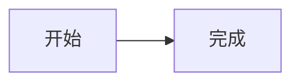

# 9dianbiqi Astro Blog

这是一个使用 Astro 生成、通过 GitHub Pages 发布的个人技术博客。

## 本地开发

```bash
npm install
npm run dev
```

## 构建验证

```bash
npm run build
```

## 音乐播放器

博客包含一个可定制的全站悬浮 Web Component 播放器：

- Spotify：使用官方公开歌单 Embed，无需 Premium、Client ID、Secret、OAuth 或 Worker。
- 汽水音乐：读取站内配置并跳转官方分享链接，不使用非官方播放接口。
- Astro 客户端导航期间保持播放器实例和展开状态，不自动播放。

本地自动化验证：

```bash
npm run test:player
npm run test:e2e
npm run verify:music-player
```

Spotify 歌单、汽水歌曲和免费站内播放限制见 [`docs/music-player-configuration.md`](docs/music-player-configuration.md)。Spotify iframe 内部样式、完整歌曲播放资格和地区限制由 Spotify 控制。

## Mermaid 图表

博客已全局支持 Mermaid。以后在任意 `.md` 或 `.mdx` 文章中使用标准代码围栏即可，无需单独导入组件：

````markdown

````

图表仅在当前页面包含 Mermaid 代码块时按需加载；渲染失败时会保留源码，便于阅读和排查。
出于安全考虑，Mermaid 采用严格模式，不支持自定义回调和不安全链接。

发布文章时按内容语义选择围栏：

| 内容 | 围栏 |
| --- | --- |
| 流程、分支、状态转换、架构或拓扑 | `mermaid` |
| 日志、输出、目录树、路径、配置、提示词或其他字面示例 | `plaintext` |
| 可执行源码 | 准确语言，例如 `python`、`bash` 或 `json` |

关系图与字面内容必须在 Markdown 源码阶段人工分类，不在浏览器运行时猜测或自动转换。
禁止新增 `text` 围栏；真实目录树即使包含缩进或箭头，也应保留为 `plaintext`。

本地自动化验证：

```bash
npm run verify:article-visuals
npm run verify:mermaid
npm run build
```

## 发布

推送到 `main` 分支后，`.github/workflows/deploy.yml` 会使用 Astro 官方 GitHub Action 构建站点，并通过 GitHub Pages 发布到：

https://9dianbiqi.github.io
