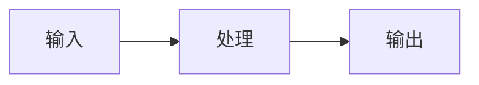

# Global Mermaid Rendering Implementation Plan

> **For agentic workers:** REQUIRED SUB-SKILL: Use superpowers:subagent-driven-development (recommended) or superpowers:executing-plans to implement this plan task-by-task. Steps use checkbox (`- [ ]`) syntax for tracking.

**Goal:** Automatically render every current and future Markdown/MDX `mermaid` fenced block as a safe, responsive SVG while preserving source-code fallback and providing a pre-release browser preview.

**Architecture:** Astro keeps producing `<pre data-language="mermaid">` as a no-JavaScript fallback. A small site bootstrap detects those blocks on initial load and `astro:page-load`, dynamically imports Mermaid only when needed, and delegates DOM replacement to a separately tested renderer module. Mermaid source is replaced only after a successful render; errors leave the source visible.

**Tech Stack:** Astro 7, TypeScript, Mermaid 11.16.0, Vitest 4, JSDOM 29, Playwright 1.61, GitHub Pages.

## Global Constraints

- All current and future `.md` and `.mdx` blog posts use standard ` ```mermaid ` fenced blocks without per-post component imports.
- Non-Mermaid pages must not load the Mermaid main chunk.
- Mermaid uses `startOnLoad: false` and `securityLevel: "strict"`.
- Initial page load and Astro `ClientRouter` navigation must both render diagrams.
- Successful rendering replaces source with an accessible `<figure>` and SVG.
- Rendering failure or unavailable JavaScript keeps the original source visible.
- Diagram containers may scroll horizontally; the document itself must not overflow at 375 pixels.
- Styling reuses the current surface, ink, teal, moss, clay, line, radius, and shadow tokens.
- No diagram editor, export button, zoom toolbar, dark mode, custom callbacks, or generated PNG/PDF assets.
- Preview at 1440, 768, and 375 pixels before remote publication.
- Publication is performed by an independent sub-agent only after user preview approval.

---

## File Structure

- Create `src/lib/mermaidDiagrams.ts`: framework-independent DOM transformation and labeling.
- Create `src/lib/mermaidDiagrams.test.ts`: JSDOM behavior tests for success, filtering, errors, labels, and idempotency.
- Create `src/scripts/mermaid-diagrams.ts`: lazy Mermaid import, one-time configuration, and Astro lifecycle wiring.
- Create `src/scripts/mermaid-diagrams.test.ts`: lazy-load and lifecycle controller tests.
- Modify `src/layouts/BaseLayout.astro`: load the small Mermaid bootstrap with the existing global browser scripts.
- Modify `src/styles/global.css`: responsive, token-based diagram and error styles.
- Create `scripts/verify-mermaid-rendering.mjs`: build/source contract verifier.
- Modify `package.json`: add Mermaid dependency and `verify:mermaid`.
- Modify `package-lock.json`: lock Mermaid 11.16.0 and transitive dependencies.
- Modify `README.md`: document the stable authoring contract and preview command.
- Create `e2e/mermaid-diagrams.spec.ts`: real-browser rendering and responsive overflow checks.

---

### Task 1: Tested DOM Rendering Contract

**Files:**
- Create: `src/lib/mermaidDiagrams.test.ts`
- Create: `src/lib/mermaidDiagrams.ts`

**Interfaces:**
- Consumes: Shiki output shaped as `pre[data-language="mermaid"]`.
- Produces:
  - `export interface MermaidRenderResult { svg: string; bindFunctions?: (element: Element) => void }`
  - `export type MermaidRender = (id: string, source: string) => Promise<MermaidRenderResult>`
  - `export function findMermaidBlocks(root: ParentNode): HTMLPreElement[]`
  - `export function getMermaidLabel(block: Element): string`
  - `export async function renderMermaidBlocks(root: ParentNode, render: MermaidRender): Promise<number>`

- [ ] **Step 1: Write the failing success and filtering tests**

Create a JSDOM document containing one Mermaid `<pre>` and one Python `<pre>`. Use a literal renderer result:

```ts
const render: MermaidRender = async () => ({
  svg: '<svg viewBox="0 0 640 320"><title>Rendered diagram</title></svg>',
});

const count = await renderMermaidBlocks(document, render);

expect(count).toBe(1);
expect(document.querySelector('.mermaid-diagram svg')).not.toBeNull();
expect(document.querySelector('pre[data-language="python"]')).not.toBeNull();
expect(document.querySelector('pre[data-language="mermaid"]')).toBeNull();
```

Production mutation caught: removing the language selector or replacing every `<pre>` would fail the non-Mermaid assertion.

- [ ] **Step 2: Run the focused test and verify RED**

Run:

```powershell
npx vitest run src/lib/mermaidDiagrams.test.ts
```

Expected: FAIL because `src/lib/mermaidDiagrams.ts` does not exist.

- [ ] **Step 3: Implement the minimal successful transformation**

Implement exact selection and delayed replacement:

```ts
const MERMAID_SELECTOR = 'pre[data-language="mermaid"]:not([data-mermaid-state])';

export function findMermaidBlocks(root: ParentNode): HTMLPreElement[] {
  return Array.from(root.querySelectorAll<HTMLPreElement>(MERMAID_SELECTOR));
}

export async function renderMermaidBlocks(root: ParentNode, render: MermaidRender): Promise<number> {
  const blocks = findMermaidBlocks(root);
  let rendered = 0;

  for (const [index, block] of blocks.entries()) {
    block.dataset.mermaidState = 'pending';
    const source = block.textContent?.trim() ?? '';
    const result = await render(`mermaid-diagram-${index}`, source);
    const figure = block.ownerDocument.createElement('figure');
    figure.className = 'mermaid-diagram';
    figure.setAttribute('aria-label', getMermaidLabel(block));
    figure.innerHTML = `<div class="mermaid-diagram__canvas">${result.svg}</div>`;
    block.replaceWith(figure);
    result.bindFunctions?.(figure);
    rendered += 1;
  }

  return rendered;
}
```

Use a module-level monotonically increasing ID suffix instead of relying only on the local index, so subsequent page loads cannot reuse an SVG ID.

- [ ] **Step 4: Run the focused test and verify GREEN**

Run:

```powershell
npx vitest run src/lib/mermaidDiagrams.test.ts
```

Expected: PASS for the success and filtering behaviors.

- [ ] **Step 5: Write failing error, label, and idempotency tests**

Add tests proving:

```ts
await renderMermaidBlocks(document, async () => {
  throw new Error('parse failed');
});
expect(document.querySelector('pre[data-language="mermaid"]')).not.toBeNull();
expect(document.querySelector('[role="alert"]')?.textContent).toContain('图表渲染失败');

expect(getMermaidLabel(blockUnderHeading)).toBe('先理解 MCP 到底是什么示意图');

await renderMermaidBlocks(document, render);
await renderMermaidBlocks(document, render);
expect(renderCalls).toBe(1);
```

Production mutations caught: replacing before rendering, dropping the error path, ignoring section context, or removing the state guard.

- [ ] **Step 6: Run the focused test and verify RED**

Run:

```powershell
npx vitest run src/lib/mermaidDiagrams.test.ts
```

Expected: FAIL on missing error notice, label, and idempotency behavior.

- [ ] **Step 7: Implement error recovery and contextual labels**

`getMermaidLabel()` walks previous siblings and ancestor context to find the nearest preceding `h2` or `h3`, falling back to `文章示意图`. On error:

```ts
block.dataset.mermaidState = 'error';
const notice = block.ownerDocument.createElement('p');
notice.className = 'mermaid-diagram-error';
notice.setAttribute('role', 'alert');
notice.textContent = '图表渲染失败，已保留 Mermaid 源码。';
block.insertAdjacentElement('afterend', notice);
```

Do not insert the Mermaid error message itself into the DOM.

- [ ] **Step 8: Run the focused test and full unit suite**

Run:

```powershell
npx vitest run src/lib/mermaidDiagrams.test.ts
npm test
```

Expected: focused suite PASS; existing 22 tests plus new Mermaid tests PASS.

- [ ] **Step 9: Commit Task 1**

```powershell
git add -- src/lib/mermaidDiagrams.ts src/lib/mermaidDiagrams.test.ts
git commit -m "feat: add Mermaid DOM rendering contract"
```

---

### Task 2: Lazy Mermaid Bootstrap and Astro Lifecycle

**Files:**
- Create: `src/scripts/mermaid-diagrams.test.ts`
- Create: `src/scripts/mermaid-diagrams.ts`
- Modify: `src/layouts/BaseLayout.astro`
- Modify: `package.json`
- Modify: `package-lock.json`

**Interfaces:**
- Consumes: `findMermaidBlocks()` and `renderMermaidBlocks()` from Task 1.
- Produces:
  - `export interface MermaidApi { initialize(config: Record<string, unknown>): void; render: MermaidRender }`
  - `export type MermaidModuleLoader = () => Promise<{ default: MermaidApi }>`
  - `export function createMermaidInitializer(loadModule?: MermaidModuleLoader): (root?: Document) => Promise<number>`
  - Default initializer used on initial load and `astro:page-load`.

- [ ] **Step 1: Install the pinned Mermaid dependency**

Run:

```powershell
npm install mermaid@11.16.0
```

Expected: `package.json` and `package-lock.json` record Mermaid 11.16.0.

- [ ] **Step 2: Write the failing lazy-load tests**

Test with a real JSDOM document and an injected loader:

```ts
const initialize = createMermaidInitializer(loadModule);
expect(await initialize(documentWithoutDiagrams)).toBe(0);
expect(loadCalls).toBe(0);

expect(await initialize(documentWithTwoDiagrams)).toBe(2);
expect(loadCalls).toBe(1);
expect(api.initialize).toHaveBeenCalledWith(expect.objectContaining({
  startOnLoad: false,
  securityLevel: 'strict',
}));
```

The loader double replaces only the external Mermaid package. DOM transformation remains real.

Production mutations caught: eager import, repeated imports, weak security level, or Mermaid auto-start.

- [ ] **Step 3: Run the focused test and verify RED**

Run:

```powershell
npx vitest run src/scripts/mermaid-diagrams.test.ts
```

Expected: FAIL because the bootstrap module does not exist.

- [ ] **Step 4: Implement the minimal lazy initializer**

Use one shared promise:

```ts
const defaultLoader: MermaidModuleLoader = () => import('mermaid');

export function createMermaidInitializer(loadModule = defaultLoader) {
  let apiPromise: Promise<MermaidApi> | undefined;

  return async (root = document) => {
    if (findMermaidBlocks(root).length === 0) return 0;
    apiPromise ??= loadModule().then(({ default: api }) => {
      api.initialize({
        startOnLoad: false,
        securityLevel: 'strict',
        theme: 'base',
        themeVariables: MERMAID_THEME,
      });
      return api;
    });
    const api = await apiPromise;
    return renderMermaidBlocks(root, api.render.bind(api));
  };
}
```

Define `MERMAID_THEME` once in the module using values matching the existing site tokens:
surface `#fffdf8`, ink `#141817`, teal `#123d3e`, moss `#667853`, clay `#b55f46`, and line `#ddd9cd`.

- [ ] **Step 5: Run the focused test and verify GREEN**

Run:

```powershell
npx vitest run src/scripts/mermaid-diagrams.test.ts
```

Expected: PASS.

- [ ] **Step 6: Add lifecycle wiring and layout import**

At the bottom of `src/scripts/mermaid-diagrams.ts`:

```ts
const initializeMermaidDiagrams = createMermaidInitializer();
const renderCurrentPage = () => void initializeMermaidDiagrams(document);

if (document.readyState === 'loading') {
  document.addEventListener('DOMContentLoaded', renderCurrentPage, { once: true });
} else {
  renderCurrentPage();
}
document.addEventListener('astro:page-load', renderCurrentPage);
```

In the existing `BaseLayout.astro` script block:

```astro
<script>
  import '../scripts/reveal';
  import '../scripts/mermaid-diagrams';
</script>
```

- [ ] **Step 7: Run focused tests, type checks, and build**

Run:

```powershell
npx vitest run src/lib/mermaidDiagrams.test.ts src/scripts/mermaid-diagrams.test.ts
npm run build
```

Expected: tests PASS; Astro reports 0 errors, 0 warnings, 0 hints; target article route builds.

- [ ] **Step 8: Commit Task 2**

```powershell
git add -- package.json package-lock.json src/scripts/mermaid-diagrams.ts src/scripts/mermaid-diagrams.test.ts src/layouts/BaseLayout.astro
git commit -m "feat: lazy load Mermaid diagrams"
```

---

### Task 3: Responsive Styling and Permanent Publishing Contract

**Files:**
- Modify: `src/styles/global.css`
- Create: `scripts/verify-mermaid-rendering.mjs`
- Modify: `package.json`
- Modify: `README.md`

**Interfaces:**
- Consumes: `.mermaid-diagram`, `.mermaid-diagram__canvas`, and `.mermaid-diagram-error` from Task 1.
- Produces: `npm run verify:mermaid` and documented author syntax.

- [ ] **Step 1: Write the failing verifier**

Create a Node verifier that reads the repository and built route. It must assert:

```js
assert.match(baseLayout, /import ['"]\.\.\/scripts\/mermaid-diagrams['"]/);
assert.match(bootstrap, /securityLevel:\s*['"]strict['"]/);
assert.match(bootstrap, /startOnLoad:\s*false/);
assert.match(bootstrap, /import\(['"]mermaid['"]\)/);
assert.match(styles, /\.mermaid-diagram__canvas/);
assert.match(styles, /overflow-x:\s*auto/);
assert.match(mcpPost, /```mermaid/);
```

Add `"verify:mermaid": "node scripts/verify-mermaid-rendering.mjs"` to `package.json`.

Production mutations caught: removing global wiring, changing security mode, eager-loading Mermaid, or losing overflow protection.

- [ ] **Step 2: Run the verifier and verify RED**

Run:

```powershell
npm run verify:mermaid
```

Expected: FAIL because diagram styles and/or permanent documentation are missing.

- [ ] **Step 3: Add responsive styles**

Append token-based styles:

```css
.mermaid-diagram {
  width: 100%;
  margin-inline: 0;
  border: 1px solid var(--line);
  border-radius: var(--radius);
  background: var(--surface);
  padding: 20px;
  box-shadow: var(--shadow-card);
}

.mermaid-diagram__canvas {
  width: 100%;
  overflow-x: auto;
  overscroll-behavior-inline: contain;
}

.mermaid-diagram svg {
  display: block;
  width: auto;
  min-width: 100%;
  max-width: none;
  height: auto;
  margin-inline: auto;
}

.mermaid-diagram-error {
  border-left: 3px solid var(--clay);
  background: var(--surface-tint);
  color: var(--ink-soft);
  padding: 10px 12px;
}
```

At the existing mobile breakpoint, reduce figure padding to 12 pixels. Do not set overflow on `.prose` or the document.

- [ ] **Step 4: Document the authoring contract**

Add a `Mermaid 图表` section to `README.md` containing:

````markdown

````

Document that:

- `.md` and `.mdx` both work.
- No component import is required.
- Plain explanatory blocks use `plaintext`, not `text`.
- Mermaid callbacks and unsafe links are unsupported under strict mode.
- Run `npm run verify:mermaid` and `npm run build` before publication.

- [ ] **Step 5: Run verifier and full static checks**

Run:

```powershell
npm run verify:mermaid
npm run verify:home
npm run verify:home-video
npm run verify:obsidian
npm run verify:article-layouts
npm run verify:toc
npm run verify:archive-filter
npm run verify:home-content
npm run verify:content-first-ui
npm run verify:object-flow
npm run verify:post-nav
npm run verify:music-player
git diff --check
```

Expected: all listed commands PASS.

- [ ] **Step 6: Run the known visual verifier separately**

Run:

```powershell
npm run verify:article-visuals
```

Expected baseline: it may still list the same nine pre-existing posts containing ` ```text `; no new Mermaid file or new failure may appear.

- [ ] **Step 7: Commit Task 3**

```powershell
git add -- src/styles/global.css scripts/verify-mermaid-rendering.mjs package.json README.md
git commit -m "docs: standardize Mermaid publishing"
```

---

### Task 4: Real-Browser Preview Gate

**Files:**
- Create: `e2e/mermaid-diagrams.spec.ts`

**Interfaces:**
- Consumes: built Astro site and production Mermaid bundle from Tasks 1–3.
- Produces: automated browser evidence and user-visible preview before publication.

- [ ] **Step 1: Write the failing Playwright test**

Cover actual routes:

```ts
test('renders Mermaid and preserves regular code blocks', async ({ page }) => {
  await page.goto('/blog/mcp-development-beginner-guide/');
  await expect(page.locator('.mermaid-diagram svg')).toBeVisible();
  await expect(page.locator('pre[data-language="mermaid"]')).toHaveCount(0);
  await expect(page.locator('pre[data-language="python"]')).toBeVisible();
});

test('keeps document width stable on mobile', async ({ page }) => {
  await page.setViewportSize({ width: 375, height: 812 });
  await page.goto('/blog/mcp-development-beginner-guide/');
  await expect(page.locator('.mermaid-diagram svg')).toBeVisible();
  const overflow = await page.evaluate(() => document.documentElement.scrollWidth - innerWidth);
  expect(overflow).toBeLessThanOrEqual(1);
});
```

Add a navigation test: start at `/blog/`, enter the MCP article, navigate to another article containing Mermaid, and assert exactly one rendered figure per source block.

- [ ] **Step 2: Run the E2E test and verify its diagnostic value**

Run:

```powershell
npm run build
npx playwright test e2e/mermaid-diagrams.spec.ts
```

If the implementation is already present, temporarily disable the BaseLayout import, run once to observe failure on missing `.mermaid-diagram svg`, restore the import, and rerun. This satisfies the regression test’s red-green proof without retaining broken production code.

- [ ] **Step 3: Run full E2E tests**

Run:

```powershell
npm run test:e2e
```

Expected: Mermaid, article reading workspace, and music player tests all PASS.

- [ ] **Step 4: Start the local preview**

Run:

```powershell
npm run preview -- --host 127.0.0.1
```

Open `/blog/mcp-development-beginner-guide/` and one existing Feishu Mermaid article.

- [ ] **Step 5: Inspect required viewports**

Capture and inspect:

- 1440 × 900: SVG replaces the black Mermaid source block and aligns with the article column.
- 768 × 1024: SVG remains readable and does not collide with the collapsed reading workspace.
- 375 × 812: document has no horizontal overflow; wide diagram scroll is confined to its card.

Also navigate between Mermaid and non-Mermaid articles to confirm the lazy loader and lifecycle behavior.

- [ ] **Step 6: Present preview to the user**

Report the local preview URL, screenshots or visible browser state, and verification results. Stop before push/PR and request explicit preview approval.

- [ ] **Step 7: Commit Task 4 after preview checks pass**

```powershell
git add -- e2e/mermaid-diagrams.spec.ts
git commit -m "test: cover Mermaid article rendering"
```

---

### Task 5: Independent Publication After Preview Approval

**Files:**
- No new implementation files expected.

**Interfaces:**
- Consumes: user-approved preview and clean feature branch.
- Produces: merged PR, successful GitHub Pages deployment, and public verification.

- [ ] **Step 1: Run the final verification gate**

Run fresh:

```powershell
npm test
npm run verify:mermaid
npm run build
npm run test:e2e
git diff --check
git status -sb
```

Expected: all tests and build PASS; worktree contains only intended committed changes.

- [ ] **Step 2: Dispatch the independent publication sub-agent**

The publication agent must:

- Inspect `git status -sb` and the branch diff.
- Confirm all feature commits are in scope.
- Push `agent/mermaid-rendering`.
- Create a ready PR with change, rationale, impact, and validation.
- Merge the PR after required GitHub Pages checks permit it.
- Ignore the unrelated Vercel failure.

- [ ] **Step 3: Verify GitHub Pages**

Wait for the workflow whose head SHA equals the merge SHA. Require build and deploy jobs to report `success`.

- [ ] **Step 4: Perform production browser acceptance**

Verify:

- `https://9dianbiqi.github.io/blog/mcp-development-beginner-guide/` returns HTTP 200 and displays an SVG diagram.
- At least one Feishu Mermaid article displays SVG.
- Mermaid source code is not visible after successful rendering.
- A normal Python code block remains visible.
- Homepage and archive remain HTTP 200.

- [ ] **Step 5: Report release evidence**

Return the public article URL, branch commits, PR URL, merge SHA, Pages workflow URL, final tests, known unchanged baseline failures, and clean `main...origin/main` state.

