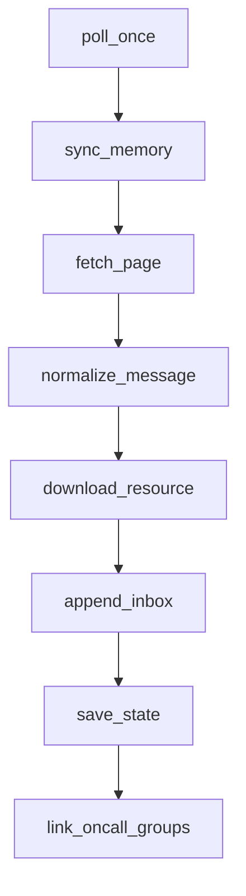
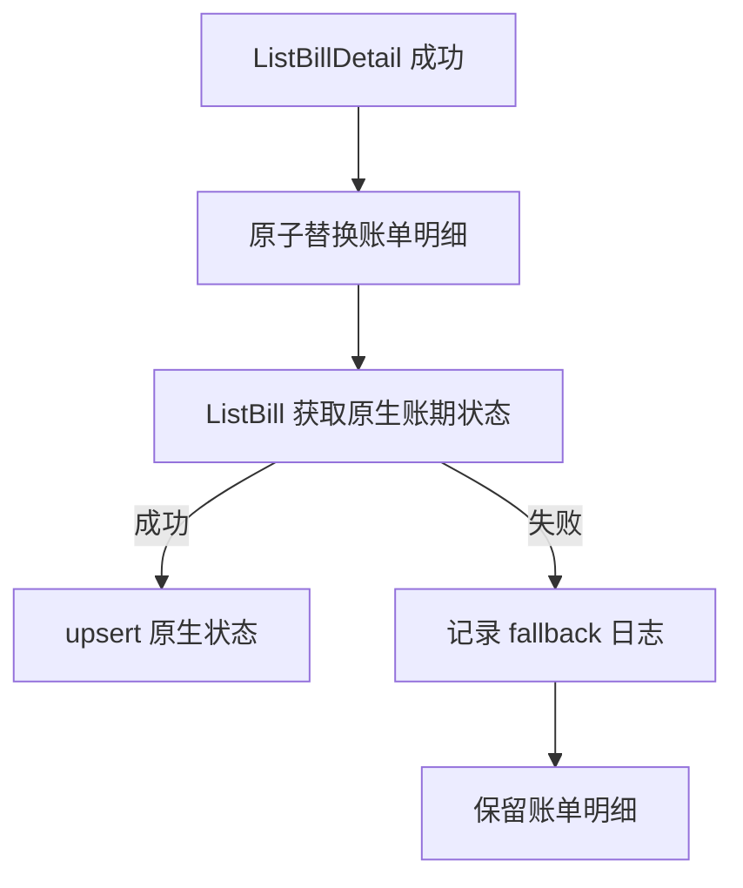
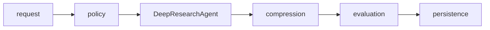

# Plaintext Content Visualization Implementation Plan

> **For agentic workers:** REQUIRED SUB-SKILL: Use superpowers:subagent-driven-development (recommended) or superpowers:executing-plans to implement this plan task-by-task. Steps use checkbox (`- [x]`) syntax for tracking.

**Goal:** Reclassify all 84 legacy `text`/`plaintext` blocks across 13 published posts so relationship-heavy content renders as Mermaid and literal content renders as a warm light plaintext card.

**Architecture:** Markdown remains the semantic source of truth: authors explicitly choose `mermaid` for flows, state transitions, architecture, and topology, and `plaintext` for literal output, paths, trees, configuration, and copyable text. Global CSS restyles only `pre[data-language="plaintext"]`; the existing lazy Mermaid runtime remains unchanged. An executable repository verifier and real-browser tests protect the authoring, styling, rendering, and responsive-overflow contracts.

**Tech Stack:** Astro 7, Markdown/MDX, Mermaid 11.16.0, Shiki output attributes, CSS design tokens, Node.js verification scripts, Playwright 1.61.

## Global Constraints

- All 13 audited posts and all 84 legacy `text`/`plaintext` blocks must be reviewed individually.
- Relationship content with three or more semantic stages, branching, state transitions, architecture, topology, or conceptual hierarchy uses `mermaid`.
- Literal logs, command output, directory trees, paths, filenames, formulas, config, endpoint lists, prompts, and exact examples use `plaintext`.
- No `text` fence may remain in `src/content/blog`.
- Runtime content guessing or automatic Mermaid conversion is prohibited.
- Plaintext cards use the existing `surface`, `surface-tint`, `ink`, `teal`, `clay`, `line`, `radius`, and shadow tokens.
- Plaintext CSS may override Shiki inline colors only inside `pre[data-language="plaintext"]`; Python, Bash, JSON, and other language blocks remain unchanged.
- Mermaid keeps the existing strict-security, lazy-loading, source-fallback, and internal-scroll behavior.
- Neither Mermaid nor plaintext may cause document-level horizontal overflow at 375 pixels.
- Preview at 1440, 768, and 375 pixels before remote publication.
- Publication is performed by an independent sub-agent only after user preview approval.

---

## File Structure

- Modify `scripts/verify-article-visuals.mjs`: enforce fence classification, representative diagram migrations, and plaintext CSS contract.
- Modify `src/styles/global.css`: add warm light plaintext-card styles scoped by `data-language="plaintext"`.
- Modify `README.md`: document the permanent Mermaid/plaintext decision rules and release checks.
- Modify `e2e/mermaid-diagrams.spec.ts`: cover plaintext appearance, unchanged ordinary code, and mobile overflow in a real browser.
- Modify the 13 audited files under `src/content/blog`: normalize retained blocks to `plaintext` and rewrite the selected relationship blocks as Mermaid.
- Modify `docs/superpowers/plans/2026-07-28-plaintext-content-visualization.md`: check off completed steps during execution.

---

### Task 1: Executable Content and Style Contract

**Files:**
- Modify: `scripts/verify-article-visuals.mjs`
- Modify: `package.json` only if a separate command is needed; prefer the existing `verify:article-visuals`.

**Interfaces:**
- Consumes: Markdown/MDX sources in `src/content/blog` and `src/styles/global.css`.
- Produces: `npm run verify:article-visuals`, exiting non-zero for legacy `text` fences, missing representative Mermaid migrations, or missing plaintext scoping/overflow styles.

- [x] **Step 1: Extend the verifier before production edits**

Add fenced-block parsing that recognizes opening fences at line start:

```js
function collectFences(source) {
  return [...source.matchAll(/^```([a-zA-Z0-9_-]+)\s*$/gm)].map((match) => ({
    language: match[1],
    index: match.index,
  }));
}
```

Collect all posts with `language === 'text'`, count `plaintext` and `mermaid`, and assert:

```js
assert.deepEqual(legacyTextPosts, [], `Legacy text fences remain: ${legacyTextPosts.join(', ')}`);
assert.ok(plaintextCount > 0, 'Literal content should remain as plaintext');

for (const post of [
  'feishu-operations-cli-architecture.md',
  'codex-openclaw-billing-governance-native-status.md',
  'sso-authentication-flow-guide.md',
  'vpn-basics-for-beginners.mdx',
]) {
  assert.match(readPost(post), /^```mermaid\s*$/m, `${post} should contain a migrated Mermaid diagram`);
}
```

Assert the real CSS contract, not exact decorative values:

```js
assert.match(styles, /\.prose pre\[data-language="plaintext"\]/);
assert.match(styles, /pre\[data-language="plaintext"\][^{]*\{[^}]*overflow-x:\s*auto/s);
assert.match(styles, /pre\[data-language="plaintext"\][^{]*\{[^}]*background:/s);
assert.match(styles, /pre\[data-language="plaintext"\][^{]*code\s+span[^{]*\{[^}]*color:\s*inherit\s*!important/s);
```

Production mutations caught: reintroducing `text`, losing a required migrated diagram, broadening the override to all code, or removing internal overflow.

- [x] **Step 2: Run the verifier and observe RED**

Run:

```powershell
npm run verify:article-visuals
```

Expected: FAIL first because 59 legacy `text` fences remain and plaintext card styles do not exist.

- [x] **Step 3: Commit only the failing contract**

```powershell
git add -- scripts/verify-article-visuals.mjs
git commit -m "test: define article visual classification contract"
```

---

### Task 2: Warm Light Plaintext Card

**Files:**
- Modify: `src/styles/global.css`

**Interfaces:**
- Consumes: Shiki output shaped as `<pre data-language="plaintext"><code><span>…`.
- Produces: a token-based light card with literal whitespace, inherited monochrome text, internal horizontal scroll, and a decorative `PLAINTEXT` label.

- [x] **Step 1: Add the minimum scoped stylesheet**

Place the rules after the generic `.prose pre code` rules and before Mermaid styles:

```css
.prose pre[data-language="plaintext"] {
  position: relative;
  overflow-x: auto;
  overscroll-behavior-inline: contain;
  border-color: var(--line);
  background:
    linear-gradient(180deg, rgba(255, 253, 248, 0.98), rgba(248, 244, 234, 0.82)),
    var(--surface);
  color: var(--ink);
  padding: 42px 20px 20px;
  box-shadow: var(--shadow-card);
  scrollbar-gutter: stable;
}

.prose pre[data-language="plaintext"]::before {
  content: "PLAINTEXT";
  position: absolute;
  inset: 14px auto auto 20px;
  color: var(--teal);
  font: 700 0.7rem/1 "JetBrains Mono", "SFMono-Regular", Consolas, monospace;
  letter-spacing: 0.12em;
}

.prose pre[data-language="plaintext"] code,
.prose pre[data-language="plaintext"] code span {
  background: transparent !important;
  color: inherit !important;
}
```

At `max-width: 640px`, reduce horizontal padding to 14 pixels and keep overflow on the card, not `.prose` or `body`.

- [x] **Step 2: Run the verifier and confirm the failure advances**

Run:

```powershell
npm run verify:article-visuals
```

Expected: plaintext CSS assertions PASS; command still FAILS because legacy `text` fences and representative Mermaid migrations remain.

- [x] **Step 3: Check ordinary code selectors remain untouched**

Run:

```powershell
git diff -- src/styles/global.css
rg -n 'pre\\[data-language="plaintext"\\]' src/styles/global.css
```

Expected: every new Shiki override includes the plaintext attribute selector; no generic `.prose pre` color is changed.

- [x] **Step 4: Commit the plaintext visual**

```powershell
git add -- src/styles/global.css
git commit -m "style: add light plaintext article cards"
```

---

### Task 3: Normalize Literal Blocks

**Files:**
- Modify: `src/content/blog/astro-home-video-background.md`
- Modify: `src/content/blog/codex-openclaw-billing-governance-native-status.md`
- Modify: `src/content/blog/codex-openclaw-dynamic-dashboard-technical-architecture.md`
- Modify: `src/content/blog/codex-openclaw-volcengine-billing-correctness.md`
- Modify: `src/content/blog/feishu-operations-cli-architecture.md`
- Modify: `src/content/blog/feishu-operations-cli-optimization-roadmap.md`
- Modify: `src/content/blog/helloagents-deepresearch-interview-qa.md`
- Modify: `src/content/blog/linux-export-mysql-postgresql-beginner-checklist.md`
- Modify: `src/content/blog/mcp-development-beginner-guide.md`
- Modify: `src/content/blog/parallel-frontend-backend-development.md`
- Modify: `src/content/blog/sso-authentication-flow-guide.md`
- Modify: `src/content/blog/vpn-basics-for-beginners.mdx`
- Modify: `src/content/blog/vue-sso-third-party-integration-page.md`

**Interfaces:**
- Consumes: the audited 84 legacy fences.
- Produces: no `text` fences; retained literal blocks use `plaintext` without changing their contents.

- [x] **Step 1: Rename all legacy opening fences**

Change only opening ` ```text ` lines to ` ```plaintext ` in the 13 listed files. Do not edit block bodies in this step.

- [x] **Step 2: Verify normalization**

Run:

```powershell
rg -n '^```text\\s*$' src/content/blog
rg -n '^```plaintext\\s*$' src/content/blog
npm run build
```

Expected: the first command has no matches; all articles compile. `verify:article-visuals` still fails because required flow candidates have not yet become Mermaid.

- [x] **Step 3: Commit semantic normalization**

```powershell
git add -- src/content/blog
git commit -m "content: normalize literal article blocks"
```

---

### Task 4: Migrate Operations and Billing Relationships

**Files:**
- Modify: `src/content/blog/feishu-operations-cli-architecture.md`
- Modify: `src/content/blog/codex-openclaw-billing-governance-native-status.md`
- Modify: `src/content/blog/codex-openclaw-dynamic-dashboard-technical-architecture.md`
- Modify: `src/content/blog/codex-openclaw-volcengine-billing-correctness.md`

**Interfaces:**
- Consumes: relationship blocks normalized in Task 3.
- Produces: valid Mermaid fences while literal dates, formulas, status priority, endpoints, filenames, dependencies, and summaries remain plaintext.

- [x] **Step 1: Convert the Feishu polling chain**

Replace the `poll_once` block with:



- [x] **Step 2: Convert billing-governance relationships**

Convert the collection pipeline, `ListBill` success/fallback branch, and dashboard layout relationship. Keep the date windows, formula, priority line, and literal labels as plaintext. The branch diagram must contain:



- [x] **Step 3: Convert dynamic-dashboard relationships**

Convert only:

- the top-level CronJob → collector → SQLite → dashboard → frontend → VPN pipeline;
- the current `run_after_review.py` boundary;
- the large target architecture;
- the page information architecture at the block beginning with `顶部栏`;
- the PVC/CronJob/Deployment mount topology.

Keep module paths, query method names, parameters, endpoints, SQLite URI, Kubernetes object lists, ports, task names, dependency names, asset names, health endpoint, and closing summary as plaintext.

- [x] **Step 4: Convert Volcengine billing old/new architectures**

Convert both architecture blocks. Preserve `1 CNY = 1,000,000 micros` as plaintext.

- [x] **Step 5: Validate Mermaid syntax through the real build and browser runtime**

Run:

```powershell
npm run build
npx playwright test e2e/mermaid-diagrams.spec.ts
```

Expected: build PASS; existing Mermaid routes remain green. New routes are manually opened during Task 8 for visual syntax verification.

- [x] **Step 6: Commit operations and billing diagrams**

```powershell
git add -- src/content/blog/feishu-operations-cli-architecture.md src/content/blog/codex-openclaw-billing-governance-native-status.md src/content/blog/codex-openclaw-dynamic-dashboard-technical-architecture.md src/content/blog/codex-openclaw-volcengine-billing-correctness.md
git commit -m "content: visualize operations and billing flows"
```

---

### Task 5: Migrate Authentication and Network Relationships

**Files:**
- Modify: `src/content/blog/sso-authentication-flow-guide.md`
- Modify: `src/content/blog/vue-sso-third-party-integration-page.md`
- Modify: `src/content/blog/vpn-basics-for-beginners.mdx`

**Interfaces:**
- Consumes: normalized relationship blocks.
- Produces: Mermaid flowcharts for login, token exchange, authorization, network topology, route decisions, and bastion access.

- [x] **Step 1: Convert the SSO guide**

Convert:

- the complete login sequence;
- frontend code → backend exchange → session sequence;
- browser → backend → identity platform boundary;
- authentication → user info → authorization → system sequence;
- frontend/backend responsibility block, using Mermaid subgraphs.

Keep the system-name list, explanatory sentences, callback URLs, and the two literal identity/authorization questions as plaintext.

- [x] **Step 2: Convert the Vue SSO integration article**

Convert the entry decision tree and `浏览器 -> 自有后端 -> 第三方服务` chain. Use explicit branch labels `已有状态` and `没有状态`.

- [x] **Step 3: Convert the VPN guide**

Convert:

- the computer/network/VPN gateway/internal-resource topology;
- public versus internal route decision;
- VPN → bastion → server access chain.

Keep route CIDRs, global/split mode definitions, and the final study outline as plaintext.

- [x] **Step 4: Build and inspect parser results**

Run:

```powershell
npm run build
rg -n '^```mermaid\\s*$' src/content/blog/sso-authentication-flow-guide.md src/content/blog/vue-sso-third-party-integration-page.md src/content/blog/vpn-basics-for-beginners.mdx
```

Expected: build PASS and each of the three files contains migrated Mermaid fences.

- [x] **Step 5: Commit authentication and network diagrams**

```powershell
git add -- src/content/blog/sso-authentication-flow-guide.md src/content/blog/vue-sso-third-party-integration-page.md src/content/blog/vpn-basics-for-beginners.mdx
git commit -m "content: visualize authentication and VPN flows"
```

---

### Task 6: Migrate Development Workflow Relationships

**Files:**
- Modify: `src/content/blog/helloagents-deepresearch-interview-qa.md`
- Modify: `src/content/blog/parallel-frontend-backend-development.md`

**Interfaces:**
- Consumes: normalized relationship blocks.
- Produces: Mermaid flows for agent processing, work switching, correct query ordering, and the documented anti-pattern.

- [x] **Step 1: Convert the DeepResearch processing chain**

Use:



- [x] **Step 2: Convert parallel-development flows**

Convert:

- `修改功能 1 → git switch ...` to a four-step Mermaid sequence;
- the correct query flow ending in `LIMIT/OFFSET 分页`;
- the anti-pattern that fetches 50 rows before aggregation.

Keep physical worktree/branch trees, branch-to-directory mappings, date intervals, merge markers, and delivery summary as plaintext.

- [x] **Step 3: Run the complete visual verifier**

Run:

```powershell
npm run verify:article-visuals
```

Expected: PASS. All required representative posts now have Mermaid and no legacy `text` fence remains.

- [x] **Step 4: Commit development workflow diagrams**

```powershell
git add -- src/content/blog/helloagents-deepresearch-interview-qa.md src/content/blog/parallel-frontend-backend-development.md
git commit -m "content: visualize development workflow sequences"
```

---

### Task 7: Permanent Authoring Contract and Browser Regression

**Files:**
- Modify: `README.md`
- Modify: `e2e/mermaid-diagrams.spec.ts`

**Interfaces:**
- Consumes: `.mermaid-diagram` and `pre[data-language="plaintext"]` rendered pages.
- Produces: documented author rules and Playwright evidence that plaintext is light, ordinary code remains dark, and mobile document width is stable.

- [x] **Step 1: Add failing browser assertions**

Extend the first test to visit the Feishu architecture article and assert:

```ts
const plaintext = page.locator('pre[data-language="plaintext"]').first();
await expect(plaintext).toBeVisible();

const colors = await plaintext.evaluate((element) => {
  const style = getComputedStyle(element);
  return { background: style.backgroundColor, color: style.color };
});

expect(colors.background).not.toBe('rgb(31, 38, 40)');
expect(colors.color).toBe('rgb(20, 24, 23)');
```

Retain the existing MCP assertion that a Python block is visible, and assert its computed background remains `rgb(31, 38, 40)`.

Extend the 375-pixel test so both `.mermaid-diagram` and `pre[data-language="plaintext"]` have right edges no greater than 375 and `document.documentElement.scrollWidth - innerWidth <= 1`.

Production mutations caught: Shiki dark background leaking into plaintext, a broad override making Python light, or card overflow widening the document.

- [x] **Step 2: Run Playwright and observe RED if the CSS is incomplete**

Run:

```powershell
npx playwright test e2e/mermaid-diagrams.spec.ts
```

Expected before any required CSS correction: FAIL on the mismatched computed color or width. If Task 2 already satisfies it, temporarily remove only the plaintext selector in the working tree, observe the expected failure, restore it, and continue without committing the broken state.

- [x] **Step 3: Make the minimum CSS correction and rerun GREEN**

Only if the browser test reveals an actual mismatch, update the Task 2 selectors or mobile padding. Then run:

```powershell
npx playwright test e2e/mermaid-diagrams.spec.ts
```

Expected: PASS.

- [x] **Step 4: Expand README classification rules**

Document this decision table:

```markdown
| Content | Fence |
| --- | --- |
| Flow, branch, state transition, architecture, topology | `mermaid` |
| Log, output, directory tree, path, config, prompt, literal example | `plaintext` |
| Executable source | Exact language such as `python`, `bash`, or `json` |
```

State that `text` is prohibited, conversion is manual rather than runtime guessing, and publication requires:

```powershell
npm run verify:article-visuals
npm run verify:mermaid
npm run build
```

- [x] **Step 5: Commit documentation and browser coverage**

```powershell
git add -- README.md e2e/mermaid-diagrams.spec.ts src/styles/global.css
git commit -m "test: protect article plaintext presentation"
```

---

### Task 8: Full Verification and Local Preview

**Files:**
- Modify: `docs/superpowers/plans/2026-07-28-plaintext-content-visualization.md`

**Interfaces:**
- Consumes: all content, CSS, documentation, and test changes.
- Produces: reproducible local evidence and a preview URL for user approval.

- [x] **Step 1: Verify classification counts**

Run:

```powershell
rg -n '^```text\\s*$' src/content/blog
rg -n '^```plaintext\\s*$' src/content/blog
rg -n '^```mermaid\\s*$' src/content/blog
```

Expected: zero legacy `text` matches; both plaintext and Mermaid matches remain.

- [x] **Step 2: Run unit, static, build, and E2E gates**

Run:

```powershell
npm test
npm run verify:article-visuals
npm run verify:mermaid
npm run verify:home
npm run verify:home-video
npm run verify:obsidian
npm run verify:article-layouts
npm run verify:toc
npm run verify:archive-filter
npm run verify:home-content
npm run verify:content-first-ui
npm run verify:object-flow
npm run verify:post-nav
npm run verify:music-player
npm run build
npm run test:e2e
git diff --check
```

Expected: every command PASS with no new warnings or errors.

- [x] **Step 3: Start or refresh the local production preview**

Run:

```powershell
npm run preview -- --host 127.0.0.1
```

Open:

- `/blog/feishu-operations-cli-architecture/?preview=plaintext`
- `/blog/codex-openclaw-dynamic-dashboard-technical-architecture/?preview=plaintext`
- `/blog/sso-authentication-flow-guide/?preview=plaintext`
- `/blog/vpn-basics-for-beginners/?preview=plaintext`

- [x] **Step 4: Inspect 1440, 768, and 375 pixel widths**

At each width verify:

- migrated relationship blocks display SVG and no Mermaid source;
- retained literal blocks use the warm light plaintext card;
- Python/Bash/JSON blocks retain the dark Shiki theme;
- no document-level horizontal overflow;
- wide cards scroll only inside themselves;
- diagrams remain readable and do not overlap the reading rail.

- [x] **Step 5: Present preview and stop before remote publication**

Give the user the local preview URL, changed-post count, diagram/plaintext counts, and test results. Request explicit publication approval.

- [x] **Step 6: Commit plan completion metadata**

Check off completed boxes in this plan, then:

```powershell
git add -- docs/superpowers/plans/2026-07-28-plaintext-content-visualization.md
git commit -m "docs: record plaintext migration execution"
```

Execution evidence:

- Audited legacy blocks: 84 across 13 posts.
- Final classification: 59 `plaintext`, 25 newly migrated Mermaid diagrams, 0 legacy `text`.
- Repository Mermaid total after migration: 36.
- Unit tests: 29 passed.
- Static verification, Astro check, and production build: passed.
- Full Playwright suite: 18 passed using the installed system Chrome because the Playwright Chromium download endpoint timed out.
- Browser preview: 1440, 768, and 375 pixels passed without document-level horizontal overflow.

---

### Task 9: Independent Publication After Preview Approval

**Files:**
- No new implementation files expected.

**Interfaces:**
- Consumes: user-approved local preview and a clean, fully committed feature branch.
- Produces: merged PR, successful GitHub Pages deployment, and public browser verification.

- [ ] **Step 1: Run the final release gate**

Run fresh:

```powershell
npm test
npm run verify:article-visuals
npm run verify:mermaid
npm run build
npm run test:e2e
git diff --check
git status -sb
```

Expected: all checks PASS and the branch contains only intended commits.

- [ ] **Step 2: Dispatch the required independent publication sub-agent**

The publication sub-agent must inspect the branch diff, push `agent/plaintext-visuals`, create a PR describing all 13 migrated articles and validation evidence, merge it when GitHub permits, and ignore unrelated Vercel checks.

- [ ] **Step 3: Verify GitHub Pages**

Wait for the Pages workflow whose head SHA equals the merge SHA. Require build and deploy jobs to report `success`.

- [ ] **Step 4: Perform production acceptance**

Verify the public Feishu architecture, dashboard, SSO, VPN, and MCP articles:

- migrated Mermaid diagrams display as SVG;
- retained plaintext cards are light;
- ordinary source blocks remain dark;
- homepage and article archive return HTTP 200;
- mobile document width remains stable.

- [ ] **Step 5: Report release evidence**

Return the public URLs, PR URL, merge SHA, Pages workflow URL, final test results, and the clean local branch state.
