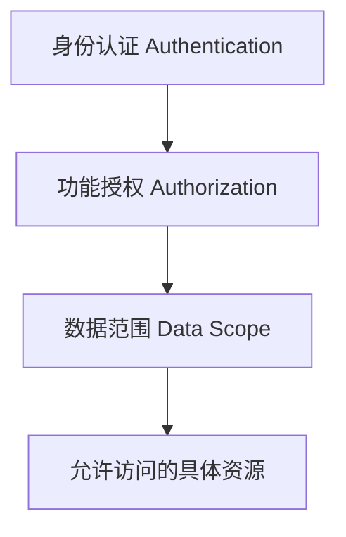
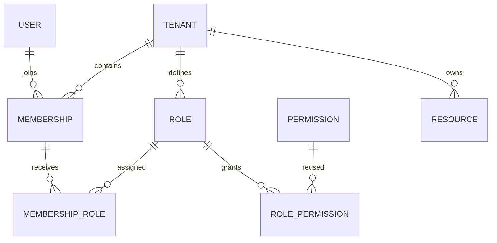
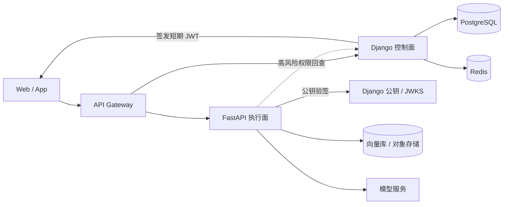

# Django Permissions And FastAPI Architecture Article Implementation Plan

> **For agentic workers:** REQUIRED SUB-SKILL: Use superpowers:subagent-driven-development (recommended) or superpowers:executing-plans to implement this plan task-by-task. Steps use checkbox (`- [ ]`) syntax for tracking.

**Goal:** Write, validate, and publish a Chinese enterprise-practice guide covering Django multi-tenant RBAC and a Django plus FastAPI enterprise AI architecture.

**Architecture:** The article uses an enterprise AI platform as one continuous scenario. Django is the identity and authorization control plane; FastAPI is the AI execution plane; short-lived asymmetric JWTs carry verified identity and tenant context while permission checks and tenant-aware resource queries remain explicit.

**Tech Stack:** Astro 7, Markdown, Mermaid 11, Django, Django REST Framework, FastAPI, PostgreSQL, Redis, JWT, GitHub Pages

## Global Constraints

- Publish the article at `src/content/blog/django-multitenant-rbac-fastapi-architecture.md`.
- Use `articleLayout: guide`.
- Write for readers who know basic Python and have seen Django or FastAPI.
- Keep multi-tenant RBAC and data scope as the central authorization model.
- Reuse Django `Permission` and `ContentType`; do not claim that default Django permissions provide tenant or object isolation.
- Use tenant-scoped roles attached to memberships, not global roles attached directly to users.
- Every protected resource query must include verified tenant context.
- Use short-lived asymmetric JWTs: Django signs with a private key and FastAPI verifies with a public key.
- Do not put a large fine-grained permission list into long-lived JWTs.
- Include exactly three core Mermaid diagrams: authorization layers, multi-tenant RBAC relationships, and the Django/FastAPI system flow.
- Do not add a frontend, Kubernetes manifests, a model-serving implementation, a policy engine, or a separate sample-code repository.
- Use official Django, Django REST Framework, FastAPI, and PyJWT documentation for version-sensitive claims.
- Publishing must be executed by an independent subagent.

---

## File Structure

- Create `src/content/blog/django-multitenant-rbac-fastapi-architecture.md`
  - Owns the complete published article, frontmatter, prose, diagrams, tables, and code skeletons.
- Create `docs/superpowers/plans/2026-07-29-django-permissions-fastapi-architecture-article.md`
  - Owns this execution plan.
- Existing validation files are read-only unless a real repository defect blocks the article:
  - `package.json`
  - `scripts/verify-article-layouts.mjs`
  - `scripts/verify-article-visuals.mjs`
  - `scripts/verify-mermaid-rendering.mjs`

The article remains one file because the existing blog stores each guide as a single Markdown content item and all sections share one glossary, scenario, and table of contents.

---

### Task 1: Verify Technical Claims And Establish Article Metadata

**Files:**
- Create: `src/content/blog/django-multitenant-rbac-fastapi-architecture.md`

**Interfaces:**
- Consumes: Approved design at `docs/superpowers/specs/2026-07-29-django-permissions-fastapi-architecture-article-design.md`
- Produces: Valid frontmatter, source-backed terminology, and a stable section skeleton used by every later task

- [ ] **Step 1: Read the current official documentation**

Check these primary sources:

```text
https://docs.djangoproject.com/en/stable/topics/auth/default/
https://docs.djangoproject.com/en/stable/ref/contrib/auth/
https://www.django-rest-framework.org/api-guide/permissions/
https://fastapi.tiangolo.com/tutorial/security/
https://pyjwt.readthedocs.io/en/stable/usage.html
```

Record the current stable behavior for:

```text
Django default add/change/delete/view permissions
User.has_perm()
Group and Permission relationships
Django superuser behavior
DRF BasePermission and has_object_permission()
FastAPI security dependencies
PyJWT issuer, audience, expiry, and asymmetric key validation
```

- [ ] **Step 2: Create the article with final frontmatter**

Create:

```yaml
---
title: "企业级 Django 权限实战：从多租户 RBAC 到 Django + FastAPI 架构"
description: "从 Django 内置权限出发，设计多租户 RBAC、数据范围、JWT 身份传递与 FastAPI 鉴权，搭建企业 AI 平台的控制面和执行面。"
pubDate: 2026-07-29
articleLayout: guide
tags:
  - Django
  - FastAPI
  - Python
  - RBAC
  - 多租户
  - 企业架构
readingTime: "约 30 分钟"
draft: false
---
```

- [ ] **Step 3: Add the complete heading skeleton**

Use these top-level sections in this order:

```text
一、登录成功，为什么仍然不等于“有权限”
二、Django、FastAPI 和 Flask 的权限能力应该怎样比较
三、Django 内置权限体系解决了什么
四、Django 默认权限为什么不等于多租户权限
五、设计 Tenant → Membership → Role → Permission
六、每次请求都要通过三道权限门
七、为什么企业 AI 平台还需要 FastAPI
八、Django 控制面 + FastAPI 执行面的总体架构
九、用 JWT 在两个服务之间传递可信身份
十、FastAPI 如何校验权限和资源归属
十一、三种权限同步方案怎么选
十二、可落地的项目目录与代码骨架
十三、错误码、安全边界和常见误区
十四、权限测试矩阵
十五、从单体到多服务的演进路线
十六、什么时候只用 Django、只用 FastAPI，什么时候组合
```

- [ ] **Step 4: Validate the initial content entry**

Run:

```powershell
npm run build
```

Expected:

```text
Astro content validation accepts the frontmatter.
The article route is generated.
No duplicate slug or schema error is reported.
```

- [ ] **Step 5: Commit the metadata and skeleton**

```powershell
git add src/content/blog/django-multitenant-rbac-fastapi-architecture.md
git commit -m "docs: scaffold Django permissions architecture guide"
```

---

### Task 2: Write The Django Authorization And Multi-Tenant RBAC Chapters

**Files:**
- Modify: `src/content/blog/django-multitenant-rbac-fastapi-architecture.md`

**Interfaces:**
- Consumes: Heading skeleton from Task 1
- Produces: Sections 1–6, the authorization-layer diagram, the RBAC relationship diagram, and Django-side model and permission concepts

- [ ] **Step 1: Write the enterprise problem statement**

Sections 1–2 must answer:

```text
Who is the caller?
Which tenant is active?
Which action is permitted?
Which concrete records are visible?
Why is FastAPI's dependency system not the same as a built-in RBAC model?
Why can Flask reach the same outcome but with fewer framework conventions?
```

Add the first Mermaid diagram:



- [ ] **Step 2: Explain Django's built-in model accurately**

Cover:

```text
User
Group
Permission
ContentType
is_staff
is_superuser
add/change/delete/view
has_perm()
Admin integration
DRF BasePermission
```

Include one compact example of checking:

```python
request.user.has_perm("knowledge.delete_knowledgebase")
```

State that object-level behavior requires explicit application logic or a compatible backend.

- [ ] **Step 3: Define the tenant-scoped data model**

Use these consistent names:

```python
class Tenant(models.Model)
class Department(models.Model)
class Membership(models.Model)
class Role(models.Model)
class MembershipRole(models.Model)
class RolePermission(models.Model)
class DataScope(models.TextChoices)
```

Required relationships:

```text
Membership(user, tenant, department, is_active)
Role(tenant, name, data_scope)
MembershipRole(membership, role)
RolePermission(role, permission)
```

Add the second Mermaid diagram:



- [ ] **Step 4: Define the three authorization gates**

Use this order:

```text
1. Verify authenticated identity.
2. Resolve active membership and action permission.
3. Load the resource through tenant and data-scope filters.
```

The article must reject this unsafe pattern:

```python
tenant_id = request.data["tenant_id"]
KnowledgeBase.objects.get(id=knowledge_base_id)
```

And show this safe shape:

```python
KnowledgeBase.objects.get(
    id=knowledge_base_id,
    tenant_id=principal.tenant_id,
)
```

- [ ] **Step 5: Review sections 1–6 for internal consistency**

Confirm:

```text
Role belongs to Tenant everywhere.
Permissions are reused from Django Permission.
Membership, not User, receives roles.
Data scope is separate from action permission.
No text claims that Django automatically enforces object permissions.
```

- [ ] **Step 6: Commit the Django authorization chapters**

```powershell
git add src/content/blog/django-multitenant-rbac-fastapi-architecture.md
git commit -m "docs: explain multi-tenant Django RBAC"
```

---

### Task 3: Write The Django Plus FastAPI Architecture And JWT Chapters

**Files:**
- Modify: `src/content/blog/django-multitenant-rbac-fastapi-architecture.md`

**Interfaces:**
- Consumes: `Tenant`, `Membership`, `Role`, `DataScope`, and tenant-safe resource loading from Task 2
- Produces: Sections 7–11, the system architecture diagram, JWT claim contract, FastAPI principal contract, and permission synchronization recommendation

- [ ] **Step 1: Define the service boundary**

Write Django as the control plane for:

```text
Tenant and membership management
Role and permission administration
Login and token issuance
Billing and plans
Audit queries
Authoritative high-risk permission decisions
```

Write FastAPI as the execution plane for:

```text
Agent execution
RAG retrieval
File processing
LLM calls
Streaming responses
AI workflow orchestration
```

- [ ] **Step 2: Add the system architecture diagram**

Use the third core Mermaid diagram:



Explain that the client presents the token to FastAPI through the gateway; the diagram does not mean Django forwards every AI request.

- [ ] **Step 3: Define the JWT contract**

Use this example:

```json
{
  "sub": "user-uuid",
  "tenant_id": "tenant-uuid",
  "roles": ["ai_operator"],
  "permission_version": 12,
  "iss": "django-control-plane",
  "aud": "fastapi-ai-service",
  "exp": 1785312600,
  "iat": 1785311700,
  "jti": "token-uuid"
}
```

State:

```text
Django holds the signing private key.
FastAPI holds only the public verification key or reads JWKS.
iss, aud, exp, and the algorithm allowlist are verified.
tenant_id comes from the verified token, not the request body.
```

- [ ] **Step 4: Define the FastAPI principal and dependency**

Use these exact interfaces:

```python
class Principal(BaseModel):
    user_id: UUID
    tenant_id: UUID
    roles: frozenset[str]
    permission_version: int
    jti: UUID


def require_permission(code: str) -> Callable[..., Awaitable[Principal]]:
    ...


async def get_tenant_agent(
    *,
    tenant_id: UUID,
    agent_id: UUID,
) -> Agent:
    ...
```

The endpoint shape is:

```python
@router.post("/agents/{agent_id}/runs")
async def run_agent(
    agent_id: UUID,
    principal: Principal = Depends(require_permission("agent.execute")),
):
    agent = await get_tenant_agent(
        tenant_id=principal.tenant_id,
        agent_id=agent_id,
    )
    return await agent_runner.start(agent=agent, principal=principal)
```

- [ ] **Step 5: Compare synchronization strategies**

Use a table with:

```text
JWT permission snapshot
Live Django authorization call
Dedicated policy service
```

Recommend:

```text
Short-lived JWT
Cached role-to-permission expansion
permission_version invalidation
Live Django recheck for high-risk actions
Policy service only after demonstrated complexity
```

- [ ] **Step 6: Commit the cross-service architecture chapters**

```powershell
git add src/content/blog/django-multitenant-rbac-fastapi-architecture.md
git commit -m "docs: add Django and FastAPI authorization architecture"
```

---

### Task 4: Add Connected Code Skeletons, Safety Guidance, And Selection Advice

**Files:**
- Modify: `src/content/blog/django-multitenant-rbac-fastapi-architecture.md`

**Interfaces:**
- Consumes: Model and service contracts from Tasks 2–3
- Produces: Sections 12–16, project trees, connected code skeletons, error semantics, security warnings, test matrix, and final selection guidance

- [ ] **Step 1: Add project directory trees**

Django tree:

```text
control_plane/
├── tenants/
│   ├── models.py
│   └── services/permissions.py
├── accounts/
│   └── services/tokens.py
├── audit/
│   └── models.py
└── api/
    └── permissions.py
```

FastAPI tree:

```text
ai_service/
├── auth/
│   ├── principal.py
│   ├── jwt.py
│   └── dependencies.py
├── agents/
│   ├── router.py
│   ├── repository.py
│   └── service.py
└── audit/
    └── service.py
```

- [ ] **Step 2: Add connected Django skeletons**

Include concise implementations for:

```text
Tenant, Membership, Role, MembershipRole, RolePermission
DataScope
resolve_permissions(membership)
TenantPermission.has_permission()
tenant_safe_queryset(principal)
issue_access_token(membership)
```

Use the same names and fields defined in Task 2. If a production detail is omitted, label the omission directly below that code block.

- [ ] **Step 3: Add connected FastAPI skeletons**

Include concise implementations for:

```text
decode_access_token(token) -> Principal
require_permission(code)
get_tenant_agent(tenant_id, agent_id)
run_agent endpoint
audit event emission
```

The decoder must specify:

```python
algorithms=["RS256"]
issuer="django-control-plane"
audience="fastapi-ai-service"
```

- [ ] **Step 4: Add error semantics and the test matrix**

Use:

```text
401: absent, expired, invalid, wrong issuer/audience, or stale permission version
403: valid identity without the required action permission
404: absent resource or concealed tenant/data-scope mismatch
409: resource-version or idempotency conflict
429: tenant or user rate limit
```

The test matrix must include:

```text
Same tenant with permission -> allowed
Same tenant without permission -> 403
Wrong department for resource endpoint -> 404
Other tenant's resource -> 404
Wrong JWT audience -> 401
Stale permission version -> 401 and reauthorization
Superuser without active tenant -> denied
Forged request tenant_id -> ignored
```

- [ ] **Step 5: Add common mistakes and the evolution path**

Cover every item:

```text
Frontend-only authorization
Role-name-only checks
Trusting request tenant_id
Long-lived access tokens
Shared private keys
Missing tenant query filters
Oversized permission claims
FastAPI unrestricted access to Django tables
Implicit superuser tenant bypass
```

End with:

```text
Django only: one product, one control plane, ordinary CRUD and Admin-heavy workflows.
FastAPI only: a focused API or AI service with a deliberately designed external identity system.
Django + FastAPI: enterprise management and authorization plus independent AI execution workloads.
```

- [ ] **Step 6: Commit the implementation and safety chapters**

```powershell
git add src/content/blog/django-multitenant-rbac-fastapi-architecture.md
git commit -m "docs: complete enterprise authorization guide"
```

---

### Task 5: Editorial, Code, Mermaid, And Build Verification

**Files:**
- Modify: `src/content/blog/django-multitenant-rbac-fastapi-architecture.md`

**Interfaces:**
- Consumes: Complete draft from Tasks 1–4
- Produces: Publication-ready Markdown with verified claims, consistent code, valid diagrams, and an accurate reading-time label

- [ ] **Step 1: Run the content consistency review**

Search for forbidden ambiguity:

```powershell
rg -n "大概是|可能内置|权限应该没问题|框架会自动处理" src/content/blog/django-multitenant-rbac-fastapi-architecture.md
```

Expected: no matches.

- [ ] **Step 2: Review names and security invariants**

Confirm every example uses:

```text
Principal.user_id
Principal.tenant_id
Principal.roles
Principal.permission_version
Role belongs to Tenant
Membership receives Role
RS256 allowlist
Verified issuer and audience
Tenant-aware resource loading
```

- [ ] **Step 3: Validate Markdown and Mermaid**

Run:

```powershell
npm run verify:article-layouts
npm run verify:article-visuals
npm run verify:mermaid
npm run test:content
```

Expected: all commands exit successfully.

- [ ] **Step 4: Run the production build**

Run:

```powershell
npm run build
```

Expected:

```text
astro check succeeds.
astro build succeeds.
The article route is generated.
No Markdown, schema, or Mermaid integration error appears.
```

- [ ] **Step 5: Preview the article**

Run:

```powershell
npm run preview -- --host 127.0.0.1
```

Inspect:

```text
/blog/django-multitenant-rbac-fastapi-architecture/
Desktop width
375 px mobile width
Table of contents
All three Mermaid diagrams
Code-block horizontal scrolling
Tables
External links
Previous/next navigation
```

- [ ] **Step 6: Adjust reading time and perform final diff review**

Use the final Chinese character and code-block length to select the nearest honest label:

```text
约 25 分钟
约 30 分钟
约 35 分钟
```

Then run:

```powershell
git diff --check
git status --short
git diff -- src/content/blog/django-multitenant-rbac-fastapi-architecture.md
```

- [ ] **Step 7: Commit publication-ready corrections**

```powershell
git add src/content/blog/django-multitenant-rbac-fastapi-architecture.md
git commit -m "docs: polish and verify Django authorization guide"
```

---

### Task 6: Publish Through An Independent Subagent

**Files:**
- Read: `src/content/blog/django-multitenant-rbac-fastapi-architecture.md`
- Read: `docs/superpowers/specs/2026-07-29-django-permissions-fastapi-architecture-article-design.md`
- Read: `docs/superpowers/plans/2026-07-29-django-permissions-fastapi-architecture-article.md`

**Interfaces:**
- Consumes: Clean, fully verified local commit history from Tasks 1–5
- Produces: Remote branch or merged main commit, successful GitHub Pages deployment, and a verified public article URL

- [ ] **Step 1: Dispatch the publishing subagent**

The subagent brief must include:

```text
Repository: 9dianbiqi/9dianbiqi.github.io
Local path: work/9dianbiqi.github.io
Required action: inspect the established repository workflow, publish the already verified article, and avoid changing article content unless a deployment blocker requires a minimal fix
Required report: branch, commit SHA, PR or merge result, deployment status, public URL
```

- [ ] **Step 2: Re-run the release gate before pushing**

The subagent runs:

```powershell
npm run verify:article-layouts
npm run verify:article-visuals
npm run verify:mermaid
npm run test:content
npm run build
git status --short
```

Expected:

```text
All checks pass.
Only intentional commits are ahead of origin/main.
No credentials, build output, or unrelated files are staged.
```

- [ ] **Step 3: Publish through the repository's established GitHub workflow**

Preferred flow:

```text
Create a dedicated branch from the verified local state.
Push the branch.
Open a pull request if branch protection or the existing workflow requires it.
Merge only after required checks pass.
```

If the repository explicitly publishes direct commits to `main` and no review gate exists, the subagent may push the verified commits to `main`.

- [ ] **Step 4: Verify deployment**

Wait for GitHub Pages to publish, then open:

```text
https://9dianbiqi.github.io/blog/django-multitenant-rbac-fastapi-architecture/
```

Verify:

```text
HTTP page loads.
Title and description are correct.
All three Mermaid diagrams render.
Code blocks and tables remain readable.
No draft marker appears.
```

- [ ] **Step 5: Return the publication report**

The subagent returns:

```text
Published branch
Final commit SHA
Pull request URL, if used
Deployment result
Verified public article URL
Any minimal deployment fix made
```
