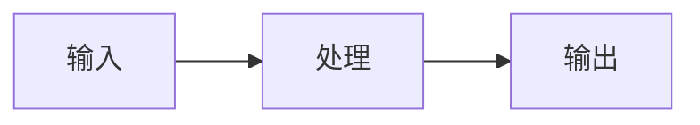

# 博客全局 Mermaid 渲染设计

日期：2026-07-27

## 背景

博客使用 Astro 7、Content Collections、Markdown/MDX 和 GitHub Pages。当前文章中的
`mermaid` fenced code block 会被 Shiki 输出为带有
`data-language="mermaid"` 的普通 `<pre>`，因此浏览器只显示深色源码框，不能显示图表。

仓库已有多篇文章包含 Mermaid。目标不是只修复某一篇文章，而是建立长期写作能力：
以后作者只需使用标准 ` ```mermaid ` fenced block，现有和未来的 Markdown/MDX 文章都能
自动显示图表。

## 目标

- 自动渲染全部博客文章中的 Mermaid fenced block。
- 同时支持 `.md` 与 `.mdx`，不要求作者导入组件。
- 普通文章不下载 Mermaid 主包。
- 兼容 Astro `ClientRouter` 的首次加载和页面切换。
- 图表在 1440、768 和 375 像素宽度下保持可读，不造成页面级横向溢出。
- 使用站点现有米白、墨绿、苔绿和陶土色视觉体系。
- 渲染失败或 JavaScript 不可用时保留 Mermaid 源码，不能显示空白区域。
- 为未来发布提供自动回归测试和明确的写作规范。
- 发布前提供本地预览，用户确认后才进入远程发布。

## 非目标

- 不为每篇文章设计独立 Mermaid 主题。
- 不支持 Mermaid 节点中的自定义 JavaScript 回调。
- 不在本次增加图表编辑器、导出按钮、缩放工具栏或深色模式。
- 不把 Mermaid 图表预生成成仓库中的 PNG/PDF 文件。
- 不修改现有文章的 Mermaid 语法，除非某个现有图表本身无法解析。

## 方案比较

### 方案 A：浏览器端按需渲染（采用）

Astro 继续生成带 `data-language="mermaid"` 的 `<pre>`。文章加载后，小型启动脚本检测
这些节点；只有检测到图表时才动态导入 Mermaid，并把源码渲染为 SVG。

优点：

- 对现有 Markdown/MDX 零迁移。
- 不依赖 Chromium 或其他构建期浏览器。
- GitHub Pages 构建链简单。
- Mermaid 版本升级只需修改一个依赖和一套测试。
- 普通文章只承担很小的检测脚本成本。

代价：

- 图表在浏览器中完成渲染，会比正文稍晚出现。
- 需要处理 Astro 页面切换、重复初始化和运行时错误。

### 方案 B：构建期生成 SVG

在 Astro 构建时通过 Mermaid CLI 或浏览器内核生成 SVG。

优点是页面无 Mermaid 运行时，图表首屏稳定；缺点是 CI 依赖更重，构建耗时和故障面更大，
Windows 与 Linux 渲染差异也更难维护。当前个人博客不采用。

### 方案 C：每篇 MDX 手工使用组件

作者在 MDX 中导入 Mermaid 组件并传入源码。

优点是单图控制精细；缺点是普通 Markdown 不适用，现有文章需要迁移，长期发布步骤更复杂。
当前不采用。

## 架构

### 内容契约

作者继续写标准 fenced block：

````markdown

````

不需要导入组件或添加 frontmatter 开关。非 Mermaid 代码块保持现有 Shiki 高亮行为。

### 运行流程

1. Astro 将 Markdown/MDX 渲染为 HTML。
2. Mermaid fenced block 在构建产物中保留为
   `<pre data-language="mermaid">`，源码可用于无 JavaScript 回退。
3. 全局轻量启动器在首次加载及 `astro:page-load` 时扫描当前文档。
4. 若页面没有 Mermaid，流程立即结束，不加载 Mermaid 主包。
5. 若存在未处理图表，动态导入 Mermaid，并进行一次全局初始化。
6. 每个图表读取原始 `textContent`，调用 Mermaid 渲染 API。
7. 只有渲染成功后，才用带语义标签的 `<figure>` 和 SVG 替换源码块。
8. 已处理节点带状态标记，重复页面事件不会再次渲染。
9. 渲染失败时保留原 `<pre>`，并在其附近显示可访问的失败提示。

## 模块边界

### `src/lib/mermaidDiagrams.ts`

纯行为模块，负责：

- 发现 Mermaid `<pre>`。
- 提取源码。
- 从最近的章节标题生成可读标签。
- 管理 pending/rendered/error 状态。
- 成功后建立图表容器。
- 失败时保留源码并输出恢复提示。
- 支持注入渲染函数，以便用真实 DOM 测试本站行为，而不测试 Mermaid 库内部。

### `src/scripts/mermaid-diagrams.ts`

浏览器启动模块，负责：

- 首次页面初始化。
- 监听 `astro:page-load`。
- 页面存在 Mermaid 时动态导入 `mermaid`。
- 以一次性、严格安全配置初始化 Mermaid。
- 把 Mermaid 的 `render` 能力传给纯行为模块。

### `src/layouts/BaseLayout.astro`

加载轻量启动脚本。由于真正的 Mermaid 包采用动态导入，首页、归档和不含图表的文章不会加载
Mermaid 主包。

### `src/styles/global.css`

提供统一图表样式：

- 使用现有设计令牌形成浅色表面、边框与阴影。
- 图表容器最大宽度不超过正文。
- 宽图在容器内部横向滚动，不能让整个页面横向溢出。
- SVG 高度自动，保持比例。
- 加载和错误提示不依赖颜色表达状态。
- 不增加装饰性动画；现有 `prefers-reduced-motion` 策略保持有效。

### 发布规范与验证脚本

在仓库文档中记录 Mermaid 写法和约束，并增加专用验证命令，确保：

- 全局脚本仍被加载。
- 动态导入与严格安全配置仍存在。
- 至少一个真实文章 Mermaid block 能在构建产物中被识别。
- 非 Mermaid 代码块不会进入图表流程。

## 视觉与可访问性

- 图表使用站点现有 `surface`、`ink`、`teal`、`moss`、`clay` 语义颜色。
- 不依靠红绿配色单独表达关系。
- 图表容器使用最近的 `h2` 或 `h3` 生成类似“先理解 MCP 到底是什么示意图”的标签。
- Mermaid 输出 SVG 保留自身语义；外层 `figure` 提供稳定的上下文标签。
- 错误提示使用文本和 `role="alert"`，不是只改变边框颜色。
- 宽图只在自身容器滚动；375 像素页面不得出现页面级横向滚动。
- 不自动播放或添加图表动画。

## 安全

- Mermaid 使用 `securityLevel: "strict"`。
- `startOnLoad: false`，只通过本站受控启动器调用。
- 不启用节点 JavaScript 回调。
- 文章仍属于仓库内受控内容，但渲染器不能依赖作者内容天然可信。
- 渲染失败不写入不可信 HTML；保留 Shiki 已输出的源码块。

## 性能

- Mermaid 使用动态 `import()`，只在页面含图表时加载。
- 同一页面的多个图表共享一次模块加载和初始化。
- 每个节点最多处理一次。
- 不在首页和归档页渲染图表。
- 图表容器避免异步替换导致正文以外的布局位移；源码块在成功前作为稳定回退占位。

## 测试策略

实施遵循测试驱动开发。

### 单元测试

先写并观察失败，再实现以下行为：

- Mermaid 代码块成功转换为可访问图表。
- 非 Mermaid 代码块保持不变。
- 渲染错误时保留源码并显示错误提示。
- 重复初始化不会重复渲染。
- 最近章节标题会进入图表标签。

测试使用 JSDOM 的真实 DOM，只替换外部 Mermaid 渲染边界。

### 构建与静态验证

- `npm test`
- 新增 Mermaid 专用验证命令
- 现有全部相关 `verify:*`
- `npm run build`
- `git diff --check`

`verify:article-visuals` 的既有旧文基线问题需与本次新增问题分开记录。

### 浏览器预览

发布前启动本地预览并验证：

- 目标 MCP 教程不再显示 `flowchart LR` 黑色源码框，而显示 SVG。
- 现有其他 Mermaid 文章也能渲染。
- 普通代码块仍显示 Shiki 高亮。
- 1440、768、375 像素宽度无页面级横向溢出。
- 375 像素下宽图可以在图表容器内部滚动。
- 模拟无效 Mermaid 时源码仍可见，并有清楚错误信息。
- Astro 页面切换后图表仍能渲染且不会重复。

预览完成后由用户确认视觉结果，再进入远程发布。

## 发布流程

1. 在功能分支完成实现与本地验证。
2. 向用户展示本地预览和验证结论。
3. 用户确认后，由独立发布子 agent 检查提交范围。
4. 提交、推送、创建并合并 PR。
5. 等待 GitHub Pages Actions 成功。
6. 在线验证 MCP 教程、其他 Mermaid 文章、首页和归档页。
7. Vercel 外部检查仍不作为 GitHub Pages 发布门。

