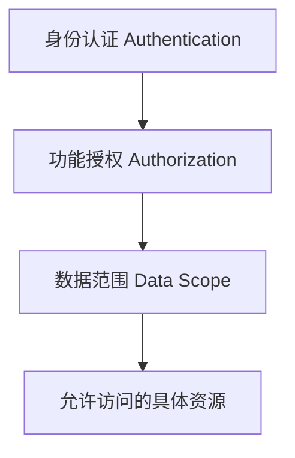
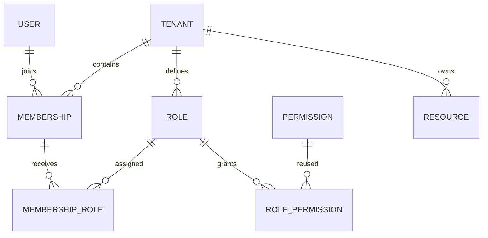
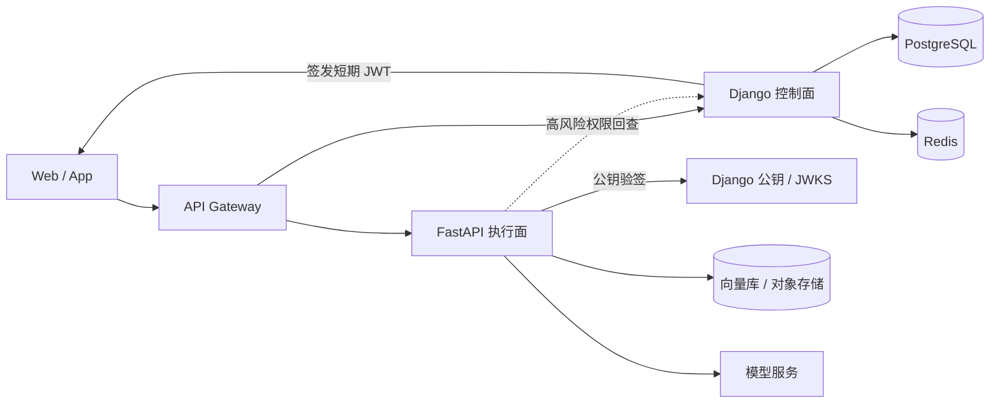

## 一、登录成功，为什么仍然不等于“有权限”

企业系统里最危险的权限误解，是把“能登录”当成“能操作”。登录只证明请求能够关联到某个身份；它没有回答这个人在当前组织中是什么成员、能执行什么动作，更没有回答他能看见哪几条数据。

以企业 AI 知识库为例，同一个账号可能同时加入集团租户和测试租户：在集团租户中是知识库管理员，在测试租户中只是访客。即使两个租户里都有主键为 `42` 的知识库，“登录用户能够删除知识库”也仍然缺少四个关键条件：

1. **调用者是谁**：会话或令牌对应哪个可信 `User`，账号是否仍然有效。
2. **当前租户是谁**：本次请求激活的是哪条 `Membership`，而不是客户端随意声明了哪个 `tenant_id`。
3. **允许什么动作**：当前成员通过租户内角色，是否拥有 `knowledge.delete_knowledgebase`。
4. **能操作哪些记录**：即使允许删除知识库，目标是否属于当前租户，并且落在本人的数据范围内。

这四个问题分别属于身份认证、功能授权和数据范围。它们是依次收窄的门禁，而不是一个布尔值：



因此，本文把一次授权判断写成一个清晰的交集：

```text
允许访问 = 可信身份 ∩ 有效租户成员关系 ∩ 动作权限 ∩ 数据范围 ∩ 资源租户归属
```

任何一项缺失都应拒绝请求。尤其要注意，“知道某个资源 ID”从来不等于“有权访问该资源”；详情、更新和删除接口都必须从已经按租户和数据范围收窄的查询集里加载对象。

## 二、Django、FastAPI 和 Flask 的权限能力应该怎样比较

这三个框架都能构建安全的企业权限系统，但它们提供的是不同层级的能力。准确的比较不是“谁能做 RBAC”，而是“框架已经替你规定了多少模型和约定”。

| 框架 | 原生提供的权限基础 | 仍需业务实现的部分 | 更合适的角色 |
|---|---|---|---|
| Django | `User`、`Group`、`Permission`、`ContentType`、认证后端、`has_perm()` 与 Admin 集成 | 租户成员关系、租户内角色、数据范围、对象查询过滤 | 账号、组织、权限配置、运营后台等控制面 |
| FastAPI | 可组合的依赖注入、安全工具和 OAuth2 scopes 示例 | RBAC 表结构、权限持久化、租户关系、对象过滤、管理界面 | 高并发 API、模型推理、流式响应等执行面 |
| Flask | 简洁可扩展的 Web 核心和扩展机制 | 认证、ORM、RBAC、迁移、后台及其组合约定 | 需要高度自定义、团队愿意自行选型和治理的服务 |

[FastAPI 官方文档](https://fastapi.tiangolo.com/tutorial/dependencies/)明确说明，依赖系统可以复用认证和角色要求等逻辑。这意味着我们可以写出 `get_current_principal`、`require_permission`、`load_scoped_resource` 等依赖，并让路由声明它们；但依赖注入是**执行与组合机制**，不是内置 RBAC 数据模型。它不会自动创建 `Role`、`RolePermission`、租户成员关系，也不会替应用决定权限从哪里同步、何时失效。

FastAPI 的 OAuth2 scopes 能表达令牌被授予的 scope，但 scope 字符串仍不等同于完整的企业 RBAC。多租户系统还需要处理活跃成员关系、租户隔离、角色变更、数据范围和对象归属；这些规则必须由应用的数据模型与查询策略定义。

Flask 也能达到同样结果，只是路径更偏“自行组装”。[Flask 官方设计说明](https://flask.palletsprojects.com/en/stable/design/)把 “micro” 解释为保持核心简单、可扩展，并且不替应用决定数据库等选型；[扩展文档](https://flask.palletsprojects.com/en/stable/extensions/)则说明额外能力来自扩展包。因此，团队可以组合认证、ORM 和权限扩展，或者完全自研，但要自行统一模型、迁移、后台、检查入口和测试规范。所谓“框架约定更少”，不是能力更弱，而是架构决策和长期治理更多地落到团队身上。

Django 的优势也不应被夸大。它提供成熟的授权地基，但不会因为模型上有 `tenant_id` 就自动获得多租户隔离，也不会自动把模型级权限变成对象级权限。后续设计是在 Django 地基上增加企业语义，而不是宣称框架已经完成全部工作。

## 三、Django 内置权限体系解决了什么

Django 把常见的身份与模型级权限概念做成了一套可迁移、可查询、可在后台管理的基础设施。[官方认证文档](https://docs.djangoproject.com/en/5.2/topics/auth/default/)给出的核心关系可以概括为：

- `User` 表示登录主体。默认用户可以直接拥有权限，也可以通过一个或多个 `Group` 继承权限。
- `Group` 是对用户进行分类并批量授予权限的通用容器。它适合表达全局角色，但本身没有租户归属。
- `Permission` 表示一个动作，字段包括 `name`、`codename` 和指向 `ContentType` 的外键。
- `ContentType` 标识权限针对哪个应用模型，因此权限名称可以稳定地写成 `<app_label>.<codename>`。

当安装 `django.contrib.auth` 并执行迁移时，Django 会为每个模型创建 `add`、`change`、`delete`、`view` 四个默认权限。假设应用名是 `knowledge`、模型是 `KnowledgeBase`，删除检查可以保持得很紧凑：

```python
request.user.has_perm("knowledge.delete_knowledgebase")
```

`has_perm()` 会交给配置的认证后端求值，既可以利用用户直接权限，也可以利用组权限。`is_superuser` 表示该用户在默认语义下无需逐项分配便被视为拥有全部权限；它是高风险平台开关，不应被当成租户角色。`is_staff` 主要表示用户是否可以登录 Django Admin，也不等于“某个租户的管理员”。两者都是 `User` 属性，而不是本文的租户授权模型。

Django Admin 会使用模型权限控制查看、添加、修改和删除入口，这使权限配置和内部运营界面天然衔接。使用 Django REST Framework 时，还可以继承 [`BasePermission`](https://www.django-rest-framework.org/api-guide/permissions/) 实现：

```python
class KnowledgeBasePermission(BasePermission):
    def has_permission(self, request, view):
        ...

    def has_object_permission(self, request, view, obj):
        ...
```

这里必须保留一条边界：Django 的默认 `ModelBackend` 不会自动实现对象级权限。调用 `user.has_perm(permission, obj)` 时，是否支持对象参数取决于认证后端；DRF 的自定义视图也需要显式调用对象权限检查。并且列表接口不会逐条自动执行对象权限，官方建议通过 `queryset` 过滤可见记录。换言之，对象级行为必须由明确的应用逻辑或兼容的权限后端提供，不能只写一个 `has_perm()` 就假定资源已经隔离。

## 四、Django 默认权限为什么不等于多租户权限

Django 默认权限擅长回答“这个用户是否拥有某个模型动作”，但企业多租户问题问的是“这个成员在当前租户中是否拥有该动作，并且能作用于哪些数据”。两者之间至少有四处语义差距。

第一，默认 `Group` 没有租户维度。如果把“管理员”建成一个全局组，那么用户加入后可能在所有租户都表现为管理员；如果为每个租户复制一组权限，又会产生大量命名约定和生命周期管理问题。本文因此把 `Role` 明确归属于 `Tenant`。

第二，一个 `User` 可以加入多个租户，并在每个租户拥有不同部门和角色。角色不能直接挂在 `User` 上，否则无法回答同一账号在租户 A 是管理员、在租户 B 是访客。本文让 `Membership` 表示 `User` 在某个 `Tenant` 中的身份，并且只让 `Membership` 接收角色。

第三，动作权限和数据范围不是同一维度。`knowledge.view_knowledgebase` 表示“可以执行查看动作”，却没有表达“只看本人创建”“看本部门”还是“看全租户”。如果把这些组合成 `view_own_knowledgebase`、`view_department_knowledgebase` 等大量权限，权限目录会迅速膨胀，修改组织规则也更困难。本文把 `DataScope` 放在租户角色上，并在查询集里执行。

第四，模型权限不自动校验对象的 `tenant_id`。即使用户拥有 `delete_knowledgebase`，应用仍必须确保目标记录属于当前租户；否则只要猜中主键就可能发生越权访问。

所以扩展策略不是废弃 Django 权限，而是分层复用：

```text
Django Permission：统一动作目录
Tenant Role：租户内权限集合与数据范围
Membership：用户在当前租户中的授权主体
QuerySet filter：真正执行租户隔离与数据可见性
```

这样既保留 Django 生态对 `Permission`、`ContentType` 和 Admin 的支持，也把企业系统需要的组织边界显式建模。

## 五、设计 Tenant → Membership → Role → Permission

下面的关系是整套模型的主轴。`Permission` 继续复用 Django 内置表；自定义模型只补齐租户、成员、角色和数据范围。



一个可落地的 Django 模型骨架如下。示例刻意使用显式中间表，便于以后添加授权人、授权时间、有效期和审计字段：

```python
from django.conf import settings
from django.contrib.auth.models import Permission
from django.db import models


class DataScope(models.TextChoices):
    SELF = "self", "仅本人"
    DEPARTMENT = "department", "本部门"
    TENANT = "tenant", "全租户"


class Tenant(models.Model):
    name = models.CharField(max_length=128)
    is_active = models.BooleanField(default=True)


class Department(models.Model):
    tenant = models.ForeignKey(
        Tenant,
        on_delete=models.CASCADE,
        related_name="departments",
    )
    name = models.CharField(max_length=128)


class Membership(models.Model):
    user = models.ForeignKey(
        settings.AUTH_USER_MODEL,
        on_delete=models.CASCADE,
        related_name="tenant_memberships",
    )
    tenant = models.ForeignKey(
        Tenant,
        on_delete=models.CASCADE,
        related_name="memberships",
    )
    department = models.ForeignKey(
        Department,
        on_delete=models.SET_NULL,
        null=True,
        blank=True,
        related_name="memberships",
    )
    is_active = models.BooleanField(default=True)

    class Meta:
        constraints = [
            models.UniqueConstraint(
                fields=["user", "tenant"],
                name="uniq_membership_user_tenant",
            ),
        ]


class Role(models.Model):
    tenant = models.ForeignKey(
        Tenant,
        on_delete=models.CASCADE,
        related_name="roles",
    )
    name = models.CharField(max_length=128)
    data_scope = models.CharField(
        max_length=16,
        choices=DataScope.choices,
        default=DataScope.SELF,
    )

    class Meta:
        constraints = [
            models.UniqueConstraint(
                fields=["tenant", "name"],
                name="uniq_role_tenant_name",
            ),
        ]


class MembershipRole(models.Model):
    membership = models.ForeignKey(
        Membership,
        on_delete=models.CASCADE,
        related_name="membership_roles",
    )
    role = models.ForeignKey(
        Role,
        on_delete=models.CASCADE,
        related_name="membership_roles",
    )

    class Meta:
        constraints = [
            models.UniqueConstraint(
                fields=["membership", "role"],
                name="uniq_membership_role",
            ),
        ]


class RolePermission(models.Model):
    role = models.ForeignKey(
        Role,
        on_delete=models.CASCADE,
        related_name="role_permissions",
    )
    permission = models.ForeignKey(
        Permission,
        on_delete=models.CASCADE,
        related_name="tenant_role_permissions",
    )

    class Meta:
        constraints = [
            models.UniqueConstraint(
                fields=["role", "permission"],
                name="uniq_role_permission",
            ),
        ]
```

关系可以记成四句话：

- `Membership(user, tenant, department, is_active)` 确定用户在某个租户中的成员身份。
- `Role(tenant, name, data_scope)` 始终属于一个租户，并携带独立于动作权限的数据范围。
- `MembershipRole(membership, role)` 把角色授予成员关系，而不是授予全局 `User`。
- `RolePermission(role, permission)` 复用 Django `Permission` 作为动作目录，不复制 `ContentType` 与 codename 体系。

`RolePermission` 复用的是权限记录和 codename 规范，不会自动把权限加入 `User.user_permissions` 或 `Group.permissions`，所以默认 `request.user.has_perm()` 并不知道租户角色。租户接口应由统一授权服务查询 `MembershipRole → RolePermission`；如果希望继续使用 `has_perm()` 风格，则要实现理解租户上下文的自定义认证后端，并对上下文来源和缓存边界做严格约定。

即使写入入口已经校验租户一致性，授权读取也要防御历史脏数据、Admin、脚本或 fixture 绕过服务层的情况。权限查询必须同时绑定已验证的成员和可信租户：

```python
def permission_grants(principal, app_label, codename):
    return RolePermission.objects.filter(
        role__membership_roles__membership_id=principal.membership_id,
        role__membership_roles__membership__tenant_id=principal.tenant_id,
        role__tenant_id=principal.tenant_id,
        permission__content_type__app_label=app_label,
        permission__codename=codename,
    )
```

这样，即使错误数据把租户 A 的 `Membership` 连到租户 B 的 `Role`，该角色也不会进入租户 A 的授权结果。`authorized_scope` 也只能从这个已收窄的 `permission_grants()` 查询集计算。

数据库里的普通外键不能单独保证 `MembershipRole.membership.tenant_id == MembershipRole.role.tenant_id`，也不能保证成员所选部门属于相同租户。领域服务、表单和 serializer 仍应做写入时验证，但不能把它当成唯一防线。对支持复合外键的数据库，可以在 `MembershipRole` 冗余一个 `tenant_id`，为 `Membership(id, tenant_id)` 和 `Role(id, tenant_id)` 建唯一约束，再分别建立 `(membership_id, tenant_id)` 与 `(role_id, tenant_id)` 复合外键；Django 模型 API 或目标数据库不便直接表达时，可用数据库迁移或触发器实现。跨表一致性不能用一个只检查当前行的普通 `CheckConstraint` 代替。

### 数据范围怎样落到查询上

假设 `KnowledgeBase` 至少包含 `tenant_id`、`created_by_id` 和 `department_id`。动作权限检查通过后，再根据当前成员拥有角色中的有效数据范围构造查询集：

```python
def scope_knowledge_bases(queryset, principal, authorized_scope):
    queryset = queryset.filter(tenant_id=principal.tenant_id)

    if authorized_scope == DataScope.TENANT:
        return queryset
    if authorized_scope == DataScope.DEPARTMENT:
        if principal.department_id is None:
            return queryset.none()
        return queryset.filter(department_id=principal.department_id)
    return queryset.filter(created_by_id=principal.user_id)
```

`Membership.department` 允许为空，因此部门范围必须 fail closed：没有经过验证的 `department_id` 时返回空查询集，或者在进入作用域函数前直接拒绝请求。不能执行 `department_id=None`，因为 Django 会把它翻译为 `IS NULL`，从而让没有部门的成员看到租户内全部“未分部门”资源。

`authorized_scope` 必须只从**实际授予本次动作权限**的角色计算。例如，一个角色授予“全租户查看”，另一个角色只授予“本人删除”，不能把查看范围错误套到删除动作上。若多个角色都授予同一动作，可以定义明确的合并规则，例如 `TENANT > DEPARTMENT > SELF` 取最宽范围；不要依赖数据库返回顺序，也不要把“有查看权限”推导成“默认可看全租户”。动作权限回答“能不能做”，数据范围回答“本次动作能对哪些记录做”，两者必须分别测试。

## 六、每次请求都要通过三道权限门

一个安全的详情、修改或删除请求，应严格按下面的顺序通过三道门：

1. **验证已认证身份**：从服务端会话或已验证签名的令牌得到 `User`；匿名、禁用或令牌失效立即拒绝。
2. **解析有效成员关系和动作权限**：根据可信的当前租户上下文加载 `Membership(user, tenant, is_active=True)`，聚合该成员的租户内角色，检查所需 Django `Permission`，并从授予该动作的角色计算 `authorized_scope`。
3. **通过租户与数据范围过滤加载资源**：先构造已按 `tenant_id` 和 `DataScope` 收窄的 queryset，再从中取目标对象。

顺序很重要：先建立可信 `principal`，再谈资源。下面是必须拒绝的写法：

```python
tenant_id = request.data["tenant_id"]
KnowledgeBase.objects.get(id=knowledge_base_id)
```

它有两个问题：`tenant_id` 来自不可信输入，而且按全局主键取对象没有租户条件。即使后面再比较租户，也容易在某条分支漏检，并且可能暴露资源是否存在。

最低限度的安全加载形态是：

```python
KnowledgeBase.objects.get(
    id=knowledge_base_id,
    tenant_id=principal.tenant_id,
)
```

如果角色还受部门或本人范围约束，则应进一步从统一作用域函数返回的 queryset 加载：

```python
queryset = scope_knowledge_bases(
    KnowledgeBase.objects.all(),
    principal,
    authorized_scope,
)
knowledge_base = queryset.get(id=knowledge_base_id)
```

列表、导出、批量更新和统计接口也必须复用相同的作用域函数。不能只保护详情接口，否则攻击者仍可能从列表、搜索结果、总数或导出文件旁路获取跨租户信息。

这三道门最终形成稳定的请求管道：

```text
request
  → authenticated user
  → active Membership in trusted Tenant
  → required Permission through tenant Role
  → tenant-scoped and data-scoped queryset
  → concrete resource
```

对于不存在和无权访问的资源，通常统一返回 `404` 可以减少对象枚举信息；未认证返回 `401`，已认证但缺少动作权限返回 `403`。无论采用何种错误码约定，审计日志都应记录可信的 `user_id`、`tenant_id`、权限 codename、资源类型和拒绝原因，而不是记录来自客户端但尚未验证的租户声明。

## 七、为什么企业 AI 平台还需要 FastAPI

Django 已经承载账号、租户和权限，为什么还要增加 FastAPI？原因不是 Django “不能做 AI”，而是企业 AI 请求与传统管理请求的运行特征不同：模型调用和 RAG 检索通常是长耗时、流式、异步并且依赖 GPU、向量库与对象存储。把这些任务和后台管理、计费、权限配置放进同一个进程，会让扩缩容、超时和故障隔离互相牵制。

更清晰的分工是让 Django 成为**控制面**，负责：

- 租户与成员关系管理；
- 角色与权限管理；
- 登录与令牌签发；
- 计费与套餐；
- 审计查询；
- 高风险操作的权威权限决策。

FastAPI 则成为**执行面**，负责：

- Agent 执行；
- RAG 检索；
- 文件处理；
- LLM 调用；
- 流式响应；
- AI 工作流编排。

这不是按框架拆分业务，而是按职责和运行特征拆分：Django 保持授权事实的唯一权威来源，FastAPI 消费已经验证的身份与权限上下文。FastAPI 不应维护一套可独立编辑的租户角色表，否则两个服务会逐渐出现“同一用户、两种权限答案”。

## 八、Django 控制面 + FastAPI 执行面的总体架构



正常的数据流是：客户端先向 Django 登录并取得短期 JWT，随后把令牌通过 API Gateway 携带给 FastAPI。图中的连线不表示 Django 要转发每一次 AI 请求；网关可以直接把执行请求路由到 FastAPI，FastAPI 使用 Django 发布的公钥或 JWKS 在本地完成验签。

这种边界让执行面可以按模型吞吐量独立扩容，也避免 Django 成为所有流式响应的数据中转点。只有删除关键数据、调整计费资源、导出敏感内容等高风险动作，才需要由 FastAPI 携带可信主体和动作上下文回查 Django 的权威授权接口。即使网关已经做过认证，FastAPI 仍须自行验证令牌；网关路由不是服务端授权的替代品。

高风险回查还需要独立的服务间信任边界。Django 应通过工作负载身份、mTLS，或者权限仅限内部授权接口的窄范围服务凭据来认证 FastAPI，不能因为请求来自内网或网关就接受它。回查请求应携带原始签名 JWT，由 Django 独立验签并验证标准声明，再使用令牌中经过验证的 `sub`、`tenant_id`、`jti` 从数据库重新加载有效 `Membership`，以当前角色、权限和数据范围作出决定。如果不转发原始令牌，则只能提交 Django 签发且可反查签发记录的不透明授权句柄，不能提交自由填写的用户和租户字段。Django 不能信任 FastAPI 发送的 `Principal` JSON、角色数组或租户字段本身，因为这些都可能由调用方重新构造。

## 九、用 JWT 在两个服务之间传递可信身份

跨服务 JWT 的目标是传递一个有明确边界、可验证来源的 `Principal`，而不是把 Django 的整套会话状态复制到执行面。一个最小声明契约可以是：

```json
{
  "sub": "user-uuid",
  "tenant_id": "tenant-uuid",
  "roles": ["ai_operator"],
  "permission_version": 12,
  "iss": "django-control-plane",
  "aud": "fastapi-ai-service",
  "exp": 1785312600,
  "iat": 1785311700,
  "jti": "token-uuid"
}
```

各字段承担不同职责：`sub` 是用户标识，`tenant_id` 是本次令牌唯一有效的租户上下文，`roles` 是签发时的角色快照，`permission_version` 用于判断权限是否已经变更，`jti` 用于审计和必要时的单令牌撤销。`iss`、`aud`、`iat` 与 `exp` 则约束令牌由谁签发、给谁使用以及有效时间。

服务间应采用**非对称签名**：Django 持有签名私钥；FastAPI 只持有验签公钥，或者从受信任地址读取 JWKS。FastAPI 验证时必须同时检查签名、固定的算法允许列表、`iss`、`aud` 和 `exp`，不能根据令牌头里的 `alg` 任意选择算法，也不能只把载荷做 Base64 解码就当成可信身份。密钥轮换时可通过 `kid` 选择 JWKS 中仍在轮换窗口内的公钥，但未知 `kid` 必须拒绝。

`tenant_id` 只能来自**验签成功后的令牌声明**，不能来自请求体、查询参数或客户端自定义请求头。客户端可以提交业务资源 ID，却不能在同一令牌上切换租户；要访问另一个租户，应先由 Django 根据该用户的有效 `Membership` 签发面向那个租户的新令牌。

短期 JWT 不是永久授权证明。账号禁用、成员退出、角色调整或高风险权限撤销后，旧令牌在过期前可能仍携带旧快照，因此还需要第十一节的版本失效和在线回查策略。

## 十、FastAPI 如何校验权限和资源归属

验签与声明校验通过后，FastAPI 把外部令牌转换成内部主体。接口保持精简，避免路由直接依赖原始 JWT：

```python
from collections.abc import Awaitable, Callable
from uuid import UUID

from pydantic import BaseModel


class Principal(BaseModel):
    user_id: UUID
    tenant_id: UUID
    roles: frozenset[str]
    permission_version: int
    jti: UUID


def require_permission(code: str) -> Callable[..., Awaitable[Principal]]:
    ...


async def get_tenant_agent(
    *,
    tenant_id: UUID,
    agent_id: UUID,
) -> Agent:
    ...
```

`require_permission()` 应依次完成令牌提取、非对称签名与标准声明验证、声明类型转换、`permission_version` 有效性检查，以及角色到动作权限的展开。任一步失败都不产生 `Principal`。角色名称只是权限快照的输入，不应让每个路由自行写 `if "admin" in roles`；统一依赖才能保证权限 codename、缓存和失效逻辑一致。

角色到权限的展开结果也不能由 FastAPI 本地配置文件自行定义。Django 应提供一个内部、只读、带版本的权限快照端点：它根据当前有效 `Membership` 和租户内 `RolePermission` 计算权限 codename，并返回与 `tenant_id`、`sub`、角色集合和 `permission_version` 绑定的快照。FastAPI 缓存未命中或遇到未知版本时，只能向这个 Django 权威端点补取；返回版本与已验证令牌不一致、快照字段不匹配、请求超时或刷新失败时，都必须 fail closed，拒绝本次请求并要求重新取得令牌，不能沿用旧映射或退回本地默认角色。

接口最终还要通过租户安全的资源加载器把“能执行动作”和“能操作这个对象”连接起来：

```python
@router.post("/agents/{agent_id}/runs")
async def run_agent(
    agent_id: UUID,
    principal: Principal = Depends(require_permission("agent.execute")),
):
    agent = await get_tenant_agent(
        tenant_id=principal.tenant_id,
        agent_id=agent_id,
    )
    return await agent_runner.start(agent=agent, principal=principal)
```

`get_tenant_agent()` 必须在同一条数据库查询或同一个仓储方法中同时约束 `tenant_id` 与 `agent_id`，例如语义上等价于 `WHERE tenant_id = :tenant_id AND id = :agent_id`。禁止先按 `agent_id` 全局加载，再依靠路由中的后置判断；更不能使用请求体里的 `tenant_id`。对于无权访问或不存在的 Agent，可以统一返回 `404`，以减少跨租户对象枚举信息。

同一原则也适用于知识库、文件、会话和工作流。动作权限依赖保护入口，租户感知的资源加载器保护对象，两者缺一不可；列表、批量处理和流式任务恢复也要复用相同的租户过滤条件。

## 十一、三种权限同步方案怎么选

控制面和执行面拆开以后，最关键的工程取舍是 FastAPI 在什么时刻获得权限答案。常见方案有三种：

| 方案 | 请求路径与优点 | 主要代价 | 适用场景 |
|---|---|---|---|
| JWT 权限快照 | Django 签发时写入角色或权限摘要，FastAPI 本地验签后即可决策；延迟低，对 Django 短暂不可用更有韧性 | 令牌有效期内可能保留旧权限，声明过大会增加传输和解析成本 | 高频、低到中风险的执行请求 |
| 实时调用 Django 鉴权 | FastAPI 每次把可信主体、动作和资源上下文交给 Django，答案最新且审计集中 | 增加网络延迟和控制面负载，Django 故障可能阻塞执行面 | 删除敏感数据、计费变更等高风险动作 |
| 独立策略服务 | 把跨语言、跨服务的策略求值集中到专门服务，可支持更复杂的 ABAC 或统一策略语言 | 引入新的部署、策略发布、一致性、可用性和排障成本 | 服务数量和策略复杂度已经被事实证明需要集中治理时 |

对大多数从 Django 单体演进而来的企业 AI 平台，推荐组合而不是三选一：

1. Django 签发**短期 JWT**，缩短旧权限自然存活的窗口。
2. FastAPI **缓存角色到权限的展开结果**，缓存键至少包含租户、角色集合和 `permission_version`，不能让不同租户共享同名角色的结果；缓存内容只能来自 Django 的版本化权限快照端点。
3. 每次角色、权限、成员状态或相关数据范围发生变化时，Django 递增对应授权主体的 **`permission_version`**；FastAPI 发现版本已失效时拒绝旧令牌并要求重新签发。
4. 对高风险动作执行**实时 Django 回查**，并设置明确的工作负载认证、超时、失败关闭和审计策略；授权服务不可用时不能默认放行。
5. 只有当多服务策略重复、跨语言规则和策略发布复杂度已经被真实业务证明后，再引入**独立策略服务**，不要为假设中的规模预付治理成本。

这套组合让绝大多数 AI 执行请求走本地验签和缓存路径，同时把权限撤销窗口控制在短期令牌与版本校验之内。需要强调的是，`permission_version` 必须有 FastAPI 可验证的当前版本来源，例如短 TTL 缓存配合 Django 事件失效或轻量版本查询；如果只是把版本号写进 JWT 却从不比较，它就没有撤销价值。

完整的缓存补给路径应是：命中相同租户、角色集合与版本的可信缓存时直接使用；缓存未命中或版本未知时，FastAPI 请求 Django 拥有的版本化权限快照端点；Django 从数据库中的有效成员关系和角色授权重新计算快照；FastAPI 校验响应中的主体、租户、角色集合与版本均和已验证令牌一致后才写入缓存。Django 也可以发布经过认证的失效事件来主动清除旧缓存，但事件只负责加速失效，不能成为另一套可编辑权限模型。快照获取失败、版本不一致、响应无法验证或事件顺序存在缺口时一律拒绝请求，不能把“暂时取不到权限”解释成“沿用旧权限”。

权限快照端点和高风险回查端点都属于内部授权 API，必须使用上述工作负载身份、mTLS 或窄范围服务凭据认证调用方。服务认证只证明“这是获准调用该接口的 FastAPI”，不证明它提交的用户字段正确；Django 仍要独立验签原始 JWT，或依据 Django 自己签发并可反查的不透明授权句柄重新加载当前成员关系，绝不直接把调用方构造的 `Principal` 当作授权事实。

## 十二、可落地的项目目录与代码骨架

## 十三、错误码、安全边界和常见误区

## 十四、权限测试矩阵

## 十五、从单体到多服务的演进路线

## 十六、什么时候只用 Django、只用 FastAPI，什么时候组合
