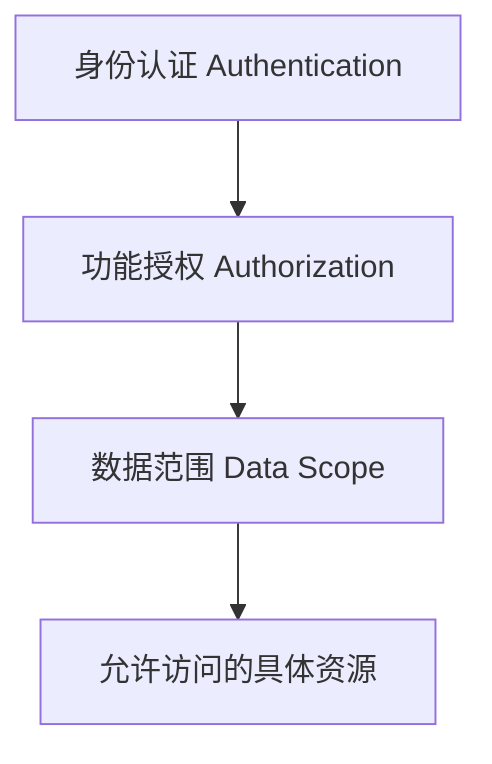
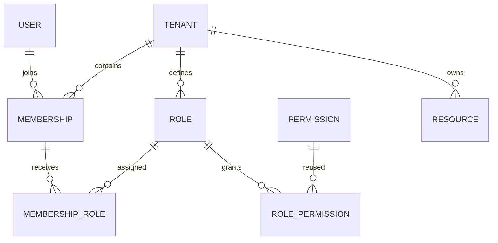
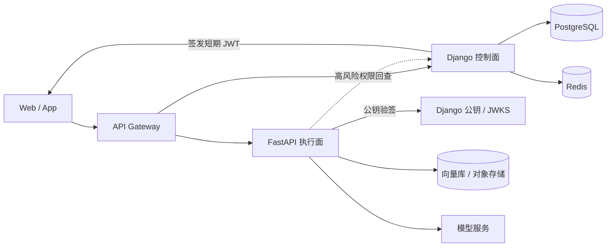

## 一、登录成功，为什么仍然不等于“有权限”

企业系统里最危险的权限误解，是把“能登录”当成“能操作”。登录只证明请求能够关联到某个身份；它没有回答这个人在当前组织中是什么成员、能执行什么动作，更没有回答他能看见哪几条数据。

以企业 AI 知识库为例，同一个账号可能同时加入集团租户和测试租户：在集团租户中是知识库管理员，在测试租户中只是访客。即使两个租户里都有主键为 `42` 的知识库，“登录用户能够删除知识库”也仍然缺少四个关键条件：

1. **调用者是谁**：会话或令牌对应哪个可信 `User`，账号是否仍然有效。
2. **当前租户是谁**：本次请求激活的是哪条 `Membership`，而不是客户端随意声明了哪个 `tenant_id`。
3. **允许什么动作**：当前成员通过租户内角色，是否拥有 `knowledge.delete_knowledgebase`。
4. **能操作哪些记录**：即使允许删除知识库，目标是否属于当前租户，并且落在本人的数据范围内。

这四个问题分别属于身份认证、功能授权和数据范围。它们是依次收窄的门禁，而不是一个布尔值：



因此，本文把一次授权判断写成一个清晰的交集：

```plaintext
允许访问 = 可信身份 ∩ 有效租户成员关系 ∩ 动作权限 ∩ 数据范围 ∩ 资源租户归属
```

任何一项缺失都应拒绝请求。尤其要注意，“知道某个资源 ID”从来不等于“有权访问该资源”；详情、更新和删除接口都必须从已经按租户和数据范围收窄的查询集里加载对象。

## 二、Django、FastAPI 和 Flask 的权限能力应该怎样比较

这三个框架都能构建安全的企业权限系统，但它们提供的是不同层级的能力。准确的比较不是“谁能做 RBAC”，而是“框架已经替你规定了多少模型和约定”。

| 框架 | 原生提供的权限基础 | 仍需业务实现的部分 | 更合适的角色 |
|---|---|---|---|
| Django | `User`、`Group`、`Permission`、`ContentType`、认证后端、`has_perm()` 与 Admin 集成 | 租户成员关系、租户内角色、数据范围、对象查询过滤 | 账号、组织、权限配置、运营后台等控制面 |
| FastAPI | 可组合的依赖注入、安全工具和 OAuth2 scopes 示例 | RBAC 表结构、权限持久化、租户关系、对象过滤、管理界面 | 高并发 API、模型推理、流式响应等执行面 |
| Flask | 简洁可扩展的 Web 核心和扩展机制 | 认证、ORM、RBAC、迁移、后台及其组合约定 | 需要高度自定义、团队愿意自行选型和治理的服务 |

[FastAPI 官方文档](https://fastapi.tiangolo.com/tutorial/dependencies/)明确说明，依赖系统可以复用认证和角色要求等逻辑。这意味着我们可以写出 `get_current_principal`、`require_permission`、`load_scoped_resource` 等依赖，并让路由声明它们；但依赖注入是**执行与组合机制**，不是内置 RBAC 数据模型。它不会自动创建 `Role`、`RolePermission`、租户成员关系，也不会替应用决定权限从哪里同步、何时失效。

FastAPI 的 OAuth2 scopes 能表达令牌被授予的 scope，但 scope 字符串仍不等同于完整的企业 RBAC。多租户系统还需要处理活跃成员关系、租户隔离、角色变更、数据范围和对象归属；这些规则必须由应用的数据模型与查询策略定义。

Flask 也能达到同样结果，只是路径更偏“自行组装”。[Flask 官方设计说明](https://flask.palletsprojects.com/en/stable/design/)把 “micro” 解释为保持核心简单、可扩展，并且不替应用决定数据库等选型；[扩展文档](https://flask.palletsprojects.com/en/stable/extensions/)则说明额外能力来自扩展包。因此，团队可以组合认证、ORM 和权限扩展，或者完全自研，但要自行统一模型、迁移、后台、检查入口和测试规范。所谓“框架约定更少”，不是能力更弱，而是架构决策和长期治理更多地落到团队身上。

Django 的优势也不应被夸大。它提供成熟的授权地基，但不会因为模型上有 `tenant_id` 就自动获得多租户隔离，也不会自动把模型级权限变成对象级权限。后续设计是在 Django 地基上增加企业语义，而不是宣称框架已经完成全部工作。

## 三、Django 内置权限体系解决了什么

本文明确以 [Django 5.2 LTS](https://docs.djangoproject.com/en/5.2/releases/5.2/) 为目标版本；文中版本敏感链接均固定到 `/en/5.2/`，不把可能随最新稳定版切换的 `/stable/` 当作兼容基线。Django 把常见的身份与模型级权限概念做成了一套可迁移、可查询、可在后台管理的基础设施。[官方认证文档](https://docs.djangoproject.com/en/5.2/topics/auth/default/)给出的核心关系可以概括为：

- `User` 表示登录主体。默认用户可以直接拥有权限，也可以通过一个或多个 `Group` 继承权限。
- `Group` 是对用户进行分类并批量授予权限的通用容器。它适合表达全局角色，但本身没有租户归属。
- `Permission` 表示一个动作，字段包括 `name`、`codename` 和指向 `ContentType` 的外键。
- `ContentType` 标识权限针对哪个应用模型，因此权限名称可以稳定地写成 `<app_label>.<codename>`。

当安装 `django.contrib.auth` 并执行迁移时，Django 会为每个模型创建 `add`、`change`、`delete`、`view` 四个默认权限。假设应用名是 `knowledge`、模型是 `KnowledgeBase`，删除检查可以保持得很紧凑：

```python
request.user.has_perm("knowledge.delete_knowledgebase")
```

函数视图可以使用 `permission_required` 装饰器，类视图可以使用 `PermissionRequiredMixin`，把同一种模型动作检查接到 Django 原生视图入口：

```python
from django.contrib.auth.decorators import permission_required
from django.contrib.auth.mixins import PermissionRequiredMixin
from django.views import View


@permission_required(
    "knowledge.delete_knowledgebase",
    raise_exception=True,
)
def delete_knowledge_base(request, knowledge_base_id):
    ...


class KnowledgeBaseDeleteView(PermissionRequiredMixin, View):
    permission_required = "knowledge.delete_knowledgebase"
```

这两个入口仍然只会向已配置的认证后端询问动作权限；它们不会建立可信租户上下文，也不会自动过滤对象。多租户 HTML 视图仍要复用租户授权服务和租户安全 queryset；本文后面的 DRF 入口则使用 `TenantPermission`。装饰器或 mixin 都不能替代资源查询中的 `tenant_id` 与数据范围条件。

`has_perm()` 会交给配置的认证后端求值，既可以利用用户直接权限，也可以利用组权限。`is_superuser` 表示该用户在默认语义下无需逐项分配便被视为拥有全部权限；它是高风险平台开关，不应被当成租户角色。`is_staff` 只是默认 Django Admin 入口的必要条件，而非充分条件：默认 [`AdminSite.has_permission()`](https://docs.djangoproject.com/en/5.2/ref/contrib/admin/#django.contrib.admin.AdminSite.has_permission) 同时要求 `is_active=True` 和 `is_staff=True`；它也不等于“某个租户的管理员”。两者都是 `User` 属性，而不是本文的租户授权模型。

Django Admin 会使用模型权限控制查看、添加、修改和删除入口，这使权限配置和内部运营界面天然衔接。使用 Django REST Framework 时，还可以继承 [`BasePermission`](https://www.django-rest-framework.org/api-guide/permissions/) 实现：

```python
from rest_framework.permissions import BasePermission


class KnowledgeBasePermission(BasePermission):
    def has_permission(self, request, view):
        ...

    def has_object_permission(self, request, view, obj):
        ...
```

这里必须保留一条边界：Django 的默认 `ModelBackend` 不会自动实现对象级权限。调用 `user.has_perm(permission, obj)` 时，是否支持对象参数取决于认证后端；DRF 的自定义视图也需要显式调用对象权限检查。并且列表接口不会逐条自动执行对象权限，官方建议通过 `queryset` 过滤可见记录。换言之，对象级行为必须由明确的应用逻辑或兼容的权限后端提供，不能只写一个 `has_perm()` 就假定资源已经隔离。

## 四、Django 默认权限为什么不等于多租户权限

Django 默认权限擅长回答“这个用户是否拥有某个模型动作”，但企业多租户问题问的是“这个成员在当前租户中是否拥有该动作，并且能作用于哪些数据”。两者之间至少有四处语义差距。

第一，默认 `Group` 没有租户维度。如果把“管理员”建成一个全局组，那么用户加入后可能在所有租户都表现为管理员；如果为每个租户复制一组权限，又会产生大量命名约定和生命周期管理问题。本文因此把 `Role` 明确归属于 `Tenant`。

第二，一个 `User` 可以加入多个租户，并在每个租户拥有不同部门和角色。角色不能直接挂在 `User` 上，否则无法回答同一账号在租户 A 是管理员、在租户 B 是访客。本文让 `Membership` 表示 `User` 在某个 `Tenant` 中的身份，并且只让 `Membership` 接收角色。

第三，动作权限和数据范围不是同一维度。`knowledge.view_knowledgebase` 表示“可以执行查看动作”，却没有表达“只看本人创建”“看本部门”还是“看全租户”。如果把这些组合成 `view_own_knowledgebase`、`view_department_knowledgebase` 等大量权限，权限目录会迅速膨胀，修改组织规则也更困难。本文把 `DataScope` 放在租户角色上，并在查询集里执行。

第四，模型权限不自动校验对象的 `tenant_id`。即使用户拥有 `delete_knowledgebase`，应用仍必须确保目标记录属于当前租户；否则只要猜中主键就可能发生越权访问。

所以扩展策略不是废弃 Django 权限，而是分层复用：

```plaintext
Django Permission：统一动作目录
Tenant Role：租户内权限集合与数据范围
Membership：用户在当前租户中的授权主体
QuerySet filter：真正执行租户隔离与数据可见性
```

这样既保留 Django 生态对 `Permission`、`ContentType` 和 Admin 的支持，也把企业系统需要的组织边界显式建模。

## 五、设计 Tenant → Membership → Role → Permission

下面的关系是整套模型的主轴。`Permission` 继续复用 Django 内置表；自定义模型只补齐租户、成员、角色和数据范围。



一个可落地的 Django 模型骨架如下。示例刻意使用显式中间表，便于以后添加授权人、授权时间、有效期和审计字段：

```python
from django.conf import settings
from django.contrib.auth.models import Permission
from django.core.exceptions import ValidationError
from django.db import models


class DataScope(models.TextChoices):
    SELF = "self", "仅本人"
    DEPARTMENT = "department", "本部门"
    TENANT = "tenant", "全租户"


class Tenant(models.Model):
    name = models.CharField(max_length=128)
    is_active = models.BooleanField(default=True)


class Department(models.Model):
    tenant = models.ForeignKey(
        Tenant,
        on_delete=models.CASCADE,
        related_name="departments",
    )
    name = models.CharField(max_length=128)


class Membership(models.Model):
    user = models.ForeignKey(
        settings.AUTH_USER_MODEL,
        on_delete=models.CASCADE,
        related_name="tenant_memberships",
    )
    tenant = models.ForeignKey(
        Tenant,
        on_delete=models.CASCADE,
        related_name="memberships",
    )
    department = models.ForeignKey(
        Department,
        on_delete=models.SET_NULL,
        null=True,
        blank=True,
        related_name="memberships",
    )
    is_active = models.BooleanField(default=True)

    def clean(self):
        super().clean()
        if self.department_id and not Department.objects.filter(
            id=self.department_id,
            tenant_id=self.tenant_id,
        ).exists():
            raise ValidationError(
                {"department": "department must belong to membership tenant"}
            )

    class Meta:
        constraints = [
            models.UniqueConstraint(
                fields=["user", "tenant"],
                name="uniq_membership_user_tenant",
            ),
        ]


class Role(models.Model):
    tenant = models.ForeignKey(
        Tenant,
        on_delete=models.CASCADE,
        related_name="roles",
    )
    name = models.CharField(max_length=128)
    data_scope = models.CharField(
        max_length=16,
        choices=DataScope.choices,
        default=DataScope.SELF,
    )

    class Meta:
        constraints = [
            models.UniqueConstraint(
                fields=["tenant", "name"],
                name="uniq_role_tenant_name",
            ),
            models.CheckConstraint(
                condition=models.Q(data_scope__in=DataScope.values),
                name="role_data_scope_valid",
            ),
        ]


class MembershipRole(models.Model):
    membership = models.ForeignKey(
        Membership,
        on_delete=models.CASCADE,
        related_name="membership_roles",
    )
    role = models.ForeignKey(
        Role,
        on_delete=models.CASCADE,
        related_name="membership_roles",
    )

    class Meta:
        constraints = [
            models.UniqueConstraint(
                fields=["membership", "role"],
                name="uniq_membership_role",
            ),
        ]


class RolePermission(models.Model):
    role = models.ForeignKey(
        Role,
        on_delete=models.CASCADE,
        related_name="role_permissions",
    )
    permission = models.ForeignKey(
        Permission,
        on_delete=models.CASCADE,
        related_name="tenant_role_permissions",
    )

    class Meta:
        constraints = [
            models.UniqueConstraint(
                fields=["role", "permission"],
                name="uniq_role_permission",
            ),
        ]
```

关系可以记成四句话：

- `Membership(user, tenant, department, is_active)` 确定用户在某个租户中的成员身份。
- `Role(tenant, name, data_scope)` 始终属于一个租户，并携带独立于动作权限的数据范围。
- `MembershipRole(membership, role)` 把角色授予成员关系，而不是授予全局 `User`。
- `RolePermission(role, permission)` 复用 Django `Permission` 作为动作目录，不复制 `ContentType` 与 codename 体系。

`RolePermission` 复用的是权限记录和 codename 规范，不会自动把权限加入 `User.user_permissions` 或 `Group.permissions`，所以默认 `request.user.has_perm()` 并不知道租户角色。租户接口应由统一授权服务查询 `MembershipRole → RolePermission`；如果希望继续使用 `has_perm()` 风格，则要实现理解租户上下文的自定义认证后端，并对上下文来源和缓存边界做严格约定。

即使写入入口已经校验租户一致性，授权读取也要防御历史脏数据、Admin、脚本或 fixture 绕过服务层的情况。权限查询必须同时绑定已验证的成员和可信租户：

```python
def permission_grants(principal, app_label, codename):
    return RolePermission.objects.filter(
        role__membership_roles__membership_id=principal.membership_id,
        role__membership_roles__membership__tenant_id=principal.tenant_id,
        role__tenant_id=principal.tenant_id,
        permission__content_type__app_label=app_label,
        permission__codename=codename,
    )
```

这样，即使错误数据把租户 A 的 `Membership` 连到租户 B 的 `Role`，该角色也不会进入租户 A 的授权结果。`authorized_scopes` 也只能从这个已收窄的 `permission_grants()` 查询集计算。

数据库里的普通外键不能单独保证 `MembershipRole.membership.tenant_id == MembershipRole.role.tenant_id`，也不能保证 `Membership.department.tenant_id == Membership.tenant_id` 或业务资源的 `department.tenant_id == resource.tenant_id`。上面的 `Membership.clean()` 给表单、Admin 和显式调用 `full_clean()` 的领域服务一条清楚的写入校验，但 `save()` 不会自动调用 `full_clean()`，serializer 和批量写入路径也必须主动复用同一规则。

数据库仍应承担最终不变量。以 PostgreSQL 为例，可以为 `Department(id, tenant_id)`、`Membership(id, tenant_id)` 和 `Role(id, tenant_id)` 建复合唯一键，在 `Membership` 与每个带部门的资源表上用 `(department_id, tenant_id)` 复合外键指向 `Department`；`MembershipRole` 则冗余 `tenant_id`，分别用 `(membership_id, tenant_id)` 与 `(role_id, tenant_id)` 复合外键连接两侧。Django 模型 API 或目标数据库不便直接表达时，应通过数据库迁移或触发器实现。跨表一致性不能用一个只检查当前行的普通 `CheckConstraint` 代替。

### 数据范围怎样落到查询上

假设 `KnowledgeBase` 至少包含 `tenant_id`、`created_by_id` 和 `department_id`。动作权限检查通过后，再根据当前成员拥有角色中的有效数据范围构造查询集：

```python
from django.db.models import Q


def scope_knowledge_bases(queryset, principal, authorized_scopes):
    queryset = queryset.filter(tenant_id=principal.tenant_id)

    if DataScope.TENANT in authorized_scopes:
        return queryset

    predicate = None
    if (
        DataScope.DEPARTMENT in authorized_scopes
        and principal.department_id is not None
    ):
        predicate = Q(department_id=principal.department_id)
    if DataScope.SELF in authorized_scopes:
        own_records = Q(created_by_id=principal.user_id)
        predicate = (
            own_records
            if predicate is None
            else predicate | own_records
        )
    if predicate is None:
        return queryset.none()
    return queryset.filter(predicate)
```

`Membership.department` 允许为空，因此 `DEPARTMENT` 谓词必须 fail closed：没有经过验证的 `department_id` 时不能添加部门条件，更不能执行 `department_id=None`，因为 Django 会把它翻译为 `IS NULL`，从而让没有部门的成员看到租户内全部“未分部门”资源。如果同一动作还由另一个角色授予 `SELF`，本人谓词仍可独立生效；没有任何有效谓词时才返回空查询集。

`authorized_scopes` 必须只从**实际授予本次动作权限**的角色计算。例如，一个角色授予“全租户查看”，另一个角色只授予“本人删除”，不能把查看范围错误套到删除动作上。多个角色授予同一动作时要保留全部范围：`TENANT` 可以直接短路为全租户；`DEPARTMENT` 与 `SELF` 不是天然包含关系，必须把两者的查询谓词用 OR 组合。不要依赖数据库返回顺序，也不要把“有查看权限”推导成“默认可看全租户”。动作权限回答“能不能做”，数据范围回答“本次动作能对哪些记录做”，两者必须分别测试。

## 六、每次请求都要通过三道权限门

一个安全的详情、修改或删除请求，应严格按下面的顺序通过三道门：

1. **验证已认证身份**：从服务端会话或已验证签名的令牌得到 `User`；匿名、禁用或令牌失效立即拒绝。
2. **解析有效成员关系和动作权限**：根据可信的当前租户上下文加载 `Membership(user, tenant, is_active=True)`，聚合该成员的租户内角色，检查所需 Django `Permission`，并从授予该动作的角色计算 `authorized_scopes`。
3. **通过租户与数据范围过滤加载资源**：先构造已按 `tenant_id` 和 `DataScope` 收窄的 queryset，再从中取目标对象。

顺序很重要：先建立可信 `principal`，再谈资源。下面是必须拒绝的写法：

```python
tenant_id = request.data["tenant_id"]
KnowledgeBase.objects.get(id=knowledge_base_id)
```

它有两个问题：`tenant_id` 来自不可信输入，而且按全局主键取对象没有租户条件。即使后面再比较租户，也容易在某条分支漏检，并且可能暴露资源是否存在。

最低限度的安全加载形态是：

```python
KnowledgeBase.objects.get(
    id=knowledge_base_id,
    tenant_id=principal.tenant_id,
)
```

如果角色还受部门或本人范围约束，则应进一步从统一作用域函数返回的 queryset 加载：

```python
queryset = scope_knowledge_bases(
    KnowledgeBase.objects.all(),
    principal,
    authorized_scopes,
)
knowledge_base = queryset.get(id=knowledge_base_id)
```

列表、导出、批量更新和统计接口也必须复用相同的作用域函数。不能只保护详情接口，否则攻击者仍可能从列表、搜索结果、总数或导出文件旁路获取跨租户信息。

这三道门最终形成稳定的请求管道：

```plaintext
request
  → authenticated user
  → active Membership in trusted Tenant
  → required Permission through tenant Role
  → tenant-scoped and data-scoped queryset
  → concrete resource
```

对于不存在和无权访问的资源，通常统一返回 `404` 可以减少对象枚举信息；未认证返回 `401`，已认证但缺少动作权限返回 `403`。无论采用何种错误码约定，审计日志都应记录可信的 `user_id`、`tenant_id`、权限 codename、资源类型和拒绝原因，而不是记录来自客户端但尚未验证的租户声明。

## 七、为什么企业 AI 平台还需要 FastAPI

Django 已经承载账号、租户和权限，为什么还要增加 FastAPI？原因不是 Django “不能做 AI”，而是企业 AI 请求与传统管理请求的运行特征不同：模型调用和 RAG 检索通常是长耗时、流式、异步并且依赖 GPU、向量库与对象存储。把这些任务和后台管理、计费、权限配置放进同一个进程，会让扩缩容、超时和故障隔离互相牵制。

更清晰的分工是让 Django 成为**控制面**，负责：

- 租户与成员关系管理；
- 角色与权限管理；
- 登录与令牌签发；
- 计费与套餐；
- 审计查询；
- 高风险操作的权威权限决策。

FastAPI 则成为**执行面**，负责：

- Agent 执行；
- RAG 检索；
- 文件处理；
- LLM 调用；
- 流式响应；
- AI 工作流编排。

这不是按框架拆分业务，而是按职责和运行特征拆分：Django 保持授权事实的唯一权威来源，FastAPI 消费已经验证的身份与权限上下文。FastAPI 不应维护一套可独立编辑的租户角色表，否则两个服务会逐渐出现“同一用户、两种权限答案”。

## 八、Django 控制面 + FastAPI 执行面的总体架构



正常的数据流是：客户端先向 Django 登录并取得短期 JWT，随后把令牌通过 API Gateway 携带给 FastAPI。图中的连线不表示 Django 要转发每一次 AI 请求；网关可以直接把执行请求路由到 FastAPI，FastAPI 使用 Django 发布的公钥或 JWKS 在本地完成验签。

这种边界让执行面可以按模型吞吐量独立扩容，也避免 Django 成为所有流式响应的数据中转点。只有删除关键数据、调整计费资源、导出敏感内容等高风险动作，才需要由 FastAPI 携带可信主体和动作上下文回查 Django 的权威授权接口。即使网关已经做过认证，FastAPI 仍须自行验证令牌；网关路由不是服务端授权的替代品。

高风险回查还需要独立的服务间信任边界。Django 应通过工作负载身份、mTLS，或者权限仅限内部授权接口的窄范围服务凭据来认证 FastAPI，不能因为请求来自内网或网关就接受它。回查请求应携带原始签名 JWT，由 Django 独立验签并验证标准声明，再使用令牌中经过验证的 `sub`、`tenant_id`、`jti` 从数据库重新加载有效 `Membership`，以当前角色、权限和数据范围作出决定。如果不转发原始令牌，则只能提交 Django 签发且可反查签发记录的不透明授权句柄，不能提交自由填写的用户和租户字段。Django 不能信任 FastAPI 发送的 `Principal` JSON、角色数组或租户字段本身，因为这些都可能由调用方重新构造。

## 九、用 JWT 在两个服务之间传递可信身份

跨服务 JWT 的目标是传递一个有明确边界、可验证来源的 `Principal`，而不是把 Django 的整套会话状态复制到执行面。一个最小声明契约可以是：

```json
{
  "sub": "user-uuid",
  "tenant_id": "tenant-uuid",
  "roles": ["ai_operator"],
  "permission_version": 12,
  "iss": "django-control-plane",
  "aud": "fastapi-ai-service",
  "exp": 1785312600,
  "iat": 1785311700,
  "jti": "token-uuid"
}
```

各字段承担不同职责：`sub` 是用户标识，`tenant_id` 是本次令牌唯一有效的租户上下文，`roles` 是签发时的角色快照，`permission_version` 用于判断权限是否已经变更，`jti` 是用于审计和撤销查询的令牌标识。`jti` 本身不会撤销令牌；单令牌撤销还必须让验证方在每次使用时查询可信的拒绝列表或等效权威状态。`iss`、`aud`、`iat` 与 `exp` 则约束令牌由谁签发、给谁使用以及有效时间。

服务间应采用**非对称签名**：Django 持有签名私钥；FastAPI 只持有验签公钥，或者从受信任地址读取 JWKS。FastAPI 验证时必须同时检查签名、固定的算法允许列表、`iss`、`aud` 和 `exp`，不能根据令牌头里的 `alg` 任意选择算法，也不能只把载荷做 Base64 解码就当成可信身份。密钥轮换时可通过 `kid` 选择 JWKS 中仍在轮换窗口内的公钥，但未知 `kid` 必须拒绝。

`tenant_id` 只能来自**验签成功后的令牌声明**，不能来自请求体、查询参数或客户端自定义请求头。客户端可以提交业务资源 ID，却不能在同一令牌上切换租户；要访问另一个租户，应先由 Django 根据该用户的有效 `Membership` 签发面向那个租户的新令牌。

短期 JWT 不是永久授权证明。账号禁用、成员退出、角色调整或高风险权限撤销后，旧令牌在过期前可能仍携带旧快照，因此还需要第十一节的版本失效和在线回查策略。

## 十、FastAPI 如何校验权限和资源归属

验签与声明校验通过后，FastAPI 把外部令牌转换成内部主体。接口保持精简，避免路由直接依赖原始 JWT：

```python
from collections.abc import Awaitable, Callable
from uuid import UUID

from pydantic import BaseModel


class Principal(BaseModel):
    user_id: UUID
    tenant_id: UUID
    roles: frozenset[str]
    permission_version: int
    jti: UUID


def require_permission(code: str) -> Callable[..., Awaitable[Principal]]:
    ...


async def get_tenant_agent(
    *,
    tenant_id: UUID,
    agent_id: UUID,
) -> Agent:
    ...
```

`require_permission()` 应依次完成令牌提取、非对称签名与标准声明验证、声明类型转换、`permission_version` 有效性检查，以及角色到动作权限的展开。任一步失败都不产生 `Principal`。角色名称只是权限快照的输入，不应让每个路由自行写 `if "admin" in roles`；统一依赖才能保证权限 codename、缓存和失效逻辑一致。

角色到权限的展开结果也不能由 FastAPI 本地配置文件自行定义。Django 应提供一个内部、只读、带版本的权限快照端点：它根据当前有效 `Membership` 和租户内 `RolePermission` 计算权限 codename，并返回与 `tenant_id`、`sub`、角色集合和 `permission_version` 绑定的快照。FastAPI 调用该端点时必须转交本次请求的原始签名 JWT，或者 Django 签发且可反查的不透明授权句柄；Django 从这份终端用户证明独立推导主体与租户，FastAPI 同时提交的 `Principal` 只能用于响应绑定比对，不能成为 Django 的授权事实。缓存未命中或遇到未知版本时，只能向这个 Django 权威端点补取；返回版本与已验证令牌不一致或证明失效时返回 `401`，快照服务超时或不可用时返回 `503`，两者都必须 fail closed，不能沿用旧映射或退回本地默认角色。

接口最终还要通过租户安全的资源加载器把“能执行动作”和“能操作这个对象”连接起来：

```python
@router.post("/agents/{agent_id}/runs")
async def run_agent(
    agent_id: UUID,
    principal: Principal = Depends(require_permission("agent.execute")),
):
    agent = await get_tenant_agent(
        tenant_id=principal.tenant_id,
        agent_id=agent_id,
    )
    return await agent_runner.start(agent=agent, principal=principal)
```

`get_tenant_agent()` 必须在同一条数据库查询或同一个仓储方法中同时约束 `tenant_id` 与 `agent_id`，例如语义上等价于 `WHERE tenant_id = :tenant_id AND id = :agent_id`。禁止先按 `agent_id` 全局加载，再依靠路由中的后置判断；更不能使用请求体里的 `tenant_id`。对于无权访问或不存在的 Agent，可以统一返回 `404`，以减少跨租户对象枚举信息。

同一原则也适用于知识库、文件、会话和工作流。动作权限依赖保护入口，租户感知的资源加载器保护对象，两者缺一不可；列表、批量处理和流式任务恢复也要复用相同的租户过滤条件。

## 十一、三种权限同步方案怎么选

控制面和执行面拆开以后，最关键的工程取舍是 FastAPI 在什么时刻获得权限答案。常见方案有三种：

| 方案 | 请求路径与优点 | 主要代价 | 适用场景 |
|---|---|---|---|
| JWT 权限快照 | Django 签发时写入角色或权限摘要，FastAPI 本地验签后即可决策；延迟低，对 Django 短暂不可用更有韧性 | 令牌有效期内可能保留旧权限，声明过大会增加传输和解析成本 | 高频、低到中风险的执行请求 |
| 实时调用 Django 鉴权 | FastAPI 每次把可信主体、动作和资源上下文交给 Django，答案最新且审计集中 | 增加网络延迟和控制面负载，Django 故障可能阻塞执行面 | 删除敏感数据、计费变更等高风险动作 |
| 独立策略服务 | 把跨语言、跨服务的策略求值集中到专门服务，可支持更复杂的 ABAC 或统一策略语言 | 引入新的部署、策略发布、一致性、可用性和排障成本 | 服务数量和策略复杂度已经被事实证明需要集中治理时 |

对大多数从 Django 单体演进而来的企业 AI 平台，推荐组合而不是三选一：

1. Django 签发**短期 JWT**，缩短旧权限自然存活的窗口。
2. FastAPI **缓存角色到权限的展开结果**，缓存键至少包含用户、租户、角色集合和 `permission_version`，不能让不同主体或租户共享同名角色的结果；缓存内容只能来自 Django 的版本化权限快照端点。
3. 每次角色、权限、成员状态或相关数据范围发生变化时，Django 原子递增授权主体 `(user_id, tenant_id)` 的 **`permission_version`**。这是一条持久化、单调递增且永不重置的 generation：成员退出、删除后重新加入同一租户，也不能复用或重建为较小值。FastAPI 以同一 `(user_id, tenant_id)` 键比较当前 generation，发现版本已失效时拒绝旧令牌并要求重新签发。
4. 对高风险动作执行**实时 Django 回查**，并设置明确的工作负载认证、超时、失败关闭和审计策略；授权服务不可用时不能默认放行。
5. 只有当多服务策略重复、跨语言规则和策略发布复杂度已经被真实业务证明后，再引入**独立策略服务**，不要为假设中的规模预付治理成本。

这套组合让绝大多数 AI 执行请求走本地验签和缓存路径，同时把权限撤销窗口控制在短期令牌与版本校验之内。需要强调的是，`permission_version` 必须有 FastAPI 可验证的当前版本来源，例如短 TTL 缓存配合 Django 事件失效或轻量版本查询；签发端与验证端必须使用同一个永不重置的 `(user_id, tenant_id)` 键。如果只是把版本号写进 JWT 却从不比较，或者成员重建后把 generation 清零，它就没有撤销价值。

完整的缓存补给路径应是：命中相同用户、租户、角色集合与版本的可信缓存时直接使用；缓存未命中或版本未知时，FastAPI 把原始签名 JWT 或 Django 签发的不透明句柄交给 Django 的版本化权限快照端点；Django 从证明中独立建立主体，再从数据库中的有效成员关系和角色授权重新计算快照；FastAPI 校验响应中的主体、租户、角色集合与版本均和本地已验证令牌一致后才写入缓存。Django 也可以发布经过认证的失效事件来主动清除旧缓存，但事件只负责加速失效，不能成为另一套可编辑权限模型。证明失效或版本不一致是 `401`；快照获取、JWKS 或当前版本来源不可用是 `503`。两类失败都不能把“暂时取不到权限”解释成“沿用旧权限”。

权限快照端点和高风险回查端点都属于内部授权 API，必须使用上述工作负载身份、mTLS 或窄范围服务凭据认证调用方。服务认证只证明“这是获准调用该接口的 FastAPI”，不证明它提交的用户字段正确；Django 仍要独立验签原始 JWT，或依据 Django 自己签发并可反查的不透明授权句柄重新加载当前成员关系，绝不直接把调用方构造的 `Principal` 当作授权事实。

## 十二、可落地的项目目录与代码骨架

控制面不需要一开始就拆成十几个 Django app，但权限解析、令牌签发和 API 入口应保持明确边界。一个最小目录可以是：

```plaintext
control_plane/
├── tenants/
│   ├── models.py
│   └── services/permissions.py
├── accounts/
│   ├── models.py
│   └── services/tokens.py
├── audit/
│   └── models.py
└── api/
    └── permissions.py
```

跨服务 ID 必须先统一。本文约定平台使用自定义 `User`，并让 `User.id` 与 `Tenant.id` 都是 UUID；因此 JWT 的 `sub` 和 `tenant_id` 是这两个 UUID 的字符串形式，FastAPI 可以无损解析成既有 `Principal.user_id: UUID` 与 `Principal.tenant_id: UUID`。不能让 Django 签发整数租户 ID，再期待 Pydantic 把它当成 UUID。

`accounts/models.py` 显式定义用户主键，项目设置同时使用 `AUTH_USER_MODEL = "accounts.User"`：

```python
from uuid import uuid4

from django.contrib.auth.models import AbstractUser
from django.db import models


class User(AbstractUser):
    id = models.UUIDField(
        primary_key=True,
        default=uuid4,
        editable=False,
    )
```

> **生产省略项：** 对已有整数用户主键的系统，改用 UUID 需要数据迁移、外键重建和兼容窗口，不能只修改模型代码；也可以选择另一套统一 ID 类型，但必须同时修改 Django 声明、JWT 契约和 FastAPI `Principal`，不能混用。

`tenants/models.py` 保持第五节的业务字段和关系不变，并显式补上跨服务使用的 UUID 租户主键：

```python
from uuid import uuid4

from django.conf import settings
from django.contrib.auth.models import Permission
from django.core.exceptions import ValidationError
from django.db import models


class DataScope(models.TextChoices):
    SELF = "self", "仅本人"
    DEPARTMENT = "department", "本部门"
    TENANT = "tenant", "全租户"


class Tenant(models.Model):
    id = models.UUIDField(
        primary_key=True,
        default=uuid4,
        editable=False,
    )
    name = models.CharField(max_length=128)
    is_active = models.BooleanField(default=True)


class Department(models.Model):
    tenant = models.ForeignKey(
        Tenant,
        on_delete=models.CASCADE,
        related_name="departments",
    )
    name = models.CharField(max_length=128)


class Membership(models.Model):
    user = models.ForeignKey(
        settings.AUTH_USER_MODEL,
        on_delete=models.CASCADE,
        related_name="tenant_memberships",
    )
    tenant = models.ForeignKey(
        Tenant,
        on_delete=models.CASCADE,
        related_name="memberships",
    )
    department = models.ForeignKey(
        Department,
        on_delete=models.SET_NULL,
        null=True,
        blank=True,
        related_name="memberships",
    )
    is_active = models.BooleanField(default=True)

    def clean(self):
        super().clean()
        if self.department_id and not Department.objects.filter(
            id=self.department_id,
            tenant_id=self.tenant_id,
        ).exists():
            raise ValidationError(
                {"department": "department must belong to membership tenant"}
            )

    class Meta:
        constraints = [
            models.UniqueConstraint(
                fields=["user", "tenant"],
                name="uniq_membership_user_tenant",
            ),
        ]


class Role(models.Model):
    tenant = models.ForeignKey(
        Tenant,
        on_delete=models.CASCADE,
        related_name="roles",
    )
    name = models.CharField(max_length=128)
    data_scope = models.CharField(
        max_length=16,
        choices=DataScope.choices,
        default=DataScope.SELF,
    )

    class Meta:
        constraints = [
            models.UniqueConstraint(
                fields=["tenant", "name"],
                name="uniq_role_tenant_name",
            ),
            models.CheckConstraint(
                condition=models.Q(data_scope__in=DataScope.values),
                name="role_data_scope_valid",
            ),
        ]


class MembershipRole(models.Model):
    membership = models.ForeignKey(
        Membership,
        on_delete=models.CASCADE,
        related_name="membership_roles",
    )
    role = models.ForeignKey(
        Role,
        on_delete=models.CASCADE,
        related_name="membership_roles",
    )

    class Meta:
        constraints = [
            models.UniqueConstraint(
                fields=["membership", "role"],
                name="uniq_membership_role",
            ),
        ]


class RolePermission(models.Model):
    role = models.ForeignKey(
        Role,
        on_delete=models.CASCADE,
        related_name="role_permissions",
    )
    permission = models.ForeignKey(
        Permission,
        on_delete=models.CASCADE,
        related_name="tenant_role_permissions",
    )

    class Meta:
        constraints = [
            models.UniqueConstraint(
                fields=["role", "permission"],
                name="uniq_role_permission",
            ),
        ]
```

> **生产省略项：** 骨架未展开时间戳、软删除、常用组合索引和审计字段。`Role.data_scope` 已用数据库 `CheckConstraint` 限定枚举值；跨表租户一致性则要用数据库迁移建立复合外键或触发器：`Membership(department_id, tenant_id)` 与业务资源的 `(department_id, tenant_id)` 都指向 `Department(id, tenant_id)`，`MembershipRole` 的两侧也绑定同一个租户。这些不能用普通行级 `CheckConstraint` 草率替代。已有整数 `Tenant.id` 的系统还必须先完成 UUID 数据与外键迁移。

`tenants/services/permissions.py` 统一解析动作权限，并且只从真正授予该动作的角色中合并数据范围：

```python
import logging
from dataclasses import dataclass
from typing import Mapping
from uuid import UUID

from django.db.models import Q, QuerySet

from tenants.models import (
    DataScope,
    Department,
    Membership,
    RolePermission,
    Tenant,
)


logger = logging.getLogger(__name__)


@dataclass(frozen=True)
class ResolvedPermissions:
    codes: frozenset[str]
    scopes_by_code: Mapping[str, frozenset[str]]


@dataclass(frozen=True)
class TenantPrincipal:
    membership_id: int
    user_id: UUID
    tenant_id: UUID
    department_id: int | None
    permissions: ResolvedPermissions


def resolve_permissions(membership: Membership) -> ResolvedPermissions:
    if not membership.is_active or not Tenant.objects.filter(
        id=membership.tenant_id,
        is_active=True,
    ).exists():
        return ResolvedPermissions(frozenset(), {})
    if membership.department_id and not Department.objects.filter(
        id=membership.department_id,
        tenant_id=membership.tenant_id,
    ).exists():
        logger.error(
            "Ignoring membership whose department belongs to another tenant"
        )
        return ResolvedPermissions(frozenset(), {})

    grants = RolePermission.objects.filter(
        role__membership_roles__membership_id=membership.id,
        role__membership_roles__membership__tenant_id=membership.tenant_id,
        role__tenant_id=membership.tenant_id,
    ).values_list(
        "permission__content_type__app_label",
        "permission__codename",
        "role__data_scope",
    )

    scope_sets: dict[str, set[str]] = {}
    for app_label, codename, data_scope in grants:
        code = f"{app_label}.{codename}"
        if data_scope not in DataScope.values:
            logger.error(
                "Ignoring unknown DataScope value %r for %s",
                data_scope,
                code,
            )
            continue
        scope_sets.setdefault(code, set()).add(data_scope)

    scopes_by_code = {
        code: frozenset(scopes)
        for code, scopes in scope_sets.items()
    }
    return ResolvedPermissions(
        frozenset(scopes_by_code),
        scopes_by_code,
    )


def tenant_safe_queryset(
    queryset: QuerySet,
    *,
    principal: TenantPrincipal,
    permission_code: str,
) -> QuerySet:
    queryset = queryset.filter(tenant_id=principal.tenant_id)
    scopes = principal.permissions.scopes_by_code.get(
        permission_code,
        frozenset(),
    )

    if DataScope.TENANT in scopes:
        return queryset

    predicate = None
    if (
        DataScope.DEPARTMENT in scopes
        and principal.department_id is not None
    ):
        predicate = Q(department_id=principal.department_id)
    if DataScope.SELF in scopes:
        own_records = Q(created_by_id=principal.user_id)
        predicate = (
            own_records
            if predicate is None
            else predicate | own_records
        )
    if predicate is None:
        return queryset.none()
    return queryset.filter(predicate)
```

> **生产省略项：** 应为权限解析增加以 `user_id + tenant_id + permission_version` 为键的短期缓存，并在授权变更事务提交后失效；缓存未命中只能回源，不能默认放行。解析器对未知 `DataScope` 记录错误并跳过该 grant，查询器对没有任何已知范围的动作返回空集。不同资源若没有 `department_id` 或 `created_by_id`，应提供显式的资源作用域适配器。

`api/permissions.py` 把 DRF 入口接到同一解析服务。这里的 `request.tenant` 必须由服务端根据会话、主机名或验签后的令牌建立，不能从请求体复制：

```python
from django.db.models import Q
from rest_framework.permissions import BasePermission

from tenants.models import Membership
from tenants.services.permissions import (
    TenantPrincipal,
    resolve_permissions,
)


class TenantPermission(BasePermission):
    def has_permission(self, request, view) -> bool:
        if not request.user or not request.user.is_authenticated:
            return False

        tenant = getattr(request, "tenant", None)
        permission_code = getattr(view, "required_permission", None)
        if tenant is None or permission_code is None:
            return False

        try:
            membership = (
                Membership.objects.select_related("tenant", "department")
                .filter(
                    Q(department__isnull=True)
                    | Q(department__tenant=tenant)
                )
                .get(
                    user=request.user,
                    tenant=tenant,
                    is_active=True,
                    tenant__is_active=True,
                )
            )
        except Membership.DoesNotExist:
            return False

        resolved = resolve_permissions(membership)
        if permission_code not in resolved.codes:
            return False

        request.tenant_principal = TenantPrincipal(
            membership_id=membership.id,
            user_id=membership.user_id,
            tenant_id=membership.tenant_id,
            department_id=membership.department_id,
            permissions=resolved,
        )
        return True
```

> **生产省略项：** 入口查询与 `resolve_permissions()` 都会拒绝跨租户部门；写入端仍要执行模型/serializer 校验，并用前述复合外键守住数据库。视图还须用 `tenant_safe_queryset()` 加载对象、列表、导出与聚合数据；`has_permission()` 只判断入口动作，不能代替对象范围过滤。Django `is_superuser` 也没有隐式跨租户通行权，未找到当前租户的有效 `Membership` 就会拒绝。

下面的 DRF 删除端点把三道门连成一条真实路径：配置的认证类先建立 `request.user` 和服务端 `request.tenant`，`TenantPermission` 检查 `required_permission` 并写入可信主体，最后只能从 `tenant_safe_queryset()` 删除对象：

```python
from uuid import UUID

from django.shortcuts import get_object_or_404
from rest_framework import status
from rest_framework.response import Response
from rest_framework.views import APIView

from api.permissions import TenantPermission
from knowledge.models import KnowledgeBase
from tenants.services.permissions import tenant_safe_queryset


class KnowledgeBaseDeleteView(APIView):
    permission_classes = [TenantPermission]
    required_permission = "knowledge.delete_knowledgebase"

    def delete(
        self,
        request,
        knowledge_base_id: UUID,
    ) -> Response:
        queryset = tenant_safe_queryset(
            KnowledgeBase.objects.all(),
            principal=request.tenant_principal,
            permission_code=self.required_permission,
        )
        knowledge_base = get_object_or_404(
            queryset,
            id=knowledge_base_id,
        )
        knowledge_base.delete()
        return Response(status=status.HTTP_204_NO_CONTENT)
```

这条路径不会先按全局 ID 加载对象。对象不存在、属于其他租户，或者只落在未获授权的数据范围内，都会在同一个作用域查询中变成 `404`；动作权限失败则在删除查询和副作用发生前返回 `403`。

`accounts/services/tokens.py` 只在成员和租户均有效时签发短期令牌。私钥仅留在控制面，角色查询也重复约束成员租户和角色租户：

```python
from datetime import timedelta
from typing import Protocol
from uuid import UUID, uuid4

import jwt
from django.conf import settings
from django.utils import timezone

from tenants.models import Membership, Role


class PermissionVersionStore(Protocol):
    def current(
        self,
        *,
        user_id: UUID,
        tenant_id: UUID,
    ) -> int: ...


permission_versions: PermissionVersionStore


def issue_access_token(membership: Membership) -> str:
    if not membership.is_active or not membership.tenant.is_active:
        raise PermissionError("inactive membership or tenant")
    if not isinstance(membership.user_id, UUID) or not isinstance(
        membership.tenant_id,
        UUID,
    ):
        raise TypeError("user_id and tenant_id must both be UUID values")

    roles = Role.objects.filter(
        tenant_id=membership.tenant_id,
        membership_roles__membership_id=membership.id,
        membership_roles__membership__tenant_id=membership.tenant_id,
    ).values_list("name", flat=True)

    now = timezone.now()
    claims = {
        "sub": str(membership.user_id),
        "tenant_id": str(membership.tenant_id),
        "roles": sorted(set(roles)),
        "permission_version": permission_versions.current(
            user_id=membership.user_id,
            tenant_id=membership.tenant_id,
        ),
        "iss": "django-control-plane",
        "aud": "fastapi-ai-service",
        "iat": now,
        "exp": now + timedelta(minutes=15),
        "jti": str(uuid4()),
    }
    return jwt.encode(
        claims,
        settings.JWT_PRIVATE_KEY,
        algorithm="RS256",
        headers={"kid": settings.JWT_SIGNING_KEY_ID},
    )
```

> **生产省略项：** `PermissionVersionStore` 必须绑定持久化、原子递增且可审计的实现，以 `(user_id, tenant_id)` 为唯一键并保留 tombstone；删除、禁用或重建 `Membership` 都不得删除、回绕或重置该 generation。私钥应来自密钥管理系统并定期轮换，而不是写入仓库或与 FastAPI 共享。实际签发还应检查用户禁用状态、限制时钟偏差并记录 `jti`。上述类型守卫是合同防线，不代替数据库层的 UUID 主键迁移。

执行面按身份、验签、依赖、仓储、服务和审计拆开。下面的树列出本节示例直接导入的全部本地模块；框架配置、迁移和测试目录仍可按项目约定扩展：

```plaintext
ai_service/
├── auth/
│   ├── errors.py
│   ├── principal.py
│   ├── jwt.py
│   └── dependencies.py
├── agents/
│   ├── models.py
│   ├── router.py
│   ├── repository.py
│   └── service.py
├── audit/
│   └── service.py
├── db.py
└── dependencies.py
```

`auth/errors.py` 先把“终端用户证明无效”和“授权基础设施暂时不可用”定义为不同异常，避免把所有失败都误报成 `401`：

```python
class InvalidIdentityError(Exception):
    pass


class AuthorizationServiceUnavailable(Exception):
    def __init__(
        self,
        message: str,
        *,
        retry_after_seconds: int | None = None,
    ) -> None:
        super().__init__(message)
        self.retry_after_seconds = retry_after_seconds
```

`auth/principal.py` 复用第十节的内部主体。路由不直接解析原始 JWT，但授权依赖会把原始证明转交给 Django 的快照或高风险回查接口：

```python
from uuid import UUID

from pydantic import BaseModel, ConfigDict


class Principal(BaseModel):
    model_config = ConfigDict(frozen=True)

    user_id: UUID
    tenant_id: UUID
    roles: frozenset[str]
    permission_version: int
    jti: UUID
```

> **生产省略项：** 如数据范围也在执行面求值，应从 Django 的可信权限快照补充经过验证的部门和逐动作范围，而不是接受客户端提交的 `department_id`。

`auth/jwt.py` 固定算法、签发方和受众，并在建立 `Principal` 前比较当前授权版本：

```python
from typing import Protocol
from uuid import UUID

import jwt
from jwt import InvalidTokenError
from pydantic import ValidationError

from auth.errors import (
    AuthorizationServiceUnavailable,
    InvalidIdentityError,
)
from auth.principal import Principal


class SigningKeyResolver(Protocol):
    """Unknown kid is invalid identity; JWKS outage is unavailable."""

    def resolve(self, kid: str) -> str: ...


class PermissionVersionReader(Protocol):
    """State uncertainty is unavailable, not a stale-token answer."""

    def is_current(
        self,
        *,
        user_id: UUID,
        tenant_id: UUID,
        version: int,
    ) -> bool: ...


signing_keys: SigningKeyResolver
permission_versions: PermissionVersionReader


def decode_access_token(token: str) -> Principal:
    try:
        kid = jwt.get_unverified_header(token).get("kid")
        if not isinstance(kid, str) or not kid:
            raise InvalidTokenError("missing kid")

        payload = jwt.decode(
            token,
            key=signing_keys.resolve(kid),
            algorithms=["RS256"],
            issuer="django-control-plane",
            audience="fastapi-ai-service",
            options={
                "require": [
                    "sub",
                    "tenant_id",
                    "roles",
                    "permission_version",
                    "exp",
                    "iat",
                    "jti",
                ],
            },
        )
        principal = Principal.model_validate(
            {
                "user_id": payload["sub"],
                "tenant_id": payload["tenant_id"],
                "roles": payload["roles"],
                "permission_version": payload["permission_version"],
                "jti": payload["jti"],
            }
        )
        if not permission_versions.is_current(
            user_id=principal.user_id,
            tenant_id=principal.tenant_id,
            version=principal.permission_version,
        ):
            raise InvalidIdentityError("stale permission version")
        return principal
    except (InvalidIdentityError, AuthorizationServiceUnavailable):
        raise
    except (
        InvalidTokenError,
        KeyError,
        TypeError,
        ValueError,
        ValidationError,
    ) as exc:
        raise InvalidIdentityError("invalid access token") from exc
```

> **生产省略项：** `SigningKeyResolver` 应从受信任的 JWKS 地址读取并缓存公钥：令牌缺少/使用未知 `kid` 时抛出 `InvalidIdentityError`，可信 JWKS 暂时取不到时抛出 `AuthorizationServiceUnavailable`。`PermissionVersionReader` 应使用短 TTL 缓存、认证过的失效事件或轻量权威查询；明确比较为旧 generation 是 `InvalidIdentityError`，超时或当前状态未知则是 `AuthorizationServiceUnavailable`。两种情况都失败关闭，但 HTTP 语义不同。

`auth/dependencies.py` 从 Django 的版本化快照取得动作权限。读取器同时展示高风险回查契约；两种调用都必须携带原始终端用户证明，`expected_principal` 只用于 FastAPI 对响应做绑定检查：

```python
from collections.abc import Awaitable, Callable
from typing import Protocol
from uuid import UUID

from fastapi import Depends, HTTPException, status
from fastapi.security import OAuth2PasswordBearer

from auth.errors import (
    AuthorizationServiceUnavailable,
    InvalidIdentityError,
)
from auth.jwt import decode_access_token
from auth.principal import Principal


oauth2_scheme = OAuth2PasswordBearer(tokenUrl="/auth/token")


class DjangoAuthorizationReader(Protocol):
    async def permissions_for(
        self,
        *,
        end_user_proof: str,
        expected_principal: Principal,
    ) -> frozenset[str]: ...

    async def authorize_high_risk(
        self,
        *,
        end_user_proof: str,
        expected_principal: Principal,
        code: str,
        resource_type: str,
        resource_id: UUID,
    ) -> bool: ...


django_authorization: DjangoAuthorizationReader


def require_permission(
    code: str,
) -> Callable[..., Awaitable[Principal]]:
    async def dependency(
        token: str = Depends(oauth2_scheme),
    ) -> Principal:
        try:
            principal = decode_access_token(token)
            permissions = await django_authorization.permissions_for(
                end_user_proof=token,
                expected_principal=principal,
            )
        except InvalidIdentityError as exc:
            raise HTTPException(
                status_code=status.HTTP_401_UNAUTHORIZED,
                detail="invalid or stale access token",
                headers={"WWW-Authenticate": "Bearer"},
            ) from exc
        except AuthorizationServiceUnavailable as exc:
            headers = None
            if exc.retry_after_seconds is not None:
                headers = {
                    "Retry-After": str(exc.retry_after_seconds),
                }
            raise HTTPException(
                status_code=status.HTTP_503_SERVICE_UNAVAILABLE,
                detail="authorization service unavailable",
                headers=headers,
            ) from exc

        if code not in permissions:
            raise HTTPException(
                status_code=status.HTTP_403_FORBIDDEN,
                detail="permission denied",
            )
        return principal

    return dependency
```

> **生产省略项：** `permissions_for()` 与 `authorize_high_risk()` 都应使用带工作负载身份或 mTLS 的 Django 内部接口，同时提交原始签名 JWT；也可以提交 Django 签发且可反查的一次性不透明句柄，但绝不能只提交调用方重建的 `Principal`。Django 必须独立验证证明、加载当前成员关系并推导主体；FastAPI 再校验响应与 `expected_principal` 的绑定关系。证明无效、已撤销、generation 过期或绑定不匹配抛出 `InvalidIdentityError`，映射为 `401`；JWKS、当前 generation、快照或权威回查服务超时/不可用抛出 `AuthorizationServiceUnavailable`，映射为 `503`，可携带 `Retry-After`。高风险接口返回 `False` 才是已认证主体缺权限的 `403`；任何基础设施故障都不能退回本地角色判断。

`db.py` 提供 ORM 基类和路由实际导入的会话依赖：

```python
from collections.abc import AsyncIterator

from sqlalchemy.ext.asyncio import AsyncSession, async_sessionmaker
from sqlalchemy.orm import DeclarativeBase


class Base(DeclarativeBase):
    pass


session_factory: async_sessionmaker[AsyncSession]


async def get_session() -> AsyncIterator[AsyncSession]:
    async with session_factory() as session:
        yield session
```

> **生产省略项：** 启动代码必须用受控的异步数据库引擎初始化 `session_factory`，配置连接池、超时和凭据轮换，并在应用关闭时释放引擎。

`agents/models.py` 让执行面资源沿用同一个 UUID 租户合同：

```python
from uuid import UUID, uuid4

from sqlalchemy import Uuid
from sqlalchemy.orm import Mapped, mapped_column

from db import Base


class Agent(Base):
    __tablename__ = "agents"

    id: Mapped[UUID] = mapped_column(
        Uuid,
        primary_key=True,
        default=uuid4,
    )
    tenant_id: Mapped[UUID] = mapped_column(
        Uuid,
        nullable=False,
        index=True,
    )
```

> **生产省略项：** 实际 `Agent` 还需要名称、配置、状态、软删除、所有者/部门范围和必要索引；任何新增资源表都应让 `tenant_id` 与 Django `Tenant.id` 使用同一种 UUID 表示。

`agents/repository.py` 在同一条查询中同时限制对象 ID 和可信租户 ID：

```python
from uuid import UUID

from fastapi import HTTPException, status
from sqlalchemy import select
from sqlalchemy.ext.asyncio import AsyncSession

from agents.models import Agent


async def get_tenant_agent(
    *,
    session: AsyncSession,
    tenant_id: UUID,
    agent_id: UUID,
) -> Agent:
    statement = select(Agent).where(
        Agent.id == agent_id,
        Agent.tenant_id == tenant_id,
    )
    agent = await session.scalar(statement)
    if agent is None:
        raise HTTPException(
            status_code=status.HTTP_404_NOT_FOUND,
            detail="agent not found",
        )
    return agent
```

> **生产省略项：** 实际查询通常还要加入软删除、资源状态和逐动作数据范围；这些条件仍应留在仓储层的一次查询中，不能先按全局 ID 加载再事后比较。

`agents/service.py` 提供路由实际导入的服务和依赖函数，把模型执行器留在可替换边界后：

```python
from typing import Protocol

from agents.models import Agent
from auth.principal import Principal


class AgentExecutor(Protocol):
    async def start(
        self,
        *,
        agent: Agent,
        prompt: str,
        principal: Principal,
    ) -> dict[str, str]: ...


class AgentService:
    def __init__(self, executor: AgentExecutor) -> None:
        self.executor = executor

    async def run(
        self,
        *,
        agent: Agent,
        prompt: str,
        principal: Principal,
    ) -> dict[str, str]:
        return await self.executor.start(
            agent=agent,
            prompt=prompt,
            principal=principal,
        )


agent_service: AgentService


def get_agent_service() -> AgentService:
    return agent_service
```

> **生产省略项：** 应用启动时必须注入真实 `AgentExecutor`；执行器还要实现超时、取消、流式断连、幂等、配额和敏感输入处理，不能在服务层重新解释租户 ID。

`audit/service.py` 只记录可信主体字段；请求体里的租户字段不会进入审计事实：

```python
from dataclasses import dataclass
from typing import Any, Protocol
from uuid import UUID

from auth.principal import Principal


@dataclass(frozen=True)
class AuditEvent:
    action: str
    outcome: str
    user_id: UUID
    tenant_id: UUID
    jti: UUID
    resource_type: str
    resource_id: UUID
    metadata: dict[str, Any]


class AuditSink(Protocol):
    async def write(self, event: AuditEvent) -> None: ...


class AuditService:
    def __init__(self, sink: AuditSink) -> None:
        self.sink = sink

    async def emit_agent_run(
        self,
        *,
        principal: Principal,
        agent_id: UUID,
        outcome: str,
    ) -> None:
        await self.sink.write(
            AuditEvent(
                action="agent.execute",
                outcome=outcome,
                user_id=principal.user_id,
                tenant_id=principal.tenant_id,
                jti=principal.jti,
                resource_type="agent",
                resource_id=agent_id,
                metadata={},
            )
        )
```

> **生产省略项：** 审计存储应追加写、限制访问、定义保留期并对提示词和模型输出做敏感数据脱敏；关键操作还要设计审计写入失败时的失败关闭或可靠投递策略。

顶层 `dependencies.py` 提供路由所导入的审计依赖，和 `agents/service.py` 的接线方式保持一致：

```python
from audit.service import AuditService


audit_service: AuditService


def get_audit_service() -> AuditService:
    return audit_service
```

> **生产省略项：** 应用启动时必须用持久化 `AuditSink` 构造 `AuditService`；高风险动作应明确审计依赖不可用时是失败关闭还是通过可靠消息暂存，不能静默丢弃。

`agents/router.py` 把动作权限、租户安全加载、执行服务和审计事件连成一条路径。请求模型故意不接受 `tenant_id`：

```python
from uuid import UUID

from fastapi import APIRouter, Depends
from pydantic import BaseModel, ConfigDict
from sqlalchemy.ext.asyncio import AsyncSession

from agents.repository import get_tenant_agent
from agents.service import AgentService, get_agent_service
from audit.service import AuditService
from auth.dependencies import require_permission
from auth.principal import Principal
from db import get_session
from dependencies import get_audit_service


router = APIRouter()


class RunAgentRequest(BaseModel):
    model_config = ConfigDict(extra="forbid")

    prompt: str


@router.post("/agents/{agent_id}/runs")
async def run_agent(
    agent_id: UUID,
    payload: RunAgentRequest,
    principal: Principal = Depends(require_permission("agent.execute")),
    session: AsyncSession = Depends(get_session),
    agent_service: AgentService = Depends(get_agent_service),
    audit: AuditService = Depends(get_audit_service),
):
    agent = await get_tenant_agent(
        session=session,
        tenant_id=principal.tenant_id,
        agent_id=agent_id,
    )
    try:
        result = await agent_service.run(
            agent=agent,
            prompt=payload.prompt,
            principal=principal,
        )
    except Exception:
        await audit.emit_agent_run(
            principal=principal,
            agent_id=agent.id,
            outcome="failed",
        )
        raise

    await audit.emit_agent_run(
        principal=principal,
        agent_id=agent.id,
        outcome="succeeded",
    )
    return result
```

> **生产省略项：** 骨架未展开流式断连、任务恢复、幂等键、事务边界、超时、重试、配额和限流；依赖阶段的 `401`、`403` 与仓储阶段的 `404` 还应由统一异常处理器记录拒绝审计，且不能在响应中泄露其他租户资源是否存在。

## 十三、错误码、安全边界和常见误区

错误码应表达身份、动作、对象和并发状态的不同失败层次，并在所有服务中保持一致：

| 状态码 | 语义 |
|---|---|
| `401` | absent, expired, invalid, wrong issuer/audience, or stale permission version |
| `403` | valid identity without the required action permission |
| `404` | absent resource or concealed tenant/data-scope mismatch |
| `409` | resource-version or idempotency conflict |
| `429` | tenant or user rate limit |
| `503` | trusted JWKS, current permission generation, permission snapshot, or authoritative authorization service is temporarily unavailable |

`401` 表示客户端需要重新建立或刷新身份与授权上下文，响应应携带适当的 `WWW-Authenticate`；`403` 只说明当前可信主体没有动作权限；对象不存在、跨租户或超出部门/本人范围统一为 `404`，避免攻击者根据差异枚举资源。`503` 表示服务当前无法取得可信授权答案，而不是客户端身份一定无效，响应可以根据恢复预期携带 `Retry-After`。`409` 与 `429` 也不是权限不足，客户端不应通过重新登录来重试。

下面这些错误在企业权限系统中尤其常见：

1. **Frontend-only authorization**：隐藏按钮只能改善交互，攻击者仍可直接调用 API。后端必须在每个入口检查动作权限，并在查询层检查资源范围。
2. **Role-name-only checks**：`if "admin" in roles` 会让租户内同名角色、角色改名和权限变更产生漂移。路由应检查稳定的权限 codename，角色展开只能来自 Django 权威快照。
3. **Trusting request tenant_id**：请求体、查询参数和自定义头都可伪造。Django 使用服务端选定的活跃成员关系，FastAPI 只使用验签成功的 `Principal.tenant_id`。
4. **Long-lived access tokens**：长生命周期扩大成员禁用和撤权后的暴露窗口。使用短期访问令牌、当前版本比较，并为必要场景设计刷新令牌撤销。
5. **Shared private keys**：把 Django 签名私钥复制给 FastAPI，会让执行面也能伪造身份。控制面独占私钥，执行面只读取公钥或 JWKS。
6. **Missing tenant query filters**：先按全局 ID 查询再比较，很容易在列表、导出、聚合或异常分支漏掉校验。租户和数据范围必须成为仓储查询条件。
7. **Oversized permission claims**：把完整权限树、资源 ID 列表或策略写入 JWT 会增加请求体积，并让撤销更困难。令牌保持最小身份和版本声明，权限展开使用受约束缓存或权威回查。
8. **FastAPI unrestricted access to Django tables**：执行面直连并任意读取控制面表，会绕过领域规则并扩大数据库泄露半径。优先使用窄范围内部授权 API；确需共享数据库时使用只读账号、限定视图和最小表权限。
9. **Implicit superuser tenant bypass**：Django 超级用户身份不代表已经选择任意企业租户。普通租户 API 仍要求显式、有效的 `Membership`；真正的跨租户运维通道应独立、强认证并完整审计。

此外，日志不能记录 JWT、签名私钥、刷新令牌或完整敏感提示词；JWKS 获取、权限快照和高风险回查都要有超时与失败关闭策略。服务“在内网”不是认证机制。

## 十四、权限测试矩阵

权限测试不能只覆盖“管理员成功”这一条快乐路径。至少应固定以下矩阵，并分别在 API 测试、仓储测试和端到端测试中验证：

| 场景 | 预期结果 | 重点断言 |
|---|---|---|
| Same tenant with permission | allowed | 动作权限通过，资源查询包含可信 `tenant_id` 和正确数据范围 |
| Same tenant without permission | `403` | 不执行资源查询和业务副作用 |
| Wrong department for resource endpoint | `404` | 即使对象真实存在也不泄露其存在性 |
| Other tenant's resource | `404` | 单条查询同时包含资源 ID 与当前租户 ID |
| Wrong JWT audience | `401` | 不产生 `Principal`，不调用业务服务 |
| Stale permission version | `401` and reauthorization | 清除或绕过旧快照，客户端必须重新取得令牌 |
| Membership leaves and rejoins tenant | old token remains `401` | `(user_id, tenant_id)` generation 单调递增且从不重置 |
| JWKS or permission-version source unavailable | `503` | 不伪装成无效令牌，可按策略返回 `Retry-After` |
| Permission snapshot or high-risk authorization unavailable | `503` | 不沿用旧缓存，不执行业务副作用 |
| Same action granted by SELF and DEPARTMENT roles | OR-composed result | 本人记录与本部门记录取并集，不按等级丢掉任一谓词 |
| Unknown DataScope in historical dirty row | denied and logged | 跳过未知 grant，不抛出 `KeyError`，也不扩大查询 |
| Membership or resource department belongs to another tenant | denied | 写入校验与数据库复合外键同时阻止跨租户部门 |
| Superuser without active tenant | denied | `is_superuser` 不绕过有效 `Membership` |
| Forged request tenant_id | `422` rejected | `RunAgentRequest(extra="forbid")` 拒绝额外字段，路由和仓储不执行 |

这里的拒绝结果由本文展示的请求模型决定，不存在“忽略或拒绝”两种答案；即使将来接口改为忽略未知字段，任何被接受的请求也只能使用验签后 `Principal.tenant_id` 作为租户权限来源，请求数据永远不能升级为租户授权事实。

还应补充：禁用用户、禁用租户、禁用成员、缺少 `kid`、未知 `kid`、过期令牌、签名被篡改、部门范围但成员无部门、同一成员由多个角色授予同一动作、不同租户存在同名角色、审计写入失败、列表与导出接口、并发幂等键冲突和租户/用户限流。跨服务 ID 合同还要有一条正向测试，证明 Django 的 UUID `User.id` 与 `Tenant.id` 分别经 `sub` 和 `tenant_id` 签发后能构造 FastAPI `Principal`；再用整数或畸形 ID 做反向测试并断言 `401`。测试数据库中要故意构造跨租户脏 `MembershipRole`、跨租户部门和未知 `DataScope`，证明 `resolve_permissions()` 与 `tenant_safe_queryset()` 都会失败关闭；权限快照和高风险回查测试还必须断言 Django 接收到原始签名 JWT 或可反查句柄，而不是只接收到重建的 `Principal`。

测试还要验证“没有发生什么”：拒绝路径不应启动模型调用、不应创建异步任务、不应消耗其他租户配额，也不应把目标对象详情写入错误响应或普通日志。对于 `404`，可以断言跨租户和真实不存在返回相同的外部结构，但内部审计保留不同的可信拒绝原因。

## 十五、从单体到多服务的演进路线

演进的目标不是尽快拆服务，而是在每一步都保留单一授权事实和可回退路径：

1. **Django 单体阶段**：先建立 `Tenant → Membership → Role → Permission`、统一 `resolve_permissions()`、`TenantPermission` 和租户安全 queryset。Admin、HTML 页面、DRF、后台任务和导出入口复用同一服务，不允许各自维护角色判断。
2. **异步任务阶段**：把耗时 AI 调用移入任务队列，但任务消息只携带资源 ID、可信主体引用和授权版本。任务执行前重新加载租户范围内资源；高风险任务在真正产生副作用前再次授权。
3. **FastAPI 执行面阶段**：当流式响应、独立扩缩容或 AI 依赖隔离成为真实瓶颈，再引入短期 RS256 JWT、固定 `iss`/`aud`、JWKS、版本化权限快照和租户安全仓储。先迁移低风险、可重试的执行接口，Django 继续拥有租户和授权写模型。
4. **集中策略阶段**：只有多个服务确实重复复杂 ABAC、策略发布和审计需求时，才评估独立策略服务。迁移期间以影子求值比较新旧答案，差异默认拒绝；策略服务不可用时不能自动放行。

每个阶段都应设置可观测指标：按原因分类的 `401/403/404/503`、授权快照延迟和失败率、版本失效传播时间、跨租户查询防护测试、审计投递失败率以及令牌签名密钥轮换结果。服务拆分前先压测并记录瓶颈；如果流式执行面故障，控制面仍应能禁用租户、撤销授权和查询审计。

数据库也应按职责逐步收窄：先用独立账号和最小权限，再把 FastAPI 资源迁入执行面自有存储，最后通过 ID 和受认证事件同步必要状态。不要用双写角色表过渡；任何时刻都只能有一个可编辑的权限权威来源。

## 十六、什么时候只用 Django、只用 FastAPI，什么时候组合

选择框架时先看产品边界、身份来源和运行负载，而不是比较谁的路由语法更短：

- **只用 Django**：产品只有一个主要控制面，账号、租户、权限、普通 CRUD、Admin 和同步 API 占主导；Django 的认证、ORM、Admin 与事务能力可以减少系统数量。
- **只用 FastAPI**：服务是边界清楚的专用 API 或 AI 执行服务，并且外部身份提供方、租户目录、权限权威和审计链路已经被明确设计；“暂时没有 Django”不能等于“暂时没有授权模型”。
- **Django + FastAPI**：企业管理、成员与角色配置、计费和审计查询需要成熟控制面，同时模型调用、RAG、流式响应和工作流需要独立扩缩容与故障隔离。Django 拥有授权事实，FastAPI 验证并消费最小可信上下文。

如果团队尚未证明拆分收益，先用 Django 单体和后台任务完成权限闭环；如果已经有统一身份平台且服务只承担窄功能，FastAPI 可以独立存在；如果控制面稳定而 AI 执行负载明显不同，组合架构通常最平衡。无论选择哪种框架，租户隔离、动作权限、数据范围、令牌验证和审计都不能省略。

Django only: one product, one control plane, ordinary CRUD and Admin-heavy workflows.

FastAPI only: a focused API or AI service with a deliberately designed external identity system.

Django + FastAPI: enterprise management and authorization plus independent AI execution workloads.
