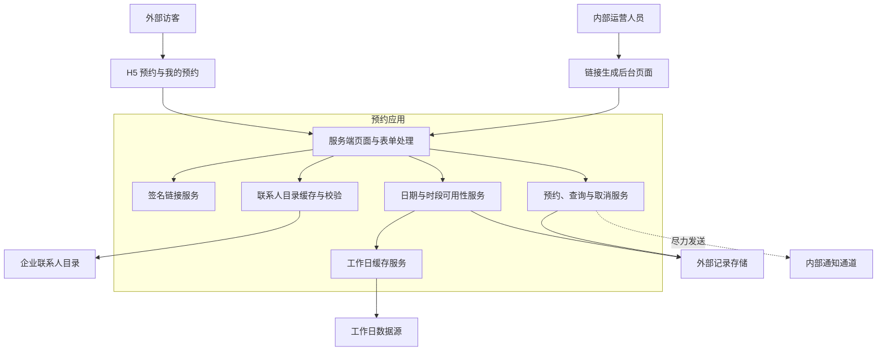
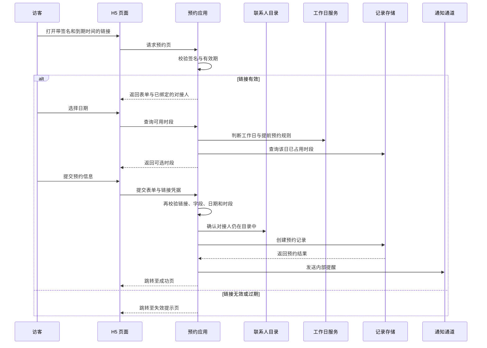

> 本文是脱敏技术复盘。业务名称、组织信息、地址、联系人、配置值、第三方实例标识和其他可识别信息均已移除或泛化。它说明可迁移的工程经验，不提供可用于访问原系统的细节。

一个面向访客的预约系统，看似只是“填表、选时段、提交”三步，实际却连接了外部访客、内部对接人、运营人员、工作日规则、联系人目录、记录存储和消息通知。最容易出问题的地方不在页面，而在这些边界交汇处：过期链接能否阻止提交？联系人是否仍有效？两个访客会不会抢到同一时段？谁能生成链接、查询记录和取消预约？

本文按三种证据强度说明结论：

- **当前实现**：在审查范围内直接观察到的行为。
- **审查推断**：基于实现结构得出的风险或能力判断，不等同于运行环境证明。
- **改进建议**：面向生产运行的下一步设计，不代表已经落地。

## 目标与边界：一条小程序式 H5 预约链路

系统的访客端是适配手机屏幕的服务端渲染页面：访客通过带有效期的预约链接进入表单，选择日期和时间段，填写联系电话与主要来访人员，完成提交后可用预留电话查询记录。当前列表页提供取消入口，但取消操作按记录标识直接更新状态，未见其先绑定提交手机号、签名链接或查询主体；因此不能将它描述为“取消自己的预约”。内部侧有一个链接生成页面，先从联系人目录确认对接人，再生成可转发的预约入口。

预约规则被收敛为几个服务端可执行的约束：提前若干日预约、仅工作日开放、每个开放时段只接待一批访客、单次人数有上限、备注长度受限。浏览器会先展示日期和时段的可用性，服务端在创建记录前再次校验，避免把界面状态当作最终裁决。

## 总体架构：页面、领域服务与外部能力解耦

### 当前实现

应用采用一个轻量 Web 服务承载页面、静态资源和可用性接口。路由层主要负责解析请求、验证链接与表单、渲染结果；领域服务负责链接签名、联系人校验、日期可用性和预约生命周期；外部系统访问被封装在仓储或客户端适配层中。应用启动时预热工作日数据和联系人目录，并用进程内定时任务刷新缓存。

### 审查推断

这种分层让 H5 页面不直接了解外部记录系统或联系人目录的协议，也让测试可以替换仓储、时钟和 HTTP 客户端。代价是关键一致性仍跨越应用与外部记录存储：如果后者不提供唯一约束或条件写入，应用层“先查再写”的判断无法完全消除并发冲突。

### 改进建议

把“预约时段占用”提升为数据层不变量：为日期与时段建立唯一约束，或使用条件创建 / 乐观并发版本号。应用收到冲突后返回可理解的“时段刚被占用”结果，并刷新 H5 可用性，而不是把并发控制仅留在内存或页面逻辑中。

## H5 预约：体验层快速反馈，服务端负责最终判定

日期选择器会提前屏蔽周末和短期日期；日期改变后，浏览器请求可用性数据并禁用已占用的时段。表单提交时，服务端仍会完成链接、联系人、字段、工作日和时段状态检查。这样即使请求绕过浏览器脚本，规则也不会只停留在界面上。

### 当前实现

链接载荷只包含经签名的对接人姓名与到期时间；签名比对使用恒定时间比较。服务端可靠地约束预约目的为预定义枚举、人数处于允许范围、备注不超过上限，并要求解析结果至少包含一位来访人员。来访人员的姓名、单位和职位，以及预约电话号码，未见完整的服务端内容或长度校验；浏览器的 `required` 属性可被绕过。服务器将访客填写的对接人替换为链接中已验证的值，并在落库前重新查询时段可用性。

### 审查推断

签名链接将“可进入预约流程”与“知道某个链接”绑定，适合由内部人员定向转发的轻量流程；它不是用户身份认证。链接一旦被转发，持有人仍可在有效期内进入页面，因此不能把它误作访客实名授权或内部管理权限。

### 改进建议

为高风险或更大规模的场景增加可撤销链接标识、一次性使用选项、创建者与用途审计，以及短期验证码或企业身份校验。页面端保留便捷体验，服务端则根据链接风险等级决定是否要求额外验证。

## 联系人目录与后台：把“填名字”变成可验证的关联

内部人员生成预约链接前，系统会用联系人目录验证姓名并取回稳定的用户标识；访客提交时会再次验证，以降低员工离职、改名或链接误转发造成的脏关联。联系人目录以进程内姓名到标识的映射缓存，在启动和定时任务中刷新；刷新失败时保留已有缓存，尚未成功加载时会明确拒绝无法验证的提交。

### 当前实现

联系人适配层处理分页读取和名称标准化，目录服务忽略空名称和重复名称。预约记录保存的是已验证的联系人标识，而不是只保存访客输入的展示名称。链接生成的有效期有默认值与最大值，并在服务端检查范围。

### 审查推断

目录缓存使表单提交不必每次都遍历远程成员列表，也把“对接人存在性”集中在一个服务中。以名称作为生成入口仍有歧义：同名成员会被忽略其后的重复项，且改名后的历史链接会在下一次验证时失效或无法匹配。

### 改进建议

后台应搜索并选择目录中的稳定标识，而不是手工输入姓名；展示层可附带部门或脱敏辅助信息消除歧义。为目录刷新增加版本、最后成功时间和告警，并明确“保留旧缓存”与“拒绝新链接”的降级策略。

## 数据流：可读、可追溯，也要最小化

预约写入包含业务必需的日期、时间段、人数、来访人员、联系电话、对接人关联和状态。查询按联系电话筛选记录；取消操作会更新状态，而非从外部记录存储中直接删除。创建成功后，通知适配器尝试向内部通道发送新预约摘要；通知失败会记录异常，但不会回滚已创建的预约。

| 数据流 | 当前实现 | 审查推断 | 改进建议 |
| --- | --- | --- | --- |
| 表单到领域对象 | 服务端解析表单，并用模式校验转换为预约请求。 | 能避免一部分类型错误和超长备注进入外部记录系统。 | 对电话、姓名和自由文本增加明确的格式、长度与敏感词策略。 |
| 可用性查询 | 根据工作日缓存和指定日期的有效记录返回时段状态。 | 读取与创建之间仍存在竞态窗口。 | 用唯一约束或条件写入闭合竞态，并为冲突返回统一错误码。 |
| 预约创建 | 通过仓储适配层写入外部记录；通知为尽力而为。 | 写入成功而通知失败不会丢失预约，但运营可能错过提醒。 | 用持久化事件表或重试队列补偿通知，并记录投递结果。 |
| 查询与取消 | 预约按联系电话查询；取消通过记录标识直接更新状态。 | 取消前未见将记录与提交手机号、签名链接或查询主体绑定的所有权校验；这些入口涉及个人数据和状态变更，不能仅依赖页面隐藏。 | 对查询、详情和取消统一实施身份或二次验证、记录归属校验和最小审计事件。 |

## 安全审查：现有保护与需要补齐的边界

### 当前实现

应用从运行时配置读取外部服务凭据和签名密钥，不把它们写入页面或业务记录。外部 API 客户端缓存短期访问令牌、设置网络超时，并对 HTTP 与业务错误分层处理。请求日志包含请求标识、路径、状态和耗时，便于关联排障。工作日数据刷新失败时会保留该年份已有缓存；若该年没有缓存，日期判断会回退为周一至周五可约、周末不可约的规则。联系人目录刷新失败时会保留上一次成功的映射；若从未成功加载，联系人校验会明确失败。

### 审查推断

审查范围内未看到后台链接生成页的身份认证或授权中间件；未看到表单的 CSRF 防护；查询页可以仅凭电话号码发起查询。取消接口仅接收记录标识便更新状态，未见先验证提交手机号、有效签名链接或查询主体与该记录的绑定关系，也就是缺少所有权校验。若这些路由直接暴露给不可信网络，攻击者可能通过猜测、诱导请求或已泄露的记录标识访问或影响他人的预约。日志和内部通知还可能处理联系电话、来访人员等个人信息，应按最小必要原则评估。

### 改进建议

优先以服务端身份认证和角色授权保护后台入口；对预约查询与取消使用短信验证码、一次性操作令牌或已认证会话，并确保记录归属校验在服务端执行。为所有变更表单加入 CSRF 防护、速率限制和审计。日志应避免写入电话号码、完整姓名和可复用标识；通知仅发送最小业务摘要，敏感详情留在受控页面中查看。

## 测试：以边界条件证明预约不会“看起来能用”

### 当前实现

项目声明了 Python 测试工具和测试目录约定；在本次审查的代码树中未发现测试文件。实现本身通过依赖注入和可替换的时间提供器，为单元测试留出了接口：可用性服务可替换日期来源与仓储，外部客户端可注入 HTTP 客户端，路由层可覆写服务依赖。

### 审查推断

现有结构具备可测试性，但仅靠结构不能证明预约规则、安全边界和外部错误分支正确。尤其是并发占用、链接过期、目录未加载、通知失败和取消越权，需要自动化回归才能防止后续改动重新引入风险。

### 改进建议

| 测试层次 | 优先场景 | 预期结果 |
| --- | --- | --- |
| 单元测试 | 签名篡改、过期、有效期范围、人数与备注边界 | 无效输入在写入前被拒绝。 |
| 服务测试 | 工作日、最早可约日、已取消记录、全部时段占满 | 返回稳定且可解释的可用性结果。 |
| 路由测试 | 未认证后台、CSRF、失效链接、联系人未加载、电话查询和取消 | 未满足授权条件的请求不能读取或改变记录。 |
| 并发与集成测试 | 两个请求同时抢同一时段、外部写入冲突 | 最多一个创建成功，另一请求得到可恢复的冲突响应。 |
| 适配器测试 | 分页目录、令牌失效、超时、通知失败 | 错误被分类、可观测，且不会造成错误的业务状态。 |

## 部署与运行：先让单实例运行可观测，再讨论扩展

### 当前实现

应用在生命周期启动时刷新两类缓存并启动异步定时任务，关闭时停止调度器。运行配置由环境变量或本地配置文件装配，日志提供轮转能力；外部请求设置了超时。审查范围内未包含容器清单、反向代理、CI/CD、健康检查或基础设施定义，因此无法据此确认生产部署拓扑、网络边界与备份策略。

### 审查推断

联系人目录和工作日缓存均存于进程内，多副本会各自刷新并拥有不同的缓存时刻；进程重启也会丢失缓存。在外部记录系统可用时，这可以是轻量部署的合理起点，但不能直接推断为具备高可用或一致的多副本能力。

### 改进建议

第一阶段应建立最小运行基线：健康与就绪探针、受管控的运行时密钥、结构化脱敏日志、外部依赖可用性指标、数据库或记录存储的备份与恢复演练。需要扩容时，再把缓存刷新、任务调度和通知投递迁移到可协调的共享组件，防止多个副本重复执行任务或产生状态分歧。

## 优化路线：先修正风险最高的路径

1. **补齐授权闭环**：保护后台链接生成；为查询和取消引入身份或一次性验证；在服务端校验记录归属。
2. **收紧预约一致性**：让外部记录存储拒绝重复的日期与时段组合，应用把冲突转换为刷新可用性的友好反馈。
3. **降低个人信息暴露**：最小化日志与通知内容，设定保留期限、访问角色和脱敏规则。
4. **建立自动化回归**：先覆盖链接、工作日、时段、联系人、越权与并发，再接入端到端冒烟测试。
5. **提升可运维性**：监控缓存最后成功刷新时间、外部调用失败率、预约冲突率与通知积压，并为关键依赖设计降级和恢复演练。

## 结语

企业预约系统的价值不止在于减少人工收集表单，更在于把预约资格、时间资源、联系人归属和后续协同放进一条可验证的链路。轻量 H5、服务端模板和外部记录存储可以快速形成闭环；真正决定它能否长期运行的，是服务端授权、并发一致性、个人信息最小化、自动化测试和明确的部署边界。

先让每一次链接生成、预约创建、查询和取消都能回答“谁在做、是否允许、写入是否唯一、失败后如何恢复”，再扩展功能和规模，系统才会从可演示的表单走向可信的业务入口。
