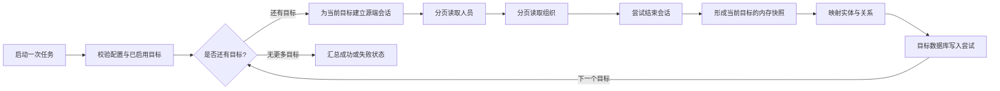
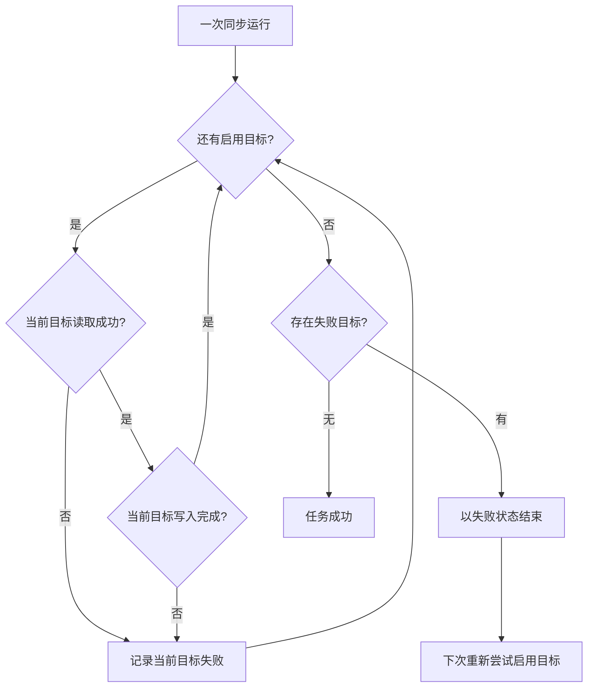

企业身份同步并不是“把用户表搬过去”这么简单。它同时涉及源端会话、分页读取、组织关系、目标端替换写入，以及失败后的数据一致性。一个看上去很短的批处理程序，往往正处在权限和个人信息的交界处。

本文复盘一个已脱敏的同步服务。为避免把复盘文章写成臆测，文中使用三类表述：

- **当前实现**：直接由代码可验证的行为。
- **审查推断**：根据实现形态得出的运行含义，可能需要运行记录进一步证实。
- **改进建议**：尚未在当前实现中发现、但适合纳入后续版本的能力。

文中不包含真实组织、项目、地址、账号、租户、字段样例或连接信息。

## 1. 当前同步模型：按目标生成全量快照，而不是增量事件流

**当前实现**按已启用目标逐个处理：先合并该目标适用的源端配置，建立认证会话，顺序读取人员和组织两类分页数据，拼成该目标本轮使用的内存快照；随后完成映射与写入。每个目标都采用“清空后重建”的全量替换方式。

这类设计的优点是模型直接：每个目标都以本轮刚读取的完整快照为输入，完成一次替换写入。它也有明确代价：源端数据越大，运行时间和内存占用越高；多个目标会各自读取快照，读取时点或源端配置还可能不同。

**审查推断**：该服务更适合按固定频率运行的中小规模基线同步，而不是需要秒级变化传播的场景。若要支持高频或超大目录，需重新评估快照式同步的成本。

## 2. 源端读取与分页：先保证“读全”，再谈“读快”

**当前实现**会为每个启用目标合并适用的连接与认证配置、设置请求超时，并在该目标的一次会话中读取两类数据。分页函数兼容多种常见响应包装形态，并优先使用服务端给出的“是否有下一页”、总页数或总量等元数据；元数据缺失时，退回到“本页达到页大小则继续”的规则。

这套兼容策略有现实价值，因为身份系统的分页响应常会随网关或版本变化而变化。不过它也需要边界测试：

- 空页但仍声明有下一页时，是否能终止或告警；
- 总量与实际页数不一致时，是否有可审计的差异；
- 响应中混入非对象项时，是否会在写入前失败；
- 会话结束接口失败时，是否保留原始主错误。

**当前实现**对网络请求和源端显式错误会抛出失败；会话结束在主流程完成后会被尝试执行，结束失败不会覆盖已经完成的读取结果。

**当前实现没有发现自动重试、退避、限流或断点续读。** 某个目标读取时遇到临时网络故障，会把该目标记为失败并继续后续目标；全部目标处理结束后，任务以失败状态汇总退出。之后只能由外部调度器重新触发。

**改进建议**：为幂等的读取请求加入有上限的指数退避和随机抖动；把认证失败、权限拒绝、响应格式错误归为不可重试错误；为限流和连续失败建立独立指标。不要对身份变更写操作做无差别重试。

## 3. 映射：把“身份事实”和“目标模型”分离

**当前实现**将源快照转换为四类目标记录：人员、组织、人员—组织关系，以及包含本次快照时间和关联状态的宽表记录。组织父子关系仅在父组织也存在于本次快照时才保留；人员缺失组织匹配时仍会生成可供排查的关联状态。

这说明映射层不仅在搬运字段，也在表达数据质量：例如“找不到对应组织”和“组织没有人员”可作为后续对账线索。

但映射规则也是身份同步中最容易发生语义漂移的地方：

- 唯一标识必须稳定，不能依赖展示名称；
- 空值、禁用状态和离职状态要有明确的目标语义；
- 组织层级断裂不能悄悄变成根节点；
- 一个用户有多个组织归属时，要先确认目标是否支持多值关系；
- 原始载荷若需要保留，应当有最小化、脱敏与保留期限策略。

**当前实现**优先使用源端的人员标识作为人员键；源端缺少该值时会生成新的随机标识。关系和宽表记录也会生成新的标识，并给宽表写入本次处理时间。

因此，**当前实现不是逐行 upsert 意义上的幂等写入，也不满足相同输入得到严格相同目标状态的条件**：同一快照重跑时，部分记录标识和处理时间会变化。至多只能说，在源数据未变且写入均完成的前提下，部分业务字段或数量可能具有相近语义；这并不构成结果集收敛或重试安全性的证明。

**改进建议**：在进入目标端前建立并验证稳定的业务键策略；对不能构成稳定键的数据隔离到异常队列或人工处理清单，而不是静默生成新标识。这样才能安全支持增量、重试和跨批次审计。

## 4. 目标写入：当前的原子边界在哪里

**静态审查观察到**：每个目标的替换写入代码位于一个数据库事务边界内，边界内包含确保所需同步数据结构、按依赖顺序删除旧记录和按相反依赖顺序插入新记录的语句。

这是代码结构层面的观察，不是对运行结果的完整保证。其范围需要严格限定：

- 该事务边界只涉及该目标的数据库操作；是否回滚还取决于数据库、驱动以及数据定义语句的实际语义，需用集成测试验证。
- 它不证明源端调用、日志、外部调度器或其他系统副作用具备原子性；多个目标之间也没有可见的分布式事务。
- 每个目标的源端读取都在该目标的数据库事务之外；读取完成后，才映射并尝试写入该目标。
- 替换写入会删除目标中该同步集合的旧数据；当前代码中**没有发现** dry-run、删除阈值保护或写前快照检查点。

**当前实现**会继续处理后续目标，即使前一个目标失败；全部目标处理结束后，只要存在失败目标，进程以失败状态结束。

这意味着目标之间可能出现版本差异：一个目标已更新，另一个仍保留旧快照。**审查推断**：如果多个目标必须严格同时切换，当前模型不满足这一要求，需要另行设计发布屏障或一致性策略。

## 5. 失败恢复：从“重跑”到“可验证地重跑”

**当前实现没有发现任务检查点、分页游标持久化或失败目标自动恢复队列。** 重启后会按顺序重新尝试所有已启用目标，并为每个目标重新读取完整快照；是否只重跑失败目标，要由运行时配置或外部编排决定，而不是由服务保存的进度决定。某个目标源端读取失败时，该目标不会进入映射和写入，但后续目标仍会继续。

这里的关键不是“能不能重跑”，而是“重跑前能否知道上一轮影响了什么”。

**改进建议**：为每轮运行生成不含身份明细的运行编号，记录开始/结束时间、源端计数、每个目标的删除数和插入数、错误分类与最终状态。把检查点、只读预演和删除保护作为明确的新增设计，而不是误以为当前已具备：

- **检查点**可记录已提交的目标和版本，但需要定义与源快照一致的恢复语义；
- **dry-run**应只产生映射和差异摘要，绝不能写入目标；
- **删除保护**可在删除量异常时停止提交，并要求人工确认；
- **对账**应比对源端、映射结果和目标端的计数、稳定业务键覆盖率与孤儿关系数。

## 6. 进度、错误与日志：可观测，但不要泄露身份信息

**当前实现**记录任务开始/结束、目标是否跳过、源端两类数据的总数、每个目标的写入计数，以及异常堆栈。这些信息足以初步判断任务卡在读取、映射还是写入阶段。

需要立即关注的是日志最小化。**当前实现会记录部分源端记录内容**，其中可能包含姓名、邮箱、手机号或组织信息。即使日志系统权限受控，这种做法也扩大了个人信息暴露面。

**改进建议**：删除记录内容级别的常规日志，只保留数量、分页序号、处理耗时、错误类别和经过脱敏的关联标识；为错误输出设置长度上限，并确认异常消息不会回显认证材料、请求头或连接串。日志访问也应被视为身份数据访问的一部分。

一组足够实用的指标可以是：

- 本轮读取的人员数、组织数、页数与总耗时；
- 每目标的映射数、删除数、插入数、提交成功数；
- 未匹配组织、空稳定键、重复稳定键等数据质量计数；
- 按错误类别统计的失败次数和连续失败次数；
- 最近一次成功时间与最近成功快照的摘要。

## 7. 最小权限与密钥边界

同步器需要两侧权限，但不应拥有超过任务所需的能力。

**当前实现**从配置读取源端认证信息和目标数据库连接信息，并且会创建同步数据结构、删除旧数据、插入新数据。因此目标端账户需要相应的数据定义和数据修改权限。**当前实现没有发现**角色分离、密钥轮换或外部密钥注入的控制。

**改进建议**：

- 源端使用仅能读取所需身份范围的服务身份，不授予管理、修改或跨范围查询权限；
- 目标端账户仅限同步专用结构及必要的创建、删除、插入权限，避免使用全库管理员；
- 将密钥放入受控的运行时注入机制，不进入镜像、代码仓库、错误日志或诊断包；
- 为密钥轮换、失效和访问审计建立操作流程；
- 将生产、预发布等环境的身份与权限完全分开。

## 8. 测试与部署：先证明边界，再放进调度器

**当前实现**提供了精简的容器构建定义：安装运行依赖、复制应用与示例配置，并以单次同步命令作为容器默认入口。它适合由外部调度器按批次启动。

**当前实现中没有发现自动化测试文件。** 这不代表功能一定不正确，但意味着分页终止、映射边界，以及数据库事务边界在异常时的实际行为还缺少可重复的证据。

**改进建议**至少覆盖以下测试层次：

| 层次 | 关键场景 |
| --- | --- |
| 单元测试 | 分页元数据组合、空页、非法响应、稳定键缺失、组织断链、禁用状态映射 |
| 数据库集成测试 | 依赖顺序、未知列拒绝、任一插入失败时数据库实际行为、多目标部分失败 |
| 契约测试 | 源端响应包装变化、认证失败、限流和超时的分类 |
| 回归与安全测试 | 日志不含身份明细或密钥、镜像不携带运行时配置、最小权限不足时明确失败 |
| 演练 | 人为中断后全量重跑、目标部分失败后的对账与告警 |

容器化并不自动等于可运营。**改进建议**是在部署层补齐非特权运行用户、只读根文件系统（如运行方式允许）、资源上限、健康或任务完成状态采集、受控配置挂载，以及由调度平台保管的重试策略。重试次数和并发数需要根据源端承载能力设置，而不是直接无限放大。

## 9. 优化路线：按风险收益排序

下面的顺序能在不改变同步语义的前提下，先收敛风险，再提升效率：

1. **先修日志与密钥边界**：停止记录身份明细，确认异常与配置不会泄露敏感值。
2. **补齐测试和运行摘要**：让分页、映射、数据库异常行为和失败分类有自动化证据。
3. **建立对账与删除保护**：先能发现异常全量替换，再考虑自动放行。
4. **引入受控重试**：仅对短暂的可重试读取失败启用退避，并保留最终失败信号。
5. **稳定业务键与差异同步**：只有在键策略、删除语义和回滚方案明确后，才评估增量同步或并行化。

全量替换并非落后的方案；在数据量可控、数据库异常行为经过验证、对账完善的条件下，它通常比不完整的增量同步更容易解释。真正需要避免的是把“本轮写成功了”误认为“身份数据长期正确且可安全恢复”。

## 总结

这个服务已经具备一条清晰的全量同步骨架：按目标读取源端分页数据并形成内存快照，再映射并在该目标的数据库事务边界内尝试替换写入；单个目标失败后继续后续目标，最后汇总退出状态。静态审查不能据此证明完整原子性或严格幂等性。它尚未具备自动重试、检查点、dry-run、删除保护、跨目标原子切换和内建对账；这些都是后续应明确设计和验证的能力，而不是可以默认存在的特性。

把身份同步当成一项持续运行的批处理产品来维护，重点便会从“字段能不能写进去”转向四个问题：读得全不全、写得稳不稳、失败能不能解释、日志和权限会不会泄露身份数据。答案清晰之后，才适合继续追求速度和自动化。
