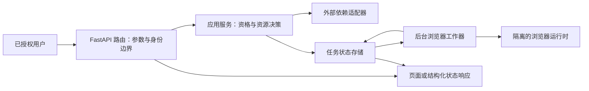
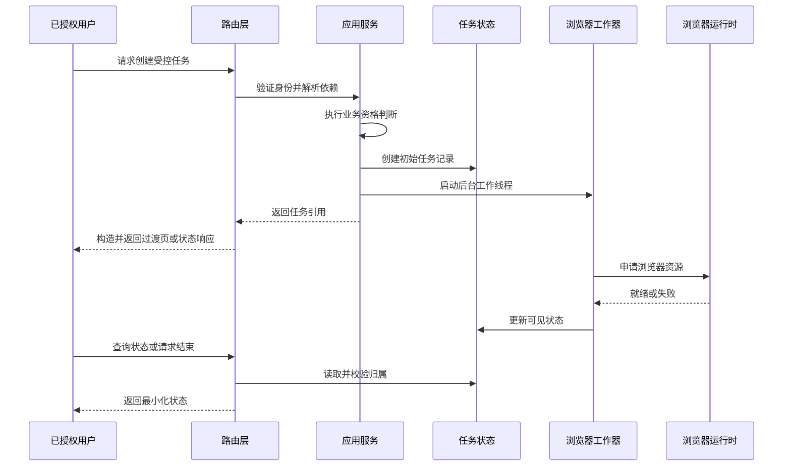
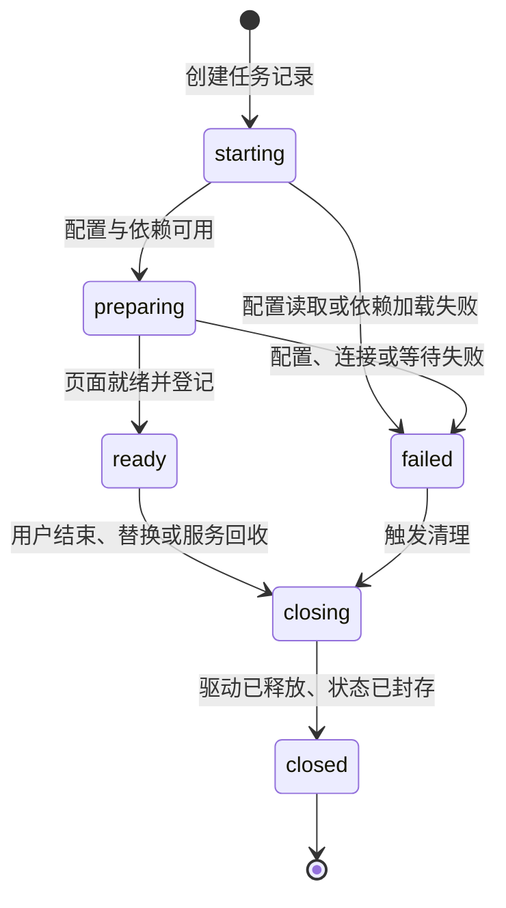

> 本文是对一个已授权内部集成的防御性复盘。它只讨论架构边界和可靠性原则，不包含目标地址、页面定位规则、身份材料、访问凭据或可直接复现的自动化操作。

浏览器集成服务很容易被误写成“一个接口启动一个浏览器”。真正的工程难点在于：浏览器是昂贵、易失败、状态复杂的外部资源；HTTP 请求却应当短小、可验证、可取消、可观测。二者之间需要一条明确的任务边界。

本文把观察分成三类：**当前实现**只陈述已在代码中看到的行为；**审查推断**说明由结构带来的限制；**改进建议**则是面向生产化的改进方向。不要把改进建议误读为已经具备的能力。

## 1. 当前边界：路由负责协议，服务负责决策，工作线程负责资源

**当前实现。** 应用入口注册了健康检查、认证相关路由、静态资源和页面模板。路由层既提供页面过渡，也提供任务创建、状态查询和关闭等结构化响应；它通过可替换的依赖提供者取得外部服务客户端，因此测试可以注入替身。

认证完成后，路由会完成业务资格判断与目标资源解析，再创建一条最小化的浏览器任务记录，并把耗时的浏览器启动交给守护线程。浏览器工作器负责配置读取、驱动创建、页面就绪等待、状态推进、保活和退出；进程内任务管理器负责状态的读写与返回可公开展示的字段。

**当前实现的并发事实。** 同步路由会由框架的工作线程池执行；每个任务又会创建一个没有显式上限的守护线程。驱动注册表的锁只保护映射的读写，不会串行化驱动操作，也不是容量闸门。保活与关闭路径可能同时访问同一驱动，而创建、登记和关闭不是一个原子事务。因此，现有逻辑只能尽力收拢活动任务，不能据此推断为严格的单活跃保证、驱动独占或并发安全。

这条分层避免了让模板、路由或前端直接持有浏览器对象，也把外部服务异常留在服务边界处理。

**审查推断。** 路由处理函数可以是同步函数，后台任务也使用线程；这并不等于服务已经异步化，更不等于它能安全地承受高并发。浏览器启动、远程调用和共享状态仍会占用有限资源，容量必须按浏览器实例数和隔离策略评估。

**改进建议。** 将“创建任务”与“执行任务”视为两个独立接口：前者只验证、落状态并返回任务标识；后者由有并发上限的执行器领取。以原子状态迁移实现每个驱动的独占使用，并让创建、登记与关闭遵循同一协调协议。这样可以把 HTTP 超时、浏览器容量和重试策略分别治理。

## 2. 一次请求的责任流

下图描述的是抽象请求流，而不是某个系统的接口约定。

这里最重要的约束是：任务引用只能指向调用方自己拥有的任务；状态接口和受控访问代理都应重复执行归属校验。认证成功不能自动扩展为访问任意任务的权限。

## 3. 浏览器任务生命周期要以清理为中心

**当前实现。** 任务记录有启动、准备中、就绪、失败和关闭等状态；工作器读取配置、加载依赖并创建驱动后，才会把驱动登记到受锁保护的注册表，随后等待文档达到可用状态，成功时发布受控访问入口并启动保活线程。异常路径会写入面向用户的简短错误状态，`finally` 分支会尝试释放未保留的驱动；显式关闭也会尝试从注册表移除并退出驱动。这些都是尽力清理，而不是跨路径的原子关闭或驱动互斥保证。

**审查推断。** 进程内字典与锁可以保护部分同一进程的映射读写，但不能跨进程、跨副本同步；进程重启还会丢失内存中的任务视图。由于创建、登记和关闭能够交错，活动任务收拢只是尽力行为，可能出现超出预期的并行工作或关闭竞态；它不是多用户并行调度器，也不是严格的单活跃控制器。

**改进建议。** 对每个任务保存创建时间、开始时间、最后活动时间、取消原因和清理结果；用明确的终止状态机实现幂等关闭。执行器需要在进程退出信号、超时、客户端取消、驱动失联和任务替换时走同一份清理路径，并以外部持久化状态存储支撑重启恢复与多副本部署。

## 4. 并发隔离：锁不是容量模型

浏览器隔离至少有三层。

| 层次 | 当前实现 | 推断与风险 | 建议 |
| --- | --- | --- | --- |
| 任务元数据 | 进程内锁保护部分映射读写 | 仅对单进程有效，创建、登记和关闭可交错，重启后不可恢复 | 使用带租约的共享存储，并记录版本或状态迁移序号 |
| 驱动对象 | 注册表锁只保护映射；保活与关闭都可能访问驱动 | 锁不限制排队量，也不提供驱动独占或关闭原子性 | 用固定并发槽位、队列长度、每主体配额和驱动独占协议限制资源 |
| 受控访问 | 依据已认证主体校验任务归属 | 代理层与应用层需要一致的授权语义 | 将授权判断封装为单一策略，并为拒绝事件保留审计信息 |

不要因为框架叫 FastAPI 就宣称异步或高并发安全。是否安全取决于阻塞调用放在哪里、执行器有多少槽位、状态是否跨副本一致、浏览器资源是否可回收，以及压测下的失败模式是否已验证。

## 5. 错误映射应稳定，但诊断信息应收敛

**当前实现。** 配置错误、上游依赖错误、业务资格不足和任务不存在/不归属等情况会映射为不同的 HTTP 响应类别或页面提示。浏览器任务的公开状态会隐藏内部诊断；浏览器工作器也把驱动连接、创建和页面等待异常转换为有限的用户状态。

**当前缺口。** 部分路由可能把上游适配器异常的原文带入页面或结构化错误响应。因此，不能把当前实现描述为已经完全隔离了底层详情；面向调用方的错误契约仍需要收敛。

**改进建议。** 定义一张稳定的错误契约表：

| 错误域 | 对调用方 | 对运维 | 重试策略 |
| --- | --- | --- | --- |
| 输入或权限 | 通用拒绝原因 | 关联请求与授权决策 | 不自动重试 |
| 配置 | 一般服务不可用 | 缺失项的内部标识 | 修复后再试 |
| 上游依赖 | 暂时不可用 | 超时、类别和关联标识 | 有预算的退避 |
| 浏览器资源 | 任务失败或排队 | 资源槽位、生命周期阶段 | 仅在幂等前提下重试 |
| 未知异常 | 通用失败 | 受控堆栈与追踪标识 | 人工判定 |

日志应结构化记录任务引用、阶段、耗时、错误类别和清理结果；不得记录页面正文、跳转地址、认证载荷或任何访问材料。

## 6. 超时、保活与资源清理

**当前实现。** 浏览器连接创建有受限重试窗口，页面加载和就绪等待使用配置化超时；就绪后，独立保活线程周期性检查驱动仍可用。失败路径和关闭入口都会尝试释放驱动，但保活与关闭可并发触及同一驱动，因此这不是已证明的完整回收保证。

**审查推断。** 页面就绪超时并不覆盖整个任务生命周期；仅有保活检查也不等于存在可靠的闲置回收。长期保持的浏览器、网络半断开、工作线程异常退出和进程被终止都可能产生孤儿资源或状态漂移。

**改进建议。** 增加端到端任务时限、空闲时限和清理看门狗；每项都应有度量和明确的优先级。关闭操作必须幂等，并以“先阻止新访问、再请求退出、最后标记关闭”的顺序执行。对无法确认已退出的实例，记录待回收标记并交给运行时级别的回收机制处理。

## 7. 测试：从 HTTP 断言扩展到生命周期证据

**当前实现。** 代码库包含健康检查、页面输出、配置读取和依赖替身测试；依赖提供者可被替换，适合把外部服务失败映射为稳定响应的测试。

**改进建议。** 以下测试比“接口返回成功”更能证明浏览器集成可靠：

- 单元测试：状态机只能合法迁移；关闭重复执行不报错；公开状态不会包含内部诊断。
- 路由测试：未认证、非所有者、已关闭任务和上游失败均映射到预期类别。
- 工作器测试：用假驱动模拟创建失败、就绪超时、注册后立即取消、保活失败与退出异常。
- 并发测试：同时创建、登记、保活、关闭和读取同一任务，验证驱动独占、原子状态迁移与关闭后的不可恢复性。
- 集成测试：在隔离运行时中验证代理授权与任务归属一致，不涉及真实目标系统。
- 负载测试：固定浏览器槽位下观察排队、拒绝、超时和清理比例，而不是只测 HTTP 吞吐。

测试应明确区分“浏览器被模拟”和“隔离运行时已验证”。前者快且适合回归，后者慢但能发现镜像、网络和资源配额问题。

## 8. 容器部署：把浏览器当作受限工作负载

**当前实现。** 服务镜像把应用进程、反向代理和浏览器运行时组合在同一容器内；各组件通过本地回环通信，并以进程管理配置启动。浏览器会话数量配置为很低，反映了浏览器实例的高资源成本。

**改进建议。** 生产部署应逐项确认：

- 以非特权身份运行，并为浏览器设置内存、共享内存、CPU 和进程数上限。
- 将应用、代理和浏览器运行时的健康信号分开；“HTTP 存活”不能代表浏览器可创建任务。
- 使用平台级密钥管理和最小权限注入；镜像、日志、状态响应和诊断页均不应携带访问材料。
- 设置入口层的请求体、并发、速率和会话时长限制；受控访问通道必须经过同一授权策略。
- 将任务状态、审计日志和指标输出到容器外部；不要依赖容器内内存作为恢复依据。

## 9. 优化顺序：先减少不确定性，再提高吞吐

浏览器工作负载的优化通常不是把路由改成 `async`。建议按以下顺序推进：

1. **可观测性。** 先测量创建耗时、就绪耗时、失败类别、清理耗时、活动实例数和队列长度。
2. **资源边界。** 为并发槽位、单主体活动任务数、排队时间和任务总时长设上限。
3. **隔离与恢复。** 把状态迁移、租约和清理结果外部化，处理副本切换与进程重启。
4. **失败控制。** 对重复失败的依赖设置熔断与冷却窗口；只有经过幂等设计的阶段才允许自动重试。
5. **体验优化。** 用任务状态说明排队、准备、就绪或失败，避免把长时间浏览器启动伪装成同步页面加载。

## 10. 复盘清单

在把浏览器能力接到 FastAPI 前，可以逐项回答：

- 路由、应用服务、任务状态和浏览器工作器是否各自只有一个清晰职责？
- 每个任务是否有明确所有者，且读取、关闭和受控访问都重复校验归属？
- 所有成功、失败、取消、替换和进程退出路径是否都会进入同一清理协议？
- 当前状态存储能否支撑副本扩展、重启恢复和审计？若不能，是否明确限制为单进程能力？
- 是否已验证资源上限、排队行为、超时、保活失败和清理失败？
- 用户响应与日志是否都排除了访问材料和目标页面细节？

浏览器集成服务的价值不在于“能打开一个页面”，而在于能以可验证的授权边界、可终止的任务状态和可回收的资源生命周期，把一项高成本外部能力稳定地交给应用层使用。
