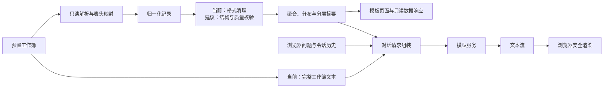
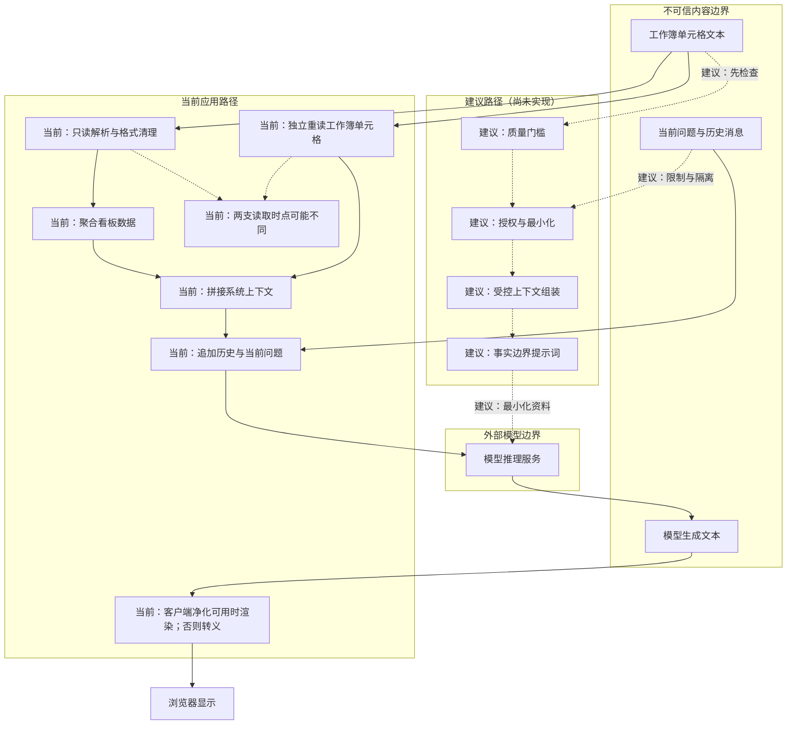

> 本文基于一个内部原型的**脱敏**复盘。不会公开原始工作簿、字段名、数值、分类标签、提示词、连接地址或任何访问材料。文中的“当前实现”仅描述已核对到的行为；“审查推断”是风险判断；“改进建议”不代表现有代码已经具备相应能力。

把 Excel 和大语言模型放在同一条链路上，容易让人把问题想成“读一张表，再问模型”。真正需要设计的是边界：哪些数据被接受，哪些数据被聚合，哪些内容会离开应用，以及页面怎样避免把不可靠文本当成事实。

## 1. 先校正入口认知：这不是上传型系统

**当前实现。** 该原型没有面向浏览器的文件上传接口。服务端将解析后的数据单独做进程内记忆化，页面访问和数据接口复用该结果。聊天入口接收一段当前问题及浏览器提交的历史消息，浏览器只在会话存储中保留这段对话历史。

这一区别很重要：上传型系统需要处理文件大小、扩展名、内容嗅探、隔离存储与反病毒扫描；当前系统的首要风险则是**预置数据的质量、权限和刷新方式**。不能因为它处理 Excel，就声称已经实现了上传校验。

**当前实现的缓存边界。** 解析数据与系统级上下文是两份独立的进程内记忆化结果。构造系统级上下文时会再次读取工作簿以取得单元格文本，并不复用已解析的数据对象。两份缓存首次填充的时刻不同：聚合数据可能来自较早的一次读取，而模型上下文中的单元格文本来自较晚的一次读取；并发的首次缓存未命中也可能触发重复读取。

**审查推断。** 工作簿变更后，这两份结果都不会自动刷新；多副本运行时，各副本还可能持有不同组合的旧聚合与较新文本。浏览器提交的历史消息同样属于不可信输入，不能视为可信上下文。

**改进建议。** 若以后增加上传能力，应把接收、隔离、解析、发布拆成独立阶段：先限制体积和类型，再在隔离环境解析；仅当结构和内容检查通过后，才发布为可查询快照。对预置工作簿，应从同一个有版本、不可变快照派生聚合数据和模型资料包，并以一次同步发布替换两份缓存；同时明确版本、所有者、审批和刷新策略。

## 2. 当前数据流水线：解析、归一化、聚合与呈现

**当前实现。** 服务以只读方式读取工作簿中的若干约定工作表；每张表按指定表头行转为记录，再清理文本、数值和日期形式。记录被映射到内部数据对象，随后派生出计数、分布、覆盖关系、分层摘要和展示行。页面模板渲染初始看板，若干只读接口则返回聚合摘要或筛选后的记录。

这里的“清理”是格式归一化，不等于严格的数据校验。当前代码没有看到对必填列、枚举集合、重复标识、数值范围、跨表引用完整性或异常行的显式拒绝策略；缺失和无法转换的值会以默认形式继续参与后续计算。因此，展示出来的汇总应被理解为“基于当前可解析记录的结果”，而不是自动证明数据正确。

**改进建议。** 将解析结果先写入一个可验证的中间模型，并保留不含敏感值的质量统计，例如缺列、无效日期、未知分类、重复记录和跨表未匹配的数量。只有通过门槛的快照才进入聚合。这样既能阻止静默错误，也能使“数据不足”成为可解释的状态，而不是由模型补全的空白。

## 3. 指标构造：规则可追溯，结论不能越界

**当前实现。** 看板从记录的分类、状态和预设评分维度构造总量、结构占比、分层分布和候选列表。部分健康统计会把预设评分与阈值结合，计算结构性占比；这是一个独立的聚合行为。行动候选则主要先采用工作簿已有的分类，再按既定排序取出记录，并把该分类映射为静态行动建议；相关规则表只为展示提供解释与建议文本。查询接口支持若干条件筛选和关键词匹配。

**审查推断。** 这些指标是应用规则的产物，不是客观事实本身。阈值、分类映射和排序方式变化，都可能改变面板和候选列表。搜索还会覆盖多种自由文本属性，因此结果可能带有比界面看上去更宽的内容范围。

**改进建议。** 为每个对外指标建立一份可审核的定义：来源范围、计算口径、缺失值处理、分母、阈值版本和适用时间。将“事实数据”“规则推导”“模型建议”分别标注；当过滤条件、快照版本或质量门槛不满足时，宁可显示不可用，也不要显示貌似精确的结论。

## 4. 模型调用的事实：流式文本，不是经验证的分析

**当前实现。** 对话处理先构造一条系统级上下文，再附加浏览器提交的历史消息和当前问题，随后请求模型服务并把增量文本直接流回浏览器。应用分别对解析数据与系统级上下文做进程内记忆化；模型失败时，流中会出现由异常生成的文本。系统上下文包含聚合摘要，并且会把工作簿的全部非空单元格序列化为文本加入模型上下文。

最后一点是此原型最需要正视的隐私边界：当前做法不是最小化数据传递，也不是只向模型发送聚合指标。只要模型服务处于应用外部，完整单元格文本就可能越过应用边界。代码中也没有看到对字段级脱敏、行级授权、上下文裁剪、输出审阅或模型调用审计的实现；这些都不能写成既有能力。

**改进建议。** 优先把模型输入改为经过授权的最小化统计包，而非整本工作簿文本。统计包应有明确数据合同：允许的维度、最大行数、时间范围、敏感字段替换规则和来源快照标识。对需要明细的场景，先在应用内执行权限过滤与聚合，再按问题按需取数；模型只接收完成任务所需的最小片段。

## 5. 信任边界：把输入当数据，不当指令

工作簿内容和聊天消息都可能携带与分析目标无关的文本。它们进入模型上下文后，可能尝试改变回答目标、要求泄露上下文，或诱导系统把推测写成事实。模型输出也同样不可信：它可能遗漏限定条件、误解指标，或生成不在数据范围内的断言。

下图把已实现路径和建议路径分开。实线是当前行为；虚线与“建议”前缀的节点均未在当前代码中实现。当前工作簿有两条独立读取支路：一条解析并聚合看板数据，另一条为系统级上下文重新读取单元格文本；后者不复用解析对象，两条读取可能发生在不同时间。

**当前实现。** 浏览器对用户消息使用文本节点呈现；对助手消息则在可用时经 Markdown 解析器与净化器处理，缺少这些全局依赖时退回到 HTML 转义加换行显示。这降低了直接把回答当 HTML 注入的风险，但它不是模型事实性的保证，也不替代服务端的输入控制。

**改进建议。** 在进入模型前，把所有表格文本和聊天文本标记为引用资料，而非可执行指令；明确模型不得遵从资料中的指令、不得扩展到资料外结论、资料不足时必须说明不足。服务端还应限制消息长度、历史轮数和总上下文大小，过滤或隔离高风险文本，并按主体、数据范围和用途执行授权。输出层可要求固定结构，例如“依据 / 不确定性 / 下一步”，再由应用检查是否引用了允许范围内的证据。

## 6. 可靠性：流式连接要有失败契约

**当前实现。** 模型调用采用流式返回；浏览器逐段读取并刷新显示，在请求失败时尝试把响应错误显示给用户。服务端只捕获模型客户端的一类异常，异常文本会被拼入流。当前实现没有看到请求超时、重试预算、并发上限、取消传播、响应长度上限、结构化输出校验或降级回答策略。

**审查推断。** 长时间流式连接会占用应用与浏览器资源；上游慢、断流或输出过长时，用户体验和资源占用都不可预测。直接显示异常文本还可能暴露不应面向用户的连接细节。

**改进建议。** 定义可观察的调用状态：已接收、处理中、首段到达、完成、超时、取消和失败。为连接、首段与总时长设置独立预算；为每个主体设置并发和速率边界；仅在幂等且有预算的阶段重试。向用户返回稳定的通用错误类别，把完整诊断留在受控日志中，并对流式输出实行字符数或令牌预算。

## 7. 测试要验证边界，而不只验证页面

**当前实现。** 在该项目范围内没有发现自动化测试目录或测试脚本，因此不能声称已有单元、集成、端到端或安全测试覆盖。可运行的应用结构与“已验证可靠”是两件事。

**改进建议。** 最小测试矩阵应覆盖：

- 解析：缺表、表头变化、空行、无效日期、非数值、重复标识和跨表不匹配。
- 口径：固定样本上的聚合、筛选、排序和阈值边界，且断言不含真实数据。
- 权限与隐私：不同主体只能获得允许范围的统计包；上下文构造不会包含禁止字段或整表原文。
- 提示注入：含“忽略约束”“泄露资料”等文本的单元格与聊天消息，仍只能被当作资料，不会改变系统策略。
- 模型适配：模拟首段延迟、超时、断流、异常和超长输出，验证稳定错误契约与资源释放。
- 渲染：恶意 Markdown、链接和 HTML 片段不能在浏览器获得执行能力；模型建议须显示其不确定性。

## 8. 部署与优化：先收紧数据面，再谈吞吐

**当前实现。** 应用提供模板页面、静态资源、数据响应和流式对话响应；解析结果与系统级上下文保存在单个进程内。项目中没有看到面向生产的部署编排、集中日志、外部缓存、队列或持久化任务状态。因此，不能把该原型描述为已经具备多副本一致性、审计、缓存共享或生产级可观测性。

**改进建议。** 优化顺序应当是：

1. **数据面。** 先实现最小化上下文、质量门槛和授权，再评估模型调用成本。
2. **可靠性。** 为工作簿刷新、模型调用和浏览器断开定义超时、取消和稳定错误契约。
3. **可观测性。** 记录不含原文的快照版本、解析质量类别、上下文大小、调用时长、失败类别与输出拦截结果。
4. **容量。** 根据真实请求模式设置连接并发、上下文预算与队列，而不是只依赖进程内缓存。
5. **交付。** 在隔离环境中验证运行配置、依赖版本和回滚路径；生产密钥与敏感配置必须由受控平台提供，且不写入工作簿、页面、日志或模型上下文。

## 9. 一份上线前检查表

在把表格洞察交给模型之前，团队至少应能回答：

- 当前数据是预置、上传还是同步获得？每种入口是否有独立的质量与权限边界？
- 每个指标能否追溯到版本化的来源范围和计算口径？
- 发送给模型的是最小化统计包，还是可能含敏感原文的整表文本？
- 工作簿文本、聊天历史和模型输出是否都被视为不可信内容？
- 浏览器展示是否明确区分数据事实、规则推导与模型建议？
- 超时、断流、异常、取消和快照变更能否以稳定方式处理和测试？

一个可信的 Excel + LLM 系统，不是把更多内容塞进上下文，而是在每一次解析、聚合、调用和渲染前，都能说明“为什么这部分数据可以在这里出现”。
