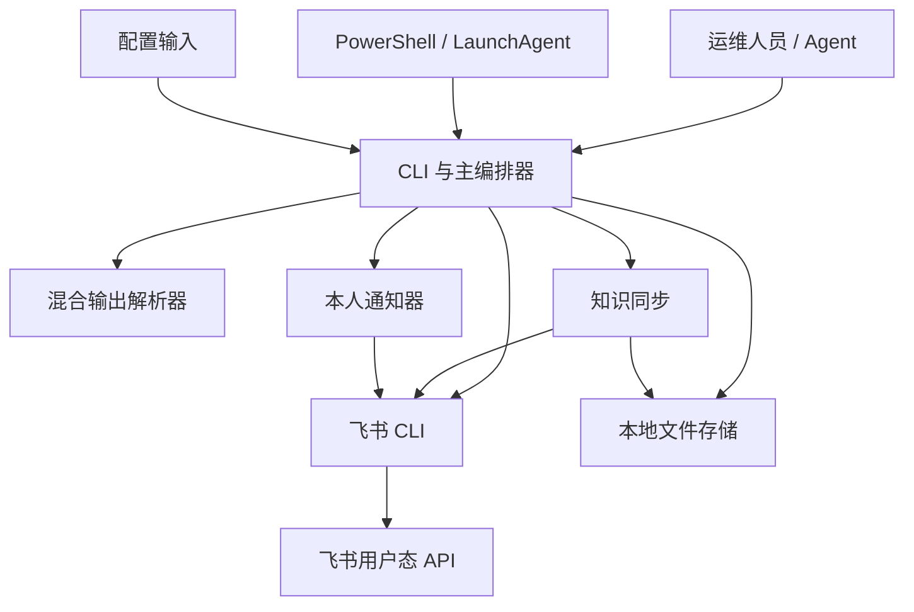
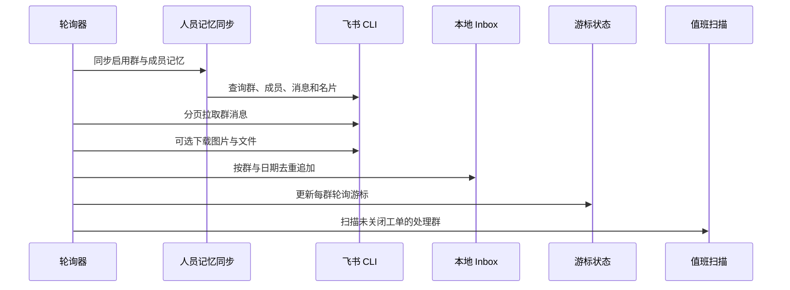
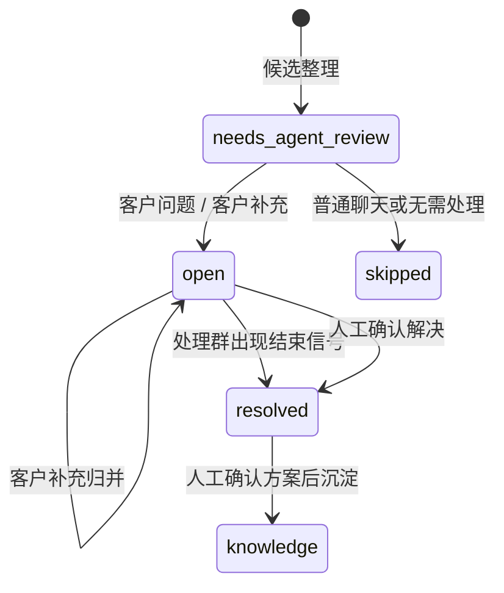

# 飞书运维 CLI 项目架构技术解析

这是一套面向飞书私有化平台运维客服的本地 CLI 工作流系统。它不是 Web 服务，也不是自动回复机器人，而是把客户问题处理拆成消息采集、人工判断、工单流转、本人通知和知识沉淀五类职责。

本文基于一次静态架构审查整理。为了适合公开阅读，已经移除私有仓库标识、提交哈希、真实人员与群组标识、客户消息、凭据定位和内部文件路径，只讨论可复用的架构方法与风险结论。

## 一句话理解这套系统

系统的核心边界是：**代码负责稳定地收集事实、保存证据和执行确定性动作，Agent 负责语义判断，最终对外动作仍由人确认。**

它主要完成五件事：

1. 通过飞书 CLI 串行读取消息、群、成员和知识源。
2. 把消息、附件、运行状态和人员记忆落到本地文件系统。
3. 整理待判断的客户消息组，但把最终语义判断交给 Agent。
4. 根据已确认的判断创建或归并工单，只把草稿发给运维本人。
5. 在人工确认真实解决方案后，把已解决工单沉淀为本地知识。

## 总体架构



### 架构分层

| 层 | 典型组件 | 职责 |
| --- | --- | --- |
| 规则与决策 | 项目规则、Agent Skill | 定义安全约束、语义判断、建单和解决沉淀规则 |
| 入口与编排 | Python CLI | 参数解析、消息采集、候选整理、工单、值班协作和守护运行 |
| 外部适配 | 飞书 CLI、输出解析器 | 访问飞书，并从混合日志中提取结构化 JSON |
| 辅助任务 | 知识同步、本人通知、导出脚本 | 同步知识、生成草稿和支持离线整理 |
| 配置 | YAML、JSON | 监听群、轮询、角色和知识源配置 |
| 持久化 | JSON、Markdown、媒体文件 | 保存全部业务事实和运行状态 |
| 调度 | 轮询循环、PowerShell、LaunchAgent | 周期执行与健康状态记录 |
| 验证 | 单元测试与 mock | 验证解析逻辑和关键文件副作用 |

当前实现的一个明显特征是：主 CLI 文件同时承担领域规则、文件仓储、飞书网关、任务编排、日志、平台调度和终端展示。它是系统的核心，也是主要耦合点。

## 核心运行链路

### 1. 消息采集



实际链路可以概括为：

```plaintext
poll_once
  -> sync_memory
  -> fetch_page
  -> normalize_message
  -> download_resource
  -> append_inbox
  -> save_state
  -> link_oncall_groups
```

这条链路先补齐人员角色信息，再分页拉取消息、下载证据、落盘并推进游标。串行访问降低了外部 API 冲突，但也让单次慢调用更容易拖住整轮任务。

### 2. 候选整理与 Agent 决策

分析阶段读取指定日期的 inbox，用人员记忆回填发送者角色，只保留客户消息；随后合并连续消息，并补充同群上下文，形成待审候选。

代码只做启发式预分类，候选的初始意图固定为“需要 Agent 审核”。Agent 需要阅读原文、上下文、图片和知识参考，最终产出：

- 意图：客户问题、客户补充、解决信号或普通聊天；
- 优先级：P0、P1 或 P2；
- 支撑判断的文字、上下文和图片证据；
- 新建、归并、跳过或等待人工的动作；
- 客户需要补充的资料与内部处理方向。

这种设计把“可重复执行的代码”和“需要理解语义的判断”分开，避免脚本凭少量关键词直接替人做高风险决定。

### 3. 工单与通知



建单流程通常是一个多步提交：

1. 写入或更新 Markdown 工单；
2. 回写原始消息的处理状态和工单编号；
3. 更新本轮候选状态；
4. 生成给运维本人的通知草稿；
5. 通过飞书把草稿发给本人。

客户问题默认新建工单，客户补充默认尝试归并到同群未关闭工单，也允许人工明确指定目标或强制新建。

### 4. 值班处理群关联

轮询器会根据未关闭工单标题搜索飞书群。候选同时满足标题词、处理中或结束信号、最低得分和领先幅度时，才会自动关联；模糊结果留给人工确认。

如果已关联群的名称出现“已解决”或“已完成”，系统可以关闭工单，但不会自动把群聊内容当作最终解决方案。知识沉淀仍需人工确认，避免错误信息进入长期知识库。

### 5. 解决沉淀与知识同步

- 人工解决工单后，把工单标为已解决并生成知识 Markdown；
- 知识同步从文档、表格和本地历史生成可检索文本及清单；
- 回复建议只检索本地知识和历史工单，形成给运维本人的建议，不直接回复客户。

这一层的关键不是“自动化程度最高”，而是确保知识有来源、有审核、有责任人。

## 数据架构：文件即数据库

| 数据类型 | 作用 | 主要写入方 | 主要读取方 |
| --- | --- | --- | --- |
| 轮询状态 | 每群游标与最近同步信息 | 轮询器 | 下一轮轮询 |
| Inbox JSON | 原始消息事实库 | 轮询与历史拉取 | 分析、搜索、知识同步 |
| 图片与附件 | 客户问题证据 | 轮询与补图流程 | Agent、工单与知识整理 |
| 待审候选 | 消息分组和处理状态 | 分析器 | 建单、跳过与补充证据 |
| 守护状态 | 运行健康与错误摘要 | 守护进程 | 状态查询和告警 |
| 工单 Markdown | 问题跟踪主数据 | 建单、归并与解决流程 | 值班协作、检索与人工审阅 |
| 人员记忆 | 群、成员、角色与关联关系 | 记忆同步 | 角色识别与群关联 |
| 知识 Markdown | 外部知识、历史与解决经验 | 同步、解决与整理脚本 | 检索、建议与 Agent |

文件存储的优点是可审阅、易备份、容易与 Agent 协作；代价是缺少数据库事务、锁和跨文件提交协议。

当前一致性依赖一个隐含前提：**同一时间只有一个进程写这些文件。** 一旦出现两个轮询器或两个建单进程，就可能发生重复编号、丢更新或半写文件。

## 配置与依赖

系统通过 YAML/JSON 配置本人标识、轮询间隔、分页、监听群、角色规则和知识源。实现中需要特别警惕两类漂移：

1. 配置字段只在部分链路生效，采集与分析可能读写不同目录；
2. 文档与实现使用了不同字段名、状态值或章节标题。

运行时依赖通常包括 Python、飞书 CLI、YAML 解析器、PDF 文本提取器和测试框架。如果没有项目级依赖清单、锁文件和 CI，新机器上的行为就会依赖操作者经验。

## 调度、日志与故障边界

Windows 可用 PowerShell 包装单次轮询、循环轮询和历史拉取；macOS 可用 LaunchAgent 管理守护任务。这个方案足够轻量，但有几个关键故障边界：

1. 外部子进程没有超时、重试和退避时，一次卡住就会阻塞整轮；
2. 每轮先做较重的人员记忆同步，再拉消息并扫描未关闭工单，API 调用量会随群数和工单数线性增长；
3. 单群失败如果只计数后吞掉，守护状态可能仍显示成功；
4. 游标若使用拉取结束后的本机时间，而不是冻结的查询上界，就存在漏消息窗口；
5. `dry-run` 若仍触发真实读取或本地写入，就不能被视为离线预演。

## 安全与隐私边界

现有设计里有几条值得保留的保护：

- 客户群不自动发送，通知目标限定为运维本人；
- 外部 CLI 串行调用，降低并发冲突；
- Agent 决策保留原文、上下文和图片证据；
- 模糊的值班群候选等待人工确认；
- 解决方案在人工确认后才进入知识库。

架构审查也发现了需要立即治理的风险类别。这里不公开任何值、内部文件名或定位信息：

- 历史知识中出现过密码、Cookie、Authorization、JWT 和 URL 秘密参数形态；
- 原始消息、成员信息、工单与知识正文可能被 Git 跟踪；
- 人员记忆可能包含姓名、部门、企业邮箱和跨租户标识；
- 错误日志与 dry-run 预览可能输出目标标识或消息正文；
- 缺少自动 secret/PII 扫描、数据保留期和访问审计。

发现这类问题时，应先轮换或撤销凭据、审计暴露范围、清理完整历史，再恢复运行或分发。删除工作树中的一行远远不够。

## 测试现状与主要缺口

现有测试覆盖内容解析、消息归组、工单新建与归并、dry-run、inbox 回写、解决沉淀、群关联、知识检索、角色识别、媒体下载和日志轮转等关键行为。

但更值得补齐的是“失败时是否仍正确”：

- 轮询游标边界、分页竞态和漏消息注入；
- 文件原子性、进程锁、并发建单和崩溃恢复；
- timeout、限流、重试、部分群失败和降级状态；
- 配置与 schema 一致性；
- 飞书 CLI 的录制合约测试与 PowerShell 自动化测试；
- CI 中的 secret、PII、链接和文档漂移检查。

## 架构结论

完成安全事件处置后，这类系统适合“单机、单运维、低并发、强调审计与人工把关”的运行模式。它的优势是业务边界清晰、文件可审阅、Agent 判断与代码执行分离，并且禁止对客户群自动回复。

主要技术债不是缺少复杂平台，而是可靠性契约尚未固化：采集游标、dry-run、一致性、外部调用超时、失败状态、配置依赖和隐私治理仍依赖操作者理解。

下一阶段应该先完成可靠性与安全加固，再在不改变 CLI 和文件格式的前提下渐进拆分单体。只有出现多实例、高可用或多人协作需求时，服务化和数据库化才真正值得投入。
