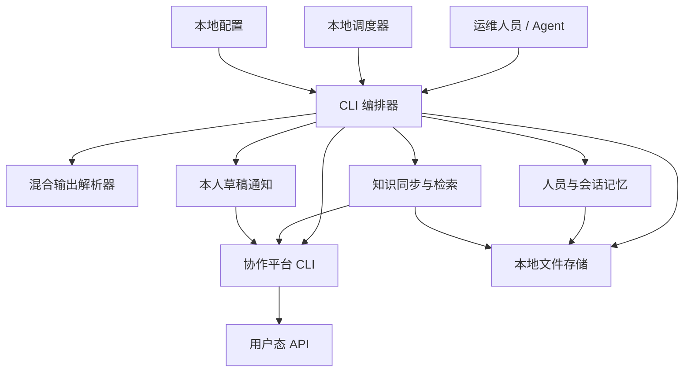
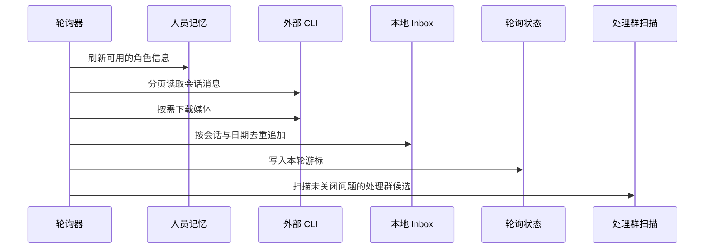
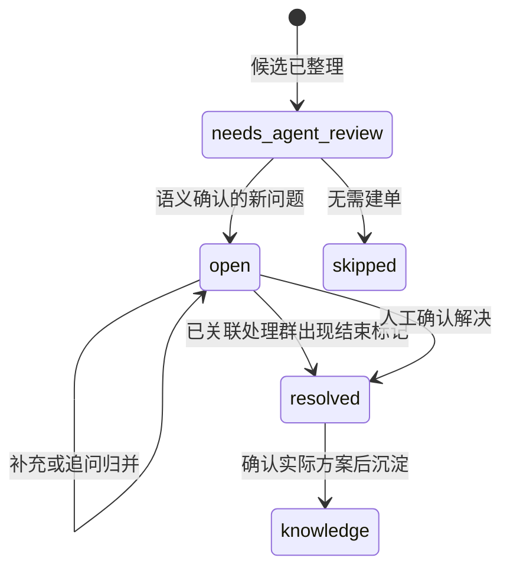

这是一套面向协作平台运维客服的本地 CLI 工作流：它把消息采集、候选整理、人工/Agent 语义裁决、问题跟踪、本人草稿通知和知识沉淀拆开处理。它不是对客户自动回复的机器人，也不是多租户 Web 服务。

本文来自一次静态架构审查。为适合公开阅读，已经移除私有仓库标识、组织与人员信息、群组和客户数据、内部地址、凭据定位、提交信息及源代码路径；只保留可迁移的设计结论。

## 如何阅读这份复盘

为避免把“代码能做什么”和“系统应该怎样演进”混为一谈，本文使用三种证据标签：

| 标签 | 含义 |
| --- | --- |
| **当前实现** | 静态阅读当前 CLI、测试和运维文档后可直接确认的行为；不代表已在生产环境压测。 |
| **审查推断** | 从控制流、文件写入方式或缺少的保护措施推导出的风险；需要用故障演练或运行数据验证。 |
| **改进建议** | 尚未实现的下一步，不应被理解为现有能力。 |

这也是本文的范围边界：不会公开消息正文、成员资料、工单内容或配置值，也不会宣称未经测量的可用性、吞吐量和安全合规结论。

## 一句话理解这套系统

系统的核心边界是：**代码稳定地收集事实、保留证据和执行确定性动作；语义判断由 Agent 或人工完成；任何面向客户的发送都不在自动化范围内。**

当前实现围绕五件事组织：

1. 串行读取已启用会话的消息，并可下载关联媒体；
2. 将消息、附件、轮询游标、人员记忆和候选状态保存到本地；
3. 尝试补充最近五条同会话上文；历史不足时按实际数量保留，并把意图和优先级留给语义裁决；
4. 在确认后新建或归并问题跟踪单，并把草稿发送给预先配置的运维本人；
5. 只在人工确认真实解决方案后，将已解决问题沉淀为本地知识。

## 总体架构

```mermaid
flowchart TB
    U["运维人员 / Agent"]
    WRAP["本地调度器"]
    CLI["CLI 编排器"]
    PARSER["混合输出解析器"]
    MEMORY["人员与会话记忆"]
    KNOWLEDGE["知识同步与检索"]
    NOTIFY["本人草稿通知"]
    EXT["协作平台 CLI"]
    API["用户态 API"]
    CFG["本地配置"]
    FS["本地文件存储"]

    U --> CLI
    WRAP --> CLI
    CFG --> CLI
    CLI --> PARSER
    CLI --> MEMORY
    CLI --> KNOWLEDGE
    CLI --> NOTIFY
    CLI --> FS
    MEMORY --> FS
    KNOWLEDGE --> FS
    CLI --> EXT
    KNOWLEDGE --> EXT
    NOTIFY --> EXT
    EXT --> API
```

| 层 | 当前实现 | 责任边界 |
| --- | --- | --- |
| 规则与决策 | 运维规则与 Agent 工作流 | 语义判断、优先级、建单/归并和知识沉淀的确认 |
| 编排 | Python CLI | 参数解析、轮询、候选状态、工单流程和守护运行 |
| 外部适配 | 协作平台 CLI 与 JSON 解析 | 访问外部数据，并从混合输出中恢复结构化结果 |
| 辅助任务 | 知识同步、草稿发送、格式转换脚本 | 同步可检索知识、生成并投递本人草稿 |
| 持久化 | JSON、Markdown、媒体文件 | 保存业务事实、处理状态、运行日志和知识材料 |
| 验证 | 单元测试与 mock | 覆盖解析及关键文件副作用的代表性场景 |

**当前实现：** 主 CLI 同时承担领域规则、文件仓储、外部网关、任务编排、日志与平台调度，因而是最重要的控制点，也是最集中的耦合点。

## 核心运行链路

### 1. 采集：先保存事实，再推进轮询状态

```mermaid
sequenceDiagram
    participant W as 轮询器
    participant M as 人员记忆
    participant C as 外部 CLI
    participant I as 本地 Inbox
    participant S as 轮询状态
    participant O as 处理群扫描

    W->>M: 刷新可用的角色信息
    W->>C: 分页读取会话消息
    W->>C: 按需下载媒体
    W->>I: 按会话与日期去重追加
    W->>S: 写入本轮游标
    W->>O: 扫描未关闭问题的处理群候选
```

**当前实现：** 外部 CLI 调用和会话处理按顺序执行；单个会话失败会被记录并继续其余会话。消息按唯一标识去重后写入本地收件箱，轮询状态保存每个会话的最近时间与消息标识。守护模式会写入最近一轮成功或错误状态，并维护有限数量的日志备份。

**审查推断：** 外部子进程调用没有显式超时；一次卡住的调用可能拉长整轮。游标在本轮拉取后以本机时间更新，边界消息的精确语义需要用分页、时钟偏差和重试注入测试来证明，而不宜仅凭实现阅读下结论。

### 2. 候选：代码整理上下文，不替人理解意图

候选分析读取指定日期的本地消息，以人员记忆补充角色，只默认处理被识别为客户的消息。它合并连续消息，尝试补充最近五条同会话上文；历史不足时按实际数量保留，并可补齐候选中的媒体路径。

**当前实现：** 候选的初始状态是“需要 Agent 审核”。即使传入自动建单或自动发草稿意图，代码也会明确忽略这类意图识别行为；后续建单强制提供意图与优先级，并支持显式附带文字、上下文或图片证据。

**可迁移原则：** 把“把资料放在同一个候选里”自动化，把“它是不是新问题、补充、解决信号或普通聊天”保留为可追责的语义决策。这样能避免关键词规则把高风险业务动作伪装成确定性程序。

### 3. 工单、处理群与通知：状态变化必须可回看

```mermaid
stateDiagram-v2
    [*] --> needs_agent_review: 候选已整理
    needs_agent_review --> open: 语义确认的新问题
    needs_agent_review --> skipped: 无需建单
    open --> open: 补充或追问归并
    open --> resolved: 已关联处理群出现结束标记
    open --> resolved: 人工确认解决
    resolved --> knowledge: 确认实际方案后沉淀
```

**当前实现：** 新问题默认建单；补充或追问默认在同一会话寻找未关闭问题后归并，也支持明确指定目标或强制新建。建单会回写原始消息与候选状态；默认草稿只发送给配置的运维本人，不向客户会话发送。

处理群关联采用保守匹配：只有标题词、处理状态信号与分值条件同时满足且结果不模糊时才可自动关联；模糊候选留给人工确认。已关联处理群的名称出现结束标记时，当前实现可以把问题标为已解决，但**不会**自动生成知识库条目。

**审查推断：** “处理群名称已结束”是流程状态信号，不等同于经过验证的根因和解决方案。因此，自动关闭与知识沉淀必须是两个独立的控制点。

### 4. 知识与人员记忆：帮助判断，不替代事实

**当前实现：** 本地知识可由文档、表格和已确认解决的问题同步而来；建议回复同时检索本地知识与历史问题，并仅供运维本人参考。人员记忆保存会话关系、角色推断依据和必要的访问错误，以支持“仅处理客户消息”的门槛。

**审查推断：** 人员记忆、消息、附件、工单和知识正文都可能含有业务与个人数据。只要它们共处在本地文件系统，就应按敏感运营数据设计访问、保留和清理策略，而不能把“本地”误认为天然安全。

## 数据架构：文件即数据库

| 数据类型 | 作用 | 主要写入方 | 主要读取方 |
| --- | --- | --- | --- |
| 轮询状态 | 每个会话的游标与最近同步信息 | 轮询器 | 下一轮轮询 |
| Inbox JSON | 原始消息事实库 | 轮询与历史拉取 | 候选、搜索、记忆同步 |
| 媒体文件 | 问题证据 | 轮询与补图流程 | Agent 与人工审阅 |
| 待审候选 | 分组、上下文和处理状态 | 分析器 | 建单、跳过与草稿流程 |
| 问题 Markdown | 问题跟踪主数据 | 建单、归并、关闭流程 | 值班协作、检索与审阅 |
| 人员记忆 | 会话、成员与角色关系 | 记忆同步 | 角色门槛与会话关联 |
| 知识 Markdown | 受确认的经验与参考 | 同步、解决流程 | 检索与建议 |
| 守护状态与日志 | 最近运行结果和故障线索 | 守护进程 | 状态查询与人工排障 |

文件存储的价值是可审阅、可备份、与 Agent 协作成本低。**审查推断：** 目前普通文件写入并不提供跨文件事务或互斥保证；若同时运行多个轮询、建单或解决流程，可能出现编号竞争、半写入或状态覆盖。当前架构适合单机、单写者、低并发的运行前提。

## 安全与隐私边界

### 已实现的防线

- 客户会话不在自动发送范围内；草稿目标限定为运维本人。
- 候选、工单和知识沉淀之间保留人工/Agent 决策关口。
- 角色不明或非客户身份默认不进入自动处理范围。
- 处理群匹配对模糊结果要求人工确认。
- 媒体下载失败仍保留原消息并记录错误，而不是把失败伪装成没有证据。

### 审查发现的治理缺口

以下是风险类别，不代表本文公开任何真实样本：

- 原始消息、附件、成员资料、草稿和知识正文的最小化保存与保留期限尚未形成可见策略；
- 日志、异常信息和 dry-run 预览有输出业务标识或正文片段的可能；
- 文件型数据的访问控制、审计、加密与备份范围需要与实际运行账户一并验证；
- 缺少在持续集成中执行的凭据、个人信息和内部链接扫描证据。

### 改进建议：先建立数据处置闭环

1. 将消息、附件、工单、知识与日志分级，明确保存期限、访问主体和销毁方式。
2. 对输出做字段级脱敏；禁止把正文、标识符或访问参数直接写入普通日志。
3. 在提交与发布前扫描凭据形态、个人信息形态和内部链接；命中时走隔离、轮换、历史审计和清理流程。
4. 将运行身份的文件权限、备份加密和恢复演练纳入上线门槛。

删除工作树中的一行不是安全处置完成；发现疑似泄露时，应先阻断访问、轮换或撤销相关凭据，并审计历史暴露面。

## 可观测性、故障处理与优化路线

| 主题 | 当前实现 | 审查推断 | 改进建议 |
| --- | --- | --- | --- |
| 运行可见性 | 有守护状态、stdout/stderr 日志与有限日志轮转 | 缺少结构化指标，难以区分慢、失败、跳过和积压 | 增加每轮耗时、会话成功率、待审积压、媒体失败和处理群关联结果指标 |
| 外部调用 | 串行执行并保留解析错误 | 无显式超时，瞬时故障与永久故障的处理边界不清 | 设定超时、有限重试、指数退避、限流和可观察的失败分类 |
| 写入一致性 | 消息去重、候选状态合并、dry-run 覆盖若干写入路径 | 多进程下仍可能竞争或半写入 | 使用进程锁、临时文件加原子替换、幂等键和崩溃恢复演练 |
| 轮询成本 | 采集前会补充记忆，随后扫描未关闭问题 | 会话数、成员数和未关闭问题增大时，单轮耗时可能线性上升 | 缓存可复用的角色结果、限制扫描预算、按失败域分片并记录队列年龄 |
| 配置正确性 | 配置驱动监听、角色与知识来源 | 字段名、状态值和目录约定可能随文档或脚本漂移 | 用 schema 校验、示例配置和兼容性测试固化契约 |

这里的排序很重要：先补“会不会错、错了能否看见和恢复”，再讨论服务化或数据库化。对这类运维工作流，可靠性契约通常比技术栈升级更早产生价值。

## 测试现状与补齐优先级

**当前实现：** 单元测试与 mock 已覆盖混合 JSON 解析、内容与媒体解析、消息分组、工单新建/归并、dry-run、收件箱回写、知识沉淀、处理群关联、人员角色、候选媒体下载、日志编码与轮转等代表性行为。

**尚待验证的关键场景：**

1. 分页边界、迟到消息、重复消息、时钟偏差与游标恢复；
2. 外部命令超时、限流、部分会话失败、连续失败与降级状态；
3. 多进程同时建单、写入中断、磁盘空间不足及恢复后的幂等性；
4. 配置 schema、运维文档与实际命令参数的一致性；
5. 录制的外部 CLI 合约测试，以及真实但脱敏的端到端演练；
6. 提交阶段的敏感信息、内部链接、乱码和 Mermaid/Markdown 结构检查。

测试不应只回答“成功路径能否运行”，还要回答“失败时是否仍然不误发、不漏记、可恢复且可解释”。

## 可迁移的设计经验

1. **把语义裁决变成显式输入。** 意图、优先级和证据不应从隐式关键词规则中猜出；将它们写入问题记录，才能回看决策依据。
2. **将自动关闭与知识沉淀分离。** 结束信号能推进流程，但不能证明解决方案正确；知识库必须有额外确认门槛。
3. **把文件系统当作受约束的数据层。** 文件让早期系统易于审阅，却不会自动提供事务、锁、权限模型或保留策略。
4. **为不确定性设计降级路径。** 身份不明、群关联模糊、媒体缺失和知识无命中时，安全默认值应是等待确认，而非扩大自动化动作。
5. **用运行证据驱动拆分时机。** 只有当锁、原子写、指标和故障演练仍无法满足多人协作、多实例或高可用需求时，数据库和服务化才是下一步，而不是起点。

## 结论

这套架构适合“单机、单运维、低并发、重视审计与人工把关”的阶段：它的强项是把事实采集、语义判断、确定性动作和知识沉淀分开，并拒绝向客户会话自动发送。

下一阶段最值得投入的不是增加复杂平台，而是把可靠性与隐私契约落到可验证的机制：超时与重试、单写者保护、原子写、结构化可观测性、配置 schema、脱敏扫描和恢复演练。完成这些后，再依据真实的并发与协作需求决定是否逐步拆分单体、引入数据库或服务层。
