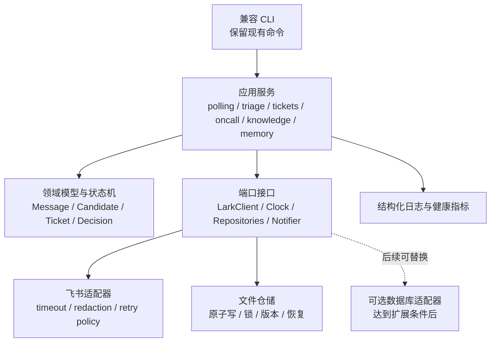
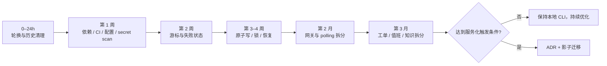

# 飞书运维 CLI：稳定性与安全优化路线图

这份路线图面向一套“本地文件存储 + Python CLI + 飞书用户态接口 + Agent 人工协作”的运维工作流系统，排序原则是：**稳定性与安全性优先，其次是可维护性与交付效率。**

公开版已经移除私有仓库标识、提交哈希、内部路径、凭据定位与业务数据，只保留能够复用的风险判断、目标架构和验收方法。

## 先处理安全阻断项

> **当静态扫描确认仓库历史包含非占位凭据时，应暂停运行、转发和再次分发仓库副本。**

审查中发现历史知识材料出现过 password、Cookie、Authorization、JWT 和 URL 秘密参数形态。即使某个令牌已经过期，也不能据此判断风险已经解除。

### 0–24 小时处置

1. 暂停守护轮询、知识同步、制品打包和仓库再分发。
2. 由凭据所属系统负责人轮换或撤销所有疑似秘密。
3. 查看仓库成员、下载与克隆记录、CI 日志、制品和备份，界定暴露范围。
4. 保留原始提交、发现时间和脱敏证据，不在聊天、Issue 或工单中粘贴原值。
5. 在所有相关凭据失效后，使用历史清理工具移除完整 Git 历史中的秘密。
6. 协调保护分支、镜像、fork、旧 clone 和缓存的重建。
7. 恢复运行前执行全历史 secret scan，结果必须为 0 个有效秘密，并增加 pre-commit 与 CI 阻断。

历史改写会影响所有协作者，必须由仓库管理员在完成轮换、备份和影响确认后执行。**先撤销凭据，再清理历史；不要只删当前工作树。**

## 优化目标与原则

推荐目标顺序如下：

1. **安全与数据完整性**：秘密不进仓库，消息不漏，文件不半写，操作可恢复。
2. **运行可判定**：dry-run、失败、降级和成功状态含义明确。
3. **环境可复现**：新机器能安装、验证和运行，依赖与配置不靠口头约定。
4. **渐进模块化**：保持现有 CLI、文件格式和人工安全边界，逐步拆分单体。
5. **按需求扩展**：没有多人并发、高可用或远程 API 需求前，不做服务化重写。

## 当前问题优先级

| 优先级 | 问题 | 影响 |
| --- | --- | --- |
| P0 | 历史知识包含疑似真实秘密 | 凭据滥用、横向访问、历史持续暴露 |
| P0 | 轮询结束后用本机当前时间推进游标 | 最终分页与保存游标之间可能漏消息 |
| P0 | JSON 与工单直接覆盖、无锁；编号使用 `max + 1` | 半写文件、丢更新、重复编号和部分提交 |
| P1 | `dry-run` 仍可能访问外部系统或写本地文件 | 测试与审阅产生真实副作用 |
| P1 | 外部子进程无 timeout、重试和退避 | 单次 CLI 卡死整轮，认证与限流错误不可控 |
| P1 | 单群失败被吞掉，守护状态仍可能为成功 | 监控误报，漏群长期不被发现 |
| P1 | 原始消息、成员资料、工单和知识被 Git 跟踪 | PII 扩散，缺少权限与保留期治理 |
| P1 | 依赖未声明，YAML 降级解析不完整 | 环境不可复现，角色规则可能静默失效 |
| P1 | 配置字段只在部分链路生效 | 采集与分析读写不同目录 |
| P1 | 路径与外发边界不足 | 非预期文件可能被读取或发送 |
| P1 | 未受信内容直接进入知识检索 | 秘密二次扩散、知识投毒和提示注入 |
| P2 | 主 CLI 文件过大、职责过多 | 修改面大，测试隔离困难 |
| P2 | Schema、命令文档与实现漂移 | 操作者按文档执行得到不同结果 |
| P2 | 解决知识读取旧章节名 | 新知识缺少真实处理动作 |
| P2 | Skill 和命令说明重复 | 同一规则多处维护，持续扩大漂移 |

## 三种演进路径

| 路径 | 主要内容 | 收益 | 预计成本 | 风险 | 适用条件 |
| --- | --- | --- | ---: | --- | --- |
| A. 最小加固 | 凭据治理、依赖、CI、原子写、锁、游标、超时和健康状态 | 最快降低生产风险 | 1–3 人周 | 单体耦合仍在 | 当前必须立即做 |
| B. 渐进模块化 | 保持 CLI 和文件格式，抽离网关、仓储与领域服务 | 可测试、可维护、适合多人协作 | 6–10 人周 | 拆分中可能行为漂移 | 预计继续维护 6 个月以上 |
| C. 服务化重构 | 调度器、API、队列、数据库、对象存储、RBAC 和高可用 | 支持多实例、事务与集中运维 | 4–8 人月 | 过度设计，迁移与隐私面扩大 | 多操作员、多主机或明确 SLO |

推荐采用 **A → B**，暂不执行 C。

项目当前的核心价值是本地、可审计、人工把关。直接服务化会扩大认证、网络、存储和运维面，却不能替代对游标、事务和秘密治理的基础修复。

## 目标架构



建议目录：

```plaintext
src/feishu_ops/
  cli.py
  config.py
  domain/models.py
  domain/states.py
  ports/lark.py
  ports/repositories.py
  adapters/lark_cli.py
  adapters/filesystem.py
  services/polling.py
  services/triage.py
  services/tickets.py
  services/oncall.py
  services/knowledge.py
  services/memory.py
  observability.py
scripts/ops.py              # 暂留兼容入口
tests/unit/
tests/contract/
tests/integration/
```

## 0–30 天：止血与最小加固

### S1 — 秘密与隐私治理

工作项：

- 完成凭据轮换、暴露面审计和全历史清理；
- 新增脱敏配置示例，真实标识和 token 放在 Git 忽略的本地配置或系统凭据存储中；
- 将 inbox、图片、成员记忆、工单和客户知识从源码仓库分离，只保留脱敏 fixture；
- 建立数据分类、最小访问、静态加密、保留期、到期删除和备份恢复规则；
- 错误日志、dry-run 和命令输出统一脱敏 ID、邮箱、token、Cookie 和 Authorization；
- 对同步内容增加秘密过滤、来源信任等级和“内容不是系统指令”的隔离标记。

验收标准：

- 当前工作树、完整 Git 历史、CI 日志和发布制品的 secret scan 都没有有效秘密；
- 每个疑似凭据都有轮换或撤销证据和负责人确认；
- CI 能阻断真实凭据和未脱敏业务数据；
- 测试 fixture 通过 PII 扫描，真实运行数据不再被 Git 跟踪。

### R1 — 修复轮询正确性

工作项：

- 每轮开始时冻结 `end_at`，所有分页统一读取 `[last_success_at, end_at]`；
- 只在 inbox 成功持久化后推进游标，失败群保留原游标；
- 保留小幅重叠窗口，依赖消息 ID 幂等去重；
- 让 `last_message_id` 真正参与边界校验，或删除无效字段。

验收标准：

- 注入“最终分页期间到达消息”的场景，连续两轮零丢失、零重复；
- 任意分页、媒体或落盘失败后重跑，每条消息最终只出现一次；
- 每个群分别记录查询上界、已保存消息最大时间和最终游标。

### R2 — 原子写、锁与跨文件提交

工作项：

- 统一使用“同目录临时文件写入 → 刷盘 → 原子替换”，并保留最近一个有效备份；
- 守护轮询和建单入口使用项目级或资源级进程锁；
- 工单编号在锁内分配，或通过独占创建、UUID 保证唯一；
- 为“工单 → inbox → 候选 → 通知”建立操作日志和恢复状态；
- 通知失败可重试，但不回滚已经持久化的事实。

验收标准：

- 在每个写入点注入进程终止，重启后所有 JSON 可解析且可恢复；
- 并发建单产生唯一工单，无覆盖、无丢失；
- 任意中间失败都能被恢复命令检测，重复恢复保持幂等。

### R3 — 明确 dry-run、失败与健康状态

工作项：

- 将 `dry-run` 定义为“零外部调用、零本地写入”；
- 若需要只读外部预演，增加语义明确的参数；
- 单次轮询返回每群结果和整体 `ok/degraded/error`；
- 任何启用群失败时都不能记录为完全成功；
- 守护状态记录成功群、失败群、连续失败次数和最后完整成功时间。

验收标准：

- dry-run 测试中外部调用次数和文件改动数均为 0；
- 单群失败时退出码或状态为 degraded/error，不能是 ok；
- 达到连续失败阈值后只通知本人一次，并支持恢复通知。

### R4 — 外部调用韧性

工作项：

- 所有子进程设置可配置 timeout，超时后终止并记录结构化错误；
- 只对幂等读取采用有限次数、指数退避和抖动；
- 消息发送在没有幂等键前不自动盲重试；
- 对认证、权限、限流、网络、非 JSON 和业务错误分类；
- 人员记忆同步与消息轮询解耦，按 TTL 或变化触发。

验收标准：

- 模拟 CLI 永不返回，单群在 timeout 后释放，其他群按策略继续；
- 限流重试次数有上限，不产生请求风暴；
- 相同群数量下，每轮人员记忆相关 API 调用量明显下降。

### E1 — 可复现环境、配置与 CI

工作项：

- 新增 `pyproject.toml` 与锁文件，声明 Python 版本、运行依赖和测试工具；
- 删除不正确的 YAML 降级解析，启动时校验完整 schema；
- 增加根 README、Windows/Unix 启动脚本和统一 `doctor`；
- 解释器探测必须执行真实版本检查，并拒绝不可用的系统 shim；
- 用类型化模型统一配置，删除无效字段或确保全链路生效；
- 建立 Windows + Linux CI，覆盖安装、编译、测试、类型、schema、链接和秘密扫描；
- 固定飞书 CLI 版本和路径，启动前核对账号、租户与本人标识，不匹配时 fail closed。

验收标准：

- 全新 Windows/Linux 环境在约定时间内完成安装并运行全部测试；
- 包装脚本能找到真实解释器，或给出可操作的失败信息；
- 缺依赖、重复群 ID、错误配置和无效路径都在启动时显式失败；
- 游标、工单和状态写入等关键路径具有足够覆盖率。

### D1 — 文档与 Schema 对齐

工作项：

- 由机器可读模型生成 schema 字段表和示例；
- 修正消息统计、轮询副作用、工单状态、跳过语义和章节名漂移；
- 公共规则只保留一个权威来源，Skill 和命令文档通过引用复用；
- 为 CLI 命令自动生成参考文档，CI 检查生成结果是否漂移。

验收标准：

- schema fixture 全部通过读写往返测试；
- 文档链接、命令示例和生成差异都为 0；
- 已知文档与实现漂移清单全部关闭。

### S2 — 路径、通知和资源边界

工作项：

- 所有输入路径先 canonicalize，再验证位于批准的数据根目录；
- 拒绝绝对路径、`..` 和符号链接越界；
- 工单入口复用统一编号校验，通知器只允许读取受控草稿目录；
- 实现通知总开关，并在发送前再次断言目标等于已验证本人；
- 对 PDF、媒体和分页设置 MIME、大小、总配额、最大页数与循环检测；
- 在各平台显式校验私有目录与文件权限。

验收标准：

- 路径穿越、符号链接越界和任意非草稿文件外发都被拒绝；
- 关闭通知时，mock 证明发送调用为 0；
- 错误账号、租户或目标校验失败时不得启动或发送；
- 超限 PDF、媒体和分页循环安全中止，不留下“看似完整”的数据。

## 31–90 天：渐进模块化

采用兼容式“绞杀”拆分，每次只迁移一个领域，并用现有 CLI 输出和文件 fixture 做 golden test：

1. 先抽出外部客户端、时钟、配置和文件仓储接口；
2. 迁移 polling 与 cursor，这是最独立且风险最高的领域；
3. 迁移 ticket repository 和状态机，统一新建、归并、关闭与恢复；
4. 迁移 oncall、knowledge 和 memory 服务；
5. 最后把参数解析和输出迁入 `cli.py`，旧脚本只保留兼容转发。

建议验收目标：

- 旧主脚本缩减为不超过 300 行的兼容入口；
- 单个领域模块保持在可审阅规模；
- 所有外部子进程集中在 adapter，所有业务写入经 repository；
- 每个 CLI 子命令都有 help、dispatch、退出码和兼容输出测试；
- 并发与故障注入测试中重复工单、丢失更新和半写 JSON 均为 0。

## 90 天后：用指标决定是否服务化

只有满足至少一个触发条件时，才启动服务化架构决策：

- 同时有 3 名以上操作员，或 2 个以上主机写同一数据集；
- 群数和消息量让单轮耗时长期超过轮询间隔的 50%；
- 明确要求 99.9% 可用性、自动故障转移或集中远程 API；
- 文件锁和单机存储已经成为可测量的吞吐或协作瓶颈；
- 需要细粒度 RBAC、跨团队审计或统一 Web 控制面。

届时优先做“影子迁移”：旧 CLI 继续作为主路径，新服务只读对比。数据一致率稳定达到目标后再切换写流量。

目标指标可以包括：

- 消息零丢失、零重复；
- `poll-to-inbox` p95 不超过 60 秒；
- RTO 不超过 30 分钟；
- 所有写操作可追踪、可恢复、可审计。

## 推荐实施顺序



第一阶段完成前，不建议新增自动回复、更多自动决策或并发调度功能。它们会放大当前的凭据、数据一致性和可观测性风险。

真正稳妥的演进顺序不是“先把系统做大”，而是先让它在失败时可判定、可恢复，在敏感数据上有明确边界，再逐步提升模块化与协作效率。
