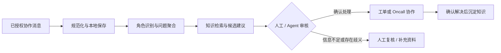

会写代码、能把项目跑起来，并不等于能把项目讲清楚。面试官通常不会陪你从目录开始读：他们想知道项目解决了什么问题、你做了什么判断、为什么这样取舍，以及遇到风险时你准备怎样收住边界。

下面以一套飞书运维工具为例，整理一份面试前可执行的准备手册。它适合 Python 自动化、运维开发、内部工具和平台工程方向；方法也可以迁移到其他真实项目。本文不把它包装成通用大型平台，而是聚焦于一个明确的运维协作闭环。

## 一、为什么“做过项目”不等于“能讲项目”

常见的尴尬是：候选人知道某个命令怎么执行，却无法在三分钟内说明“为什么需要它”。一上来背技术栈和目录，面试官听到的是功能清单；先讲业务问题和闭环，技术选择才有了上下文。

准备时请把每一个技术点都放回这四个问题里：谁遇到了什么麻烦？系统怎样把麻烦变成可处理的事项？我负责了哪一段？失败时系统或人怎样兜底？如果其中任意一个答不上来，项目还没有准备到可以面试表达的程度。

## 二、先判断项目适配什么岗位

这套工具更适合被定位为“面向已授权协作场景的本地运维工作流”，而不是对客户自动回复的机器人。它的主线是：采集消息、识别角色、聚合问题、检索本地知识、创建或归并处理记录、协助 Oncall 协作，并把已确认的解决方案沉淀回知识。

因此可以优先投递这些方向：

- Python 自动化：强调命令行编排、数据处理和外部工具适配；
- 运维开发：强调问题跟踪、失败降级、人工确认和可恢复的工作流；
- 内部工具或平台工程：强调把重复协作步骤做成受约束的工具链；
- AI Agent 应用相关岗位：强调上下文整理、工具调用边界、知识检索和 Human-in-the-loop，但要说明当前语义判断并非完整的自主模型决策层。

不要从项目中推导出未经验证的用户规模、吞吐量、线上可用性或性能收益。真实指标当然可以讲，但必须说明统计口径和数据来源。

## 三、先做一张“一页纸项目卡”

项目卡的作用，是把散落在代码、文档和记忆里的内容压缩为一页可以反复练习的材料。下面是本项目的示例。

| 字段 | 示例写法 |
| --- | --- |
| 业务问题 | 协作群里的客户问题、补充信息和附件分散，人工整理、建单和回溯成本高。 |
| 使用者 | 在已授权环境中处理协作消息的运维或支持人员。 |
| 核心链路 | 消息采集 → 角色识别与问题聚合 → 知识检索 → 工单或 Oncall 协作 → 解决知识沉淀。 |
| 我的职责 | 根据你真实参与的范围填写，例如负责消息规范化、候选问题整理、工单流转或测试隔离；不要把团队成果全部写成个人贡献。 |
| 关键技术取舍 | 采用本地 CLI 与 JSON/Markdown，优先获得可检查、易备份、便于人工修复的流程，而不是一开始服务化。 |
| 当前边界与下一步 | 文件状态需要加强原子写、恢复和并发约束；外部 CLI 适配需要统一超时、错误分类与重试策略。 |

可以直接复制下面的模板，再按自己的真实经历填写每一项：

```plaintext
项目名称：用一句话概括项目。
业务问题：写清谁在什么场景下遇到什么重复或高风险问题。
使用者：写明直接使用者与受影响对象。
核心链路：按“输入 → 关键处理 → 产出 → 反馈闭环”填写。
我的职责：写明本人负责的模块、决策和协作边界。
关键取舍：比较两种方案，并说明当前选择的原因。
当前边界：明确项目还不能保证什么。
下一步：按优先级说明准备验证或改进的事项。
```

## 四、准备 30 秒、3 分钟、10 分钟三种长度的介绍

不同长度不是把同一段话强行删减，而是信息密度不同。下面的示范只适用于候选人确实参与了该项目，并真实负责“消息规范化、候选问题聚合和工单流转”这段主链路的情况；未负责这些模块时，不能原样使用，必须改为自己的真实模块和可证明的协作边界。即使满足此前提，也要把团队方案与个人贡献分开说。

- **30 秒**：一句话说清团队方案的价值，再说清自己真实负责的范围。示例：这是一个团队建设的本地 CLI 工具链，用于把已授权飞书协作消息整理为可追踪的运维事项；我在其中负责消息和上下文的规范化、候选问题聚合，以及建单后的关联状态回看，帮助后续协作和知识沉淀有据可查。
- **3 分钟**：覆盖问题、端到端方案、个人边界、一个难点、一个取舍、当前限制和反思。
- **10 分钟**：在三分钟框架上，配合核心链路图解释输入输出、失败保护、状态变化、测试策略和下一步演进。不要按文件名逐个介绍。

### 可直接使用的三分钟示范话术

以下话术仅供真实负责上述主链路的候选人练习：项目的端到端能力应表述为团队方案，第一人称只用于自己实际完成、参与决策或明确协作的部分。若职责不完全相同，请以项目卡和可核验事实重写，不要替换名词后照读。

> 我参与的项目是一套面向已授权飞书运维协作场景的本地 CLI 工具。它要解决的问题是：客户问题、补充说明和附件散落在群聊里，支持人员需要反复整理上下文、判断是否建单、再把处理结果沉淀下来，整个过程容易遗漏，也不容易回看。
>
> 团队的方案是先把不同类型的消息规范化并保存为本地事实，再结合成员角色和近期上下文，把连续消息整理成待审核的问题组。随后工具从本地知识和历史处理记录中检索相关线索，辅助生成处理建议；经过 Agent 或人工确认后，再创建或归并处理记录、协助关联 Oncall，并在问题确认解决后沉淀为可检索知识。这样形成了从消息进入到解决经验回流的闭环。
>
> 我在团队中负责消息规范化、候选问题聚合和工单流转这段主链路：把文本、富文本和媒体消息整理为统一结构，结合成员角色和近期上下文形成候选问题，并让建单或归并后的关联状态可以回看。高风险判断由人工确认；我的职责是保留足够的事实和状态，供确认环节判断。一个技术难点是外部消息既有文本也有富文本和媒体，不能让附件下载失败导致整条消息丢失，所以我在这段链路中把主消息、媒体信息和错误状态分别保留下来。
>
> 在工程取舍上，团队当前选择本地 CLI 加 JSON/Markdown 状态，而不是立刻上数据库和服务化：它更容易检查、备份和手工修复，适合先验证流程。这个方案的边界也要明确：多文件分步写入要考虑部分成功和并发，一些外部调用还需要补齐统一的超时、错误分类和恢复机制。作为我负责链路的下一步，我会先用隔离测试和脱敏演示数据验证这些关键路径，再基于实际使用规模向团队提出是否模块化或引入更强存储能力的建议。

这段话术以本项目的主链路为示范；实际使用时，请按自己的真实职责调整，团队项目也要明确“我负责”与“团队整体”各自的范围。

## 五、画清核心业务链路，而不是背目录

面试时，一张链路图比一串目录更能帮助对方建立全局认知。每个节点只要能回答三件事：输入是什么、做了什么、失败时留下什么信息或由谁接手。



例如，媒体下载失败时仍保留主消息和失败信息；知识检索命中相似记录时，也不能把它当成已经验证的回复；Oncall 候选有歧义时应停止自动关联，转人工确认。这里的重点不是“自动化做得越多越好”，而是自动化的边界清晰、结果可检查。

需要更完整的实现背景时，再阅读：[飞书运维 CLI 项目架构技术解析](/blog/feishu-operations-cli-architecture/)。

## 六、面试前七天准备计划

| 时间 | 当天要完成的事 |
| --- | --- |
| D-7 | 在隔离环境重新运行项目和全量测试，记录当前真实基线；不要引用旧截图或历史结果。 |
| D-6 | 梳理调用链、数据状态、外部依赖与关键输入输出，补全项目卡。 |
| D-5 | 准备两个技术难点和一个失败案例，重点说发现、影响、处理与复盘。 |
| D-4 | 练习架构取舍、安全边界与替代方案，分清当前实现、风险判断和下一步建议。 |
| D-3 | 用脱敏样例录制一次完整演示，控制在五分钟内并记录每一步预期结果。 |
| D-2 | 找同伴或自己模拟追问，删除“应该”“大概”“性能很好”这类无法证明的表述。 |
| D-1 | 冻结演示环境，准备样例数据、截图或录屏、离线材料，并核对简历与代码事实一致。 |

## 七、设计一条五分钟现场演示，并准备离线备用方案

演示只讲一条代表性的闭环，不要现场翻遍所有命令。一个可行脚本是：

```plaintext
步骤 1：展示一份脱敏的样例消息，说明它代表的是客户问题和补充上下文。
步骤 2：展示消息被规范化、聚合为候选问题后的关键字段。
步骤 3：展示知识命中或未命中的两种结果，说明“相似”不等于“可直接回复”。
步骤 4：展示人工确认后创建或追加处理记录，并说明写回的关联关系。
步骤 5：展示问题确认解决后如何形成可复用的知识摘要。
```

每一步都提前写下预期输出。现场如果网络、权限或外部 CLI 不可用，直接切换到预先录好的屏幕录制、截图和同一份脱敏输入输出，不要临时尝试连接真实数据。解释顺序可以是：先说明演示环境的限制，再展示离线材料，最后解释真实环境需要的授权与人工确认边界。

## 八、六组高频追问，以及回答框架

下面给的是组织答案的框架，不是要求逐字背诵。

1. **为什么做这个项目，价值如何验证？** 先说协作信息分散造成的具体摩擦，再说闭环如何减少重复整理和遗漏；最后用真实的使用反馈、演示用例或复盘记录说明验证方式。没有数据时，坦诚说尚未建立量化口径。
2. **为什么选择本地 CLI 和文件状态，而不是数据库或服务化？** 说明当前优先级是本地可检查、易备份、便于人工修复和低运维成本；再说明多人并发、远程访问、明确 SLO 出现后，才评估 SQLite、数据库或服务化。
3. **如何处理重复采集、并发写入和失败恢复？** 说清消息标识与游标用于去重；同时承认多文件状态需要原子写、单实例或锁、启动恢复检查等保护，并说明你会用中断写入和重复执行的测试验证恢复策略。
4. **外部 CLI、飞书权限和网络异常如何隔离？** 把外部能力视为适配层，校验退出状态和结构化输出；权限遵循最小授权，样例和日志脱敏；超时、重试、退避和错误分类是需要统一补齐或验证的保护。
5. **测试覆盖了什么，当前风险是什么？** 讲解析、去重、分组、知识命中、工单流转、歧义降级和 dry-run 等关键副作用；所有测试结论都以面试前最新一次隔离验证为准，并明确已知风险与复测计划。
6. **如果数据量或用户量扩大十倍，先改哪里？** 先观测瓶颈和失败类型，再优先解决状态一致性、外部调用稳定性和可观测性；只有确有检索规模或并发需求时，才引入更强的存储、检索或服务化能力。

有关可靠性和安全的更细技术讨论，可延伸阅读：[飞书运维 CLI：稳定性与安全优化路线图](/blog/feishu-operations-cli-optimization-roadmap/)。

## 九、如何诚实表达项目短板

短板不是扣分项；回避短板才是。建议按四步回答：**现象 → 原因 → 影响范围 → 优先级与验证办法**。

例如：当前命令入口承载的职责较多，原因是项目先以快速验证工作流为目标；影响是改动面和测试隔离难度会上升；因此下一步会先用测试固定关键行为，再逐步抽离外部适配、文件仓储和领域流程。又如，多文件状态分步写入可能出现部分成功，下一步优先评估原子替换、恢复检查和幂等修复，而不是立刻承诺重写为复杂分布式系统。

注意区分“历史检查发现过的现象”和“现在已重新验证的状态”。不能把旧检查数字或旧失败案例当作今天的事实。

## 十、三条简历描述模板

请用真实职责替换方括号内容；如果有可核验指标，再替换为带统计口径的数字。

- 设计并实现[本人负责模块]，将已授权协作消息经过规范化、角色识别、问题聚合与知识检索，串联为可审核的运维处理闭环。
- 为[解析 / 工单 / 状态管理]补充[去重、错误保留、dry-run、测试隔离等真实措施]，使关键副作用和人工确认边界更易检查与回溯。
- 基于本地 CLI 与 JSON/Markdown 的可审阅存储方案完成[具体职责]，并识别多文件一致性、外部依赖稳定性等演进风险，制定分阶段改进计划。

更多从消息采集到知识沉淀的技术背景，可参考：[飞书运维工具包实战：从消息采集到知识沉淀](/blog/feishu-ops-toolkit-tutorial/)。

## 十一、面试前最终检查清单

- [ ] 项目能在隔离演示环境中启动，必要的前置条件已写清。
- [ ] 测试已在近期重新执行，结果、范围和未覆盖项可以如实说明。
- [ ] 演示数据、截图、录屏、日志和配置均已脱敏，不含凭据、真实人员或内部标识。
- [ ] 30 秒、3 分钟、10 分钟三种介绍已练习，并与实际职责一致。
- [ ] 两个技术难点和一个失败案例能按“现象—原因—影响—改进”说明。
- [ ] 能独立讲清核心链路图中的输入、输出、失败处理与人工边界。
- [ ] 已知短板、改进优先级和验证办法清楚，不把建议说成已完成能力。
- [ ] 离线演示材料可用，外部服务不可用时也能完成讲解。
- [ ] 简历、项目卡、演示和代码事实一致，没有虚构的规模或收益。

## 十二、延伸阅读

如果你已经完成项目卡和演示脚本，下面三篇文章可以帮助你为架构与演进类追问补充技术背景：

- [飞书运维 CLI 项目架构技术解析](/blog/feishu-operations-cli-architecture/)
- [飞书运维 CLI：稳定性与安全优化路线图](/blog/feishu-operations-cli-optimization-roadmap/)
- [飞书运维工具包实战：从消息采集到知识沉淀](/blog/feishu-ops-toolkit-tutorial/)

真正有说服力的项目介绍，不是把每个功能都讲一遍，而是让面试官看到：你能从真实问题出发，做出有边界的工程判断，并知道下一步应该验证什么。
