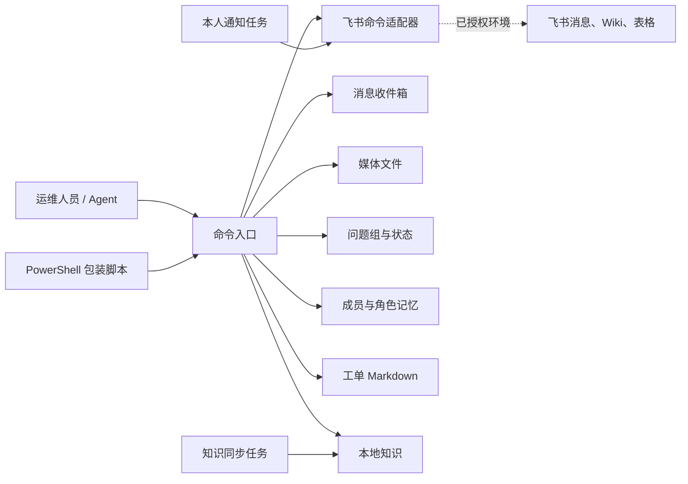
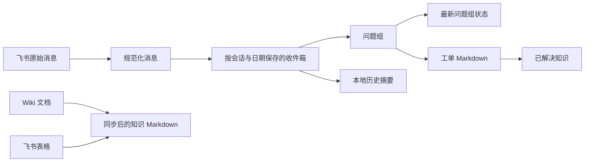
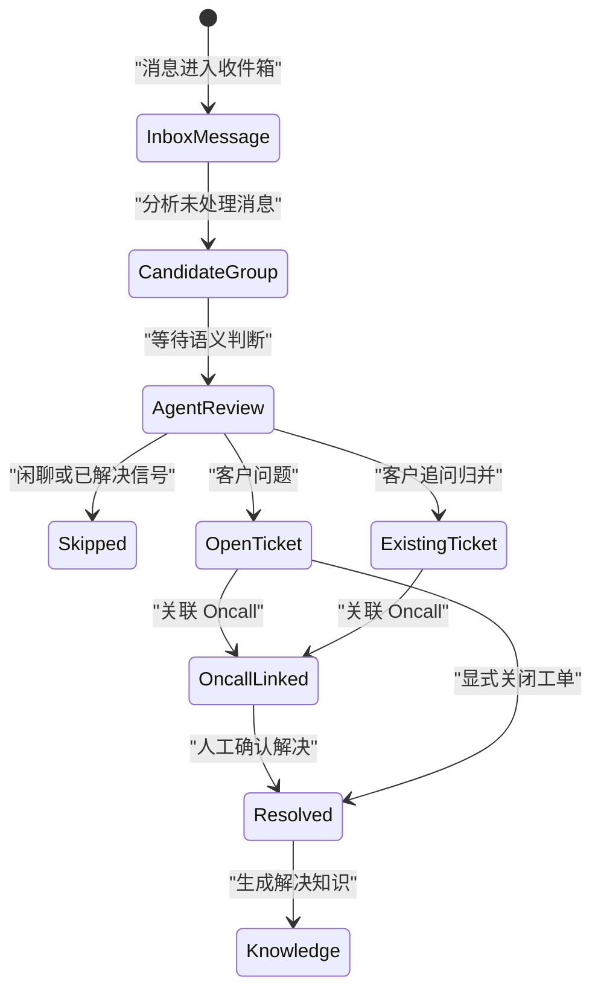

# 飞书运维工具包实战：从消息采集到知识沉淀

本文面向第一次接触 Python 运维工具的读者。目标不是背诵每个函数，而是理解一套命令行工具如何把外部消息变成可追踪、可处理、可复用的运维知识。

项目主线可以概括为：

> 已授权的飞书消息 → 本地收件箱 → 消息规范化与角色识别 → 问题分组 → 知识检索 → 回复或工单草稿 → Agent 与人工确认 → Oncall 协作 → 解决知识沉淀

在开始前，建议先了解 Python 3.10+、JSON/YAML、Markdown、命令行、PowerShell、子进程调用和 pytest。

> 公开说明：本文已经移除私有仓库标识、提交信息、内部绝对路径、真实人员与群组标识、客户数据、凭据定位以及仅对特定开发环境有意义的测试细节。示例中的名称和标识均为通用占位符。

如果希望先建立全局认知，可以搭配阅读：

- [飞书运维 CLI 项目架构技术解析](/blog/feishu-operations-cli-architecture/)
- [飞书运维 CLI：稳定性与安全优化路线图](/blog/feishu-operations-cli-optimization-roadmap/)

## 一、先明确需求范围

这类项目通常是“命令行脚本 + 本地 JSON/Markdown + 外部飞书命令行适配器”的组合，不是 Web 服务，也不是数据库系统。

从实现可以确认的能力包括：

- 采集已启用且已授权的飞书群消息；
- 解析文本、富文本、图片、视频和文件；
- 按角色筛选客户消息并合并为问题组；
- 从本地 Markdown 和历史工单中做关键词检索；
- 生成回复建议、Oncall 要点和工单 Markdown；
- 创建、追加、跳过和解决工单；
- 寻找并关联 Oncall 群；
- 把 Wiki、表格、本地历史和已解决工单整理为知识文件。

但仅凭代码不能推断生产规模、可用性、真实权限和实际数据量，也不能把数据库事务、消息队列、向量检索或生产监控描述成已经实现的能力。

这是阅读工程项目时很重要的一条原则：**把代码事实、运行环境事实和未来建议分开表达。**

## 二、当前实现与能力边界

### 已实现的主流程

主 CLI 通过参数提供轮询、监控、历史拉取、消息分析、创建工单、解决工单、同步成员记忆和同步知识等命令。

运行数据按用途分成几类逻辑目录：

- 消息收件箱：按会话和日期保存规范化消息；
- 媒体目录：保存下载的图片、视频或文件；
- 运行状态：保存问题组、轮询游标和运行日志；
- 成员记忆：保存会话、成员及其角色信息；
- 工单目录：保存编号化的 Markdown 工单；
- 知识目录：保存本地知识、同步结果和解决记录。

轮询状态通过时间游标和消息标识去重。知识检索采用中文片段与英文 token 的加权匹配，因此它属于轻量级关键词检索，并不是向量数据库检索。

### 当前没有充分证据证明的能力

- 数据库事务、Outbox、消息队列和死信队列；
- 统一重试、指数退避和多实例锁；
- Embedding、向量数据库或大模型自动问答；
- 生产级指标、告警平台和容量数据；
- 跨平台调度配置的一键部署。

学习时不要急着给项目加上复杂架构名词。先把现有链路读透，再判断真实需求是否值得引入额外组件。

## 三、目录与总体架构

公开版把内部路径抽象为职责目录：

- `README.md`：安全边界、安装方式和目录说明；
- `requirements.txt`：Python 依赖；
- `config/`：可以提交的配置模板；
- `cli/`：命令入口与主业务编排；
- `adapters/`：外部飞书命令与输出解析；
- `knowledge/`：知识同步、构建与导出；
- `wrappers/`：PowerShell 等参数转发入口；
- `tests/`：单元测试与隔离测试；
- `runtime/`：本地运行数据，不进入版本控制。



初学者要特别注意：当一个主 CLI 同时承担参数解析、外部调用、领域规则和文件持久化时，它既是最重要的阅读入口，也是未来最适合拆分的模块。

## 四、核心概念与数据契约

### 配置

一套典型配置会包含：

- 当前操作账号的占位标识；
- 轮询间隔和首次回看时间；
- API 分页大小；
- 本地数据根目录；
- 被监听会话的名称、客户、重要性和启用状态；
- 用于角色推断的组织或部门规则；
- Wiki、表格和本地历史等知识源。

配置模板只应出现占位值。真实 ID、令牌、Cookie、聊天记录和客户数据必须放在受控的本地配置或秘密管理系统中，并排除在 Git、日志和知识导出之外。

### 规范化消息

外部消息进入系统后，会被整理为统一的内部结构：

| 字段类型 | 用途 |
| --- | --- |
| 消息标识 | 去重与工单关联 |
| 会话信息 | 标记来源会话与客户 |
| 发送者信息 | 保存发送者及推断角色 |
| 消息类型与正文 | 屏蔽文本、富文本、媒体的差异 |
| 媒体列表 | 保存资源占位标识、本地位置和下载错误 |
| 创建时间 | 排序与问题分组 |
| 处理状态 | 标记是否已处理及关联工单 |
| 原始内容与错误 | 保留解析证据与异常原因 |

解析器需要支持普通文本、富文本、交互卡片、图片、贴纸、视频和文件。富文本往往是嵌套节点，因此通常要递归提取文字。

### 问题组

问题组是系统内部对象，不是飞书原生对象。系统一般按会话分组，再结合以下信息判断消息是否属于同一问题：

- 回复关系；
- “补充说明”“还有一个现象”等继续表达；
- 时间窗口；
- 同一发送者；
- 连续媒体消息。

随后为问题组补充标题、类别、优先级、上下文、媒体统计和处理草稿。

### 工单

工单可以使用 Markdown 保存。Front matter 记录编号、状态、优先级、类别、关联消息和时间，正文记录原始问题、上下文、Agent 判断、处理动作、已收集资料和解决时间线。

文件工单的优点是直观、易于审阅和备份；缺点是并发、原子性与跨文件一致性需要额外处理。

### 知识

知识检索可以从知识 Markdown、文本文件和历史工单中提取条目，再生成英文 token 以及中文二至四字片段用于加权匹配。

这里最容易出现误解：**检索到相似记录，不等于找到了可靠答案。** 只有命中明确的“客户回复口径”并达到阈值时，系统才应该认为存在较明确的回复依据。

## 五、端到端正常流程

```mermaid
flowchart TD
    A["单次轮询或持续监控"] --> B["加载配置"]
    B --> C["同步或加载成员记忆"]
    C --> D["选择已启用会话"]
    D --> E["分页拉取消息"]
    E --> F["规范化消息"]
    F --> G["下载媒体或记录错误"]
    G --> H["按消息标识去重并写入收件箱"]
    H --> I["更新轮询游标"]
    I --> J["分析未处理消息"]
    J --> K["合并问题组"]
    K --> L["分类、定级、检索知识、生成草稿"]
    L --> M["保存最新问题组"]
    M --> N{"Agent / 人工判断"}
    N -->| "客户问题或追问" | O["创建或追加工单"]
    N -->| "闲聊或已解决信号" | P["跳过或人工处理"]
    O --> Q["回写消息处理状态"]
    Q --> R["生成 Oncall 草稿"]
    R --> S["关联 Oncall 会话"]
    S --> T{"确认问题已解决？"}
    T -->| "是" | U["关闭工单"]
    U --> V["沉淀解决知识"]
```

### 5.1 启动与轮询

典型的本地准备命令如下：

```powershell
python -m pip install -r requirements.txt
python <cli-entry> --help
python -m pytest -q
```

包装脚本只负责参数转发，例如：

```powershell
.\<poll-wrapper>.ps1 -ConversationId "<conversation-id>" -SkipMedia
.\<history-wrapper>.ps1 -Since "YYYY-MM-DD" -DryRun
```

轮询会读取每个会话的最后处理时间；首次运行使用配置中的回看窗口。外部适配器依据“是否还有下一页”和分页令牌循环拉取消息。

### 5.2 规范化与落盘

每条原始消息经过规范化后，媒体使用稳定规则生成本地路径。消息按“会话目录/日期文件”组织，并通过已有消息标识避免重复写入。

即使媒体下载失败，主消息也应保留，同时记录下载错误。这样可以让下游知道“消息存在但附件不完整”，而不是把整条消息静默丢掉。

### 5.3 角色记忆与筛选

成员角色可以来自：

- 会话成员记忆；
- 联系人卡片；
- 全局成员记忆；
- 收件箱中已经识别的角色。

分析命令默认只处理客户消息，只有显式开启额外选项时才纳入非客户角色。这个默认值能减少机器人、同事讨论和系统通知对问题识别的干扰。

### 5.4 分组、分类与检索

分类规则可以把问题归为登录与权限、知识库、数据与存储、工作流与 Agent、模型调用、性能、部署安装或其他。

优先级通常结合会话重要性以及“紧急”“阻塞”“生产”“不可用”“报错”等词判断。它适合作为候选建议，但不应代替人工对业务影响范围的确认。

回复建议可分为三类：

1. 有明确回复口径；
2. 有相似记录但没有明确口径；
3. 没有命中。

后两类不应伪装成确定结论，而应列出缺失资料和 Oncall 排查方向。

### 5.5 Agent 判断、建单与解决

创建工单前，Agent 或人工需要显式提供问题意图与优先级。一个稳妥的建单策略是：

- 指定目标工单时，追加到该工单；
- 客户追问且未强制新建时，尝试匹配开放工单；
- 其他情况创建新的编号工单。

建单后，将关联消息标记为已处理并写回工单编号。问题解决时更新工单状态，再生成一份可检索的解决知识。

### 5.6 Oncall 关联

Oncall 候选可以通过工单标题搜索，再综合标题关键词、处理中或已解决状态、来源会话片段等因素评分。

只有当标题匹配、状态标记、最低分数和候选差距同时满足条件时才自动选择；一旦候选存在歧义，就转人工确认。自动化在这里负责缩小范围，而不是替人做高风险决定。

## 六、数据与状态如何流转





这些状态并不一定存在于数据库表中，而可能分散在收件箱 JSON、最新问题组文件和工单 Markdown 中。理解这一点，才能正确评估一致性和恢复风险。

## 七、上游、下游与运行时边界

入口通常有三类：

1. 主 CLI；
2. PowerShell 等包装脚本；
3. 持续轮询循环。

外部依赖是飞书命令适配器，可能涉及消息、媒体、会话搜索、消息发送、Wiki 下载、表格读取和成员信息。

仓库内能确认的下游消费者包括：

- 分析逻辑消费本地收件箱；
- 工单逻辑消费最新问题组；
- 知识检索消费本地知识；
- 通知任务消费草稿文件。

真实权限、外部命令版本、调度方式和知识库的外部消费者，必须在目标环境单独验证。不要把开发机上的可用性当成生产环境的事实。

## 八、失败路径与保护

### 配置和参数保护

不存在或被禁用的会话应被拒绝；非法意图、优先级和工单编号应立即终止命令；互斥参数不能同时使用。

### 外部调用保护

外部命令适配器需要同时检查：

- 进程退出码；
- 输出是否可以解析为 JSON；
- 结果是否为预期对象；
- 业务成功标志是否为真。

外部工具有时会在 JSON 前后混入安装提示或调试日志，因此解析器需要有明确的容错边界，并保留无法解析的原始输出供排查。

### 媒体与 dry-run

媒体下载失败时记录错误并保存主消息。`dry-run` 应避免发送和持久化副作用，但仍可能读取配置、本地文件或调用只读外部接口。

因此，**dry-run 不等于完全离线**。运行前仍要确认权限、输入范围和外部调用边界。

### 一致性风险

创建工单可能需要分别写入工单文件、收件箱状态和最新问题组。没有事务、Outbox 或补偿机制时，进程中途退出会造成部分写入。

文件存储并非不可用，但需要明确补上：

- 临时文件加原子替换；
- 文件锁或单实例约束；
- 启动恢复检查；
- 幂等键；
- 可重复执行的修复命令。

## 九、按业务顺序阅读代码

面对一个主文件较大的 CLI，可以按职责而不是按文件从头读到尾：

1. 命令解析和主入口：先认识命令与参数。
2. 外部命令适配和 JSON 解析：理解数据从哪里来。
3. 内容解析与消息规范化：理解统一数据模型。
4. 分页拉取、媒体下载、去重和轮询：理解采集链路。
5. 成员同步与角色补全：理解客户消息如何被识别。
6. 问题分组、分类和优先级：理解候选问题如何形成。
7. 分词、知识加载、检索和回复建议：理解轻量检索。
8. Agent 决策、工单构建与归并：理解人工边界。
9. Oncall 候选、评分和关联：理解协作闭环。
10. 知识同步、QA 构建与导出：理解知识如何进入和离开系统。

这种阅读顺序有一个好处：每一步都能回答“输入是什么、输出是什么、失败后留下什么状态”。

## 十、知识同步与导出

知识同步通常处理三类来源：

- Wiki 文件：下载后提取文本；
- 飞书表格：把首行作为表头，整理为工单或知识记录；
- 本地历史：从收件箱中提取相似问题线索。

同步结果应保存清单，记录来源、生成文件、时间和失败原因。

QA 构建可以把已解决工单、候选聊天问答、历史消息和图片索引分别输出为 JSONL 与 Markdown。候选问答必须标记为“未验证”，不能直接当作已确认答案。

JSON 转 Markdown 工具则负责把原始数据变成可读资料，并输出转换索引。遇到解析错误时，应生成错误清单并使用非零退出码，让自动化流程可以准确判断失败。

## 十一、测试应该覆盖什么

这类工具的测试重点不是“是否调用过某个函数”，而是关键副作用和边界是否符合预期：

- 普通文本、富文本与媒体解析；
- 消息去重和分页；
- 问题分组与上下文；
- 工单创建、追加、跳过和解决；
- 知识命中与无命中；
- Oncall 候选与歧义降级；
- dry-run 的写入和外发边界；
- 成员角色回写；
- 混合编码日志和带前缀的 JSON 输出；
- PATH 与外部命令隔离；
- 日志轮转和临时目录清理。

公开教程不记录私有仓库的精确测试计数、失败用例名称和内部环境状态。更值得保留的是通用结论：测试必须隔离外部命令、使用临时目录，并为旧数据缺少字段、环境变量污染和调用顺序变化建立稳定夹具。

## 十二、设计取舍与优化建议

### 当前方案的优点

- JSON/Markdown 便于检查、备份和手工修复；
- 先规范化消息，再执行分组与检索；
- 媒体失败不会导致主消息丢失；
- Oncall 自动关联有评分与歧义门槛；
- Agent 意图通过显式参数传入；
- 测试可以使用 Mock 和临时目录，无需连接真实飞书。

### 建议的改进顺序

1. 先让完整测试在隔离环境稳定通过，补齐旧数据缺失字段的兼容处理。
2. 把外部飞书命令封装为独立客户端，统一超时、错误和返回结构。
3. 为多文件写入增加原子替换、恢复检查，或在需求明确时迁移到 SQLite。
4. 为轮询增加错误分类、有限重试和指数退避。
5. 将单体 CLI 拆为配置、外部客户端、消息解析、分组、知识、工单和命令层。
6. 只有在数据规模确实需要时，再引入全文检索或向量检索。
7. 增加结构化指标：拉取数、去重数、媒体失败数、问题组数、工单数和歧义数。

## 十三、初学者实践路线

下面的练习使用通用路径与占位符，不需要接触真实业务数据。

1. 执行 CLI 的 `--help`，把命令分为采集、分析、工单、知识和运维五类。
2. 不连接飞书，构造 `text`、`post`、`image`、`file` 示例 JSON，单独验证内容解析。
3. 在临时测试目录手工创建一份脱敏消息文件，用指定日期执行分析命令的 `--dry-run`。
4. 创建一份包含“客户回复口径”的本地知识 Markdown，观察检索结果和回复建议。
5. 使用工单命令的 `--dry-run`、跳过和解决流程，理解每个动作的写入边界。
6. 为旧成员缺少字段、空知识库、重复媒体、分页异常和部分写入失败补测试。

练习数据必须使用虚构名称和占位标识，并放在与真实运行目录隔离的临时位置。

## 十四、发布与运行安全清单

在把类似项目或教程公开前，至少检查：

- [ ] 文档和历史中没有 token、Cookie、密码、JWT、私钥或秘密 URL 参数；
- [ ] 没有真实人员、客户、会话、消息和媒体标识；
- [ ] 没有用户目录、内网地址或私有仓库定位信息；
- [ ] 示例配置只包含明显的占位值；
- [ ] 运行数据、缓存、日志、数据库和导出报告已加入忽略规则；
- [ ] dry-run 的外部访问和本地写入边界有明确说明；
- [ ] 对外发送、建单和关闭等动作仍需要授权或人工确认；
- [ ] 测试和构建在干净环境中通过；
- [ ] 公开内容不暴露仅对内部排障有意义的失败细节。

## 十五、总结与复习问题

读完后，你应该能够回答：

1. 轮询如何结合时间游标和消息标识避免重复采集？
2. 为什么内容解析要同时保留文本、媒体和解析错误？
3. 为什么消息分析默认只处理客户角色？
4. 问题组如何使用回复关系、时间窗口和媒体消息？
5. 为什么相似知识命中仍可能需要 Oncall？
6. 为什么建单要求显式意图和优先级？
7. 客户追问如何归并已有工单或创建新工单？
8. Oncall 自动关联什么时候必须转人工复核？
9. 为什么 dry-run 不等于离线模式？
10. 多文件分步写入有哪些一致性风险？

这类工具真正值得学习的，不是某一个飞书 API，而是：

> **外部消息规范化 + 本地状态管理 + 规则驱动的问题处理闭环。**

掌握这条链路后，再学习模块化重构、API 稳定性、测试隔离和知识检索优化，会自然得多。
