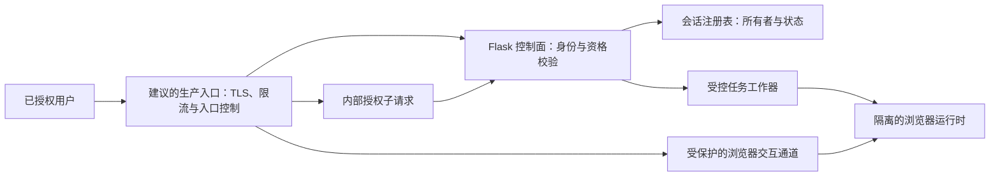
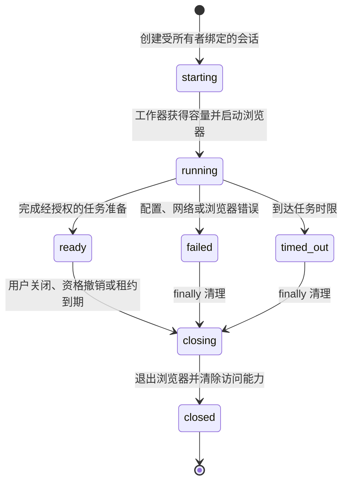

服务端浏览器自动化并不是“把脚本搬到服务器”那么简单。它同时持有 Web 身份、浏览器进程、远程交互通道和用户可见的任务状态；任一边界模糊，都可能演变为越权访问、资源耗尽或难以审计的故障。

本文复盘一种以 Flask 为控制面、Selenium 为浏览器执行器、反向代理为访问闸门的服务形态。它只讨论经授权的业务自动化与防御性工程，不包含任何目标站点、交互定位、可用于访问的敏感数据或可复现的登录操作。

为避免把设计判断伪装成事实，文中使用三种标记：

- **当前实现**：可从项目结构直接观察到的行为。
- **审查推断**：由结构带来的约束或风险，需结合运行环境验证。
- **改进建议**：面向生产化的改进方向，并非现有功能承诺。

## 先定义授权边界

受控浏览器只能代表已经通过服务自身身份校验、且具有相应业务资格的用户工作。服务不能把“能引用到任务”当成授权，也不能把反向代理当成唯一的访问控制。

**当前实现**在创建、查询、关闭会话及进入受保护页面前都会检查应用侧用户状态；会话记录绑定所有者，跨用户读取或关闭会话会被拒绝。代理层还会向应用发起内部授权校验，再决定是否放行浏览器交互通道。这形成了“应用授权 + 资源归属校验 + 代理执行”的纵深边界。

**改进建议**是把授权规则写成可测试的策略：谁可创建、谁可读取状态、谁可关闭、谁可访问交互通道、资格变化后如何撤销。每次状态查询和关闭都应重复校验资源所有者，不能只在创建时校验一次。

这个图表达的是职责分层，而不是网络拓扑的逐字复刻；其中 TLS、限流与入口控制是**建议的生产边界**，并非当前实现断言。当前实现中可核实的是交互通道须同时通过代理校验与应用中的会话归属判断。

## Flask 控制面：保持小、清晰、可拒绝

Flask 适合承担控制面：呈现状态页、创建异步任务、查询状态、结束任务，以及把失败映射成稳定的 HTTP 响应。**当前实现**配置了框架会话保护属性，并感知反向代理转发的协议与主机信息；这些设置为会话保护和正确生成外部链接提供了基础。

控制面应遵循两个原则：

1. 请求处理不等待浏览器任务完成。创建任务只返回任务引用和初始状态，页面通过受保护的状态接口轮询或接收通知。
2. 外部输入只描述“要执行已批准的任务”，不应承载任意 URL、脚本片段、浏览器能力或调试参数。

**审查推断**：如果任务状态仅驻留在进程内存，多进程部署、容器重启和滚动升级都会使状态丢失或不可见。因此，当前这种轻量实现适合受控的低并发场景；扩展前应先明确一致性与恢复语义。

## 浏览器任务生命周期

**当前实现**把浏览器创建放到后台线程，记录从“创建中”到“就绪、失败或已关闭”的状态，并在异常路径中释放驱动。显式关闭也会尝试终止对应浏览器。这样的 `try/finally` 思路比“任务结束后再清理”更可靠，因为配置错误和驱动异常都会进入清理分支；更完整的超时终态属于后文建议。

基于这些现有状态字段，下面给出一张**建议状态机**：它增加了显式的超时、收敛和租约语义，不是当前实现逐字拥有的状态集合。

**改进建议**是把这张状态机作为代码与监控的共同契约：

- 为创建、页面加载、等待条件、空闲和总任务时长分别设置上限；超时应进入 `closing`，而不是仅向前端报错。
- 关闭操作必须幂等。重复点击、网络重试或后台回收不应遗留第二个浏览器进程。
- 进程重启时扫除孤儿任务；长期运行时采用租约或心跳，而不是无限期保活。
- 错误信息分为用户可见的稳定分类与受控诊断字段；诊断字段不得含页面内容、身份凭据、请求头或个人数据。

## 并发与隔离：先承认容量是安全边界

**当前实现**以进程内锁保护会话和驱动登记，并在新任务启动时回收其他开放的浏览器会话。这说明它把并发容量收得很紧，优先避免多个受控浏览器互相干扰。

**审查推断**：这种全局回收策略在单用户演示或共享终端中简单有效，但不等价于多租户隔离；多个已授权用户同时使用时，可能互相影响。因此，不能把“有锁”误读为“已具备水平扩容能力”。

**改进建议**是按部署目标选择模型：

| 场景 | 会话模型 | 关键控制 |
| --- | --- | --- |
| 小规模受控访问 | 单一活动会话 | 明确排队提示、全局容量上限、关闭兜底 |
| 多用户服务 | 每用户或每租户独立浏览器上下文 | 所有者校验、配额、独立存储与浏览器隔离 |
| 横向扩展 | 队列派发到工作节点 | 共享状态、租约、幂等任务键与节点回收 |

无论哪种模型，浏览器配置、下载目录、缓存、日志和屏幕流都必须按会话隔离。绝不复用上一个用户的浏览器 profile，也不把调试端口直接暴露给公网。

## 超时、清理与失败恢复

浏览器任务的资源成本远高于普通 HTTP 请求。超时不仅是体验问题，更是容量与安全控制。

**当前实现**已经区分配置、连接和等待类失败，并在不再保留浏览器时调用驱动退出。**改进建议**是再补齐四类可度量的超时：排队等待、浏览器启动、单步骤等待和会话空闲。每类超时都应产生一致的状态迁移、清理动作和无敏感信息的错误代码。

清理链路建议按“取消新工作 → 撤销交互访问 → 关闭浏览器 → 删除临时数据 → 标记终态”的顺序执行。若某一步失败，记录可关联的事件标识并继续尝试后续释放；不要因删除临时文件失败而保留仍可访问的浏览器。

## 可观测性：观测状态，不观测秘密

**当前实现**对外返回经过筛选的会话状态，而把内部错误与公开字段区分开。这是一个正确方向。

**改进建议**是建立结构化事件而非堆积原始日志。每条记录可包含匿名任务标识、阶段、耗时、结果分类、工作节点和资源计数；应排除用户资料、浏览器页面正文、完整 URL、请求头、访问凭据、屏幕截图及任何认证材料。

最小指标集可以是：

- 活跃、排队、成功、失败、超时和被取消的任务数；
- 各生命周期阶段的延迟分布；
- 浏览器进程数、僵尸进程回收数和容量拒绝数；
- 授权拒绝、资源归属拒绝及代理校验失败数。

告警应关注突然升高的超时、清理失败和授权拒绝，而不是把原始交互内容写进告警正文。

## 容器与反向代理

**当前实现**把应用进程、浏览器运行时和反向代理组合在容器化部署中，代理负责把受保护的交互请求转交给内部组件，并处理长连接升级。它还通过内部校验端点限制交互通道的访问。

**改进建议**是在生产环境显式补上以下边界：

- 入口处终止 TLS，限制请求体、连接数、速率与允许方法，并只信任来自已知代理的转发头。
- 浏览器运行时使用非特权用户、只读根文件系统、最小化挂载和受限网络出口；不要把容器管理接口或浏览器调试接口暴露出来。
- 为浏览器分配内存、共享内存、CPU、进程数与会话数上限；容量耗尽时快速、可解释地拒绝新任务。
- 将配置和密钥注入交给受管密钥系统；镜像、日志、构建缓存和错误页中都不应出现秘密。

当任务量增加时，控制面可以保持无状态，工作器与浏览器运行时则按容量独立扩缩；共享会话状态和任务租约应进入专用存储，而不是依赖单个应用进程。

## 测试：覆盖拒绝路径比演示成功更重要

**当前实现**含有页面渲染和加载状态的自动化测试，这能守住基本交互回归。对于浏览器服务，更应把安全与资源行为变成可重复验证的测试目标。

建议的测试分层如下：

| 层级 | 关注点 | 安全断言 |
| --- | --- | --- |
| 单元测试 | 状态迁移、所有者比较、超时分类 | 无权用户不能读取、关闭或恢复别人的会话 |
| 路由测试 | 创建、查询、关闭与错误映射 | 缺失身份或资格时不创建浏览器任务 |
| 工作器测试 | 驱动创建失败、等待超时、取消 | 每条失败路径都调用清理，关闭操作幂等 |
| 代理集成测试 | 内部授权子请求与长连接 | 未授权请求不能到达交互通道 |
| 压力与混沌测试 | 容量上限、重启、节点失联 | 无泄漏进程、无跨会话可见数据、可恢复终态 |

测试中的浏览器、身份服务和外部依赖应使用受控替身或隔离环境；测试记录同样不能保存真实页面、用户资料或访问敏感数据。

## 优化路线

优先顺序应是先让边界可证明，再提升吞吐：

1. 固化状态机、授权策略、超时和幂等关闭的测试。
2. 统一清理、租约和孤儿进程回收，建立容量指标。
3. 将会话状态与任务调度迁出单进程内存，支持可控横向扩展。
4. 为每个工作器实施最小权限、网络出口与资源配额。
5. 最后才考虑浏览器复用或预热；复用必须以严格的上下文清除和租户隔离为前提。

## 结语

受控浏览器服务的核心不是替用户“完成某个页面动作”，而是把授权、资源、生命周期和审计串成一个可验证的闭环。Flask 可以保持控制面简洁，Selenium 可以承担受限执行器，反向代理可以提供额外闸门；但只有所有者校验、隔离、超时、清理与无敏感观测共同存在，这套服务才具备生产防御力。
