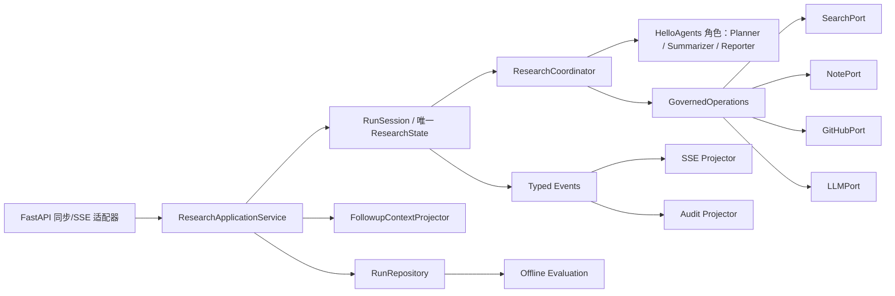

import ArticleVisual from '../../components/ArticleVisual.astro';

# HelloAgents DeepResearch 架构重构分析：让 Harness 回到真实边界

我最近重新审视 `helloagents-deepresearch` 的代码结构时，有一个直觉越来越强：问题不只是“是否应该单独放一个 `harness` 层”，而是当前 Harness 已经演化成了与研究流程并列的第二套执行系统。

更合理的方向不是把 Harness 目录简单删掉，也不是把它整块塞回 `DeepResearchAgent`，而是建立唯一的应用执行主线，把策略、上下文、事件、持久化和评估分别放回它们真正控制的边界。

一句话结论：

> 保留一个权威研究状态和一个执行主流程，让 SSE、审计、评估都成为状态事件的投影，而不是让 Harness 在外层重新猜测和重建状态。

## 一、当前架构的核心问题

### 1. 存在多套相似但语义不同的工作流

当前至少有四条执行链：

- `HarnessRunner.run()`
- `HarnessRunner.stream()`
- `DeepResearchAgent.run()`
- `DeepResearchAgent.run_stream()`

同步研究顺序执行任务，而流式研究使用 daemon 线程并行执行。于是同一个研究请求通过不同 API 时，执行顺序、失败传播和状态时序都可能不同。

这不是普通的代码重复，而是执行语义已经发生分叉。典型位置包括：

<ArticleVisual
  title={"执行语义分叉位置"}
  kicker={"代码边界"}
  kind={"list"}
  lines={[
    "backend/src/agent.py",
    "backend/src/harness/runner.py"
  ]}
/>

### 2. SSE 事件被用来反向重建领域状态

`HarnessRunner.stream()` 会解析 `todo_list`、`task_status`、`sources`、`task_summary_chunk` 等前端事件，再拼回 `SummaryStateOutput`。

这会形成两份状态：

- Agent 内部真实状态
- Harness 根据 UI 事件猜出的状态

更麻烦的是，重建过程会丢失 `retry_count`、`refined_queries`、`notices` 等字段。事件应该是权威状态的只读投影，不能反过来成为状态来源。

### 3. `done` 不代表真正完成

当前时序大致是：

<ArticleVisual
  title={"当前 done 时序"}
  kicker={"事件时序"}
  kind={"flow"}
  lines={[
    "Agent 发送 final_report -> Agent 发送 done",
    "Agent 发送 done -> 前端收到 done 后停止读取",
    "前端收到 done 后停止读取 -> Runner 才开始压缩上下文、评估和保存记录"
  ]}
/>

因此用户在看到“完成”后立即追问时，父运行记录可能还不存在。更严重的是，保存失败可能发生在 `done` 之后，但前端已经不会再看到错误。

更稳的产品定义应该是：

> 运行完成 = 报告生成成功，并且可供立即追问的 snapshot 与 follow-up context 已经耐久保存。

详细 JSONL 审计和质量评分可以异步完成，但 snapshot 不应该滞后于 `run_completed`。

### 4. Policy 没有位于真实副作用边界

目前策略主要在运行入口做预检，但搜索、GitHub、Note、LLM 都可以在更深层直接执行。例如搜索服务会直接调用 `SearchTool.run()`。

这意味着策略无法可靠地做到：

- 在工具执行前阻止副作用
- 对重试、参数和调用次数做限制
- 对每次真实外部操作进行审计
- 正确实现取消、超时和审批

`ToolAwareSimpleAgent` 的 listener 也不能完全解决这个问题，因为 `hello-agents 0.2.9` 的监听器更接近工具调用完成后的通知，不是完整的运行时中间件。

### 5. Harness 包含安全和持久化风险

比较需要先止血的问题包括：

- 完整 `Configuration` 被写入运行快照，可能包含 LLM API Key 和 GitHub Token。
- `run_id` 如果没有严格验证，容易变成文件路径构造风险。
- JSON/JSONL 写入如果没有锁、原子替换或事务，并发运行可能读到半文件。
- `/harness/runs/{run_id}` 如果直接返回完整运行记录，需要考虑身份和 ownership。
- 事件中保存网页全文、报告 chunk、配置等内容，会造成内存和磁盘重复。

这些问题不一定都要在第一天完成重构，但它们应该在大规模迁移前先被隔离。

### 6. 项目没有真正利用框架的 Agent/Tool 边界

`DeepResearchAgent` 当前更像普通业务编排类，不是 `hello_agents.Agent`。它承担的是规划、搜索、总结、报告、并发、重试和状态管理。

项目实际把 hello-agents 主要当成：

- LLM 调用包装
- `SearchTool`、`NoteTool` 等工具集合
- Planner、Summarizer、Reporter 等角色能力

这不一定错误，但命名容易造成错觉：看起来系统已经基于框架运行时构建，实际上核心生命周期仍然是项目自己管理。

## 二、必须尊重的 0.2.9 框架边界

`hello-agents 0.2.9` 是轻量学习版框架，稳定、直接，但它并不提供完整运行时。

它适合利用的部分包括：

- Agent 角色封装
- `HelloAgentsLLM`
- `Tool` 与工具参数
- Agent history
- `SimpleAgent`、`ToolAwareSimpleAgent` 等具体范式

但它没有完整提供：

- Run lifecycle hooks
- RunContext / Session
- 通用 middleware
- 可靠的 async / cancellation
- 标准事件模型
- 持久化与 checkpoint
- 策略授权
- 结构化 tracing

因此，“融入框架”在 0.2.9 下应该理解为：

- 研究角色使用框架 Agent
- 外部能力使用 Tool 或 adapter
- 项目自己的运行上下文围绕公开接口组合
- 不修改框架私有字段，不 fork 框架，不强行继承不匹配的 Agent 接口

我尤其不建议把整个 `DeepResearchAgent` 强行改成框架 `Agent`。框架 Agent 更接近“输入文本、输出文本”的角色，而当前类承担的是完整工作流编排。更准确的名字应该是 `ResearchCoordinator`。

## 三、三种重构路线

| 路线 | 评价 |
| --- | --- |
| 把 Harness 代码直接塞进 `DeepResearchAgent` | 改动最快，但会形成包含策略、线程、持久化、评估和业务逻辑的 God Object，不推荐 |
| 建立唯一应用执行主线，Harness 职责下沉到真实边界 | 推荐。兼容 0.2.9，可以渐进迁移，也不会自建一个过度庞大的框架 |
| 升级 hello-agents 1.x，尽量采用原生生命周期能力 | 值得做独立验证，但不要和业务重构同时进行 |

官方 1.0.0 已加入 tracing、session、异步生命周期、SSE、上下文管理和 lifecycle hooks，确实覆盖了当前 Harness 的一部分目标。不过它也会带来协议和接口变化，所以更适合单独做 migration spike。

我的默认建议是：短期保持 `hello-agents 0.2.9`，完成应用架构重构；同时独立评估 1.x，后续再决定是否替换一部分自建模块。

## 四、推荐的最小目标架构

建议保持模块数量克制，不必马上建立庞大的 DDD 目录：

<ArticleVisual
  title={"推荐目录骨架"}
  kicker={"模块拆分"}
  kind={"diagram"}
  lines={[
    "backend/src/deep_research/",
    "  application.py       # ResearchApplicationService",
    "  domain.py            # ResearchState、RunSession、typed events",
    "  coordinator.py       # 原 DeepResearchAgent 的编排职责",
    "  execution.py         # 公共操作中间件",
    "  ports.py             # Search/Note/GitHub/LLM typed ports",
    "  context.py           # 输入上下文与下一轮上下文",
    "  projections.py       # SSE、审计投影",
    "  adapters/            # hello-agents、文件、GitHub 等适配器",
    "  evaluation/          # 离线评分和 benchmark"
  ]}
/>

现有 `services/` 可以先作为 adapters 使用，不需要一次性移动所有文件。

## 五、现有 Harness 职责如何分解

| 现有职责 | 推荐归属 |
| --- | --- |
| `HarnessRunner` | 缩成兼容 facade，最终由 `ResearchApplicationService` 取代 |
| `RunContext` | 原地演化为 `RunSession`，不要并行创建第三份状态 |
| `_ingest_stream_event()` | 删除；SSE 只能从状态事件投影，不能重建状态 |
| `HarnessPolicy` | 运行级预检放 `CommandPolicy`；操作级授权放真实 Tool/LLM 适配器前 |
| `ContextCompressor` | 拆成 `ResearchContextAssembler` 和 `FollowupContextProjector` |
| `ContextManager` | 删除，一层方法转发没有保留价值 |
| `InMemoryEventBus` | 改为类型化 `ProjectionHub` / `EventSink` |
| `JsonlRunRecorder` | 改为 `RunRepository` 与可选审计投影 |
| `RuleBasedEvaluator` | “报告是否存在”等有效性检查在线保留；质量评分移到离线 |
| `scenarios.py`、`replay.py` | 移至 `evaluation/benchmarks`；当前 replay 实际只是 JSON loader |
| `NoteSubAgent` | 改名为 `NotePort` / `WorkspaceNoteAdapter`，它实际上不是 Agent |
| `DeepResearchAgent` | 改名 `ResearchCoordinator`，保留兼容别名一个发布周期 |

不要设计一个 `execute(kind, dict) -> Any` 的超级网关。Search、Note、GitHub、LLM 应保持各自的类型化接口，只共享统一的中间件语义：

<ArticleVisual
  title={"外部操作的统一治理链路"}
  kicker={"副作用边界"}
  kind={"flow"}
  lines={[
    "authorize -> emit operation_started",
    "emit operation_started -> execute typed operation",
    "execute typed operation -> collect duration/result metadata",
    "collect duration/result metadata -> emit operation_completed / operation_failed"
  ]}
/>

## 六、执行主流程应该只有一份

推荐的唯一执行流程是：

1. `ResearchApplicationService` 接收 `ResearchCommand`。
2. 加载并验证父运行 snapshot。
3. 创建唯一 `RunSession`。
4. `ResearchCoordinator` 规划和执行任务。
5. 每次状态变化先更新 `ResearchState`。
6. 再发布不可变的 typed event。
7. SSE 和审计只是事件订阅者。
8. 生成报告并执行在线终态校验。
9. 生成下一轮 `FollowupContext`。
10. 原子保存必要 snapshot。
11. 最后发布唯一的 `run_completed`。

同步和流式 API 都调用这份流程：

- 同步 API 等待最终结果
- 流式 API 额外订阅 SSE 投影

不能再维护两个独立的研究实现。

## 七、建议明确的架构不变量

至少应写入设计文档和测试：

1. 一个 run 只有一个权威 `ResearchState`。
2. SSE、JSONL、Evaluator 都不能反向修改或重建状态。
3. 状态先提交，事件后发布。
4. 一个 run 最多只能产生一个终态事件。
5. `run_completed` 只能在必要 snapshot 和 follow-up context 耐久保存后发布。
6. 同步和流式接口必须产生相同的最终 snapshot。
7. 所有外部操作都必须经过类型化 port 和操作中间件。
8. 策略检查必须发生在副作用之前。
9. Secret、完整网页正文和完整配置不得进入普通事件和审计记录。
10. 并发必须有上限，不再创建 daemon worker。
11. 每个并行任务使用独立的 hello-agents Agent 实例，不能共享可变 history。
12. 0.2.9 的 LLM 调用无法可靠强制中断；只能在操作前后检查取消和 deadline，不能虚假宣称“已经取消”。
13. 多轮上下文从 snapshot 构建，不从 SSE chunk 或 JSONL 重放。
14. 离线评估只能追加 Assessment，不能修改原始报告和运行终态。

## 八、推荐迁移顺序

### 先止血

开始正式重构前先解决：

- 配置快照脱敏，禁止保存 Key / Token。
- `run_id` 限制为服务端生成并严格验证的 UUID。
- 文件路径做 containment 校验。
- 原子写入并增加锁。
- 吞掉 Agent 内部 `done`，由应用服务在保存成功后发送最终完成事件。
- 父记录不存在时明确返回 404 / 409，不再静默退化成无上下文。
- 修复任务异常时真实 task 状态仍可能是 `in_progress` 的问题。
- 对记录查询接口增加认证和 ownership。

### 第一阶段：建立契约和兼容门面

- 定义 `ResearchCommand`、`ResearchState`、`ResearchEventEnvelope`。
- `RunContext` 原地演化为 `RunSession`。
- 新增 `ResearchApplicationService`。
- 旧 `HarnessRunner` 暂时委托新服务。
- 使用 adapter 保持现有 SSE 字段和 API 响应。
- 增加 `RESEARCH_APPLICATION_V2` run 级开关。

不要让新旧执行路径双跑，否则会重复搜索、LLM 消耗和笔记写入。

### 第二阶段：切换权威状态和执行边界

- `DeepResearchAgent` 演化成 `ResearchCoordinator`。
- 合并 `run()` 与 `run_stream()` 的编排。
- 删除 Harness 的 SSE 状态 reducer。
- 逐个接入 Search、Note、GitHub、LLM typed ports。
- 使用有界 `ThreadPoolExecutor` 替换 daemon threads。
- 加入 deadline、取消检查、幂等 operation ID。
- 拆分输入上下文组装和下一轮记忆投影。

### 第三阶段：清理与收口

- 所有 API 切到 `ResearchApplicationService`。
- `/harness/*` 迁移为 `/runs/*`、`/evaluations/*`。
- 兼容旧 API 和导入一个发布周期。
- 将质量评估移出在线请求。
- 删除旧 Runner、事件 reducer、重复的流式编排。
- 根据并发需求决定继续使用原子文件存储，还是迁移 SQLite。
- 更新前端为带 `schema_version` 的类型化 SSE 协议。

## 九、测试体系也要同步重构

当前测试如果大量使用 fake `hello_agents` 或 fake runner，可能只能证明“路由调用了 fake”，不能证明真实框架集成正确。

重构验收至少应覆盖：

- 同步与流式最终 snapshot 完全一致。
- 收到 `run_completed` 后立即查询和追问一定成功。
- 保存失败时只能产生 `run_failed`，不能先 `completed`。
- 任务异常在 SSE、状态、报告中一致。
- Policy 拒绝时真实工具没有执行。
- 记录中不包含 API Key、Token 和网页全文。
- 路径穿越请求被拒绝。
- 多个并发 run 不会损坏记录、Note 索引和缓存。
- 取消后不再开始新的外部操作。
- 使用真实 `hello-agents==0.2.9` 的契约测试。

另外，依赖版本也要可复现。如果 `pyproject.toml` 固定为 0.2.9，但 lockfile 仍记录 0.2.8，应先修复版本锁定，再开始迁移。

## 十、最终建议

综合来看，我建议采用第二条路线：

> 保留 `hello-agents 0.2.9`，建立唯一的 `ResearchApplicationService + RunSession + ResearchCoordinator` 主线，让旧 Harness 逐步退化为兼容门面并最终删除；同时单独验证 hello-agents 1.x，再决定是否用原生能力替换一部分自建模块。

这条路线的好处是足够克制。它不把所有治理能力粗暴塞进一个大类，也不要求立刻升级框架、重写协议或重做前端。它先解决最核心的问题：系统到底由谁负责运行生命周期，谁拥有权威状态，什么时刻才算真正完成。

只要这个边界立住，后面的策略、审计、评估、重试、取消和多轮上下文都会变得更容易设计。
