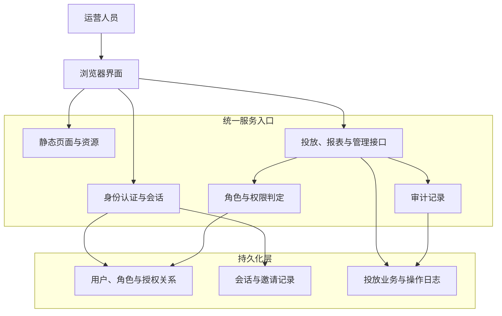
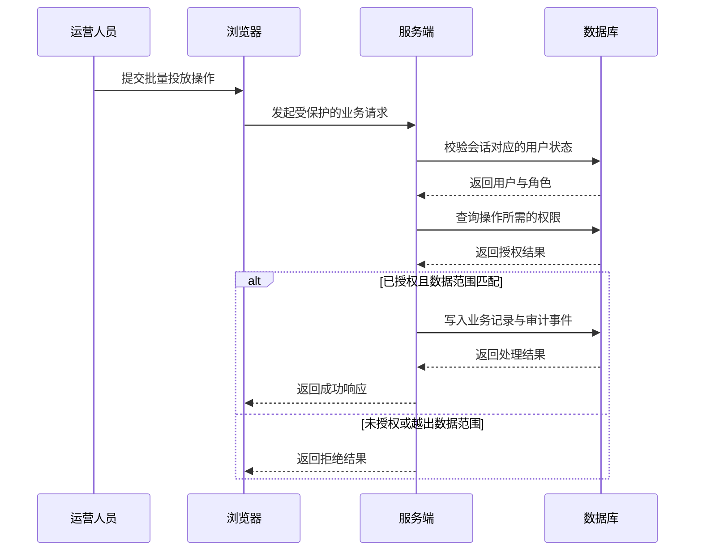
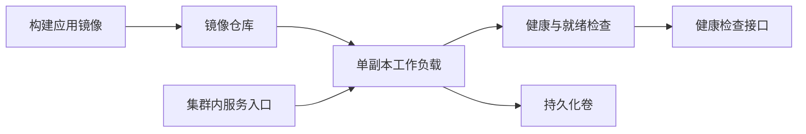

> 本文是经过脱敏的项目复盘：业务名称、组织信息、账号、地址、配置值和具体标识均已移除或泛化。文中重点是可迁移的架构取舍，而非某个系统的实现细节。

智能广告投放平台通常同时面对两类复杂性：一类来自业务，包含多渠道投放、批量任务、素材、报表和自动维护；另一类来自治理，包含登录、角色、数据范围、邀请入驻、审计和部署可靠性。

这篇复盘讨论的系统从一个适合演示的前端原型开始，后来补齐了服务端身份认证、权限控制与持久化。最有价值的经验不是“堆更多功能”，而是先把每一次操作的边界定义清楚：谁可以进入、谁可以修改、谁能看到哪一份业务数据，以及故障时如何恢复。

## 先明确系统的边界

平台将业务能力划为六个区域：总览、渠道投放、自动维护、报表、投放账户与组织管理。渠道侧允许创建和批量维护投放任务；报表侧支持按维度查询、导出与订阅；管理侧承担角色、人员、授权和邀请等治理职责。

原型阶段选择单页界面和本地模拟数据是合理的：页面切换快，演示链路稳定，也能快速验证字段和操作流程。但模拟数据不能承担真实权限边界。进入多人使用阶段后，系统需要让服务端成为身份、授权、数据归属和审计的最终裁决者。

## 总体架构：统一入口，分层处理

系统采用一个轻量服务同时提供静态页面和业务接口。浏览器负责展示、交互和会话状态恢复；服务端负责登录、权限判定、业务记录写入和审计；持久化层保存用户、角色、授权关系、会话记录、邀请记录与业务数据。

这个形态的优势是部署和排障路径短：一个入口即可提供完整体验，健康检查也只需覆盖一个服务。代价是边界容易被代码组织掩盖，因此必须在接口层明确认证、授权、归属校验和审计的顺序。

## 权限边界：界面隐藏不能代替服务端校验

权限设计采用“用户—角色—权限点”的关系模型。用户可拥有一个或多个角色，角色由可配置的权限点组成；权限点按总览、投放、报表、账户、角色、授权与邀请等业务模块划分。

前端根据当前权限集控制菜单、页面入口和操作按钮，这能减少误操作并改善体验；但它只是第一道体验层。真正的安全边界在服务端：每个读写接口都先确认会话，再检查所需权限，最后决定是否允许访问指定资源。

### 当前实现

服务端为业务记录保存创建者与归属信息；读取记录时会按用户范围过滤，更新和批量写入前也会校验归属。返回浏览器的负载会剥离只供服务端判断的内部归属字段。

### 审查推断

这套实现已经把数据级授权放在服务端，而不是只依赖菜单和按钮的隐藏。因此，即使浏览器界面被绕过，直接调用接口仍会经过权限与归属检查。

### 改进建议

继续把“查询、详情、写入”三类入口纳入同一套数据范围策略，并为跨范围访问、批量操作的部分失败和审计记录补充回归测试。这样可以避免新增页面或操作类型时只做界面控制、遗漏服务端约束。

## 身份、邀请与审计形成闭环

### 身份与会话

**当前实现**

平台支持本地账号登录，并提供统一身份源的适配入口。登录后，服务端签发短期访问凭据与可轮换的续期凭据；退出登录或账号停用会撤销相应续期凭据。前端只保存维持会话所需的状态。

**审查推断**

认证材料和账号状态由服务端裁决，避免浏览器承担长期认证材料或最终访问控制职责。

**改进建议**

在接入统一身份源前，为回调来源、失败路径、账号映射规则和凭据轮换建立可测试的约束，并将关键异常纳入审计与监控。

### 邀请与审计

**当前实现**

邀请由具备相应权限的操作者创建，可限定目标角色并设置有效期；使用后会被标记为已消费，管理端也支持撤销。创建、使用和撤销等关键动作会写入审计记录。

**审查推断**

邀请、角色分配和审计被放在同一个治理闭环中，能够将入驻来源与后续权限变更关联起来。

**改进建议**

审计日志应持续只记录操作者、动作类别、目标类型、时间和结果等必要信息，不记录可直接用于登录或访问外部服务的敏感内容；同时应补充邀请到期、重复使用和撤销后的回归用例。

## 数据隔离：从“能显示”升级到“只显示该看的”

### 当前实现

投放、报表和维护功能复用了列表、筛选和批量操作组件。服务端对业务数据保存归属信息，并在查询和写入路径中实施范围控制。

### 审查推断

组件复用提升了开发效率，也意味着一个范围校验遗漏可能影响多个业务模块。现有归属控制为隔离提供了基础，但需要持续覆盖新入口。

### 改进建议

将数据隔离按三类入口持续验收：查询层按可见范围筛选列表、指标和下拉选项；详情层在打开单条记录前再次验证归属；写入层在新建时写入归属，并在更新、删除和批量动作前逐条验证。演示数据只能作为开发便利设施，认证失败时不得回退为全量可见数据。

## 部署路径：先承认单副本约束

早期系统使用嵌入式关系型数据库持久化关键记录。这个选择降低了部署复杂度，但也带来明确限制：同一份数据库文件不适合被多个写入副本同时使用。因此部署必须诚实表达这一事实，而不能仅仅为了“看起来高可用”增加副本数。

### 当前实现

部署清单将写入副本固定为一个，并使用可重建策略避免新旧实例同时写入；数据库目录挂载到持久化卷；服务配置了健康与就绪检查；容器使用普通运行账号，并设置了资源请求与上限。

### 审查推断

这套配置适合单实例、低并发的运行模式，且清楚表达了嵌入式数据库不能安全横向扩展的约束。

### 改进建议

升级前验证备份与恢复；将初始账号策略、邮件配置和外部身份配置放入受管控的运行时配置，不写入镜像或前端资源；当并发写入、多人协作或高可用成为硬性要求时，再迁移到独立的数据库服务，并引入迁移、连接管理和备份演练。

这样可以避免在需求尚未出现时过度设计，也不会把单机方案误当作可水平扩展的架构。

## 测试策略：围绕边界与回归风险

这类平台的测试不应只验证“页面能打开”。更值得优先覆盖的是会造成越权、重复投放或错误通知的路径：

| 层次 | 重点场景 | 预期结果 |
| --- | --- | --- |
| 身份认证 | 登录失败、账号停用、续期、退出 | 无效会话不能继续访问，退出后续期失效 |
| 授权 | 菜单、页面、接口与写操作 | 前端正确引导，服务端最终拒绝越权请求 |
| 数据隔离 | 列表、详情、修改和批量操作 | 只能访问或影响归属范围内的数据 |
| 业务回归 | 批量任务、状态切换、报表订阅 | 操作闭环可重复执行，记录与界面一致 |
| 部署 | 初始化、健康检查、持久化恢复 | 重启后状态可预期，异常实例不接收流量 |

前端回归可以用浏览器模拟环境验证筛选、弹窗、批量动作和抽屉日志等关键交互。服务端单元测试则聚焦身份、邀请、权限及数据隔离。两者结合，才能避免“界面通过了，但接口仍可绕过”的假安全。

## 上线验收与故障演练：把恢复路径变成可执行检查

以下内容是面向同类平台的**改进建议**，不表示本文审阅的系统已经具备这些流程。上线前可用一组小而明确的验收场景确认边界没有被发布改动削弱：以不同角色分别完成正常访问、越权访问和数据范围外访问；对同一批量任务模拟一条成功、一条被拒绝和一次重复提交；再核对界面反馈、接口结果与审计事件是否使用同一个结果口径。这样既能发现“按钮不可见但接口可调用”的遗漏，也能避免批量操作只报告总成功而掩盖局部失败。

故障演练应优先覆盖恢复能力而不是只检查进程是否存活。可以在隔离环境中验证持久化卷不可用、数据库文件损坏前后的备份恢复、服务重启期间的请求处理，以及会话撤销后旧凭据是否仍会被拒绝。每个演练场景都应事先写明触发条件、允许的服务影响、预期告警、恢复负责人和完成判据；演练结束后记录实际恢复步骤与耗时，并据此更新运行手册。对单副本部署而言，尤其要确认发布或重建不会同时出现两个写入者，也要明确维护窗口内用户会看到的状态。

建议把这些检查分为发布前、发布中和发布后三段：发布前校验迁移、备份可读性与运行时配置；发布中观察就绪状态、错误率与审计写入；发布后用最小权限账号做一次冒烟验证，并在约定观察期内关注拒绝率、批量失败率和异常登录。验收记录只保留必要的结论与时间线，不包含账号、凭据或业务数据。这样即使团队成员变动，恢复和回滚也能依赖明确的证据，而不是个人记忆。

## 演进路线：按风险而不是按炫技排序

下一阶段的优化不应优先增加更多渠道或图表，而应按风险收敛：

1. 把所有业务读写统一收口到受保护接口，并为批量操作补齐逐条归属校验。
2. 为审计、会话失效、邀请到期和异常操作建立可查询的监控与告警。
3. 将模拟数据与真实数据访问彻底分离，避免任何认证降级导致数据暴露。
4. 通过数据库迁移、备份恢复演练和外部数据库选型，为多副本运行做准备。
5. 为第三方渠道接入建立独立适配层、失败重试、幂等键和操作回执，避免渠道差异渗透到页面逻辑。

## 结论

智能广告投放平台的难点不在于做出一张看板或一个任务表单，而在于让每一次投放操作都有清楚、可验证的责任边界。单页原型与轻量单体服务可以快速交付，但前提是随着使用范围扩大，及时把认证、授权、数据归属、审计和持久化约束沉到服务端。

先把“谁能做什么、能看到什么、出了问题如何追溯”落实，再扩展渠道、自动化与规模，平台才会从可演示的产品走向可长期运营的系统。
