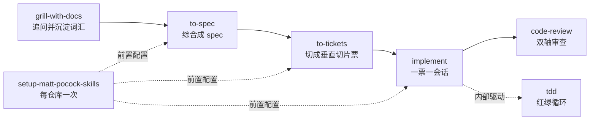

# Matt Pocock 的 Codex Skills 完整使用指南：8 个小白组合

Matt Pocock 的开源仓库 [mattpocock/skills](https://github.com/mattpocock/skills) 收集了他每天实际用于工程的 Agent Skills，口号是 "Skills for Real Engineers"：不靠 vibe coding 碰运气，而是把「想清楚 → 写规格 → 拆票 → 实现 → 审查」变成一套可组合的小工具。

和 GSD、BMAD、Spec-Kit 这类「替你接管整个流程」的方案不同，这套 skills 刻意做得小、可改造、可组合。每个 skill 只负责一个环节，配置写在仓库里，你可以随时查看和改写。

> 本文基于 2026-08-22 的仓库文档整理。仓库仍在快速迭代，名称和行为可能变化；涉及安装时以官方 README 为准。

## 一、这套 Skills 解决什么问题

最常见的问题不是「模型不会写代码」，而是「模型没做你想要的事」：

1. 你和 Agent 对需求的理解不一致，做完才发现方向错了。
2. Agent 太啰嗦，用 20 个词表达一个项目本来有准确词的概念。
3. 没有留档，一次会话结束，所有决定跟着上下文一起消失。
4. 写完没人按「项目自己的规范」和「原需求」双向校验。

这套 skills 的主链路把工程过程拆成五段：

```plaintext
grill-with-docs → to-spec → to-tickets → implement → code-review
```

其中 `tdd` 是 implement 内部的测试引擎，`setup-matt-pocock-skills` 是跑在任何技能之前的一次性初始化，`handoff` 则是独立于主链路、专门用于跨环境交接的工具。

## 二、8 个小白组合和安装提醒

小白组合共 8 个：

| Skill | 一句话作用 |
| --- | --- |
| `setup-matt-pocock-skills` | 每个仓库跑一次，配置 issue tracker、标签、领域文档布局 |
| `grill-with-docs` | 通过持续提问把模糊计划追问清楚，边问边写词汇表和 ADR |
| `to-spec` | 把当前对话综合成一份 spec，发布到 issue tracker，不再访谈 |
| `to-tickets` | 把 spec 切成 tracer-bullet 垂直切片票，声明阻塞关系 |
| `implement` | 一票一会话地实现，驱动 tdd，最后 code-review 并提交 |
| `tdd` | 红绿循环：先写失败测试，再写恰好能通过的实现 |
| `code-review` | 从固定点开始按 Standards 和 Spec 双轴并行审查 |
| `handoff` | 把会话压缩成可移动的交接文档，供另一个 Agent 接手 |

安装时可以用 Matt 官方的方式选择技能，例如通过 `npx skills@latest add mattpocock/skills`，然后勾选这一组。**务必把 `setup-matt-pocock-skills` 一起选上**，否则后面的工程技能会不知道 issue 放在哪里。

### 依赖提醒：这个组合还缺 3 个技能

小白组合本身不能独立工作：

- `grill-with-docs` 的 `SKILL.md` 只有一行：调用 `grilling` 和 `domain-modeling` 两个 Skill。只装它，会出现「一口气问一堆问题、不给建议、也不写 `CONTEXT.md`」的退化行为。
- `tdd` 依赖 `codebase-design` 提供的深模块、接口和 seam 词汇。不装它，确认测试边界时会缺少统一语言。

建议把以下 3 个一起装上：

| 依赖 | 提供什么 |
| --- | --- |
| `grilling` | 设计树访谈：一轮问当前 frontier，每个问题附推荐答案 |
| `domain-modeling` | 术语落地 `CONTEXT.md`，重大决策落地 ADR |
| `codebase-design` | 深模块、interface、seam、adapter 等设计词汇 |

## 三、主链路总览



关键认识：**主链路不是每次都要走完**。

- 功能小到一次会话能做完，直接 `grill-with-docs → implement`，跳过 spec 和 tickets。
- 需要跨多个会话的大功能，才走 `to-spec → to-tickets`。
- `code-review` 既可以作为 implement 的收尾，也可以在任何分支上单独使用。

## 四、`setup-matt-pocock-skills`：每个仓库只跑一次的初始化

### 做什么

它回答三个问题并把答案写成仓库内的配置文件：

1. **Issue tracker 在哪**：GitHub、GitLab、本地 Markdown，还是你自己描述的其他系统。
2. **Triage 标签叫什么**：五个标准角色 `needs-triage`、`needs-info`、`ready-for-agent`、`ready-for-human`、`wontfix` 映射到你的 tracker 里的真实标签。
3. **领域文档放哪**：默认 single-context，根目录一份 `CONTEXT.md` 加 `docs/adr/`；只有检测到 monorepo 才建议多上下文 `CONTEXT-MAP.md`。

它不是一个确定性脚本，而是一个会话式流程：先探索仓库现状，每节给出推荐答案，确认后才写文件。写入位置是 `docs/agents/*.md`，并在已有的 `CLAUDE.md` 或 `AGENTS.md` 里加一个 `## Agent skills` 区块。

### 具体使用技巧

- **每个仓库跑一次**，在新仓库第一次使用其他工程技能之前跑。
- **只有一个文件选择规则**：`CLAUDE.md` 存在就改它，否则改 `AGENTS.md`，不会两个都建。Codex 上如果仓库只有 `CLAUDE.md`，你要手动把区块搬到 `AGENTS.md`。
- **本地 Markdown 是一等公民**，不是降级方案：没有 remote 的个人项目可以直接用 `.scratch/<feature>/issues/*.md`。但用了 GitHub 就别同时用本地 Markdown。
- **它不创建标签**，只写「角色 → 标签字符串」的映射表。新 GitHub 仓库需要你自己先建标签。
- **技能升级后建议重跑一次**：官方模板可能已经变化，下游技能行为怪时先重跑 setup。
- 日常小调整直接改 `docs/agents/*.md`，不需要重跑。

### 怎么算做好

- `docs/agents/issue-tracker.md` 和 `docs/agents/domain.md` 存在（装了 triage 才有 `triage-labels.md`）。
- 你的 harness 真正会读的指令文件里出现了 `## Agent skills` 区块。
- 之后 `/to-tickets` 不再问 issue 放哪里，`/triage` 不再发明标签。
- skill 文件本身没有被改。

## 五、`grill-with-docs`：追问清楚再动手

### 做什么

它像一场「不客气但高效」的访谈，直到你和 Agent 对计划、术语、边界形成共同理解；同时把结果写进仓库。它是**有状态**的：术语一旦定下来，立刻进 `CONTEXT.md`，而不是结束统一写；只有极少数决策会写成 ADR。

### 核心机制

追问以 **design tree** 的形式进行：

1. 每轮只问「当前 frontier」：所有前置条件已确定、现在就能回答的问题。
2. 一轮里把所有 frontier 问题编号，**每个问题都附上推荐答案**。
3. 等你回答后，重算 frontier，再进下一轮。
4. 直到 frontier 为空、没有任何东西还停留在「默默假设」里，会话才算完成。

**事实由 Agent 负责，决定由你负责。** 能从文件系统、代码库、工具查到的事实，Agent 自己查或派子 Agent 查，不拿来问你；但每个真正的选择都要等你确认。

### 落盘规则

| 什么被解决了 | 写到哪 |
| --- | --- |
| 一个术语（项目自己的说法） | `CONTEXT.md`，实时代入，只写词汇，不写实现细节 |
| 一个「难逆转 + 没有上下文会费解 + 真的是权衡过」的决定 | `docs/adr/` 下一份 ADR |
| 其余所有决定 | 只留在当前对话里 |

ADR 是**三条件同时成立**才写：难逆转、未来读者会疑惑、经历过真实替代方案。大多数会话一个 ADR 都不产生，这很正常。

### 具体使用技巧

- 适用于「一个会话能定下来的单次变更」。大到一个会话装不下的项目，Matt 建议用 `wayfinder`，不要硬套。
- `grill-with-docs` 结束时不要急着清空或压缩上下文，下一步是同一会话里的 `to-spec`。
- 检查依赖是否真的加载：如果它一口气问所有问题、不给推荐答案、也不提 `CONTEXT.md`，说明 `grilling` 或 `domain-modeling` 没装上。
- 若发现它说写了文件但仓库里没有，可能是跑在别的编排层里，文件写入被吞了；结束后到工作目录确认。
- 对已经存在但没有任何领域文档的仓库，也可以直接说「帮我梳理这个仓库」，让它边读代码边问。

### 怎么算做好

- `CONTEXT.md` 在会话**过程中**逐词更新，而不是最后一次性出现。
- 术语表是纯粹的词汇，没有 spec 式长文。
- 代码库能回答的问题都去读代码，不问人。
- ADR 很少或没有，有的话都是「不想再重新吵一遍」的决定。
- 它还会质疑你：你说「取消」和你仓库里已有定义不一致时，它会当场指出。

## 六、`to-spec`：不访谈，只把已决定的写下来

### 做什么

把**已经谈完**的会话综合成一份 spec 并发布到 issue tracker。它的前提是决定已经做完，所以它**不访谈、不新增决定、不重新设计**；对话里从没说过的东西出现在 spec 里就是缺陷。

### 什么时候用它

| 情况 | 去向 |
| --- | --- |
| 还没想清楚 | 先 `grill-with-docs` |
| 想清楚了，一次会话做得完 | 直接 `implement`，跳过 spec |
| 想清楚了，但要跨多个会话 | `to-spec`，然后 `to-tickets` |

### 先定 seams，再写正文

动笔之前它先画出**测试边界**并和你确认：

- 优先用已经存在的 seam，不要随便造新 seam。
- 取能取到的最高层 seam。
- 理想情况是整个变更只有一个 seam。

这一步很重要：`tdd` 只允许在预先约定的 seam 写测试，`code-review` 也会检查是否用到了约定之外的 seam。边界在这里谈崩，成本最低。

### Spec 模板要点

写完后按模板发布为一条 issue，并打上 `ready-for-agent` 标签：

- **Problem Statement**：从用户视角描述问题。
- **Solution**：从用户视角描述方案。
- **User Stories**：非常长、编号、尽量覆盖所有方面的用户故事。
- **Implementation Decisions**：模块、接口、架构、schema、API 契约等决定。**不写具体文件路径和代码片段**，除非原型里有一段比 prose 更精确的状态机、schema 或类型形状。
- **Testing Decisions**：什么算好测试、测哪些模块、仓库里有什么先例。
- **Out of Scope**：明确拒绝的东西。
- **Further Notes**：补充说明。

### 具体使用技巧

- **不要在 `to-spec` 和 `to-tickets` 之间清空或压缩上下文。** 大 spec 从 issue 重新抓取容易截断，同一窗口连续跑最稳。
- 你重点该看的是 **seams 和 out-of-scope** 两节，这两个地方错了最便宜。
- spec 会随时间过期，实现阶段学到的东西应该进 `CONTEXT.md` 和 ADR，而不是改 spec。
- 重构、模块边界类工作不适合满是用户故事的模板，多靠 Implementation Decisions 和 Testing Decisions。
- `ready-for-agent` 标签表示「不再需要 triage」，不是「让 AFK Agent 一次把整个 spec 干完」。如果你的 Agent 会扫这个标签，记得排除父 spec，只让它拿 tickets。

### 怎么算做好

- 一开始就动笔，而不是又来一轮问题。
- 写之前把 seams 摆给你，而且尽量少。
- 用项目自己的名词，不是通用产品经理套话。
- 每一条决定你都记得「确实说过」。
- Out of Scope 里有真东西：拒绝掉的内容往往最值钱。

## 七、`to-tickets`：切成一条条可执行的票

### 做什么

把 plan、spec 或当前对话切成 **tracer-bullet 垂直切片**：每条票都从 schema、API、UI 到测试完整打通一小条路径，独立可演示；每条票都声明**被谁阻塞**；每条票都小到能在一个全新上下文窗口里做完。

### 流程

1. 读取 spec 或对话，必要时先探索代码库。
2. 找机会 **prefactor**："Make the change easy, then make the easy change."，前置重构排在最前。
3. 起草垂直切片列表。
4. **先给你看编号列表**，每个票包含标题、Blocked by、交付什么行为，然后问你：粒度合适吗？阻塞边对吗？要不要合并或拆分？批准前不发布。
5. 按依赖顺序发布：本地 Markdown 就 `.scratch/<feature>/issues/<NN>-<slug>.md` 一票一文件；真实 tracker 就用原生阻塞或子 issue 关系，全部打 `ready-for-agent`。
6. 之后从 **frontier** 开始做：所有 blocker 都完成的票，可以先抓。

### 最容易踩的坑

- **按层切片是最大的失败模式**：所有 schema 一张票、所有 API 一张票，集成放在最后。检查方法：问每张票「完成时我能演示什么？」答不出来就是水平切片。
- **过度拆分**是常见摩擦：一个三行改动拆出十二张票。直接在确认环节要求合并；如果整个改动一个窗口做得完，根本不需要这个 skill。
- **验收标准要能在起始 commit 上是失败的**。如果目标是「改 A」，而验收标准在改之前就成立，它什么都没验证。
- **票里不写文件路径和行号**（原型给出的少数精确片段除外），否则很容易过期。
- 父 spec 不要关、不要改；票是「可丢弃的执行步骤」，spec 才是决定记录。

### 宽重构例外：expand/contract

重命名列、重打一个共享类型这种 blast radius 横跨全库的机械改动，无法切成垂直切片，用三步：

1. **Expand**：新形态和老形态并存，什么都不破坏。
2. **Migrate**：按目录或包分批迁移调用点，每批一张票，被 Expand 阻塞。
3. **Contract**：所有调用点迁完后删掉旧形态，被所有 migrate 批次阻塞。

### 怎么算做好

- 每张票都答得出「完成时能演示什么」，答案是一个行为，不是一个层。
- 列表先带着 Blocked by 回到你面前。
- 第一张票没有 blocker，可以立刻开始。
- 票体里没有文件路径或行号（原型片段除外）。
- 每张票看起来像「全新会话没有你在场也能做完」。
- 前置重构排在依赖顺序最前面。

## 八、`implement`：一票一会话，绝不重开设计

### 做什么

实现一件**已经决定好**的工作。它不访谈、不再提议另一套方案，只会：读 ticket 或 spec → 在约定 seam 驱动 tdd → 频繁类型检查和单测 → 最后跑一次全量测试 → code-review → 提交到当前分支。

### 一次运行的五拍

1. 读 ticket/spec，确认要构建什么，确定 seams。
2. 在预先约定的 seam 上做 tdd，一次一个红绿切片。
3. 过程中频繁跑类型检查、频繁跑单个测试文件。
4. 结尾跑一次完整测试套件。
5. 跑 code-review，然后提交到当前分支。

### 具体使用技巧

- **一个 invocation 只做一张票**，一张票一个全新会话，做完清空再下一张。并行跑多个 implement 会话会共用同一个工作目录、index 和 HEAD，容易互相踩到提交。
- **先确认自己在想提交的分支上**。它不会创建分支，直接 commit。
- **它不会关 ticket，也不会勾验收框**。`to-tickets` 的 frontier 依赖 blocker 关闭，所以记得自己关票，否则依赖链永远解不开。
- 引用票时用完整引用（issue URL 或 `owner/repo#2`），并让它先回读标题。裸 `#2` 在新会话里可能解析到别的编号列表。
- 一张不简单的票烧掉 100k+ tokens 是正常的。如果一张票总是撑爆上下文，回上游把票拆小，而不是提高 effort。
- **先提交再审查**。code-review 只能看到 `git diff <固定点>...HEAD`，未提交的工作区改动静音不可见。

### 怎么算做好

- 会话开场是「回读 ticket 并复述要做什么」，而不是问你要做什么。
- 运行记录里能看到真实的 `/tdd` 调用，而不只是 diff 里出现了测试。
- 类型检查和单测反复出现，全量套件在结尾出现一次。
- 没有你催促，它自己完成了 commit。
- diff 恰好是一张票的量：贯穿所有层的垂直切片，而不是多张票混在一起。

## 九、`tdd`：红绿循环是引擎，不是仪式

### 做什么

先写一个失败的测试，再写恰好能通过的实现，然后下一个行为。它同时是一份「什么值得保留的测试」的规范，用来防止三件事：和实现细节耦合、同义反复、水平切片。

### 核心规则

- **没有预先约定的 seam，不写任何测试。** 写测试前先列出要在哪些公开边界测试，等你确认。测试精力有限，seam 要花在关键路径和复杂逻辑上，不是每个边角。
- **Red before green**：测试先红，然后只写足够让它绿的代码，不提前做下一个测试的储备。
- **一次一个垂直切片**：一个 seam、一个测试、一个最小实现，循环往复。
- **重构不属于循环。** 作者在 2026 年 6 月移除了 refactor 阶段，因为 Agent 几乎不执行它；重构交给独立的 code-review。

### 什么样的测试是好测试

- 通过**公开接口**验证行为，不摸内部结构。
- 名字读起来像能力：「用户可以用有效购物车结账」，而不是「checkout 调用了 paymentService.process」。
- 断言里的期望值是**独立的字面量或已知结果**，不是用和实现同样的方式重算出来的值。
- 内部重命名时测试不该碎。
- 优秀测试范例：

~~~typescript
// GOOD: 测试可观察行为
test("user can checkout with valid cart", async () => {
  const cart = createCart();
  cart.add(product);
  const result = await checkout(cart, paymentMethod);
  expect(result.status).toBe("confirmed");
});

// BAD: 测试实现细节
test("checkout calls paymentService.process", async () => {
  const mockPayment = jest.mock(paymentService);
  await checkout(cart, payment);
  expect(mockPayment.process).toHaveBeenCalledWith(cart.total);
});
~~~

### Mock 只出现在系统边界

允许 mock：外部支付、邮件、时间、随机性、数据库（有时）、文件系统（有时）。**禁止 mock 自己的模块和内部协作者。** 设计上让外部依赖通过参数注入，而不是在函数内部 new 出来；每个外部操作最好是一个独立的小函数，而不是一个带条件逻辑的通用 fetch。

### 依赖与坑

- 它依赖 `codebase-design`，用于深模块、interface、seam 的共享词汇。
- 浏览器端或 e2e 测试不适合先写：反馈循环太慢，通常等行为先工作再补。
- 它是参考规范，不是驱动器：`implement` 才会真正跑会话。单独用时，你直接 `/tdd`。

### 怎么算做好

- 在第一个测试文件出现前，它先停下来列出 seam 并等你确认。
- 测试是一个一个出现的：红一个、绿一个、再下一个，不是一批测试加一批代码。
- 重命名内部函数，套件不破。
- mock 只出现在外部边界，从不包住你自己的模块。

## 十、`code-review`：双轴并行审查，不合并结论

### 做什么

审查 `HEAD` 与一个固定点之间的 diff，沿两条轴独立进行：

- **Standards**：这段代码符合仓库记录的编码标准吗？
- **Spec**：这段代码忠实实现了来源 issue/spec 要的东西吗？

两条轴分别跑在**独立的并行子 Agent** 中，互不污染上下文，最后并排聚合报告，不合并、不重新排序。因为一个变更可以「标准全对但做错事」，也可以「完全按需求但违反规范」；合并会掩盖其中一轴。

### 流程

1. **你提供固定点**（commit、分支、tag、`main`、`HEAD~5`）。它先 `git rev-parse` 确认引用存在、diff 非空，再开子 Agent。
2. 找 spec 来源：commit message 里的 issue 引用 → 你传入的路径 → `docs/`、`specs/`、`.scratch/` 里匹配分支名的文件 → 问你。找不到就明确说「no spec available」，不瞎编需求。
3. 找 standards 来源：`CODING_STANDARDS.md`、`CONTRIBUTING.md` 等；仓库没写就用内置的 12 个 Fowler code smell 基线。
4. 两个子 Agent 并行跑，各自限 400 词。
5. 聚合：`## Standards` 和 `## Spec` 两个独立区块，最后一行只报每轴最严重的问题，不挑整体冠军。

### 具体使用技巧

- **固定点必须自己给**，否则它会反问；别让它猜。
- **先在最新提交上跑，不要审未提交工作**。diff 是 `git diff <点>...HEAD`，staged 和 working tree 都看不见。可以先 commit，再 amend 或补 fixup。
- **最好开全新会话审**：同一个既写代码又审查的会话，是确认偏误，不是审查。
- 每张票审一次，最后再对分支点做一次总审，能同时抓住单票问题和票间交互问题。
- **不要无脑采纳子 Agent 结论**：它是假设不是证据，每条都要带引用（标准文件加规则、smell 加 hunk、spec 加行号），先核对再行动。
- **不要反复跑到零问题为止**：修复会产生新表面，judgement call 也不稳定。拿到带硬规则引用的线索，改完就停。

### 已知坑

- 子 Agent 可能再次发现 `/code-review` 并递归开更多 Agent（有人见过 50+ 个）。自己 fork 时在两个 brief 里加一行「禁止再调 code-review 或派生 Agent」。
- 它和 Claude Code 内置 `/code-review` 重名，行为不同（内置的是查 bug，这是查规范和需求）。
- 12 个 smell 永远是 judgement call，仓库文档覆盖内置基线。

## 十一、`handoff`：只用于「要移动」的交接

### 做什么

把当前会话压缩成一份**便携交接文档**，写到操作系统临时目录，而不是工作区。它买的是可移动性，不是压缩：给另一个完全看不到你上下文的 Agent 一个能冷读的起点。

### 四种触发场景

`/handoff` 只在下列情况用，其他情况用 compact：

| 场景 | 为什么需要文件 |
| --- | --- |
| 换 harness（Claude → Codex 等） | 新环境看不到旧上下文 |
| 换目录或仓库（原型目录很常见） | 文件需要自己上路 |
| 交给同事 | 对方需要一份人能读的东西 |
| 分叉一个侧面任务 | 你继续主线，另一个 Agent 拿走副本 |

### 文档里有什么

- 在途工作：正在做什么、为什么、下一步是什么。
- `suggested skills` 段落：下一个 Agent 应该调用哪些 Skill。
- 已经写进 spec、plan、ADR、issue、commit、diff 的内容**只引用路径或 URL，不复制正文**。
- key、token、密码等敏感信息一律脱敏。

### 具体使用技巧

- 调用时传一句「下一个会话要做什么」，文档会按这个目标裁剪，而不是平铺全部历史。
- 普通续跑（同 harness、同目录、还留在同一件事里）用 compact，别用 handoff。
- **交付前自己读一遍**，把「只是猜的」降级成假设。新的 Agent 会把文件当合同执行，不会复核。
- 临时目录可能被环境清理（Codex 有这个情况）。如果下一个会话不是马上开始，自己把文件复制到持久位置；文档引用的其他临时文件也要一起带走。
- 交给新 Agent 时让它**读文件路径**，不要把摘要塞进命令行插值，反引号和 `$(...)` 会被 shell 弄坏。

### 怎么算做好

- 文档只占对话的一小部分，已落盘的东西以路径和 URL 出现。
- 不打开原会话也能冷读并知道下一步。
- 新 Agent 直接开始干活，而不是让你重新解释一遍。
- 分叉场景下，你的原会话还完好地停在那里。

## 十二、小白第一次上手路线

建议按这个顺序走一遍，先选一个**真正的小功能**：

1. 选择一个仓库，运行一次 `setup-matt-pocock-skills`，把 issue tracker、标签、文档布局配好。
2. 补装 `grilling`、`domain-modeling`、`codebase-design`，确认三个依赖真的加载。
3. 对这个小功能跑 `grill-with-docs`，把术语和边界谈清楚；不要跳步。
4. 如果功能大到一个会话做不完，紧接着 `to-spec` → `to-tickets`；如果很小，直接 `implement`。
5. 用 `implement` 一次做一张票，确认 tdd 真的出现在运行记录里。
6. 写完 `code-review`：先在最新提交上，开新会话，给出固定点。
7. 只有换环境、换目录、交给别人或分叉任务时才用 `handoff`。

### 快速选择表

| 你的状态 | 用哪个 |
| --- | --- |
| 还没想清楚 | `grill-with-docs` |
| 想清楚了，一次会话能做完 | `implement` |
| 想清楚了，要跨多个会话 | `to-spec` + `to-tickets` + `implement` |
| 写完想检查对错 | `code-review` |
| 要换环境或交接 | `handoff` |
| 新仓库第一次用 | `setup-matt-pocock-skills` |

## 常见坑速查

| 现象 | 原因和做法 |
| --- | --- |
| `grill-with-docs` 一口气问一堆问题 | `grilling` 或 `domain-modeling` 没加载，检查依赖 |
| 跑完没有任何文档文件 | 可能在编排层里文件写入被吞，去工作目录确认 |
| spec 和 tickets 之间一压缩就读不全 | 不要清空或压缩，同一窗口连续跑 |
| 票全是一层一层切的 | 问「完成时能演示什么」，答不上来就是水平切片 |
| implement 不关 ticket、不勾选框 | 正常行为，自己收尾 |
| code-review 说看不到改动 | 还没 commit；先提交再审 |
| handoff 文件找不到 | 在系统临时目录，跨环境前自己复制到持久位置 |

这套 skills 的价值不在「多会写代码」，而在把决定、词汇、测试边界和审查标准变成仓库里可检查、可重放的文件。装上之后，先在小项目上把一个完整链路走通，再逐渐改造成适合自己团队的版本。

官方仓库：[mattpocock/skills](https://github.com/mattpocock/skills)
