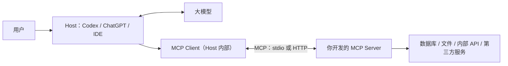

# 从零开发 MCP：新手完整实战指南

开发 MCP，通常意味着构建一个 MCP Server：把数据库、文件、内部系统或第三方 API，包装成 AI 可以发现和调用的工具。

对新手最稳妥的路线是：

> Python + 官方 SDK v1 → 本地 stdio → MCP Inspector 测试 → 接入 Codex → 再升级为远程 Streamable HTTP → 最后增加鉴权、部署和监控。

本文以 Windows PowerShell 和 Codex 客户端为例，从概念、编码、测试一路讲到生产部署。

## 一、先理解 MCP 到底是什么

MCP 全称 Model Context Protocol。它是 AI 应用连接外部数据和工具的协议，不是一个模型，也不是 OpenAI API 的替代品。

一个最小 MCP Server 本身不需要 OpenAI API Key。只有当你的工具内部还要调用 OpenAI API 时，才需要对应密钥。



三个核心角色：

- Host：用户使用的 AI 应用，例如 Codex。
- Client：Host 内部负责连接某个 MCP Server 的协议客户端。
- Server：你开发的程序，提供工具和数据。

正常调用流程是：

1. Codex 启动或连接 MCP Server。
2. 双方协商协议版本和能力。
3. Codex 通过 `tools/list` 获取工具列表。
4. 模型根据用户请求选择工具。
5. Host 根据安全策略决定是否请求用户批准。
6. Client 发送 `tools/call`。
7. Server 执行业务逻辑，返回结果。
8. 结果进入模型上下文，模型组织最终回答。

MCP 基于 JSON-RPC 2.0，但使用官方 SDK 后，你通常不用自己拼 JSON-RPC 消息。[MCP 架构说明](https://modelcontextprotocol.io/docs/learn/architecture)

## 二、Tool、Resource、Prompt 有什么区别

| 能力 | 用途 | 一般由谁决定使用 | 例子 |
|---|---|---|---|
| Tool | 执行查询、计算或操作 | 模型提出调用，Host 可审批 | 查订单、创建工单、发消息 |
| Resource | 提供被动、通常只读的上下文 | Host/Application | 文档、数据库结构、配置说明 |
| Prompt | 可复用的提示模板 | 用户显式选择 | 代码审查模板、周报模板 |

协议方法分别是：

- Tool：`tools/list`、`tools/call`
- Resource：`resources/list`、`resources/templates/list`、`resources/read`
- Prompt：`prompts/list`、`prompts/get`

不同 Host 对 Resource 和 Prompt 的展示方式可能不同。因此如果主要接入 Codex，第一版应把核心功能设计为 Tool；Resource 和 Prompt 作为补充。[MCP Server 概念](https://modelcontextprotocol.io/docs/learn/server-concepts)

## 三、什么时候应该用 MCP

适合 MCP：

- 查询实时数据库。
- 调用企业内部 API。
- 读取当前项目、日志、工单、监控数据。
- 创建、更新、删除外部对象。
- 让多个 AI 客户端复用同一套工具。

不一定需要 MCP：

- 只是给 Codex 一些固定说明：用 `AGENTS.md` 或 Skill。
- 只是一次性脚本：直接写脚本更简单。
- 需要给普通前端、移动端和其他服务共同调用：先设计普通 REST/API，再在外面加一层薄 MCP 适配器。
- 只是固定提示词：用 Prompt 或 Skill。

## 四、当前版本必须特别注意

截至 2026-07-27：

- 当前正式 MCP 规范仍是 `2025-11-25`。
- `2026-07-28` 规范尚处于 RC/draft。
- Python SDK v2、TypeScript SDK v2 仍是预发布版本。
- Python v1.x 仍是官方生产推荐版本。

因此本教程固定使用：

```plaintext
mcp>=1.27,<2
```

不要把 Python SDK `main` 分支中的 v2 `MCPServer` 示例，和本教程的 v1 `FastMCP` 混用。即使你在 7 月 28 日以后阅读，也建议先按锁定版本完成第一版，再单独阅读迁移指南。[官方版本说明](https://modelcontextprotocol.io/docs/learn/versioning)、[Python SDK](https://github.com/modelcontextprotocol/python-sdk)

## 五、编码前先做需求设计

不要一上来写几十个工具。先填写下面这份清单：

```plaintext
用户目标：
数据来自哪里：
需要哪些读操作：
需要哪些写操作：
每个操作的输入：
每个操作的输出：
谁有权限执行：
是否有副作用：
是否可重试：
失败时如何恢复：
```

例如工单系统可以设计成：

```plaintext
ticket_search(query, status, limit)
ticket_get(ticket_id)
ticket_create(title, description, idempotency_key)
ticket_update(ticket_id, expected_version, fields)
```

设计原则：

- 一个 Tool 只做一个清楚的动作。
- 查询和写入分开。
- 不要做一个包含十几种 `action` 的万能工具。
- 输出包含稳定 ID，方便后续工具继续使用。
- 写操作最好支持 `idempotency_key`，防止重试时重复创建。
- 删除、付款、发送消息等高风险操作应支持“预览→确认→执行”。
- 权限必须在 Server 端验证，不能依赖模型自觉。
- 工具描述必须写明“什么时候使用、什么时候不要使用”。

OpenAI 的 MCP 指南同样建议从具体用户目标出发，为每个独立动作设计专门工具。[OpenAI MCP Server 指南](https://developers.openai.com/plugins/build/mcp-server)

## 六、选择传输方式

| 传输方式 | 使用场景 | 特点 |
|---|---|---|
| stdio | 本机开发、Codex CLI/桌面端 | 无端口，Host 启动子进程，最适合新手 |
| Streamable HTTP | 远程、多人、生产服务 | 独立部署，需要 HTTPS、鉴权、限流 |
| 旧 HTTP+SSE | 旧客户端兼容 | 新项目不要首选 |

第一版使用 stdio。等工具完全工作后，再切换到 Streamable HTTP。[MCP 传输规范](https://modelcontextprotocol.io/specification/2025-11-25/basic/transports)

## 七、准备开发环境

推荐使用 `uv`，它负责 Python、虚拟环境、依赖和锁文件。

安装：

```powershell
winget install --id=astral-sh.uv -e
```

关闭并重新打开 PowerShell，然后执行：

```powershell
uv --version
uv python install 3.12
uv init mcp-beginner
Set-Location mcp-beginner
uv python pin 3.12
uv add "mcp[cli]>=1.27,<2"
uv run python --version
uv run mcp --help
```

官方 Python SDK 要求 Python 3.10+；这里选择 3.12，兼容性通常更稳。[uv Windows 安装说明](https://docs.astral.sh/uv/getting-started/installation/)、[Python SDK v1](https://github.com/modelcontextprotocol/python-sdk/tree/v1.x)

这些命令会生成：

```plaintext
mcp-beginner/
├── .python-version
├── pyproject.toml
├── uv.lock
└── main.py
```

`uv.lock` 应提交到 Git，保证其他机器安装相同版本。

MCP Inspector 依赖 Node/npm/npx。若后续出现“找不到 npx”或 Node 版本错误，请安装 Inspector README 当前要求的 Node 版本；截至本文版本时要求 Node 22.7.5+ 的 22.x 版本。[MCP Inspector](https://github.com/modelcontextprotocol/inspector)

## 八、编写第一个完整 MCP Server

在项目中创建 `server.py`：

```python
import sys

from mcp.server.fastmcp import FastMCP
from mcp.types import ToolAnnotations


READ_ONLY = ToolAnnotations(
    readOnlyHint=True,
    destructiveHint=False,
    openWorldHint=False,
)


mcp = FastMCP(
    "beginner-demo",
    instructions=(
        "这是一个只读演示服务器。"
        "整数加法使用 add_numbers；文本统计使用 text_stats。"
        "所有工具都不会访问网络或修改外部状态。"
    ),
    # 下面两个配置只影响 HTTP 模式，方便以后切换。
    stateless_http=True,
    json_response=True,
)


@mcp.tool(annotations=READ_ONLY)
def add_numbers(a: int, b: int) -> dict[str, int]:
    """将两个整数相加。仅在用户明确要求整数加法时使用。"""
    return {"result": a + b}


@mcp.tool(annotations=READ_ONLY)
def text_stats(text: str) -> dict[str, int]:
    """统计文本字符数和按空白切分的单词数。最大支持 100000 个字符。"""
    if len(text) > 100_000:
        raise ValueError("text 不能超过 100000 个字符")

    stripped = text.strip()

    return {
        "characters": len(text),
        "words": len(stripped.split()) if stripped else 0,
    }


@mcp.resource("demo://about")
def about() -> str:
    """返回该 MCP Server 的说明。"""
    return "这是使用官方 Python MCP SDK 构建的入门示例。"


@mcp.prompt()
def explain_topic(topic: str, level: str = "beginner") -> str:
    """生成一个解释某个主题的可复用提示模板。"""
    if level not in {"beginner", "advanced"}:
        raise ValueError("level 必须是 beginner 或 advanced")

    return (
        f"请面向 {level} 水平的读者解释 {topic}，"
        "包含定义、一个具体例子和三个常见误区。"
    )


if __name__ == "__main__":
    transport = (
        "streamable-http"
        if "--http" in sys.argv[1:]
        else "stdio"
    )
    mcp.run(transport=transport)
```

这段代码中：

- `FastMCP` 处理协议、初始化、Schema 和消息分发。
- `@mcp.tool()` 把普通 Python 函数注册成工具。
- 参数类型会生成输入 JSON Schema。
- 返回类型会生成结构化输出信息。
- 函数文档字符串会成为 Tool 描述。
- `instructions` 是整个 Server 的使用说明。
- Codex 建议其前 512 个字符能独立表达最重要的规则。
- `ToolAnnotations` 描述工具风险，但只是提示，不是安全机制。
- 没有手写 JSON-RPC。
- 默认运行 stdio；加 `--http` 后运行 HTTP。

## 九、使用 Inspector 调试

执行：

```powershell
uv run mcp dev server.py:mcp
```

它会启动 MCP Inspector。

在 Inspector 中依次检查：

1. 初始化是否成功。
2. Server instructions 是否正确。
3. Tools 是否出现 `add_numbers` 和 `text_stats`。
4. 调用 `add_numbers`：

```json
{
  "a": 2,
  "b": 3
}
```

应该返回：

```json
{
  "result": 5
}
```

5. 测试非法输入：

```json
{
  "a": "abc",
  "b": 3
}
```

应该被 Schema 拒绝。

6. 在 Resources 中读取：

```plaintext
demo://about
```

7. 在 Prompts 中调用 `explain_topic`。

还要测试：

- 缺少必填参数。
- 空字符串。
- 最大长度。
- 不支持的枚举值。
- 重复调用。
- 多个并发调用。
- 外部 API 超时和失败。

如果直接运行：

```powershell
uv run server.py
```

终端看起来“卡住”是正常现象。stdio Server 正在等待 Host 通过 stdin 发送协议消息。

特别注意：stdio 模式绝不能用普通 `print()` 向 stdout 输出日志，否则会破坏 JSON-RPC。日志应使用 `logging` 或输出到 stderr。[官方调试指南](https://modelcontextprotocol.io/docs/tools/debugging)

## 十、增加自动化测试

安装测试工具：

```powershell
uv add --dev pytest ruff
```

创建 `tests/test_server.py`：

```python
import pytest

from server import add_numbers, text_stats


def test_add_numbers() -> None:
    assert add_numbers(2, 3) == {"result": 5}


def test_text_stats() -> None:
    assert text_stats("hello MCP") == {
        "characters": 9,
        "words": 2,
    }


def test_text_too_long() -> None:
    with pytest.raises(ValueError):
        text_stats("x" * 100_001)
```

运行：

```powershell
uv run pytest -q
uv run ruff check .
```

测试分成三层：

- 单元测试：直接测试业务函数。
- 协议测试：通过 Inspector 调用 Tool。
- Host 集成测试：在 Codex 中通过自然语言触发工具。

## 十一、接入 Codex

### 方法一：CLI 添加

将路径替换为你项目的绝对路径：

```powershell
codex mcp add beginner-demo -- uv --directory "C:/Users/你的用户名/code/mcp-beginner" run server.py
```

检查配置：

```powershell
codex mcp list --json
codex mcp get beginner-demo --json
```

然后重启 Codex，在聊天中输入：

```plaintext
请使用 beginner-demo 的 add_numbers 工具计算 17 + 25，并告诉我工具返回的原始结果。
```

在 Codex TUI 或桌面端聊天框中可以使用：

```plaintext
/mcp
```

查看连接状态。

配置为 stdio 后，不需要提前运行 `server.py`。Codex 会自动启动它。

### 方法二：config.toml

编辑用户级 `~/.codex/config.toml`，或者可信项目中的 `.codex/config.toml`：

```toml
[mcp_servers.beginner_demo]
command = "uv"
args = ["run", "server.py"]
cwd = "C:/Users/你的用户名/code/mcp-beginner"
enabled = true
required = false
startup_timeout_sec = 20
tool_timeout_sec = 60
default_tools_approval_mode = "prompt"
```

第一次开发建议：

- `required = false`：Server 失败时不要阻止整个 Codex 启动。
- `default_tools_approval_mode = "prompt"`：每次工具调用都能看到审批。
- 路径使用绝对路径。
- Windows TOML 路径推荐使用 `/`，避免反斜杠转义。

ChatGPT 桌面端、Codex CLI 和 IDE Extension 在同一 Codex Host 上共享 MCP 配置，但 ChatGPT 网页端不会读取你的本地 `config.toml`。[Codex MCP 配置](https://developers.openai.com/codex/mcp/)

删除本地配置：

```powershell
codex mcp remove beginner-demo
```

官方没有通用的 `codex mcp test` 命令。配置检查使用 `list/get`，实际连接检查使用 `/mcp`。[Codex CLI reference](https://developers.openai.com/codex/cli/reference/#codex-mcp)

## 十二、切换为 Streamable HTTP

运行：

```powershell
uv run server.py --http
```

默认地址：

```plaintext
http://127.0.0.1:8000/mcp
```

另开一个终端：

```powershell
npx -y @modelcontextprotocol/inspector
```

选择 Streamable HTTP，填入：

```plaintext
http://127.0.0.1:8000/mcp
```

也可以用 Inspector CLI：

```powershell
npx -y @modelcontextprotocol/inspector --cli http://127.0.0.1:8000/mcp --transport http --method tools/list
```

调用工具：

```powershell
npx -y @modelcontextprotocol/inspector --cli http://127.0.0.1:8000/mcp --transport http --method tools/call --tool-name add_numbers --tool-arg a=2 --tool-arg b=3
```

接入 Codex：

```powershell
codex mcp add beginner-demo-http --url http://127.0.0.1:8000/mcp
```

生产环境则应配置成：

```toml
[mcp_servers.company_mcp]
url = "https://mcp.example.com/mcp"
auth = "oauth"
scopes = ["tickets:read", "tickets:write"]
default_tools_approval_mode = "writes"
enabled = true
required = false
```

OAuth 登录：

```powershell
codex mcp login company_mcp
```

如果是单一服务 Token，可以使用：

```toml
[mcp_servers.company_mcp]
url = "https://mcp.example.com/mcp"
bearer_token_env_var = "COMPANY_MCP_TOKEN"
```

这里填写的是环境变量名称，不是 Token 本身。

## 十三、连接真实 API 的正确方式

推荐把项目拆成两层：

```plaintext
MCP 层：定义工具、Schema、结果格式
业务层：调用数据库/API、做权限校验、处理事务
```

不要把所有逻辑直接堆在装饰器函数中。

项目扩大后可以改成：

```plaintext
mcp-beginner/
├── pyproject.toml
├── uv.lock
├── README.md
├── .env.example
├── src/
│   └── company_mcp/
│       ├── server.py
│       ├── settings.py
│       ├── auth.py
│       ├── tools/
│       │   ├── tickets.py
│       │   └── users.py
│       └── services/
│           ├── ticket_api.py
│           └── database.py
└── tests/
    ├── unit/
    └── integration/
```

调用外部 API 时：

- 使用异步 HTTP 客户端。
- 设置连接和读取超时。
- 只对幂等请求自动重试。
- 限制返回记录数量。
- 大结果使用分页。
- 返回稳定 ID，而不是整份内部对象。
- 不把第三方错误堆栈原样返回给模型。
- 不在日志中记录 Token 或完整敏感响应。

## 十四、必须遵守的安全规则

### 本地 stdio

- MCP Server 基本拥有启动它的用户权限。
- 不可信 Server 应放在沙箱或容器里。
- 只传递必要环境变量。
- 不要向第三方 Server 传递整个 `process.env`。
- stdout 只允许 MCP 协议消息。
- 不要让网页请求决定要启动哪个可执行文件、参数或工作目录。

### Streamable HTTP

必须做到：

- 生产环境使用 HTTPS。
- 本机开发绑定 `127.0.0.1`。
- 只有在容器或受控网关之后才监听 `0.0.0.0`。
- 校验所有入站请求的 `Origin`，防止 DNS rebinding。
- POST、GET、DELETE 都经过认证。
- 设置请求体大小、超时、并发和速率限制。
- Session ID 不能当作身份认证。
- 每个请求仍要验证 Token。
- 验证 Token 的签名、issuer、audience/resource、有效期和 scope。
- MCP Server 必须执行用户、租户、对象级授权。
- 不允许把客户端 Token 原样透传给下游 API。
- URL 工具需要防 SSRF。
- 文件工具需要防路径穿越。
- SQL 必须参数化。
- 子进程调用禁止拼接 Shell 字符串。
- 日志不能记录 Token、Authorization header、PII 或完整工具结果。

Tool annotations 只是风险提示。即使工具声明了 `readOnlyHint=true`，Server 端仍然必须执行权限控制和输入验证。[MCP 安全最佳实践](https://modelcontextprotocol.io/docs/tutorials/security/security_best_practices)、[Tool 安全规范](https://modelcontextprotocol.io/specification/2025-11-25/server/tools)

## 十五、生产部署完整流程

1. 确认所有工具在 Inspector 中通过。
2. 完成单元测试和协议测试。
3. 加入服务端身份认证和对象级授权。
4. 切换为 Streamable HTTP。
5. 使用容器、Serverless 或传统服务器部署。
6. 提供稳定 HTTPS `/mcp` 地址。
7. 从 Secret Manager 注入密钥。
8. 配置超时、限流和最大响应大小。
9. 记录工具名、耗时、结果状态和 correlation ID。
10. 不记录完整敏感参数和结果。
11. 监控初始化失败率、工具错误率、P95/P99 延迟。
12. 使用 Inspector 再测试生产端点。
13. 用真实 Codex/ChatGPT 客户端跑完整用例。
14. 灰度发布，并保留快速回滚能力。
15. 保持工具名称和 Schema 向后兼容。

远程生产端点应稳定、可用、支持 Streamable HTTP，并保留认证、授权、日志和监控边界。公开提交时不要依赖临时隧道。[OpenAI 部署建议](https://developers.openai.com/plugins/build/mcp-server)

## 十六、常见问题排查

| 现象 | 常见原因 |
|---|---|
| `uv run server.py` 没输出 | stdio 正在等待 Client，通常正常 |
| Inspector 启动失败 | Node/npm/npx 缺失或版本不满足 |
| Tool 不显示 | Server 未重启、装饰器未执行、工具被 allow/deny list 过滤 |
| Codex 启动超时 | `cwd`、命令、依赖或 PATH 错误 |
| JSON-RPC 解析失败 | stdio Server 向 stdout 打印了普通日志 |
| CLI 可用但桌面端不可用 | 桌面端未重启、环境变量不可见、版本不同 |
| 项目 `.codex/config.toml` 不生效 | 项目未被标记为可信 |
| HTTP 连接拒绝 | Server 没启动、端口错误或使用了旧 `/sse` 地址 |
| HTTP 返回 401 | Token 环境变量不存在或还没执行 OAuth login |
| 工具调用超时 | 外部 API 慢，或 `tool_timeout_sec` 太短 |
| 整个 Codex 无法启动 | 非关键 Server 错误设置了 `required=true` |
| Resource 模板找不到 | 动态资源通过 `resources/templates/list`，不一定在 `resources/list` |

Windows 上如果 Codex 找不到 `uv`，运行：

```powershell
Get-Command uv | Select-Object -ExpandProperty Source
```

然后把返回的 `uv.exe` 绝对路径配置为 `command`。

## 十七、你现在应该按这个顺序行动

1. 安装 `uv`。
2. 创建 `mcp-beginner`。
3. 固定 `mcp>=1.27,<2`。
4. 复制上面的 `server.py`。
5. 运行 `uv run mcp dev server.py:mcp`。
6. 在 Inspector 中测试全部工具。
7. 添加单元测试。
8. 通过 stdio 接入 Codex。
9. 把演示函数替换成一个真实、只读 API。
10. 最后再做 HTTP、OAuth 和生产部署。

完成第一阶段的标准是：Inspector 能初始化、工具 Schema 正确、合法与非法输入都经过测试、Codex 能实际调用工具、没有敏感数据进入日志。
