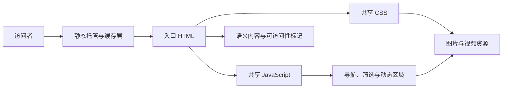
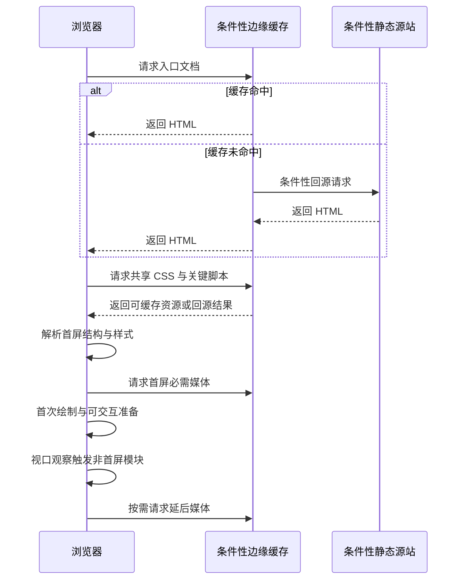

> 本文是一次脱敏技术复盘。它只讨论可迁移的工程模式，不包含原站点名称、业务文案、媒体名称或元数据、访问地址、部署位置与任何内部标识。

一个多媒体展示门户往往看起来只是“几张页面加一些素材”，但性能风险通常藏在资源优先级、首屏渲染路径和长期素材治理里。本次审阅的对象是一个以静态文件交付的多入口门户；下面把已观察到的实现、基于代码审查的推断，以及下一步建议分开记录。

## 先给结论

- **当前实现**：多个独立入口页复用共享样式表和共享脚本；视觉媒体主要通过样式层的背景资源组织，页面脚本还承担交互、延迟触发与局部 DOM 更新。
- **审查推断**：这种结构适合静态托管，内容发布成本低；但媒体请求的优先级不够显式，样式中的背景资源容易在首屏竞争带宽。
- **改进建议**：把“首屏必需”“进入视口后再取”“仅在交互后取”固化为资源契约，再用构建检查和真实设备指标约束它。

## 总体架构：静态外壳与渐进交互

当前实现采用的是轻量的多页结构：浏览器请求入口文档后，解析共享样式、页面结构和一份集中式脚本；媒体文件作为静态资源被页面或样式引用。交互能力不依赖首屏服务端接口，这是它在缓存与降级方面的优势。

这种架构的关键边界是：HTML 应先提供可阅读、可导航的内容；CSS 负责布局与视觉；JavaScript 只在需要时增强交互。这样即使脚本执行受限、网络较慢或媒体不可用，核心信息仍然存在。

## 浏览器加载路径：首屏资源必须有明确优先级

审阅中可以看到媒体既可由页面元素引用，也可由 CSS 背景声明引用；同时存在基于视口观察的延迟触发逻辑。后者是好的起点，但原生图片懒加载、预加载提示和响应式图片候选并未形成统一策略。尤其是背景图：浏览器通常要先下载并解析样式，才能发现资源，因而更难精确控制其优先级。

下图是**概念性、审查推断的部署模型**：它说明静态站点在采用边缘缓存时可能经历的加载路径，不声明已审阅站点正在使用边缘缓存或回源链路。

建议先建立一张资源优先级表，而不是只在出现卡顿后临时压缩文件。

| 资源类别 | 当前审阅结论 | 改进建议 |
| --- | --- | --- |
| 首屏品牌或主视觉 | **审查推断**：可能与样式、脚本和其他背景资源争抢请求 | 提供轻量海报或图片作为确定的首屏资源；仅对一个真正的 LCP 候选使用预加载与高优先级提示 |
| 首屏视频 | **审查推断**：视频会放大弱网与移动端成本 | 默认展示 poster；只有装饰性视频才静音、内联、循环，并允许根据网络与“减少动态效果”偏好停用 |
| 非首屏图片与视频 | **当前实现**：有视口驱动的延迟触发基础 | 图片可使用原生 `loading="lazy"` 并预留尺寸；视频提供 `poster`，使用 `preload="none"` 或 `metadata`，必要时由 `IntersectionObserver` 在接近视口后再设置媒体源 |
| CSS 背景媒体 | **当前实现**：多处视觉媒体由样式规则引用 | 将内容性图像改用 `` 或 `<picture>`；背景仅用于装饰，并为小屏提供更轻的替代规则 |
| 交互后内容 | **当前实现**：共享脚本承担动态区域更新 | 将模板与数据分离；仅在用户操作后加载该模块，并为失败状态保留可见反馈 |

## 首屏性能：先缩短关键渲染路径

**当前实现**中，入口页复用集中式共享样式和脚本；样式表包含响应式规则与动画，脚本包含 DOM 初始化、滚动帧调度和视口观察逻辑。这种集中管理易维护，但不等于每个入口页都需要下载同一份内容。

**审查推断**是：首屏瓶颈更可能来自样式发现后的背景媒体、未拆分的样式/脚本以及动画引起的主线程竞争，而不是某一个接口延迟。该判断来自静态代码审阅，不是实验室或真实用户性能测量。

**建议实施顺序**如下；实际优先级仍应由测量结果校正：

1. 为每个入口建立“首屏预算”：HTML、关键 CSS、首屏图片、JavaScript 和字体分别设上限，并在构建中校验。
2. 内联极小的关键样式，剩余样式按页面或功能拆分；非关键脚本使用 `defer` 或在交互时导入。
3. 为媒体生成现代格式和多尺寸版本，优先让浏览器按显示尺寸选取；不要把原始大图交给所有屏幕。
4. 给媒体盒子固定比例，避免素材到达后挤动正文；以 LCP、CLS、INP 和媒体字节数共同验收。
5. 使用节流后的滚动逻辑，并尊重 `prefers-reduced-motion`，不要让装饰动画压过阅读与输入。

## 兼容性与可访问性：把降级当成产品路径

**当前实现**提供了响应式样式，并使用了一部分 ARIA 标记；外链打开方式也具备基本的安全关系属性。**审查推断**是，复杂背景与动画在小屏、节能模式、键盘导航和低带宽场景更容易显露缺口。

建议把以下情形放进验收矩阵：无 JavaScript、图片失败、视频不自动播放、窄屏、触屏、键盘、读屏器、减少动态效果，以及低速网络。内容性图像应有等价文本；装饰性媒体应从辅助技术树中移除；颜色之外还要用文字、形状或状态说明传达区别。

## 部署与缓存：静态不代表无需运行治理

**当前实现**可由静态托管直接交付，且部署说明体现了缓存方面的考虑。**审查推断**是，发布应能受益于边缘缓存，但仅凭源文件无法确认生产环境是否设置了正确的 MIME 类型、压缩、缓存头或回退页。

建议把发布物按变更特征分层：带内容哈希的媒体使用长期不可变缓存，HTML 使用较短缓存或再验证策略；发布前检查相对路径、大小写和深层路由；发布后用冷缓存和移动网络复测首屏。为视频、字体和大图准备正确的内容类型与范围请求支持，并记录可回滚的发布版本。

## 安全边界：静态页面同样需要输入治理

**当前实现**的脚本包含动态插入页面片段的路径。**审查推断**是：若该路径未来接入远程内容、查询参数或运营配置，未经约束的 HTML 注入会成为主要风险；源文件中未发现可作为页面内策略证据的 CSP 标记，但这不能说明响应头未设置。

建议将动态区域限定为受信任模板与经过转义的数据；避免把不可信字符串直接交给 HTML 解析器。部署层应配置内容安全策略、禁止不必要的嵌入来源、限制第三方资源，并对外部样式或脚本使用完整性校验或本地托管。媒体上传场景还应在构建前校验类型、尺寸和文件名，避免把素材目录变成任意文件分发点。

## 测试与持续优化：从“页面能打开”升级为可量化回归

推荐将测试分为四层：

1. **结构测试**：检查每个入口的标题层级、跳过链接、媒体替代文本、固定尺寸和相对资源路径。
2. **行为测试**：验证菜单、筛选、弹层、键盘焦点、无脚本降级及媒体失败提示。
3. **性能测试**：在桌面与移动网络配置下采集 LCP、CLS、INP、总传输量、长任务和缓存命中。
4. **发布测试**：在预览环境验证 MIME、压缩、缓存头、深层链接、错误页与安全响应头。

优化顺序应始终由指标驱动：先定位 LCP 元素和阻塞资源，再减少首屏字节与主线程工作，最后处理视觉细节。每一轮只改变一个假设，并保留前后数据，才能判断“更快”究竟来自媒体、样式、脚本还是缓存。

## 上线检查与故障演练：验证退化路径，而非只验证理想网络

以下是适用于同类静态多媒体门户的**建议验收策略**，不表示当前站点已经部署了这些检查。每次发布可在预览环境先用冷缓存访问入口页：确认首屏只有一个明确的媒体候选，图片在缺失时保留版面和替代文本，非首屏视频先展示 `poster` 而不主动下载媒体主体。随后滚动到媒体区域，观察图片是否按需加载、视频是否只在接近视口或明确交互后设置媒体源，并核对网络面板中没有意外的重复请求或全量预取。

故障演练应有意模拟媒体资源不可用、响应很慢、返回错误内容类型，以及脚本或视口观察器失效等情形。验收重点不是“视频一定播放”，而是页面仍保留标题、说明、操作入口和清晰的失败反馈；当网络恢复或用户再次操作时，加载可以安全重试，而不会叠加多个请求或持续占用带宽。对于自动播放的装饰性视频，还应检查“减少动态效果”偏好、节能模式和窄屏条件下能否停用或降级为静态海报。

建议把发布后的观察窗口写入运行清单：分别抽查桌面与移动网络的 LCP、布局位移、总媒体字节数、媒体失败率和关键交互响应，并与上一个已知稳定版本比较。若指标异常，优先回退媒体清单或资源策略，再定位具体的样式、脚本或缓存变化；不要通过临时提高预加载范围掩盖问题。每次演练记录触发条件、用户可见现象、恢复动作和判定结果即可，避免把访问者信息或内部部署细节带入公开复盘。

## 可复用的检查清单

- [ ] 核心内容在脚本和媒体不可用时仍可阅读与导航。
- [ ] 每页只声明一个明确的首屏媒体候选，并为其提供尺寸与降级资源。
- [ ] 非首屏图片使用 `loading="lazy"` 或视口策略，且不会造成布局位移。
- [ ] 视频有 `poster`、合适的 `preload` 策略；必要时在接近视口后才设置媒体源，并保留减少动态效果的退出路径。
- [ ] 静态资源按版本缓存，HTML 可及时更新，发布后已验证响应头。
- [ ] 动态 HTML 的数据源受信任或已转义，部署层有可审计的安全策略。
- [ ] 性能、可访问性、交互和发布回归均进入自动化检查。

这类门户的长期竞争力不在于把更多媒体放到首屏，而在于让每一份媒体都在正确的时机、以正确的尺寸、为明确的用户目的而加载。
