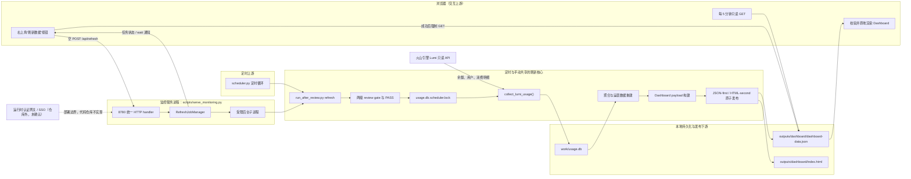
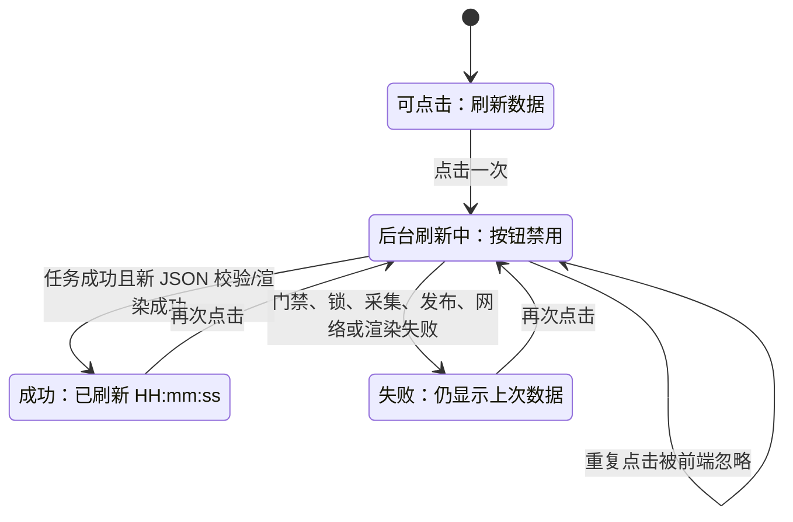
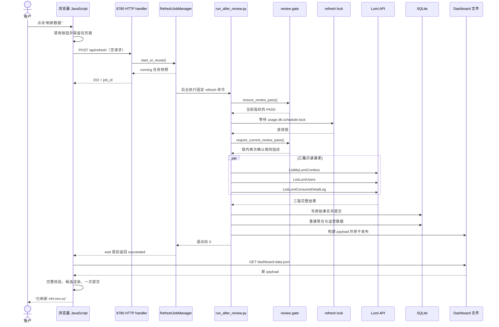
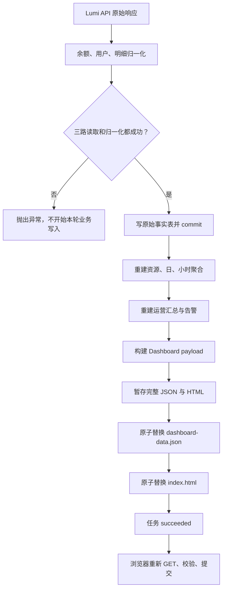

# “刷新数据”按钮更新：从页面点击到 Lumi 数据发布的完整项目教程

> 面向初学者，基于分支 `feature/integrity-improvements` 的最终代码编写。
> 本文只讲“将右上角静态运营态势改成可用刷新按钮”以及为此形成的上下游闭环，不展开同期的图表优化、自然日查询、用户关联去重等其他需求。

## 1. 如何使用这篇教程

### 1.1 适合谁阅读

这篇教程适合刚接触以下内容的读者：

- Python 后端与原生 HTTP 服务；
- 浏览器端 JavaScript 异步请求；
- 后台任务、状态查询和长轮询；
- 多进程互斥锁；
- SQLite 数据采集与静态 Dashboard 发布；
- Git 分支差异分析。

不要求你预先了解本项目。文中会先解释术语，再沿着一次真实的按钮点击逐步读代码。

### 1.2 建议阅读顺序

第一次阅读建议按以下顺序：

1. 先看“改动前后”和“项目架构”，理解为什么一个按钮会涉及前端、HTTP、后台任务、采集与文件发布。
2. 再看“端到端成功流程”，建立完整调用链。
3. 然后看“并发、门禁与一致性”，理解为什么不能简单地在 HTTP 请求里直接跑采集。
4. 最后阅读“失败路径”“测试”和“逐文件阅读顺序”。

如果你只想快速定位代码，直接跳到第 10 节和第 15 节。

### 1.3 阅读前需要知道的三个事实

第一，页面原来的“自动刷新”不等于“重新采集”。它每 5 分钟只是读取一次已经存在的 `dashboard-data.json`。

第二，当前实现中，手动按钮不会调用 `scheduler.py --once`。按钮固定执行 `run_after_review.py refresh`；定时调度器也调用同一个 `refresh` 任务，因此二者共享真正的刷新逻辑。

第三，项目把“刷新”定义为一条完整链路：

```plaintext
安全门禁 → 等待刷新锁 → 调用 Lumi 只读 API → 写 SQLite
→ 重建聚合和运营数据 → 生成 Dashboard 数据 → 原子发布文件
→ 通知浏览器 → 浏览器校验并原地更新
```

## 2. 需求与证据边界

### 2.1 业务目标

代码能够直接证明的业务目标是：

- 将 Dashboard 右上角没有行为的“OpenClaw 运营态势”静态徽标改成“刷新数据”按钮；
- 用户点击后主动执行一次最新数据采集；
- 保留原有 `scheduler.py` 定时更新；
- 定时更新与手动更新不能并发写同一数据库或 Dashboard；
- 刷新完成后页面自动加载新数据；
- 刷新失败时继续显示上一次成功数据。

代码没有提供产品用户数量、生产 QPS、SLA 或真实故障记录，因此本文不会推断这些信息。

### 2.2 Git 范围

本次分析先运行了技能提供的分支清单脚本，结果如下：

| 项目 | 结果 |
|---|---|
| 当前分支 | `feature/integrity-improvements` |
| 当前提交 | `<current-commit>` |
| 自动选择的基线 | `feature/manual-refresh` |
| 基线提交 | `<baseline-commit>` |
| Merge base | `<baseline-commit>` |
| 基线置信度 | 高；它是最近的可比较祖先，基线独有提交为 0，当前分支独有提交为 86 |
| 已提交差异 | 64 个路径 |
| 已暂存但未提交 | 0 个路径 |
| 未暂存 | 0 个路径 |
| 未跟踪 | 42 个路径，全部位于 `outputs/`，是验收日志、诊断脚本或 review 报告 |

这里有一个容易混淆的点：自动基线 `<baseline>` 已经包含第一版手动刷新功能。因此，如果只看 `<baseline>..HEAD`，会看不到“静态徽标第一次变成按钮”的历史。

为了说明需求的“改动前”，本文额外使用祖先提交 `<historical-baseline>` 作为历史对照点：

- `<historical-baseline>`：需求设计和计划完成，但页面仍是静态徽标；
- `<baseline>`：第一版手动刷新闭环完成；
- `<current>`：当前分支完成整合、两级门禁、长轮询、性能和失败保护。

这只是补充历史证据，不是偷偷替换自动选择的分支基线。

### 2.3 本文包含和排除什么

本文包含：

- 按钮 HTML、CSS、JavaScript；
- 刷新 API、后台任务和状态查询；
- 定时调度器与手动刷新共享链路；
- review gate、PASS 缓存、刷新锁；
- Lumi API 读取、SQLite 写入、聚合与 Dashboard 发布；
- 页面数据校验、状态保留和失败回退；
- 部署与测试边界。

本文排除：

- 用户资源自然日查询本身的业务算法；
- 30 日趋势、同比环比、作品排名等图表逻辑；
- 同期 Lumi 数据正确性修复的详细算法；
- `outputs/` 下未提交的本地诊断结果作为产品功能。

## 3. 改动前后

### 3.1 改动前

在历史对照提交 `<historical-baseline>` 中：

- `cloud_usage_monitor/dashboard_assets/lumi_dashboard_template.html` 的右上角是：

```html
<div class="header-badge" aria-label="OpenClaw 运营态势">
  OpenClaw 运营态势
</div>
```

- 它是一个普通 `div`，没有点击事件；
- `lumi_dashboard.js` 中的 `refreshDashboardData()` 只发送只读 GET：

```plaintext
GET dashboard-data.json?ts=<当前时间>
```

- `setInterval` 每 5 分钟调用一次这个 GET；
- `scripts/serve_monitoring.py` 只是静态文件服务，没有 `/api/refresh`；
- `scripts/scheduler.py` 先运行 `collect`，成功后再运行 `dashboard`。

所以旧页面的“自动刷新”准确含义是“检查磁盘上有没有别人生成的新 JSON”，不是“主动去 Lumi 获取最新数据”。

### 3.2 当前行为

当前版本中：

- 静态 `div` 变成真正的 `<button type="button">`；
- 点击按钮会发送空的同源 `POST /api/refresh`；
- 服务立即返回一个后台任务，不让浏览器一直卡在采集请求上；
- 浏览器通过最长 10 秒一次的状态等待接口获知任务完成；
- 后台任务执行固定命令 `run_after_review.py refresh`；
- 定时 `scheduler.py` 也执行同一个 `refresh`；
- 二者经过相同门禁，竞争同一刷新锁；
- 成功后浏览器强制读取新 `dashboard-data.json` 并更新页面；
- 失败时页面保留原有有效数据。

### 3.3 明确保留不变的行为

- `scheduler.py` 的定时循环仍然存在，默认每个刷新周期完成后等待 3600 秒；
- 原有每 5 分钟自动 GET 检查仍然存在；
- 自动 GET 不会触发采集；
- SQLite 仍是本地业务事实和聚合数据的持久化位置；
- Dashboard 仍由静态 `index.html` 和 `dashboard-data.json` 构成；
- 管理页仍使用 8765 端口，Dashboard 与刷新 API 使用 8780 端口。

## 4. 项目与模块地图

### 4.1 与刷新需求直接相关的目录

```plaintext
cloud_usage_monitor/
├─ dashboard_assets/
│  ├─ lumi_dashboard_template.html  # 按钮和状态区域
│  ├─ lumi_dashboard.css            # 按钮、旋转、成功/失败样式
│  └─ lumi_dashboard.js             # 点击、等待、数据校验、页面提交
├─ dashboard_http.py                # 刷新 HTTP 协议和同源检查
├─ dashboard_refresh.py             # 后台任务、子进程、状态等待、关闭
├─ dashboard_server.py              # 8780 的统一 handler
├─ dashboard.py                     # HTML/JSON 暂存与原子发布
├─ process_lock.py                  # 跨进程刷新锁
├─ review_cache.py                  # 环境指纹、PASS 缓存、门禁单飞
├─ review_gate.py                   # 快速检查和完整检查
├─ lumi.py                          # Lumi API 读取和 SQLite 首次写入边界
├─ lumi_aggregates.py               # 资源、日、小时聚合
├─ lumi_ops.py                      # 运营汇总和告警数据
└─ lumi_analytics.py                # 构建 Dashboard payload

scripts/
├─ serve_monitoring.py              # 长期运行的 8765/8780 服务
├─ scheduler.py                     # 长期运行的定时触发器
└─ run_after_review.py              # 统一门禁和 refresh 编排入口

work/
├─ usage.db                         # SQLite
├─ usage.db.review-pass.json        # 当前环境的 PASS
├─ usage.db.review-gate.lock        # 完整门禁单飞锁
└─ usage.db.scheduler.lock          # 定时和手动刷新互斥锁

outputs/dashboard/
├─ dashboard-data.json              # 浏览器动态加载的数据
└─ index.html                       # 初始页面与内嵌初始数据
```

### 4.2 完整上下文架构



图中的实线表示代码中可确认的调用或数据流，虚线表示仓库外的运行时边界。

### 4.3 端口与进程职责

| 组件 | 默认端口/运行形式 | 职责 |
|---|---|---|
| `serve_monitoring.py` | 8765 和 8780，长期运行 | 管理页、Dashboard 静态文件、刷新 API、历史查询 API、后台预热 |
| `scheduler.py` | 无 HTTP 端口，长期运行 | 周期性调用统一 `refresh` |
| `run_after_review.py refresh` | 短期子进程 | 门禁、锁、采集、聚合、构建和发布 |
| 浏览器 | 访问 8780 | 发起刷新、等待完成、加载新 JSON |

## 5. 核心概念与数据契约

### 5.1 后台任务

后台任务表示：HTTP 请求只负责“受理”，真正耗时的刷新在服务端线程和子进程中继续执行。

`cloud_usage_monitor/dashboard_refresh.py` 中的 `RefreshJob` 包含：

| 字段 | 含义 |
|---|---|
| `job_id` | 任务唯一 ID |
| `status` | `running`、`succeeded` 或 `failed` |
| `started_at` | UTC ISO 时间 |
| `finished_at` | 未完成时为 `null` |
| `message` | 给用户看的安全状态消息 |

任务对象是冻结的 dataclass，状态变化通过创建新快照完成，不允许任意修改。

### 5.2 review gate 与 PASS

review gate 可以理解为“允许刷新前的运行安全检查”。

- 完整门禁：配置、凭据边界、源码、编译、单元测试和 mock smoke flow；
- 快速检查：重新读取配置和凭据，检查当前环境；
- PASS：完整门禁通过后写入 `usage.db.review-pass.json` 的凭证；
- 环境指纹：对代码、配置、运行时和依赖等允许项计算 SHA-256；
- 凭据值不进入指纹，也不写入 PASS。

代码或配置变化会改变指纹，旧 PASS 就不能继续使用。

证据：

- `cloud_usage_monitor/review_gate.py` — `run_fast_review()`、`run_review()`；
- `cloud_usage_monitor/review_cache.py` — `compute_environment_fingerprint()`、`ensure_review_pass()`、`require_current_review_pass()`。

### 5.3 两把不同的锁

| 锁 | 目的 | 文件 |
|---|---|---|
| 门禁锁 | 多个请求同时遇到冷缓存时，只允许一个完整门禁运行 | `usage.db.review-gate.lock` |
| 刷新锁 | 定时和手动任务不能同时写数据库/发布 Dashboard | `usage.db.scheduler.lock` |

两把锁不能混为一谈。门禁锁保护“是否允许运行”的判断；刷新锁保护“真正刷新”的临界区。

### 5.4 HTTP API 契约

| 方法与路径 | 成功响应 | 作用 |
|---|---|---|
| `POST /api/refresh` | `202 Accepted` + `RefreshJob` | 启动或复用手动任务 |
| `GET /api/refresh/{job_id}` | `200 OK` + `RefreshJob` | 立即查询状态 |
| `GET /api/refresh/{job_id}/wait` | `200 OK` + `RefreshJob` | 最长等待 10 秒，任务完成会提前返回 |

关键限制：

- POST 请求目标必须精确等于 `/api/refresh`；
- 请求体必须为空；
- 不接受命令、配置路径或 `force` 参数；
- `Origin` 存在时必须与 `Host` 同源；
- wait 接口最多同时允许 8 个等待者；
- 第 9 个等待者收到 `429` 和 `Retry-After: 1`；
- 返回数据不包含子进程日志、凭据或异常堆栈。

### 5.5 浏览器状态



服务端还有一层重复保护：即使绕过按钮禁用并连续 POST，`RefreshJobManager.start_or_reuse()` 也会返回当前活动任务。

## 6. 一次成功刷新如何完成

### 6.1 总体时序



### 6.2 第一步：按钮只负责发起任务

入口位于 `cloud_usage_monitor/dashboard_assets/lumi_dashboard_template.html`：

- `manualRefreshButton` 是真实按钮；
- `manualRefreshStatus` 使用 `role="status"`、`aria-live="polite"`；
- 图标对读屏器隐藏，文字标签仍然可读。

样式位于 `lumi_dashboard.css`：

- 可见焦点环；
- 运行中旋转图标；
- 成功和失败使用不同颜色；
- 用户偏好减少动画时，关闭旋转动画；
- 点击目标最小高度为 44px。

`lumi_dashboard.js` 的 `runManualRefresh()` 做四件事：

1. 设置 `manualRefreshRunning = true`；
2. 使已有自动 GET 响应失效，防止旧响应覆盖新状态；
3. POST 空请求到 `/api/refresh`；
4. 用 `job_id` 等待服务端完成。

### 6.3 第二步：HTTP 层只接受固定协议

`cloud_usage_monitor/dashboard_http.py` 的 `handle_refresh_post()` 依次检查：

1. 原始请求目标是否精确为 `/api/refresh`；
2. 是否出现 `Transfer-Encoding`；
3. `Content-Length` 是否唯一且只含 ASCII 数字；
4. 请求体是否为空；
5. `Origin` 和 `Host` 是否同源；
6. 刷新管理器是否仍接受任务。

检查通过后才调用 `refresh_jobs.start_or_reuse()`。

这样做的重要意义是：浏览器不能通过请求参数控制服务器执行哪个脚本、使用哪个配置或传入任意命令。

### 6.4 第三步：后台任务管理器立即返回

`RefreshJobManager.start_or_reuse()` 的行为：

- 已经有活动手动任务：直接返回同一个任务；
- 没有活动任务：创建新 `job_id`；
- 使用非 daemon 线程运行任务；
- 线程启动失败：将任务安全结束为 `failed`，清除活动状态；
- 终态任务最多保留 128 个，避免内存无限增长。

后台线程调用 `run_bounded_process()` 执行固定命令：

```plaintext
<当前 Python> scripts/run_after_review.py refresh --config <固定配置>
```

这里的 argv 来自服务启动配置，不来自 HTTP 请求。

### 6.5 第四步：门禁先确认，再进入刷新锁

`scripts/run_after_review.py` 的 `run_reviewed_task("refresh", ...)` 使用以下顺序：

```plaintext
ensure_review_pass()
→ 等待 refresh lock
→ require_current_review_pass(expected_fingerprint=第一次指纹)
→ _run_refresh()
```

为什么锁内还要检查一次 PASS？

因为等待锁期间，代码、配置或运行环境可能发生变化。锁内复查可以防止“旧环境通过门禁，新环境执行刷新”的时间窗口。

### 6.6 第五步：定时任务与手动任务在这里汇合

`scripts/scheduler.py` 的 `run_cycle()` 不再分别执行 `collect` 和 `dashboard`，而是只执行一次：

```plaintext
run_after_review.py refresh
```

所以：

- 手动入口：浏览器 → 8780 → 后台子进程 → `refresh`；
- 定时入口：`scheduler.py` → `refresh`。

入口不同，核心任务相同。这就是“保留定时更新，同时允许用户主动获得最新数据”的关键闭环。

### 6.7 第六步：并行读取，确认完整后再写库

`cloud_usage_monitor/lumi.py` 的 `collect_lumi_usage()` 使用最多 3 个线程并行读取：

- `ListMyLumiCombos`：余额和已用算力；
- `ListLumiUsers`：用户；
- `ListLumiConsumeDetailLog`：消费明细。

任何一个读取失败，会取消仍未开始的 future；之后对三个 future 调用 `.result()`，异常会继续向上抛出。

只有三路读取全部成功，并且以下归一化全部完成后，才进入数据库写入：

- `_compute_balance_snapshot()`；
- `_normalize_users()`；
- `_normalize_logs()`。

首次业务写入发生在 `db_write_ms` 计时块内，最后调用 `conn.commit()`。

### 6.8 第七步：一次聚合，一次 Dashboard 构建

`scripts/run_after_review.py` 的 `_run_refresh()`：

1. `_run_collect()` 完成采集；
2. 采集成功后重建 `lumi_aggregates` 和 `lumi_ops`；
3. `_run_dashboard(rebuild=False)` 只构建 payload，不重复聚合；
4. `write_lumi_dashboard_files()` 发布文件。

采集失败时，Python 异常会直接中断，不会继续生成 Dashboard。

### 6.9 第八步：先发布 JSON，再发布 HTML

`cloud_usage_monitor/dashboard.py` 的 `write_lumi_dashboard_files()`：

1. 在目标目录创建 JSON 临时文件；
2. 写入、flush、`fsync`；
3. 创建 HTML 临时文件并做同样操作；
4. `os.replace()` 将完整 JSON 替换到正式路径；
5. 再替换 HTML；
6. 异常时尽力清理临时文件，保留原始异常。

顺序是 JSON-first / HTML-second。浏览器运行期间主要读取 JSON，因此先保证动态数据文件永远是完整文件。

### 6.10 第九步：浏览器收到完成通知后提交新页面

`waitForManualRefresh()` 优先调用：

```plaintext
GET /api/refresh/{job_id}/wait
```

服务端最长挂起 10 秒：

- 任务提前完成：立即返回；
- 10 秒仍在运行：返回 `running`，浏览器马上发起下一次 wait；
- 429、断线或瞬态网络错误：浏览器先即时 GET 状态，再按需等待 1 秒。

任务成功后，`refreshDashboardData({ force: true })` 强制读取新 JSON。

浏览器不会立即修改现有页面，而是：

1. `isDashboardData()` 对 payload 的关键字段和数组结构做完整校验；
2. 克隆当前 `<body>`；
3. 在克隆体中渲染候选 Dashboard；
4. 把真实历史查询面板移入候选体；
5. 一次性替换 body；
6. 恢复原来的焦点；
7. 最后才把全局 `data` 指向新 payload。

这是一种浏览器端“先准备、后提交”的事务式更新。

## 7. 数据与状态变化

### 7.1 数据流



### 7.2 主要 SQLite 下游

| 数据 | 表或数据层 | 在刷新中的作用 |
|---|---|---|
| 余额快照 | `lumi_balance_snapshots` | Dashboard 容量卡片 |
| 用户 | `lumi_users` | 用户名解析与用户维度 |
| 消费明细 | `lumi_consume_logs` | 原始消费事实 |
| 资源维度 | `lumi_resource_dimensions` | 资源名称和场景 |
| 日聚合 | `lumi_user_resource_daily` | 趋势和用户资源分析 |
| 小时聚合 | `lumi_user_resource_hourly` | 运营与告警分析 |

表结构不是这次按钮需求才全部新增的，但它们是按钮刷新后的真实下游，因此必须纳入闭环。

### 7.3 页面状态如何被保护

手动刷新开始时：

- 按钮禁用；
- 旧 Dashboard 数据继续显示；
- 历史查询结果不清空；
- 用户仍可操作历史查询区域。

手动刷新成功时：

- Dashboard 主数据更新；
- 历史筛选项后台重新加载并尽量保留选择；
- 已显示的历史查询结果不自动重跑；
- 当前日期、用户、服务、关键词、分页和焦点被保留。

这避免了用户正在查看历史结果时，被后台刷新强制跳回默认状态。

## 8. 上游与下游闭环

### 8.1 上游触发

共有三个与刷新相关的上游：

1. 用户点击按钮；
2. `scheduler.py` 定时循环；
3. `serve_monitoring.py` 启动时构建当前 Dashboard，并后台预热门禁。

启动构建只根据已有 SQLite 生成页面，不等于一次 Lumi 采集。

### 8.2 外部数据上游

真正的新数据来自火山引擎 Lumi 的三个只读接口。代码通过 `VolcLumiClient` 发起签名请求，但仓库不能证明生产网络、账号额度、接口延迟或服务可用性。

### 8.3 内部下游

刷新成功的内部下游依次是：

```plaintext
SQLite 原始事实
→ 聚合和运营表
→ Dashboard payload
→ dashboard-data.json / index.html
→ 浏览器
```

### 8.4 部署闭环

代码要求两个长期运行角色：

- 监控服务：提供按钮、API 和页面；
- scheduler：提供定时触发。

二者必须共享：

- 同一 `config.yaml`；
- 同一 `work/`；
- 同一 `outputs/`。

否则 PASS、门禁锁、刷新锁、SQLite 和 Dashboard 文件会各自分裂，互斥与数据可见性都失效。

仓库中的 `deploy/lumi-dashboard-vke.yaml` 当前只定义一个默认监控服务容器，没有 scheduler sidecar 或独立 scheduler Deployment。因此，仓库能证明“代码支持定时器”，但不能证明该清单部署后定时器一定运行。

### 8.5 安全边界

代码实现了：

- 固定空 POST；
- 同源检查；
- 严格路径解析；
- 不接受命令或配置参数；
- 错误信息不暴露日志、凭据或数据库路径。

但同源检查不是用户身份认证。仓库没有实现 SSO 登录或角色权限；生产访问控制必须由防火墙、allowlist、VPN、SSO 或认证网关提供。用户提供的“内网”前提属于部署环境信息，不应被误写成代码内鉴权。

## 9. 失败路径与保护措施

### 9.1 请求校验失败

| 失败 | 响应 | 是否启动任务 |
|---|---|---|
| 路径不是精确 `/api/refresh` | 404 | 否 |
| 请求体非空 | 400 | 否 |
| 使用 Transfer-Encoding | 400 | 否 |
| Content-Length 非法或重复 | 400 | 否 |
| 跨域或 `Origin: null` | 403 | 否 |
| 服务正在关闭 | 503 | 否 |

### 9.2 门禁失败

- 快速检查失败：不执行完整刷新；
- 完整门禁失败：不发布 PASS，不获取刷新锁；
- 等待门禁锁超时：转换为安全的 `ReviewGateError`；
- 等待刷新锁期间环境变化：锁内 PASS 复查失败，不采集；
- warmup 可以在第一次环境指纹漂移后再尝试一次完整门禁；
- 普通定时或手动刷新不会无限重试完整门禁。

### 9.3 并发与锁失败

- 定时任务持锁时，手动任务排队；
- 手动任务持锁时，定时任务排队；
- 同一个手动任务期间的重复点击复用任务；
- 刷新锁等待默认上限是 900 秒；
- 失败离开上下文后锁会释放，下一次可以重新尝试。

### 9.4 子进程超时和服务关闭

后台刷新默认最长 1800 秒：

- Windows 使用 Job Object 包含进程树，并在启动前先将暂停的根进程加入 Job；
- POSIX 使用独立进程组；
- 超时或取消时终止进程树；
- 输出只保留最后 64 KiB；
- 服务关闭会取消并 join warmup 和手动刷新线程；
- 浏览器自己的总截止时间是 31 分钟。

这些机制防止 HTTP 服务退出后遗留孤儿采集进程。

### 9.5 Lumi API 或归一化失败

三路读取中的任一路失败，或读取后的归一化失败，会在首次本轮业务写入前抛出异常。

这里要准确区分：

- 代码实现了“读取和归一化全部完成后才开始写”；
- 代码没有为真实 Lumi API 实现通用业务重试；
- 浏览器的 1 秒重试只针对状态查询的瞬态网络问题，不会重新执行失败的采集。

### 9.6 数据库、聚合或构建失败

- 采集失败：不构建本轮 Dashboard；
- 数据库写入、聚合或 payload 构建异常：任务失败；
- 页面继续显示上一次成功加载的数据；
- 下次定时或手动刷新可以重新尝试。

SQLite 提交之后、Dashboard 发布之前仍存在一致性窗口：数据库可能已经是新数据，但页面文件仍是旧版本。当前代码没有跨 SQLite 和文件系统的分布式事务或补偿回滚。

### 9.7 文件发布失败

| 失败位置 | 最终可能状态 |
|---|---|
| 暂存阶段失败 | 旧 JSON + 旧 HTML |
| 第一次 JSON 替换失败 | 旧 JSON + 旧 HTML |
| JSON 成功、HTML 替换失败 | 新 JSON + 旧 HTML，任务仍报告失败 |

“新 JSON + 旧 HTML”不是半写文件。后续五分钟只读检查可能校验并加载这份完整的新 JSON，但该刷新任务本身仍是失败状态。

### 9.8 浏览器加载或渲染失败

- JSON 请求失败或超时：保留当前页面；
- payload 结构不完整：拒绝提交；
- 候选 body 渲染失败：不替换现有 body；
- body 替换失败：尽力把历史面板放回原位置；
- 焦点恢复失败不会覆盖真正的提交结果；
- 用户看到“刷新失败，仍显示上次数据”。

## 10. 按业务步骤阅读关键代码

### 10.1 页面入口

文件：`cloud_usage_monitor/dashboard_assets/lumi_dashboard_template.html`

关键元素：

- `manualRefreshButton`；
- `manualRefreshButtonLabel`；
- `manualRefreshStatus`。

学习重点：语义化按钮、可访问状态播报、DOM ID 如何成为 JavaScript 契约。

### 10.2 交互状态和完成通知

文件：`cloud_usage_monitor/dashboard_assets/lumi_dashboard.js`

建议依次阅读：

1. `setManualRefreshState()`；
2. `fetchJsonBeforeDeadline()`；
3. `waitForManualRefresh()`；
4. `isDashboardData()`；
5. `renderNextDashboardData()`；
6. `refreshDashboardData()`；
7. `runManualRefresh()`；
8. `runDashboardAutoRefresh()`。

学习重点：一个总截止时间如何贯穿 POST、wait、状态回退和最终 JSON 加载；手动与自动请求如何避免互相覆盖。

### 10.3 HTTP 协议

文件：`cloud_usage_monitor/dashboard_http.py`

关键符号：

- `origin_matches_host()`；
- `raw_request_target()`；
- `handle_refresh_post()`；
- `try_handle_refresh_get()`；
- `send_json_response()`。

学习重点：为什么必须检查原始 request target，而不是只相信已经标准化的 URL；为什么拒绝 body 和动态参数。

### 10.4 统一 8780 服务

文件：`cloud_usage_monitor/dashboard_server.py`

关键符号：`make_dashboard_handler()`。

生产组合中，这个 handler 同时处理：

- 静态 Dashboard；
- 刷新 POST/GET/wait；
- 历史摘要查询；
- 历史筛选项查询。

它通过 `_readonly_snapshot()` 给每个历史查询一个单独的 SQLite 只读快照，不获取刷新锁。

### 10.5 后台任务与受限子进程

文件：`cloud_usage_monitor/dashboard_refresh.py`

关键符号：

- `build_refresh_request()`；
- `run_bounded_process()`；
- `RefreshJobManager.start_or_reuse()`；
- `RefreshJobManager.wait_for_job()`；
- `RefreshJobManager.shutdown()`。

学习重点：任务状态、重复请求复用、wait 条件变量、进程树回收和安全日志。

### 10.6 两级门禁

文件：

- `cloud_usage_monitor/review_gate.py`；
- `cloud_usage_monitor/review_cache.py`。

关键符号：

- `run_fast_review()`；
- `run_review()`；
- `compute_environment_fingerprint()`；
- `ensure_review_pass()`；
- `require_current_review_pass()`。

学习重点：冷缓存和暖缓存的差异、门禁单飞、PASS 原子写入、环境漂移。

### 10.7 定时和手动共用编排

文件：

- `scripts/scheduler.py`；
- `scripts/run_after_review.py`。

关键符号：

- `scheduler.run_cycle()`；
- `run_after_review.run_reviewed_task()`；
- `_run_refresh()`；
- `_run_collect()`；
- `_run_dashboard(rebuild=False)`。

学习重点：共享的是“核心任务”，不是共享同一个 HTTP 入口。

### 10.8 数据读取和发布

文件：

- `cloud_usage_monitor/lumi.py` — `collect_lumi_usage()`；
- `cloud_usage_monitor/dashboard.py` — `write_lumi_dashboard_files()`。

学习重点：并行只读、写入边界、JSON-first 原子发布。

## 11. 测试与验证

### 11.1 代码中已有的主要测试层次

| 测试文件 | 覆盖重点 |
|---|---|
| `tests/test_dashboard.py` | DOM 契约、脚本契约、JSON/HTML 原子发布 |
| `tests/test_dashboard_logic.cjs` | 真实 JavaScript 行为、状态保留、渲染回滚 |
| `tests/test_dashboard_http.py` | POST/GET/wait、同源、空 body、429、严格路径 |
| `tests/test_dashboard_refresh.py` | 后台任务、复用、wait、超时、取消、进程树 |
| `tests/test_dashboard_server.py` | 统一 8780 handler 与历史查询快照 |
| `tests/test_process_lock.py` | 跨进程锁竞争、超时和释放 |
| `tests/test_review_cache.py` | PASS、指纹、单飞、环境漂移、原子缓存 |
| `tests/test_run_after_review.py` | 门禁顺序、锁内复查、统一 refresh |
| `tests/test_scheduler.py` | 定时循环只调用一次 refresh |
| `tests/test_serve_monitoring.py` | 服务组合、预热、关闭和启动构建互斥 |
| `tests/test_docker_packaging.py` | Docker 与部署文档契约 |

### 11.2 本次实际运行

在当前分支上实际执行：

```powershell
python -m unittest discover -s tests
```

结果：

```plaintext
Ran 316 tests in 89.839s
OK
```

全量测试包含 `tests/test_dashboard_logic.py` 对 Node 行为脚本的调用。

同时实际执行：

```plaintext
python -m compileall -q cloud_usage_monitor scripts tests  → 通过
git diff --check <baseline> HEAD                              → 通过
git diff --cached --check                                  → 通过
git diff --check                                           → 通过
```

本文中的 4 个 Mermaid 代码块也使用 Mermaid 11.16.0 解析器逐一检查，结果为 4/4 通过。

本文没有再次调用真实 Lumi 生产 API，也没有修改生产 SQLite。单元测试通过不能替代真实网络、凭据和部署验收。

### 11.3 初学者可执行的重点验证

先跑最小刷新测试：

```powershell
python -m unittest `
  tests.test_process_lock `
  tests.test_dashboard_refresh `
  tests.test_dashboard_http `
  tests.test_run_after_review `
  tests.test_scheduler `
  tests.test_serve_monitoring
```

再跑全部测试：

```powershell
python -m unittest discover -s tests
```

静态检查：

```powershell
python -m compileall -q cloud_usage_monitor scripts tests
git diff --check <baseline> HEAD
git diff --cached --check
git diff --check
```

人工验收时至少观察：

1. 点击后按钮立即显示“后台刷新中”；
2. 旧数据仍可查看；
3. 完成后“生成时间”和“数据截止”更新；
4. 当前历史筛选和结果不被自动重跑；
5. 定时任务运行时点击按钮不会并发写库；
6. 失败时显示旧数据和安全错误；
7. 浏览器控制台无错误；
8. 服务端没有输出凭据、请求体或完整 API 响应。

## 12. 设计选择与权衡

### 12.1 后台任务，而不是阻塞 POST

优点：

- 浏览器快速得到 202；
- 避免长采集占用单个 HTTP 请求直至超时；
- 可以显示明确的任务状态。

代价：

- 需要任务存储、状态接口、关闭处理和终态清理。

### 12.2 手动直达统一 refresh，而不是绕一层 scheduler

当前按钮执行 `run_after_review.py refresh`，减少一层 Python 进程；scheduler 仍保留定时触发职责。

优点：

- 手动链路更短；
- 定时与手动仍共享业务实现。

代价：

- 必须清楚区分“相同核心任务”和“相同入口”；二者不是同一个进程。

### 12.3 两级门禁和后台预热

优点：

- 代码或环境变化后仍要求完整检查；
- 环境未变时复用 PASS，减少按钮等待；
- 启动服务后在后台预热，不阻塞页面服务。

代价：

- 增加 PASS、指纹、门禁锁、失败代际等复杂状态；
- 冷启动仍可能明显慢于暖缓存。

### 12.4 文件锁

优点：

- 定时器和监控服务可以是不同进程或容器；
- 不需要引入外部队列或 Redis。

代价：

- 两个容器必须共享支持相应锁语义的同一文件系统；
- 锁只保护走这条统一 refresh 链路的任务；
- 直接运维 `collect` 或 `dashboard` 不参与刷新锁，维护时必须先停服务。

### 12.5 长轮询

优点：

- 正常完成时服务端主动唤醒浏览器；
- 比每秒固定轮询更少请求。

代价：

- 每个 wait 占用一个服务线程；
- 因此实现了 8 个等待者上限；
- 超限或网络异常时仍需要状态查询和 1 秒回退。

### 12.6 JSON-first 发布

优点：

- 浏览器最关心的动态 JSON 优先成为完整新版本；
- 永远使用临时文件和原子替换，不服务半写文件。

代价：

- HTML 替换失败时可能出现新 JSON + 旧 HTML；
- 这是一项明确接受的失败一致性取舍。

### 12.7 克隆 body 后一次提交

优点：

- 新 payload 或渲染失败不会破坏当前页面；
- 可以保留历史查询面板和焦点。

代价：

- DOM 代码更复杂；
- 大页面克隆会产生额外内存和 CPU 开销。

## 13. 未完整接线与改进建议

### 13.1 当前可确认的未完整接线

1. `cloud_usage_monitor/dashboard_refresh.py` 中的 `build_scheduler_once_request()` 当前没有生产调用方。最终手动路径使用 `build_refresh_request()`；该 helper 更像早期实现留下的兼容函数。
2. `cloud_usage_monitor/dashboard_http.py` 仍有一个简单版 `make_dashboard_handler()`，当前生产服务使用的是 `cloud_usage_monitor/dashboard_server.py` 中的统一 handler；简单版只在 HTTP 单元测试中使用。
3. `deploy/lumi-dashboard-vke.yaml` 没有 scheduler sidecar 或独立 scheduler Deployment，无法单凭该清单完成“定时 + 手动”双入口部署。
4. 仓库没有实现刷新 API 的用户认证和授权。

### 13.2 改进建议

以下内容不是当前已实现功能：

- 在 VKE 清单中显式增加 scheduler sidecar 或独立 Deployment，并验证共享 PVC；
- 在认证网关上限制 8780 的访问身份和刷新权限；
- 为刷新耗时固定字段接入指标与告警；
- 对真实共享存储执行跨容器锁兼容性测试；
- 如果并发用户明显增加，可将进程内任务状态迁移到持久化队列，但会增加运维成本；
- 删除或明确标记未使用的 `build_scheduler_once_request()` 与简单 handler，减少初学者误读。

## 14. 初学者逐文件阅读顺序

| 顺序 | 文件与符号 | 读完应理解什么 |
|---:|---|---|
| 1 | `lumi_dashboard_template.html` — `manualRefreshButton` | 用户从哪里点击 |
| 2 | `lumi_dashboard.js` — `runManualRefresh()` | 浏览器如何发起和收尾 |
| 3 | `dashboard_http.py` — `handle_refresh_post()` | API 如何拒绝危险输入 |
| 4 | `dashboard_refresh.py` — `RefreshJobManager` | 为什么 HTTP 可以立即返回 |
| 5 | `dashboard_refresh.py` — `run_bounded_process()` | 超时和关闭如何回收子进程 |
| 6 | `serve_monitoring.py` — `_compose_service()` | 8780 服务如何组装 |
| 7 | `scheduler.py` — `run_cycle()` | 定时任务如何进入同一 refresh |
| 8 | `run_after_review.py` — `run_reviewed_task()` | 门禁、锁与执行顺序 |
| 9 | `review_cache.py` — `ensure_review_pass()` | 两级门禁和 PASS 如何工作 |
| 10 | `process_lock.py` — `acquire_file_lock()` | 跨进程互斥如何实现 |
| 11 | `lumi.py` — `collect_lumi_usage()` | 三路读取和首次写入边界 |
| 12 | `run_after_review.py` — `_run_refresh()` | 采集、聚合、构建如何串起来 |
| 13 | `dashboard.py` — `write_lumi_dashboard_files()` | 文件如何原子发布 |
| 14 | `lumi_dashboard.js` — `renderNextDashboardData()` | 页面如何事务式提交 |

## 15. 刷新相关变更索引

下表的 Git 状态使用历史对照 `<historical-baseline>..HEAD`，这样可以完整覆盖“静态徽标 → 当前刷新闭环”。`A` 表示该范围内新增，`M` 表示修改。

### 15.1 运行时代码

| 状态 | 路径 | 关键符号/内容 | 教程章节 |
|---|---|---|---|
| M | `cloud_usage_monitor/dashboard_assets/lumi_dashboard_template.html` | `manualRefreshButton`、状态区 | 3、6 |
| M | `cloud_usage_monitor/dashboard_assets/lumi_dashboard.css` | 按钮状态、动效、无障碍 | 6 |
| M | `cloud_usage_monitor/dashboard_assets/lumi_dashboard.js` | `runManualRefresh()`、wait、校验、提交 | 5、6、7、9 |
| A | `cloud_usage_monitor/dashboard_http.py` | 刷新 API 与同源检查 | 5、6、9 |
| A | `cloud_usage_monitor/dashboard_refresh.py` | 任务管理、受限子进程、长轮询 | 5、6、9 |
| A | `cloud_usage_monitor/dashboard_server.py` | 统一 8780 handler | 4、8 |
| A | `cloud_usage_monitor/process_lock.py` | `acquire_file_lock()` | 5、6、9 |
| A | `cloud_usage_monitor/review_cache.py` | PASS、指纹、门禁单飞 | 5、6、9 |
| M | `cloud_usage_monitor/review_gate.py` | 快速门禁接口 | 5、6 |
| A | `cloud_usage_monitor/refresh_timing.py` | 固定字段耗时日志 | 9 |
| M | `cloud_usage_monitor/lumi.py` | 并行读取、写入边界、计时 | 6、7 |
| M | `cloud_usage_monitor/dashboard.py` | JSON/HTML 原子发布 | 6、9 |
| M | `scripts/run_after_review.py` | 统一 refresh 编排 | 6、7 |
| M | `scripts/scheduler.py` | 定时任务调用 refresh | 3、6、8 |
| M | `scripts/serve_monitoring.py` | 服务组合、启动构建、预热、关闭 | 4、8、9 |

### 15.2 测试与契约

| 状态 | 路径 | 主要覆盖 |
|---|---|---|
| M | `tests/test_dashboard.py` | DOM、脚本契约、文件发布 |
| A | `tests/test_dashboard_logic.cjs` | 浏览器行为、状态保留、回滚 |
| A | `tests/test_dashboard_http.py` | POST/GET/wait 和恶意输入 |
| A | `tests/test_dashboard_refresh.py` | 任务、线程、进程树、长轮询 |
| A | `tests/test_dashboard_server.py` | 统一 handler 与只读历史快照 |
| A | `tests/test_process_lock.py` | 跨进程锁 |
| A | `tests/test_review_cache.py` | PASS、指纹、并发门禁 |
| M | `tests/test_review_gate.py` | 快速/完整门禁 |
| A | `tests/test_refresh_timing.py` | 固定日志字段 |
| A | `tests/test_run_after_review.py` | 门禁、锁、统一 refresh |
| M | `tests/test_scheduler.py` | 定时 refresh |
| A | `tests/test_serve_monitoring.py` | 服务生命周期 |
| M | `tests/test_docker_packaging.py` | 容器与文档契约 |

### 15.3 运维文档

与运行边界直接相关的已提交文档包括：

- `README.md`；
- `docs/architecture.md`；
- `docs/openclaw-setup.md`；
- `docs/lumi-dashboard-rollout-checklist.md`。

这些文档提供部署与维护证据，但不能替代实际 VKE 资源状态。

## 16. 仍然未知的事项

| 未知 | 为什么仓库证据不足 | 需要什么证据 |
|---|---|---|
| 生产 8780 前是否确实有 SSO/认证网关 | 代码只实现同源检查 | 网关、Ingress、SSO 或防火墙配置 |
| 生产是否真的同时运行 scheduler | 当前 VKE 清单只有监控服务 | 实际 Deployment/sidecar、进程或 OpenClaw 配置 |
| 共享 PVC 的文件锁语义是否满足预期 | 本地测试不能代表所有网络文件系统 | 目标存储上的跨 Pod 锁竞争测试 |
| 真实 Lumi API 的延迟和失败模式 | 单元测试使用受控 fake/mock | 生产或预发布只读观测 |
| 5–8 秒体验目标是否稳定 | 文档把它写成目标，不是 SLA | 一段时间的阶段耗时指标 |
| 服务重启后是否需要保留任务状态 | 当前任务状态只在内存 | 明确产品需求和恢复策略 |
| 当前 8 个 wait 连接上限是否合适 | 仓库没有并发用户数据 | 访问量与线程使用指标 |

## 17. 总结与自测问题

### 17.1 一句话总结

这次改动不是只换了一个按钮文字，而是把一个没有行为的静态徽标接入了“受理任务、门禁复用、跨进程互斥、只读采集、SQLite 聚合、原子发布、完成通知和浏览器事务式更新”的完整闭环，同时保留了原来的定时调度器。

### 17.2 你应该能回答的问题

1. 为什么旧的每 5 分钟自动刷新拿不到刚发生但尚未采集的数据？
2. 为什么手动按钮不再调用 `scheduler.py --once`，却仍和定时任务共享逻辑？
3. `review-gate.lock` 和 `scheduler.lock` 分别保护什么？
4. 为什么获得刷新锁以后还要重新检查 PASS？
5. 为什么三路 Lumi API 可以并行，但不能任何一路返回后立即写库？
6. 为什么服务先替换 JSON，再替换 HTML？
7. 点击时定时任务正在运行，会发生什么？
8. 为什么 1 秒重试不是 Lumi 采集重试？
9. 为什么同源检查不能代替用户鉴权？
10. 为什么现有 VKE 清单还不能证明定时更新已经部署？

如果能独立回答这些问题，你就已经理解了这个刷新按钮从上游触发到下游展示的完整项目结构。
