# Dashboard 手动采集与刷新：项目教程

> 本教程面向第一次接触本项目、Python 后端、浏览器异步任务或跨进程互斥的读者。它不只解释右上角按钮，还沿着“浏览器 → HTTP 服务 → 后台任务 → scheduler → review gate → Lumi API → SQLite → Dashboard 文件 → 浏览器重绘”追踪完整闭环。

## 1. 如何使用本教程

### 1.1 你会学到什么

读完后，你应该能够回答：

1. 原来的“OpenClaw 运营态势”为什么没有实际作用？
2. 点击“刷新数据”后，为什么接口先返回任务编号，而不是让 HTTP 请求一直等待？
3. 手动刷新与定时刷新如何复用同一业务链路？
4. 两个进程同时刷新时，文件锁如何避免 SQLite 和 Dashboard 并发写入？
5. 采集、聚合、生成 JSON、生成 HTML、前端重绘分别发生在哪里？
6. 失败时哪些旧数据会被保留，哪些数据可能已经写入？
7. 当前实现有哪些边界仍依赖部署环境，而不是代码本身？

### 1.2 建议先具备的知识

不要求你熟悉整个仓库，但最好知道：

- HTTP 的 `GET` 和 `POST` 是两种请求方法；
- JSON 是前后端交换结构化数据的一种文本格式；
- SQLite 是一个以单个文件保存数据的数据库；
- Python 进程可以再启动子进程；
- Git 分支用于隔离一组相关改动。

### 1.3 推荐阅读顺序

如果只想先理解业务，请按以下顺序阅读：

1. 第 2 节：确认教程分析的是哪个分支；
2. 第 3 节：理解改造前后；
3. 第 4 节：看总体架构图；
4. 第 6 节：沿成功路径走一遍；
5. 第 9 节：理解失败时会发生什么；
6. 第 10 节：再回到具体代码。

如果要维护代码，再继续阅读测试、设计取舍、未完成接线和变更索引。

---

## 2. 需求与证据边界

### 2.1 业务目标

需求原文的核心是：

> 右上角“OpenClaw 运营态势”如果没有实际作用，就改成刷新按钮。点击后主动刷新，同步触发采集脚本并刷新 Dashboard。

代码把“同步触发”实现为“用户的一次点击对应一个完整刷新任务”，但没有让单个 HTTP 请求同步阻塞到采集结束。浏览器先创建后台任务，再轮询任务状态。这一点是理解后续设计的关键。

### 2.2 Git 分析范围

| 项目 | 值 |
| --- | --- |
| 功能分支 | 手动刷新功能开发分支 |
| 功能分支状态 | 已完成并通过验证 |
| 显式基线 | 上一阶段的 Dashboard 刷新分支 |
| Merge base | 与显式基线 HEAD 一致 |
| 基线是否为功能分支祖先 | 是 |
| 功能提交数 | 24 |
| 已提交变更文件数 | 21 |
| Staged | 无 |
| Unstaged | 无 |
| Untracked | 无 |

本教程使用显式基线，而不是工具自动选择的 `origin`。原因是需求附件和分支历史都明确表明：手动刷新功能从上一阶段的 Dashboard 刷新分支继续实现；两者的 merge base 正好是基线 HEAD。

当前主工作树停留在基线分支，功能代码位于 Git linked worktree：

```plaintext
.worktrees/scheduler-manual-refresh
```

因此，教程描述的是该 linked worktree 中已经提交的功能实现，不把主工作树内其他未跟踪产物算入功能范围。

### 2.3 24 个提交如何组成该功能

这些提交可以按职责分成七组：

| 阶段 | 代表提交 | 作用 |
| --- | --- | --- |
| 测试策略 | 测试策略提交 | 把 Dashboard 测试方向调整为行为约束 |
| 互斥 | 互斥实现提交 | 新增跨进程锁，并让 scheduler 周期串行 |
| 子进程边界 | 子进程治理提交 | 有界运行、进程树收拢、先收拢再执行 |
| 作业管理 | 作业管理提交 | 管理异步刷新任务并处理启动失败 |
| HTTP API | API 实现提交 | 暴露固定 API 并收紧请求解析 |
| 服务与文件发布 | 服务与发布提交 | 接入监控服务、启动关闭、Dashboard 原子替换和清理 |
| 前端与收尾 | 前端与文档提交 | 按钮、轮询、校验、生命周期、文档和测试 |

### 2.4 什么是事实，什么不是

本文采用四类证据标签：

- **代码事实**：源码、配置、测试或 Git 历史直接证明；
- **有依据的推断**：多个代码事实共同支持，但运行环境没有直接证明；
- **未知**：仓库证据不足；
- **改进建议**：当前未实现的机制。

特别需要避免以下误读：

- 代码实现同源校验，不等于实现了用户登录鉴权；
- 文件锁能串行 scheduler，不等于所有直接运维命令都被锁保护；
- 两个文件分别原子替换，不等于 JSON 与 HTML 构成一个事务；
- 单元测试通过，不等于已经在真实 Lumi、Ingress 或 VKE 环境完成验收。

---

## 3. 改造前后

### 3.1 改造前

基线中的右上角元素是一个静态 `<div>`：

```html
<div class="header-badge" aria-label="OpenClaw 运营态势">
  OpenClaw 运营态势
</div>
```

它没有点击监听器、没有 API 调用，也不读取任何 OpenClaw 状态。因此，“运营态势”只是视觉标签。

基线已经存在每 5 分钟自动刷新，但它只执行：

```plaintext
GET dashboard-data.json
```

这只会读取已经生成的静态 JSON，不会触发 Lumi API 采集，也不会重建 Dashboard。

证据：

- `cloud_usage_monitor/dashboard_assets/lumi_dashboard_template.html` — 基线右上角静态标签；
- `cloud_usage_monitor/dashboard_assets/lumi_dashboard.js` — 基线 `refreshDashboardData()` 与 `startDashboardAutoRefresh()`。

### 3.2 改造后

右上角变成语义化 `<button>`，一次点击会：

1. `POST /api/refresh` 创建或复用一个后台任务；
2. 每秒 `GET /api/refresh/{job_id}` 查询状态；
3. 服务端固定启动 `scheduler.py --once`；
4. scheduler 获取共享文件锁；
5. 先执行门禁后的 `collect`；
6. 采集成功后执行门禁后的 `dashboard`；
7. 生成并替换 `dashboard-data.json` 和 `index.html`；
8. 浏览器强制读取新 JSON；
9. JSON 通过结构校验后，在离屏 DOM 中完整渲染；
10. 渲染成功后一次性替换当前页面主体。

### 3.3 保持不变的行为

以下行为有意保留：

- 每 5 分钟自动检查仍然存在；
- 自动检查仍然只读取 JSON，不触发采集；
- 定时更新仍由 `scripts/scheduler.py` 执行；
- 真正的采集、聚合与 Dashboard 生成仍走现有 Python 业务代码；
- 云侧访问仍是 Lumi 查询 API；
- Dashboard 仍由静态 `index.html` 和 `dashboard-data.json` 提供。

---

## 4. 仓库与模块地图

### 4.1 与本功能直接相关的目录

```plaintext
lumi-openclaw-monitor/
├─ cloud_usage_monitor/
│  ├─ dashboard.py                 # 渲染并发布 Dashboard 文件
│  ├─ dashboard_http.py            # 静态文件服务 + 手动刷新 API
│  ├─ dashboard_refresh.py         # 后台作业和有界子进程
│  ├─ process_lock.py              # Windows/Linux 跨进程文件锁
│  ├─ lumi.py                      # Lumi API 采集和 SQLite 写入
│  ├─ lumi_aggregates.py           # 资源维度、日/小时聚合
│  ├─ lumi_ops.py                  # 运营汇总和告警
│  ├─ lumi_analytics.py            # Dashboard JSON payload
│  └─ dashboard_assets/
│     ├─ lumi_dashboard_template.html
│     ├─ lumi_dashboard.css
│     └─ lumi_dashboard.js
├─ scripts/
│  ├─ serve_monitoring.py          # 长期 HTTP 服务入口
│  ├─ scheduler.py                 # 定时或单次刷新入口
│  └─ run_after_review.py          # review gate 后执行任务
├─ tests/                          # 各层单元和集成式测试
├─ work/
│  ├─ usage.db                     # SQLite 数据库
│  └─ usage.db.scheduler.lock      # scheduler 互斥锁文件
└─ outputs/dashboard/
   ├─ dashboard-data.json
   └─ index.html
```

### 4.2 总体架构

```mermaid

flowchart LR
    Browser["内网浏览器"] --> Monitor["serve_monitoring.py"]
    Monitor --> Static["静态 Dashboard 文件"]
    Browser -->|"POST /api/refresh"| Api["DashboardHandler.do_POST()"]
    Api --> Jobs["RefreshJobManager"]
    Jobs --> Once["scheduler.py --once"]
    Timer["scheduler.py 定时循环"] --> Lock["usage.db.scheduler.lock"]
    Once --> Lock
    Lock --> CollectGate["run_after_review.py collect"]
    CollectGate --> Review1["review_gate.run_review()"]
    Review1 --> Lumi["Lumi 查询 API"]
    Lumi --> SQLite["work/usage.db"]
    SQLite --> DashboardGate["run_after_review.py dashboard"]
    DashboardGate --> Review2["review_gate.run_review()"]
    Review2 --> Payload["build_lumi_dashboard_payload()"]
    Payload --> Publish["write_lumi_dashboard_files()"]
    Publish --> Json["dashboard-data.json"]
    Publish --> Html["index.html"]
    Json --> Static
    Html --> Static
    Browser -->|"GET /api/refresh/{job_id}"| Api
    Browser -->|"GET dashboard-data.json"| Static
```

这里最重要的结构关系是：手动刷新没有复制采集逻辑，而是启动 scheduler 的单次模式。这样手动和定时路径在锁、门禁、采集、聚合和文件生成上尽量保持一致。

### 4.3 进程边界

运行时至少涉及三类执行单元：

1. `serve_monitoring.py` 主进程：
   - 提供 8780 Dashboard；
   - 提供 8765 SQLite 只读管理页；
   - 保存内存中的刷新任务状态。
2. 刷新工作线程：
   - 由 `RefreshJobManager` 创建；
   - 不直接采集，只负责运行和等待子进程。
3. scheduler 子进程及其后代：
   - 执行 `scheduler.py --once`；
   - 再分别启动 `run_after_review.py collect` 和 `dashboard`。

这也是代码必须处理“线程关闭”“子进程超时”“孙进程残留”和“进程树终止”的原因。

---

## 5. 核心概念与数据契约

### 5.1 异步作业

采集可能耗时较长。如果 `POST /api/refresh` 一直等待，会受到浏览器、反向代理或 Ingress 超时影响。

当前协议是：

```http
POST /api/refresh
```

立即返回 `202 Accepted`：

```json
{
  "job_id": "32位十六进制编号",
  "status": "running",
  "started_at": "2026-07-27T...",
  "finished_at": null,
  "message": "正在采集并刷新"
}
```

浏览器随后请求：

```http
GET /api/refresh/{job_id}
```

状态只有三种：

| 状态 | 含义 |
| --- | --- |
| `running` | 子进程仍在执行 |
| `succeeded` | scheduler 子进程退出码为 0 |
| `failed` | 非零退出、超时、取消或内部异常 |

证据：`cloud_usage_monitor/dashboard_refresh.py` — `RefreshJob`、`RefreshJobManager`。

### 5.2 固定命令，而不是远程命令执行

API 不接收 shell 命令、配置路径或任务类型。`build_scheduler_once_request()` 固定构造：

```plaintext
当前 Python 解释器
scripts/scheduler.py
--once
--config
服务启动时解析出的 config 路径
```

并使用 `shell=False`。

这缩小了接口输入面：浏览器只能请求“执行预定义的一次刷新”，不能借接口拼接任意命令。

证据：`cloud_usage_monitor/dashboard_refresh.py` — `build_scheduler_once_request()`、`run_bounded_process()`。

### 5.3 文件锁

锁文件位置由 SQLite 路径派生：

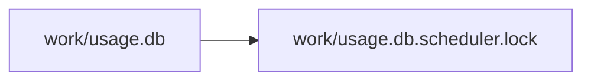

`acquire_file_lock()` 在：

- Windows 使用 `msvcrt.locking()`；
- Linux/Unix 使用 `fcntl.flock()`。

它是操作系统级跨进程锁，不只是 Python 线程锁。因此长期 scheduler 和手动启动的 scheduler 子进程可以互相看到锁。

默认等待锁 15 分钟。超时后 scheduler 返回非零退出码。

证据：

- `cloud_usage_monitor/process_lock.py` — `refresh_lock_path()`、`acquire_file_lock()`；
- `scripts/scheduler.py` — `DEFAULT_LOCK_TIMEOUT_SECONDS`、`run_cycle()`。

### 5.4 线程锁与文件锁不是同一个锁

本功能有两层互斥：

| 互斥层 | 保护范围 | 实现 |
| --- | --- | --- |
| 线程锁 | 同一个监控服务进程内只保留一个 active manual job | `RefreshJobManager._lock` |
| 文件锁 | 不同 scheduler 进程之间只运行一个 collect/dashboard 周期 | `usage.db.scheduler.lock` |

重复点击时，`RefreshJobManager.start_or_reuse()` 返回正在运行的同一个 job，不新建第二个线程。

如果同一份存储被两个独立监控服务副本同时挂载，两者的内存 job manager 互相不可见，但它们启动的 scheduler 仍会在文件锁处排队。前提是两个副本真的共享同一个支持该锁语义的文件系统。

### 5.5 Review gate

`run_after_review.py` 在执行任务前调用 `review_gate.run_review()`。门禁包括：

- 必需文件检查；
- 配置加载和路径边界；
- 配置内联 secret 检查；
- 凭证来源检查；
- provider 边界检查；
- Python 编译检查；
- 单元测试；
- mock smoke flow。

一次 scheduler 周期分别启动 `collect` 和 `dashboard` 两个门禁进程，因此正常情况下门禁会运行两次。

证据：

- `scripts/run_after_review.py` — `main()`；
- `cloud_usage_monitor/review_gate.py` — `run_review()`。

### 5.6 Dashboard payload

`build_lumi_dashboard_payload()` 从 SQLite 生成前端 JSON，主要字段是：

| 字段 | 用途 |
| --- | --- |
| `generated_at` | 本次 Dashboard 生成时间 |
| `data_end_at` | 数据实际截止时间 |
| `summary` | 余额、额度、确认消耗、预扣 |
| `daily_trend` | 每日趋势 |
| `user_rankings` | 用户排名 |
| `service_rankings` | 服务排名 |
| `work_rankings` | 作品/任务关联排名 |
| `user_resource_breakdown` | 用户资源明细 |
| `operations_overview` | 运营汇总和对比 |
| `user_deep_analysis` | 用户深度分析 |
| `recent_logs` | 最近消费记录 |
| `alerts` | 告警事件 |

前端不会只检查 `generated_at`。`isDashboardData()` 对顶层对象、时间戳、数字字段和列表中每行结构进行校验。校验失败时，不会用坏数据替换当前页面。

证据：

- `cloud_usage_monitor/lumi_analytics.py` — `build_lumi_dashboard_payload()`；
- `cloud_usage_monitor/dashboard_assets/lumi_dashboard.js` — `isDashboardData()`。

### 5.7 超时关系

| 层次 | 默认时间 | 说明 |
| --- | --- | --- |
| 自动读取 JSON | 30 秒 | 只读自动检查 |
| 文件锁等待 | 15 分钟 | scheduler 等待另一个周期结束 |
| 手动 scheduler 子进程 | 30 分钟 | 包含锁等待、门禁、采集和 Dashboard |
| 浏览器整个手动流程 | 31 分钟 | 创建任务、轮询和最终 JSON 读取共用一个 deadline |
| 手动轮询间隔 | 1 秒 | `GET /api/refresh/{job_id}` |

这些 deadline 使用 `performance.now()` 或 `time.monotonic()`，不依赖用户修改系统墙上时钟。

---


## 6. 端到端成功路径

### 6.1 时序图

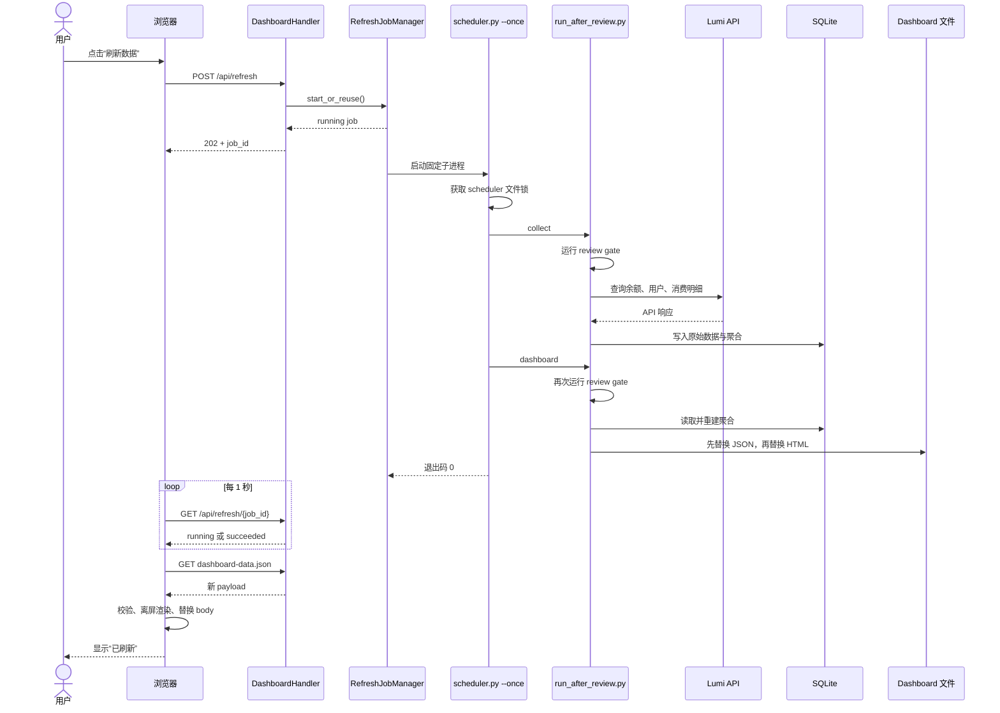

### 6.2 逐步讲解

#### 第 1 步：按钮进入运行态

`runManualRefresh()` 先检查 `manualRefreshRunning`，避免同一页面重复触发。然后：

- 保存按钮是否原本有焦点；
- 设置按钮 `disabled`；
- 设置 `aria-busy="true"`；
- 把文案改为“正在采集并刷新”；
- 取消旧自动读取结果的生效资格。

证据：`cloud_usage_monitor/dashboard_assets/lumi_dashboard.js` — `setManualRefreshState()`、`runManualRefresh()`。

#### 第 2 步：POST 创建任务

浏览器只发送空 POST。服务端要求原始 target 必须精确等于：

```plaintext
/api/refresh
```

以下请求都不会启动任务：

```plaintext
/api/refresh?force=1
//api/refresh
http://host/api/refresh
带非空 body 的请求
带 Transfer-Encoding 的请求
```

证据：`cloud_usage_monitor/dashboard_http.py` — `DashboardHandler.do_POST()`。

#### 第 3 步：同源检查

服务端比较 `Origin` 和 `Host` 的规范化主机与端口：

- 支持 HTTP/HTTPS 默认端口；
- 处理 IPv4、IPv6 和域名；
- 拒绝用户名、密码、非法端口、空格、zone id 等异常形式；
- 不信任 `X-Forwarded-*` 来改变判断。

如果浏览器没有发送 `Origin`，只要 `Host` 合法，当前实现仍接受请求。这兼容非浏览器或部分同源客户端，但也说明它不是身份认证。

证据：`cloud_usage_monitor/dashboard_http.py` — `_normalized_authority()`、`origin_matches_host()`。

#### 第 4 步：创建或复用内存任务

`RefreshJobManager.start_or_reuse()` 在内部线程锁下检查：

- 服务正在关闭：抛出 `RefreshJobManagerClosed`，API 返回 503；
- 已有 active job：直接返回该 job；
- 没有 active job：创建新 job 和非 daemon 工作线程。

终态任务最多保留 128 个，超出后删除较旧记录。服务重启后，内存 job 历史会丢失。

#### 第 5 步：有界启动 scheduler

工作线程调用 `run_bounded_process()`。它：

- 不提供 stdin；
- 合并 stdout/stderr；
- 最多保留 64 KiB 输出尾部；
- Windows 用 Job Object 收拢进程树；
- Unix 用新 session/process group 收拢进程树；
- 超时或关闭时终止整个进程树；
- API 和生命周期日志都不返回采集子进程原始输出。

“只保留输出尾部”可防止长时间任务无限占用内存；“不把输出暴露给 API”可减少凭证、路径或内部错误信息泄漏。

#### 第 6 步：scheduler 获取文件锁

`scheduler.py --once` 把 `max_runs` 设为 1。`run_cycle()` 获取文件锁后，锁覆盖完整的：

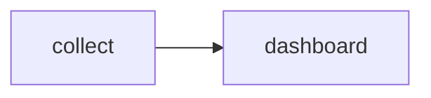

锁在周期结束或异常退出时由 context manager 释放。scheduler 睡眠期间不持锁。

#### 第 7 步：门禁后的采集

scheduler 调用：

```bash
python scripts/run_after_review.py collect --config <固定配置>
```

门禁通过后，`_run_collect()` 调用 `collect_lumi_usage()`：

1. `ListMyLumiCombos`：读取算力包余额；
2. `ListLumiUsers`：同步用户；
3. `ListLumiConsumeDetailLog`：分页拉取消费明细；
4. 写入余额快照、用户、消费日志、采集覆盖和 watermark；
5. 按资源、用户、日、小时重建聚合；
6. 重建运营汇总和告警。

所有云 API 都由 `VolcLumiClient` 发出查询请求。仓库代码没有通过该按钮调用创建、删除、授权或修改套餐接口。

证据：

- `scripts/run_after_review.py` — `_run_collect()`；
- `cloud_usage_monitor/lumi.py` — `VolcLumiClient`、`collect_lumi_usage()`。

#### 第 8 步：门禁后的 Dashboard

只有 collect 返回 0，scheduler 才继续：

```bash
python scripts/run_after_review.py dashboard --config <固定配置>
```

`_run_dashboard()`：

1. 重新连接 SQLite；
2. 初始化表；
3. 重建聚合和运营数据；
4. 生成 payload；
5. 写入 Dashboard 文件。

如果 collect 失败，Dashboard 步骤会被跳过。

#### 第 9 步：发布两个文件

`write_lumi_dashboard_files()` 先在目标目录中创建临时文件：

```plaintext
.dashboard-data.json.<随机>.tmp
.index.html.<随机>.tmp
```

每个临时文件都：

- 写入完整内容；
- `flush()`；
- `fsync()`；
- 关闭。

然后按顺序执行：

```plaintext
os.replace(JSON 临时文件, dashboard-data.json)
os.replace(HTML 临时文件, index.html)
```

同目录 `os.replace()` 让每个目标文件不会暴露“只写了一半”的内容。

#### 第 10 步：浏览器加载并原子重绘

job 成功后，浏览器强制读取 JSON。它先验证完整 schema，再：

1. 克隆当前 `<body>`；
2. 把新数据渲染到克隆 body；
3. 如果渲染成功，一次性 `replaceWith()`；
4. 最后才把全局 `data` 指向新 payload。


如果校验或离屏渲染失败，当前 body 和旧 `data` 保持不变。

证据：`cloud_usage_monitor/dashboard_assets/lumi_dashboard.js` — `isDashboardData()`、`renderNextDashboardData()`。

---

## 7. 数据与状态变化

### 7.1 刷新任务状态机

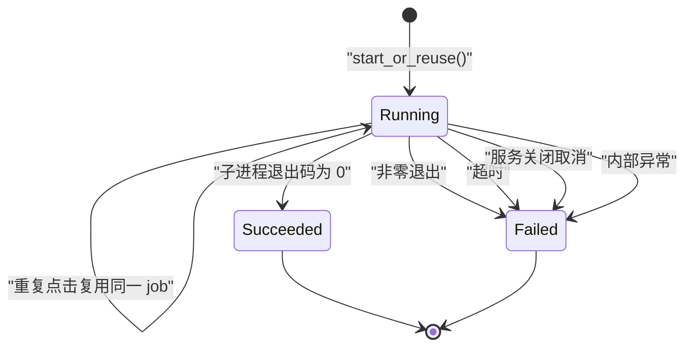

终态 message 被刻意收敛：

- 成功：`数据采集与 Dashboard 刷新完成`
- 失败：`刷新失败，仍显示上次数据`

具体堆栈和子进程输出不会返回浏览器。

### 7.2 SQLite 写入

采集会影响至少以下持久化对象：

| 表/对象 | 写入方式 | 作用 |
| --- | --- | --- |
| `lumi_balance_snapshots` | 插入 | 保存余额快照 |
| `lumi_users` | upsert | 同步用户信息 |
| `lumi_consume_logs` | insert/update | 保存消费明细并处理状态更新 |
| `lumi_collection_state` | upsert | 保存增量采集 watermark |
| `lumi_collection_coverage` | 合并区间 | 记录成功采集覆盖 |
| `lumi_resource_dimensions` | 重建 | 资源维度 |
| `lumi_user_resource_daily/hourly` | 重建 | 日/小时资源聚合 |
| `lumi_user_daily_summary` | 重建 | 用户运营汇总 |
| `lumi_service_daily_summary` | 重建 | 服务运营汇总 |
| `lumi_alert_events` | 重建 | 告警事件 |

`unique_measure_id` 是消费日志的业务去重键。相同编号只有在新记录 `updated_at` 更晚，或时间相同但内容变化时才更新。

证据：`cloud_usage_monitor/lumi.py` — `_upsert_consume_logs()`。

### 7.3 文件发布状态

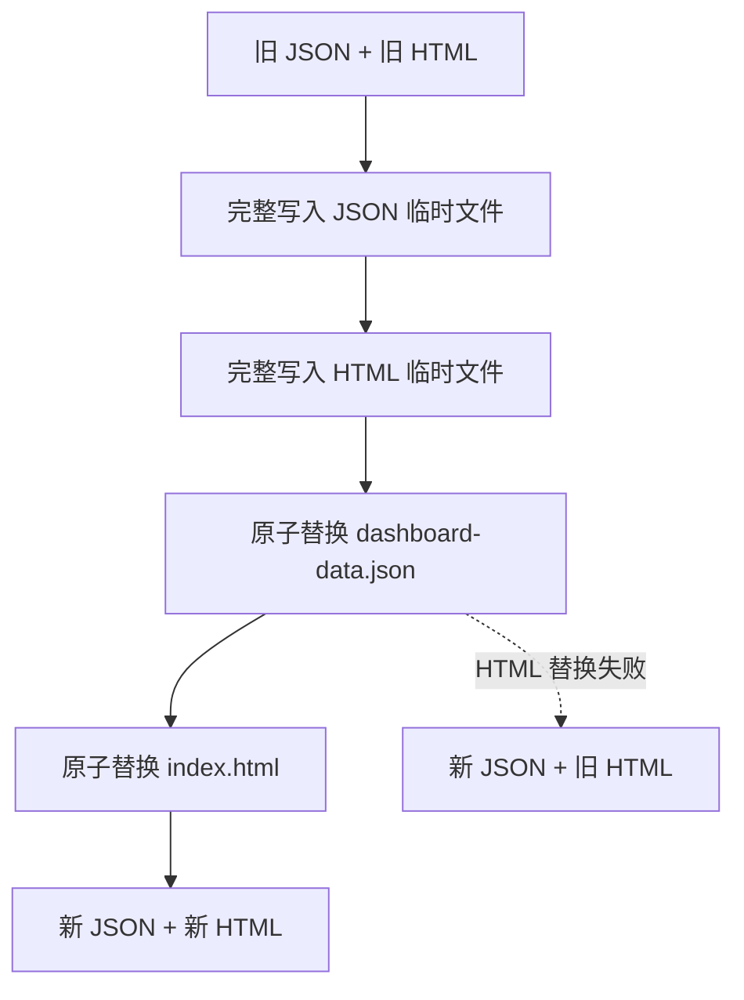

图中的虚线不是设计目标，而是代码明确允许的失败窗口。

如果 HTML 替换失败：

- 手动任务报告失败；
- 新 JSON 可能已经发布；
- 旧 HTML 仍可继续服务；
- 后续每 5 分钟自动检查可能读取并校验新 JSON，然后更新页面。

因此，“失败时仍显示上次数据”是前端安全文案和常见结果，不是两个文件都必然回滚的事务保证。

### 7.4 页面内状态

前端有三个相关状态：

| 状态 | 变量/元素 | 用途 |
| --- | --- | --- |
| 手动作业运行 | `manualRefreshRunning` | 阻止同页重复点击和自动检查 |
| 自动读取运行 | `automaticRefreshRunning` | 防止自动请求重叠 |
| 数据请求序号 | `dashboardDataRequestSequence` | 让较旧响应失效 |

当手动刷新开始时，序号递增。即使此前的自动 GET 较晚返回，它也不能覆盖手动流程准备加载的新数据。

---

## 8. 上游与下游闭环

### 8.1 上游入口

本功能有两个上游：

#### 用户手动入口

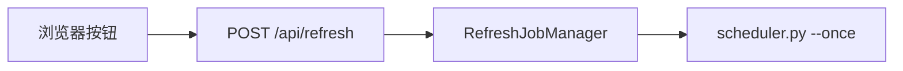

#### 定时入口

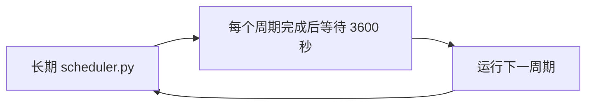

两者在 `run_cycle()` 和文件锁处汇合。

### 8.2 内部下游

从 scheduler 向下依赖：

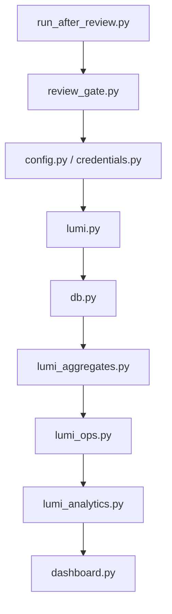

这些模块大多不是本分支新增，但必须阅读它们才能理解按钮到底刷新了什么。

### 8.3 外部边界

| 边界 | 代码能证明的内容 | 不能仅凭仓库确认的内容 |
| --- | --- | --- |
| Lumi API | 调用余额、用户、消费明细查询接口，单次请求 timeout 30 秒 | 生产账号实际 IAM 权限、API 可用性和限流 |
| 浏览器 | 通过同源 HTTP API 创建/查询任务 | 用户身份、SSO 会话和组织权限 |
| 文件系统 | 使用 SQLite、lock 文件和 Dashboard 文件 | VKE PVC 是否完整支持跨 Pod 文件锁语义 |
| 网络 | 服务默认可绑定 `0.0.0.0`，文档建议回环/内网/网关 | 真实环境是否配置 NetworkPolicy、Ingress 鉴权或防火墙 |
| 容器编排 | 镜像默认启动 `serve_monitoring.py` | 现有 VKE manifest 是否另有未入库 scheduler 工作负载 |

### 8.4 部署闭环

代码要求两个长期角色共享：

- 同一份 config；
- 同一个 `work/`；
- 同一个 `outputs/`。

推荐启动顺序是：

1. 启动监控服务；
2. 等待启动时 Dashboard 构建完成；
3. 验证 8780；
4. 再启动长期 scheduler。

监控服务启动时，`_refresh_dashboard()` 也会获取 scheduler 锁并先生成一次 Dashboard，然后才创建和监听 HTTP server。这样首个用户请求不应读到尚未生成的文件。

但是，仓库中的 `deploy/lumi-dashboard-vke.yaml` 当前只定义一个默认监控服务容器，没有定义 scheduler sidecar 或独立 Deployment。文档明确要求部署方补充 scheduler。这是当前仓库内最重要的“未完全接线”。

---

## 9. 失败路径与保护机制

### 9.1 失败矩阵

| 失败点 | 当前行为 | 调用方看到什么 | 是否已有重试/回滚 |
| --- | --- | --- | --- |
| 非法 POST target/body | 不创建任务 | 400/404 JSON | 无需重试 |
| Origin 与 Host 不匹配 | 不创建任务 | 403 JSON | 无 |
| 服务正在关闭 | 拒绝新任务 | 503 JSON | 浏览器显示失败 |
| 工作线程启动失败 | job 立即转为 failed | 安全失败文案 | 下次可新建 job |
| 文件锁 15 分钟未取得 | scheduler 返回 1 | job failed | 无自动重试 |
| review gate 失败 | 任务不执行 | job failed | 无自动重试 |
| collect 非零退出 | 跳过 dashboard | job failed | 无自动重试 |
| Lumi API 超时/错误 | collect 失败 | job failed | 客户端单请求 timeout 30 秒；未发现业务重试 |
| dashboard 非零退出 | 本轮文件不完整更新或部分更新 | job failed | 无跨文件回滚 |
| 子进程超过 30 分钟 | 终止进程树 | job failed | 无自动重试 |
| 监控服务关闭 | 设置 cancel event，终止子进程树并 join | 任务最终 failed | 关闭流程等待清理 |
| 最终 JSON fetch 失败 | 不替换页面 | “刷新失败，仍显示上次数据” | 5 分钟自动检查可能稍后恢复 |
| JSON schema 无效 | 不替换页面 | 刷新失败 | 保留最后有效页面 |
| 新数据渲染异常 | 不替换当前 body | 刷新失败 | 保留最后有效页面 |

### 9.2 collect 失败后的部分成功窗口

这是一个容易遗漏的细节。

`collect_lumi_usage()` 在写完原始采集数据、coverage 和 watermark 后会 `conn.commit()`。随后 `_run_collect()` 才重建 aggregate 和 ops，而这些函数也分别提交。

因此，如果：

1. 原始采集提交成功；
2. 后续聚合失败；

那么 scheduler 会把 collect 视为失败并跳过 Dashboard，但 SQLite 中可能已经包含新的原始数据。下一次成功运行 dashboard 时，可能会把这些数据纳入展示。

当前代码没有跨“原始采集 + 聚合 + Dashboard 文件”的全局事务。这是合理的工程取舍，但不能描述成全链路原子刷新。

### 9.3 文件发布的一致性窗口


单文件写入采用临时文件 + `os.replace()`，能避免读到半个 JSON 或半个 HTML。

但发布顺序是：

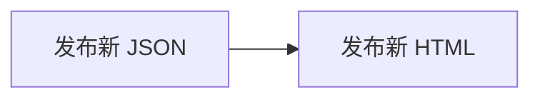

所以 HTML 替换失败时会留下“新 JSON + 旧 HTML”。这是有意记录并由测试覆盖的行为，不是未处理异常。

### 9.4 已实现的关闭保护

服务收到 SIGTERM 时：

1. 信号处理器转为 `KeyboardInterrupt`；
2. `RefreshJobManager.shutdown()` 拒绝新任务；
3. 设置 active job 的 cancel event；
4. 等待非 daemon 工作线程退出；
5. 关闭 admin 和 Dashboard server；
6. join admin thread；
7. 恢复原来的 SIGTERM handler。

子进程层会进一步终止整个进程树，避免只杀 scheduler 根进程却留下门禁、采集或测试孙进程。

### 9.5 没有实现的机制

以下机制在当前代码中没有被证明存在：

- HTTP 登录鉴权或基于角色的授权；
- 分布式 job 存储；
- job 状态跨服务重启恢复；
- 指数退避重试；
- 死信队列；
- 跨 SQLite、JSON、HTML 的事务；
- 多副本 leader election；
- metrics endpoint 或分布式 tracing；
- 直接运维命令自动参与 scheduler 锁。

它们应放在改进建议中，而不能描述为当前能力。

---

## 10. 详细代码导读

### 10.1 从静态徽标到可访问按钮

文件：

- `cloud_usage_monitor/dashboard_assets/lumi_dashboard_template.html` — `manualRefreshButton`；
- `cloud_usage_monitor/dashboard_assets/lumi_dashboard.css` — `.refresh-button`；
- `cloud_usage_monitor/dashboard_assets/lumi_dashboard.js` — `setManualRefreshState()`。

按钮使用原生 `<button type="button">`，而不是给 `<div>` 绑定点击事件。这样浏览器默认支持：

- Tab 键聚焦；
- Enter/Space 激活；
- disabled 状态；
- 辅助技术识别。

状态区域使用：

```html
role="status"
aria-live="polite"
```

运行时按钮旋转；`prefers-reduced-motion` 用户不会被强制动画。运行结束后，如果按钮原本有焦点，代码用 `focus({preventScroll: true})` 恢复焦点。

### 10.2 前端只有一个底层 fetch 入口

`fetchJsonBeforeDeadline()` 是所有请求的底层封装：

- 根据总 deadline 计算剩余时间；
- 为每次 fetch 创建 `AbortController`；
- deadline 到达时 abort；
- HTTP 非 2xx 抛错；
- 统一解析 JSON。

手动创建 job、轮询 job、自动读取 JSON、手动最终读取 JSON 都复用它，所以不会每层各自重置超时而无限延长总流程。

### 10.3 前端防竞态

假设：

1. 自动检查 A 发出；
2. 用户点击手动刷新；
3. 手动任务完成并加载新 JSON B；
4. 较老的 A 最后才返回。

如果没有保护，A 可能把页面覆盖回旧数据。

当前代码为每次数据读取递增 `dashboardDataRequestSequence`。响应返回时发现自己的 request id 已过期，就不再提交结果。

证据：`cloud_usage_monitor/dashboard_assets/lumi_dashboard.js` — `refreshDashboardData()`。

### 10.4 HTTP handler 为什么严格检查 raw target

`SimpleHTTPRequestHandler` 会对路径做一定解析或规范化。如果安全判断只看规范化后的 `self.path`，某些：

```plaintext
//api/refresh
http://host/api/refresh
带 query/fragment 的 target
```

可能在不同层被解释成相似路径。

本实现从 `requestline` 取原始 target，并要求 POST 完全匹配固定字符串。GET job 查询也拒绝 scheme、netloc、query、fragment、多段 job id 和非法字符。

这让“能启动作业的请求集合”尽量窄。

### 10.5 RefreshJobManager 为什么使用不可变快照

`RefreshJob` 是：

```python
@dataclass(frozen=True, slots=True)
```

运行中和完成后不是修改同一个对象字段，而是用新快照替换字典里的值。这减少了读线程看到“部分字段刚更新、部分还没更新”的状态。

manager 的职责边界：

- 生成 job id；
- 保证一个 active manual job；
- 启动和回收线程；
- 把子进程结果转换成安全状态；
- 关闭时取消和等待；
- 限制终态记录数量。

它不负责 HTTP、采集、锁或 Dashboard 渲染。

### 10.6 有界子进程为什么复杂

简单的 `subprocess.run(..., timeout=...)` 可能只终止直接子进程，留下孙进程。

本项目的 scheduler 会再启动：

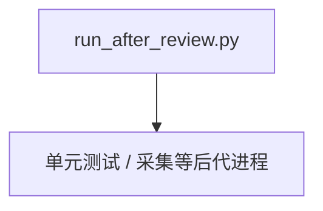

因此 `run_bounded_process()`：

- Windows：先 suspended 创建根进程，加入 Job Object 后再 resume；
- Unix：创建新 session，以 process group 为单位发送信号；
- 独立 reader thread 持续排空 stdout，避免 pipe 写满造成死锁；
- 只保留输出尾部；
- 无论正常、超时还是取消，finally 都执行进程树清理。

这是整个分支技术复杂度最高的模块。

### 10.7 scheduler 如何串行

`run_scheduler()` 只计算一次 lock path，然后循环调用 `run_cycle()`。

`run_cycle()` 的关键顺序：

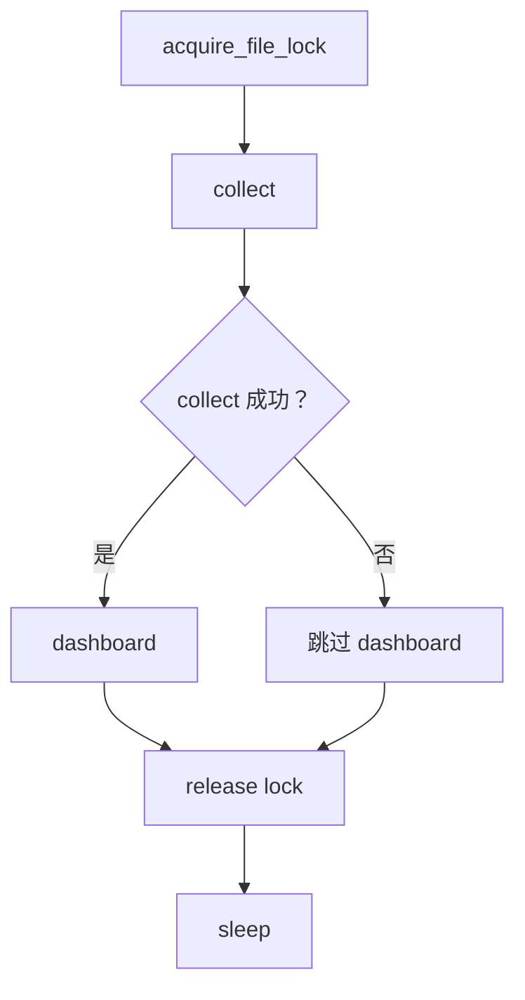

因此：

- sleep 不阻塞手动刷新；
- collect 失败时不发布基于不完整周期的新 Dashboard；
- 定时与手动使用同一锁；
- 手动点击发生在定时任务中间时，会等待，不会插队并发执行。

### 10.8 监控服务如何组合

`serve_monitoring._compose_service()`：

1. 解析绝对 config 路径；
2. 加载配置；
3. 在 scheduler 锁内构建启动 Dashboard；
4. 创建 `RefreshJobManager`；
5. 创建 Dashboard handler；
6. 创建 admin server；
7. 创建 Dashboard server。

主线程运行 Dashboard server，另一个非 daemon thread 运行 admin server。

这种组合保证按钮 API 和静态文件来自同一个 8780 server，而 8765 仍只提供 SQLite 管理功能。

### 10.9 Dashboard 文件如何发布

`dashboard._stage_text_file()` 负责一个文件的可靠 staging；`write_lumi_dashboard_files()` 负责两个文件的顺序。

异常处理刻意保留“主错误”：

- close 或临时文件清理失败不会覆盖最初的写入/替换异常；
- close 最多重试一次；
- staging 失败时尝试删除所有已知临时文件。


这些分支都有专门测试。

### 10.10 前端渲染为什么先克隆 body

如果直接在当前页面逐块更新，渲染到一半抛错，用户可能看到：

- 新 summary；
- 旧 chart；
- 被清空的筛选器；
- 已经失效的事件监听器。

`renderNextDashboardData()` 先克隆 body 并在克隆体上运行完整 `renderDashboard()`。只有所有步骤成功，才一次替换 body。

这是“页面级提交”：不是浏览器数据库事务，但能避免半更新 UI。

---

## 11. 测试与验证

### 11.1 实际运行的命令

在手动刷新功能的 linked worktree 中执行：

```powershell
$BASELINE = "<功能基线分支>"
git diff --check "$BASELINE...HEAD"
git diff --cached --check
git diff --check
python -m unittest discover -s tests
```

结果：

```plaintext
Ran 155 tests in 40.579s
OK
```

三个 `git diff --check` 命令没有输出错误。

### 11.2 测试覆盖地图

| 文件 | 主要覆盖 |
| --- | --- |
| `tests/test_process_lock.py` | 第二进程超时、释放后可重获、锁路径 |
| `tests/test_scheduler.py` | collect→dashboard、collect 失败跳过、锁释放、sleep 不持锁 |
| `tests/test_dashboard_refresh.py` | 固定 argv、输出上限、超时/取消、进程树、job 生命周期、shutdown |
| `tests/test_dashboard_http.py` | API 202/200/400/403/404/503、同源、body、非法 target、静态文件 |
| `tests/test_serve_monitoring.py` | 服务组合、启动锁、SIGTERM、资源关闭顺序 |
| `tests/test_dashboard.py` | 按钮语义、deadline、schema、文件发布顺序、清理失败 |
| `tests/test_docker_packaging.py` | Docker 默认入口、文档端口安全、部署和维护顺序 |

### 11.3 现有测试的强项

- HTTP 解析的异常输入覆盖很细；
- 真正创建本地 HTTP server 检查状态码；
- 进程测试会生成子/孙进程，检查超时后 sentinel 不被写入；
- shutdown race 和线程启动失败有覆盖；
- 原子替换的多个失败点有覆盖；
- 跨进程文件锁有真实第二进程测试。

### 11.4 尚缺少的验证

**代码事实**：计划文档曾要求用受控 `window.fetch` 做真实浏览器行为验证，但当前 `tests/test_dashboard.py` 主要通过 HTML 解析和 JavaScript 源码字符串断言检查前端契约，仓库中未发现 Playwright/jsdom 驱动的点击与竞态测试。

因此尚应补充：

- 点击按钮后真实观察 POST、轮询和最终 GET；
- 自动旧响应晚于手动响应时，真实确认不会回滚；
- JSON schema 错误时，真实 DOM 保持不变；
- 渲染异常时，真实 DOM 保持不变；
- 键盘激活、焦点恢复和 reduced motion；
- 真 Lumi 环境的端到端验收；
- 真实反向代理/Ingress 下 Origin、Host 和超时行为；
- 真实 PVC 上跨容器/Pod 的文件锁行为。

---

## 12. 设计选择与取舍

### 12.1 复用 scheduler，而不是复制采集逻辑

优点：

- 手动与定时执行相同 collect/dashboard 顺序；
- 共用 review gate；
- 共用文件锁；
- 减少两条业务链逐渐不一致。

代价：

- 一次手动刷新会启动多层 Python 进程；
- review gate 在 collect 和 dashboard 前各跑一次；
- 延迟较高；
- 进程树管理更复杂。

### 12.2 202 + polling，而不是长连接

优点：

- 避免单个 POST 长时间占用连接；
- 对普通 HTTP server 和中间代理要求低；
- 刷新 job 状态清晰。

代价：

- 每秒产生一次 GET；
- job 状态只存在内存；
- 页面刷新或服务重启后没有恢复协议；
- 多副本下 job id 可能被请求到另一个副本。

### 12.3 文件锁，而不是数据库分布式锁

优点：

- 零新增依赖；
- 适合当前单机/共享本地存储架构；
- Windows 和 Linux 都可运行。

代价：

- 依赖底层共享文件系统的锁语义；
- 不提供排队可观测性；
- 不适合无共享盘的多副本；
- 不能自动覆盖绕过 scheduler 的直接命令。

### 12.4 JSON 先于 HTML

优点：

- 运行中的旧 HTML 已经具备读取新 JSON 的逻辑；
- JSON 是页面动态更新真正依赖的数据；
- HTML 失败后，自动检查仍可能恢复到新数据。

代价：

- 两文件可能短暂或持续版本不一致；
- 手动作业可能报告失败，但页面稍后仍更新；
- 运维人员不能把 job failed 简单等同于“没有任何新文件”。

### 12.5 严格前端 schema

优点：

- 无效 payload 不会破坏页面；
- 对后端字段变化形成显式契约；
- 强制关键列表每行结构一致。

代价：

- 后端新增必需字段或允许旧行缺字段时，要同步更新校验器；
- 一个无关列表行异常可能阻止整个页面更新；
- 手写校验代码较长。

---

## 13. 未完整接线与改进建议

### 13.1 当前已确认的未完整接线

#### VKE manifest 没有 scheduler

`deploy/lumi-dashboard-vke.yaml` 只定义默认监控服务容器。它能提供按钮和 API，但如果没有另行部署 scheduler，就没有周期更新。

仓库文档已经明确要求增加：

- 同镜像 scheduler sidecar；或
- 独立 scheduler Deployment；
- 两者共享 config、`work/` 和 `outputs/`。

#### 前端真实行为测试未落地

计划文档要求 behavioral browser test，但当前测试仍主要是源码契约断言。实现已存在，自动化验证层尚未完全匹配计划。

#### 内网边界不在代码中

用户上下文说明 Dashboard 在内网，但仓库不能证明生产网络确实封闭。API 没有用户级鉴权。

### 13.2 改进建议

#### 建议 A：补真实浏览器测试

优先级高，成本中等。

用 Playwright 启动本地 server，控制 job API 和 JSON 响应，验证完整点击、轮询、竞态、失败保留和键盘访问。

#### 建议 B：为生产入口增加认证边界

如果 8780 可能越过可信内网，应在网关或应用层增加认证/授权。仅靠 Origin/Host 不能识别“谁有权触发一次真实采集”。

代价是需要接入 SSO、反向代理身份头或应用 session，并处理非浏览器运维客户端。

#### 建议 C：给 job 状态增加可观测性

可以增加：

- job duration；
- lock wait duration；
- collect/dashboard 各自退出码；
- 最近一次成功时间；
- structured metrics。


注意不能把凭证、命令输出或敏感路径返回前端。

#### 建议 D：减少重复门禁成本

可设计一个经过一次 review gate 后在同一受控进程内完成 collect + dashboard 的命令。

收益是降低延迟；代价是扩大单个入口职责，并需要重新证明失败隔离和维护命令兼容性。

#### 建议 E：明确多副本策略

如果未来扩容：

- 单副本 + Recreate 是最简单的当前适配方式；
- 多副本需要 sticky routing 或共享 job store；
- 文件锁应在目标 PVC 类型上做真实验证；
- 更大规模可考虑数据库锁或队列，但会增加运维复杂度。

#### 建议 F：让直接写命令显式选择锁

当前 `run_after_review.py collect/dashboard/backfill` 不参与 scheduler 锁，文档要求维护窗口手工停服务。

未来可为这些命令增加明确的 `--acquire-scheduler-lock` 模式，但必须避免嵌套调用造成同一进程链重复取锁。

---

## 14. 初学者代码阅读顺序

| 顺序 | 文件与符号 | 阅读目标 |
| --- | --- | --- |
| 1 | `cloud_usage_monitor/dashboard_assets/lumi_dashboard_template.html` — `manualRefreshButton` | 看用户实际点击什么 |
| 2 | `cloud_usage_monitor/dashboard_assets/lumi_dashboard.js` — `runManualRefresh()` | 看浏览器主流程 |
| 3 | 同文件 — `waitForManualRefresh()` | 看 polling 协议 |
| 4 | 同文件 — `isDashboardData()` | 看前端如何拒绝坏数据 |
| 5 | 同文件 — `renderNextDashboardData()` | 看离屏渲染和页面提交 |
| 6 | `cloud_usage_monitor/dashboard_http.py` — `make_dashboard_handler()` | 看 API 路由和输入限制 |
| 7 | `cloud_usage_monitor/dashboard_refresh.py` — `RefreshJobManager` | 看 job 生命周期 |
| 8 | 同文件 — `run_bounded_process()` | 看进程树、输出和 timeout |
| 9 | `scripts/scheduler.py` — `run_cycle()` | 看手动与定时如何汇合 |
| 10 | `cloud_usage_monitor/process_lock.py` — `acquire_file_lock()` | 看跨进程互斥 |
| 11 | `scripts/run_after_review.py` — `_run_collect()` | 看采集入口 |
| 12 | `cloud_usage_monitor/lumi.py` — `collect_lumi_usage()` | 看 Lumi API 到 SQLite |
| 13 | `scripts/run_after_review.py` — `_run_dashboard()` | 看 Dashboard 生成入口 |
| 14 | `cloud_usage_monitor/lumi_analytics.py` — `build_lumi_dashboard_payload()` | 看 JSON 从哪里来 |
| 15 | `cloud_usage_monitor/dashboard.py` — `write_lumi_dashboard_files()` | 看文件发布 |
| 16 | `scripts/serve_monitoring.py` — `_compose_service()` | 最后回看整个服务如何组装 |

读测试时，建议按同样层次从小到大：

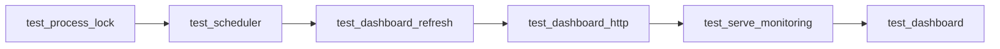

---

## 15. 变更文件索引

| Git 状态 | 路径 | 关键符号/内容 | 对应章节 |
| --- | --- | --- | --- |
| M | `README.md` | 定时/手动刷新、维护窗口、部署说明 | 8、13 |
| M | `cloud_usage_monitor/dashboard.py` | `_stage_text_file()`、`write_lumi_dashboard_files()` | 7、9、10 |
| M | `cloud_usage_monitor/dashboard_assets/lumi_dashboard.css` | `.refresh-button`、状态和无障碍动画 | 10 |
| M | `cloud_usage_monitor/dashboard_assets/lumi_dashboard.js` | polling、schema、竞态、离屏渲染 | 5、6、7、10 |
| M | `cloud_usage_monitor/dashboard_assets/lumi_dashboard_template.html` | `manualRefreshButton`、live region | 3、10 |
| A | `cloud_usage_monitor/dashboard_http.py` | `origin_matches_host()`、`DashboardHandler` | 5、6、9、10 |
| A | `cloud_usage_monitor/dashboard_refresh.py` | `run_bounded_process()`、`RefreshJobManager` | 4、5、6、9、10 |
| A | `cloud_usage_monitor/process_lock.py` | `refresh_lock_path()`、`acquire_file_lock()` | 5、10 |
| M | `docs/architecture.md` | 新架构与长期入口 | 4、8 |
| M | `docs/lumi-dashboard-rollout-checklist.md` | 启停和维护顺序 | 8、13 |
| M | `docs/openclaw-setup.md` | 监控服务、scheduler 和 backfill | 8 |
| M | `docs/superpowers/plans/2026-07-27-scheduler-manual-dashboard-refresh.md` | 前端测试策略修订 | 11、13 |
| M | `scripts/scheduler.py` | `run_cycle()`、锁和 `--once` | 5、6、10 |
| M | `scripts/serve_monitoring.py` | `_refresh_dashboard()`、`_compose_service()`、shutdown | 4、6、9、10 |
| M | `tests/test_dashboard.py` | 前端契约、文件发布失败 | 11 |
| A | `tests/test_dashboard_http.py` | API 和请求解析 | 11 |
| A | `tests/test_dashboard_refresh.py` | 进程与 job 生命周期 | 11 |
| M | `tests/test_docker_packaging.py` | 文档、端口和部署顺序 | 11 |
| A | `tests/test_process_lock.py` | 跨进程锁 | 11 |
| M | `tests/test_scheduler.py` | 周期顺序和锁释放 | 11 |
| A | `tests/test_serve_monitoring.py` | 服务组合和关闭 | 11 |

---

## 16. 未知项

| 未知 | 为什么仓库证据不足 | 需要什么证据 |
| --- | --- | --- |
| 生产 8780 是否严格只在内网 | 用户上下文说“内网”，但网络配置不在完整仓库证据内 | 防火墙、Ingress、Service、NetworkPolicy 实际配置 |
| 是否有 SSO/网关鉴权 | 应用代码没有鉴权；可能由外部网关提供 | 网关路由和认证策略 |
| VKE 是否已经另行部署 scheduler | manifest 没有，但可能有外部平台配置 | 实际工作负载清单 |
| PVC 是否支持可靠跨 Pod 文件锁 | 本地测试只能证明本机文件系统 | 目标存储类型和双 Pod 锁测试 |
| Lumi 生产凭证是否只读 | 文档要求只读，代码无法检查 IAM 授权细节 | 云账号策略 |
| 真实采集耗时是否适合 30 分钟 | 仓库没有生产时延数据 | 运行日志和分位耗时 |
| 多副本时 job 查询是否粘滞 | 当前 manifest `replicas: 1`，未来拓扑未知 | Service session affinity 或共享 job store 设计 |
| 浏览器实际行为是否通过端到端测试 | 当前未发现浏览器自动化测试 | Playwright/jsdom 测试结果 |

---

## 17. 总结与复习题

### 17.1 一句话总结

这个分支不是简单把文字换成按钮，而是把一个静态 Dashboard 扩展成“可由用户发起、可查询状态、受跨进程互斥保护、经过 review gate、能安全发布并在前端校验后提交”的完整刷新闭环。

### 17.2 最重要的五个结论

1. 按钮触发的是固定 `scheduler.py --once`，不是任意命令。
2. 手动与定时任务在 scheduler 文件锁处汇合。
3. collect 成功后才执行 dashboard，但全链路不是一个事务。
4. JSON 和 HTML 分别原子替换，两个文件之间仍有一致性窗口。
5. 应用只实现同源请求限制，没有实现用户身份鉴权；内网安全依赖部署。

### 17.3 复习题

1. 为什么 `POST /api/refresh` 返回 202，而不是等 30 分钟再返回 200？
2. 线程锁和 scheduler 文件锁分别防止哪种并发？
3. 为什么自动刷新不触发采集？
4. collect 原始数据提交成功、聚合失败时，SQLite 和 Dashboard 分别可能处于什么状态？
5. 为什么 `dashboard-data.json` 要先于 `index.html` 替换？
6. `requestSequence` 如何防止旧自动响应覆盖手动结果？
7. 为什么同源校验不能代替身份鉴权？
8. 为什么直接运行 `run_after_review.py backfill` 前仍要进入维护窗口？

如果你能根据代码回答这些问题，就已经掌握了本功能的核心结构和主要风险边界。
