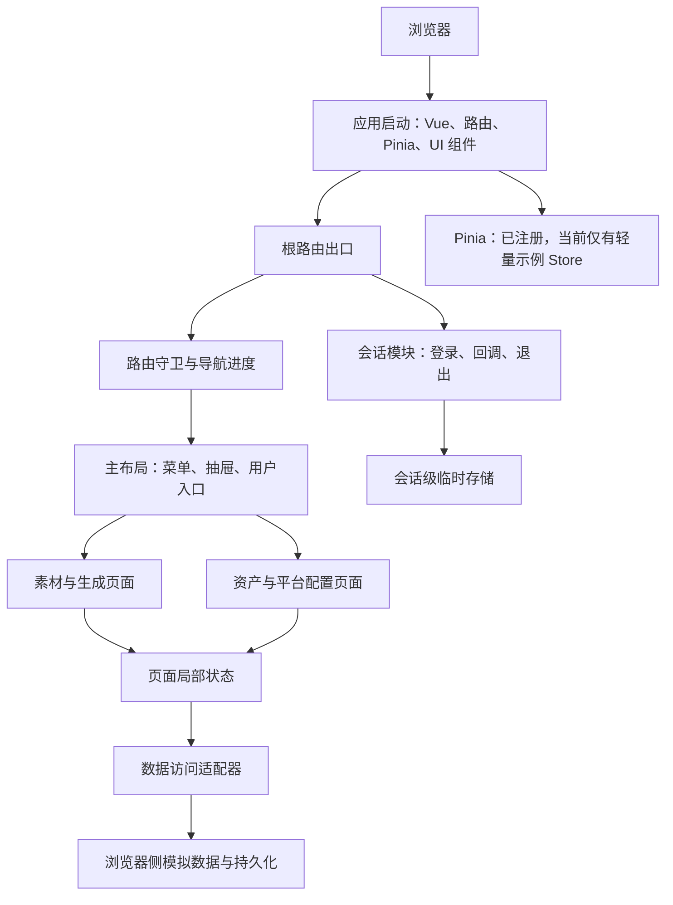
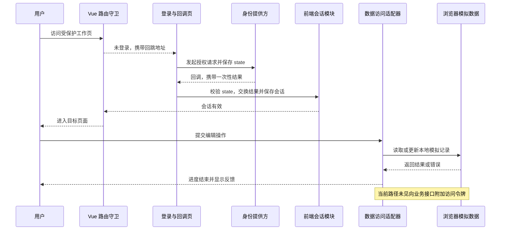

> 本文是经过脱敏的项目复盘。业务名称、组织信息、地址、应用标识、账号、令牌和配置值均已移除或泛化；图中的名称仅表示职责，不对应任何真实接口。文中将明确标注“当前实现”“审查推断”和“改进建议”，避免把规划当成已落地能力。

营销管理前端往往同时承载素材、资产、生成任务和第三方平台配置等页面。它的难点不只是把表格和表单画出来，而是让页面边界、会话边界和数据边界能够一起演进：原型阶段可以使用浏览器内的模拟数据快速验证流程；多人协作和真实数据接入后，则必须让服务端成为身份、权限和数据写入的最终裁决者。

本文复盘的应用采用 Vue 3、TypeScript、Vite、Vue Router、Pinia 与组件库，已经具备单页应用的基本骨架、登录回调流程和容器化交付路径。它也保留了典型原型特征：业务数据访问主要落在浏览器侧的模拟数据层，核心业务状态尚未沉淀为领域 Store。理解这两点，是正确评价该架构的前提。

## 解决的问题与边界

界面把能力归为两组：一组面向素材与生成过程，例如上传、分类、标签和生成任务；另一组面向资产维护，例如产品、应用和外部平台配置。桌面端使用侧栏，窄屏切换为抽屉菜单，内容区通过嵌套路由装载具体工作页。

**当前实现**解决的是“登录后访问多个工作页，并在本地完成演示数据的读取、编辑和反馈”。它不包含可由源码证明的服务端角色判定、资源级数据范围控制、审计留存或真实业务接口鉴权。

**审查推断**是：前端路由拦截适合改善用户体验，但它只能控制浏览器里的导航；任何用户都可以修改或绕开浏览器状态。只要业务数据能够经网络访问，服务端仍必须独立验证凭据、判断权限和限制数据范围。

## 一句话架构判断

这是一个“壳层、路由、页面、轻量会话模块和本地数据适配器分离”的 Vue 原型：页面组织清楚，登录流程已有闭环雏形；要进入生产环境，优先补齐服务端受保护接口、领域状态与端到端测试，而不是继续在页面中堆叠条件判断。

## 组件分层：从应用壳到业务页面

应用启动时注册路由、Pinia、持久化插件和 UI 组件库。根组件只渲染路由出口；主布局负责菜单、响应式抽屉、当前用户显示和退出入口；功能页面通过路由懒加载。这个分层使布局改动不必侵入每个业务页，也为按路由拆包保留了空间。

这里有三个值得保留的边界。

1. **布局不承担领域逻辑。** 主布局只关心导航、断点适配、用户展示和退出动作；素材与资产页各自持有表单、列表和加载状态。页面不应反向操纵侧栏的实现细节。
2. **路由表达信息架构。** 受保护根路由下再挂载工作区子路由，便于统一应用登录要求；页面组件使用异步加载，初始包不必携带全部工作页。
3. **数据访问集中。** 现有包装器以统一的 `get/post/put/patch/delete` 形态处理数据、进度条和错误提示，页面不直接操作持久化细节。这一接口形状可成为以后替换真实 HTTP 客户端的迁移接缝。

## 路由与 Pinia：不要把“注册了”写成“已经治理了”

**当前实现**中，路由元数据标记需要登录的父级工作区。全局前置守卫检查内存中的会话计算值；未登录时跳转登录页并保留目标地址，已登录再次访问登录页时回到工作区。后置守卫统一结束导航进度，避免异常跳转后进度条悬挂。

Pinia 和持久化插件已在应用入口注册，但可见 Store 仍是一个简单的计数示例。用户会话实际由独立认证模块中的响应式引用管理，并写入浏览器的会话级存储；业务页面的主要状态则分散在组件和模拟数据中。因此，不能把此实现描述为“已通过 Pinia 管理用户、权限和营销领域状态”。

**改进建议**是按生命周期划分状态，而非为了使用 Store 而集中一切：

| 状态类别 | 合适的位置 | 生命周期与原则 |
| --- | --- | --- |
| 输入框、弹窗、表格加载 | 页面组件或组合式函数 | 路由离开即可丢弃，避免全局污染 |
| 筛选条件、分页、当前工作上下文 | 领域 Pinia Store | 可按业务需要恢复，明确清理时机 |
| 已登录用户的最小展示信息 | 会话 Store 或服务端会话查询 | 不存放长期凭据或服务端权限真相 |
| 角色、数据范围、操作许可 | 服务端策略接口 | 前端可缓存展示结果，但不能作为执法依据 |

这张表也解释了一个常见误区：前端的“鉴权”通常是登录态感知、路由引导和按钮隐藏；服务端授权才是对每个请求、资源和动作作出允许或拒绝的安全决策。隐藏“删除”按钮可以减少误操作，却不能替代服务端拒绝未授权删除。

## 认证与一次代表性数据操作

**当前实现**同时包含两条浏览器侧登录分支。演示分支可在浏览器内直接建立一个会被路由守卫接受的会话，不经过服务端凭据验证或身份断言；它只能用于演示，不能作为生产认证。可选的单点登录分支会从登录页发起认证，浏览器保存一次性 `state` 与回跳地址；认证方回调前端后，回调页兼容读取查询参数或哈希参数，校验 `state`，在浏览器中交换短期授权码并按需读取用户资料，最后恢复原目标路由。该交换的当前实现还要求构建读取一项不应进入公开客户端的机密配置；这不是假设，而是当前实现的生产风险，因此这条分支同样不能原样作为生产认证方案。

会话到期后，计算状态不再把用户视为已登录，路由守卫会据此拒绝受保护导航；但运行中的到期不会立即删除浏览器存储内容。存储会在用户退出或后续初始化发现无效会话时清理。将“到期即主动清理并提示重新登录”列为后续改进，才能避免把状态判断误写成即时存储清除。

下面的图刻意区分已经存在的流程和缺失的业务接口边界。它追踪的是“登录后编辑一条演示记录”的代表性路径，而不是把它误称为已完成的受保护业务请求。

**审查推断**：认证模块会把访问令牌用于请求用户资料，但数据访问包装器没有消费该令牌；它当前操作的是浏览器内的模拟数据。换言之，源码可证明“前端已建立会话并拦截路由”，不能证明“业务 API 已经执行服务端认证与授权”。部署配置中的代理路径同样只是转发能力，代理本身不会自动把前端路由守卫变成安全边界。

## API 包装、错误处理与替换策略

现有数据访问适配器提供了有价值的原型体验：统一显示导航进度，解析无效路径或不存在记录时抛出统一错误，并通过组件库消息提示反馈结果。其内部将初始演示数据复制到浏览器存储后完成增删改查，因此刷新后的行为可重复，也无需依赖外部环境。

**当前限制**是该适配器同时承担“模拟数据仓库”和“请求 API”的角色。真实服务接入后，直接在原模块中叠加大量条件分支会让重试、取消、错误分类和数据一致性迅速变得难以维护。

建议保留页面调用的抽象形状，同时拆成三层：

- `transport`：只处理基地址、超时、取消、序列化和受控凭据发送；
- `resource client`：按素材、资产、任务等资源定义类型化方法与响应校验；
- `repository/mock adapter`：在演示或离线模式提供同一接口，并显式标识为模拟实现。

错误也应分级：网络不可达提示重试；认证失效清理会话并回到登录；授权拒绝解释“没有权限”但不泄露策略细节；字段校验回到具体表单；未知错误只展示安全的关联编号。开发诊断信息应进入受控日志，不能将上游响应体、令牌或个人资料直接弹给用户。

## 权限、安全与敏感信息处理

**当前实现**有几个可复用的防护动作：授权发起前生成随机 `state`，回调时默认校验它；会话状态带有到期判断；退出会清理会话与待处理登录状态；页面导航使用受保护路由元数据。这些只能改善前端流程，不能把浏览器侧状态变成可信身份。

**审查推断**指出三项必须在上线前处理的当前风险。第一，默认可用的浏览器侧演示登录分支仅在客户端建立会话，不能证明用户身份，也不能作为生产认证。第二，当前单点登录的浏览器令牌交换依赖一项不应进入公开客户端的机密构建配置；静态产物会被浏览器用户取得，环境变量不能把机密变成服务端秘密。第三，浏览器可读存储不适合作为高价值长期凭据的最终落点；一旦发生脚本注入，令牌可能被读取。以上三项都不是服务端授权：服务端仍须独立验证身份、会话和资源级操作许可。

**改进建议**如下：

- 对浏览器应用采用适合公开客户端的授权方式，例如授权码加 PKCE；涉及机密交换、刷新令牌或第三方签名时由后端会话层处理。
- 以受限的安全 Cookie 或后端会话降低脚本读取凭据的暴露面，并结合安全响应头、内容安全策略与退出失效机制；具体取舍应由威胁模型决定。
- 在会话到期时主动清理客户端残留状态、提示重新登录并取消进行中的受保护请求；后端仍要拒绝每一个无效或过期会话。
- 每个业务请求在服务端验证身份，再以“主体、动作、资源、数据范围”判断授权；前端只消费结果来渲染体验。
- 校验回跳地址为站内允许路径，错误消息使用稳定错误码和通用文案，避免把认证方原始响应透出。
- 记录登录失败、授权拒绝、关键写操作和相关请求标识，日志必须脱敏并设置保留期限。

## 构建、部署与可观测性

当前交付采用典型多阶段容器构建：构建阶段安装依赖并生成静态产物，运行阶段由 Web 服务器提供文件；服务器配置了单页应用的 history fallback，并预留了将某一类请求反向代理到后端的能力。这种方式镜像小、发布路径清楚，也能让刷新深层路由回到前端入口。

上线时要把“静态托管”和“业务安全”分开验收。前者检查资源缓存、压缩、路由回退和错误页；后者检查代理上游的超时、健康检查、TLS、服务端令牌验证、跨域策略和审计。反向代理只解决传输与路由，不替代认证或授权。

当前可见实现未展示浏览器错误上报、请求关联标识或性能指标。建议至少建立三类信号：前端错误率和路由失败率、关键 API 的延迟与失败分类、登录回调成功率与拒绝原因分布。告警应基于趋势和业务影响，而不是把用户输入或身份资料写入日志。

## 测试策略与常见故障

**当前实现**未见可执行的前端测试脚本或匹配的单元、组件测试文件，因此不能宣称已经覆盖登录、路由守卫或数据适配器。构建和静态检查只能证明类型与打包链路基本可用，不能证明会话安全或业务行为正确。

可按风险从低到高补齐测试：

1. 为会话模块写单元测试：过期会话、缺失或不匹配的 `state`、回跳地址恢复、退出清理和回调异常。
2. 为路由守卫写组件或集成测试：匿名访问、已登录访问、登录页回退和懒加载失败的可恢复提示。
3. 为资源客户端写契约测试：成功、字段校验、未认证、未授权、超时和取消都映射为稳定 UI 状态。
4. 在隔离环境执行端到端测试：从登录模拟到受保护页面，再到受限写操作被服务端拒绝；测试使用专门的虚拟身份与数据，绝不写入真实凭据。

典型故障包括刷新后会话丢失、回调状态不匹配、深层路由被服务器返回 404、后端超时被误提示为权限不足，以及前端隐藏按钮后接口仍可被直接调用。将这些场景列入发布前清单，比只检查“页面能打开”更有效。

## 当前限制与可执行的优化路线

建议按以下顺序演进，而不是一次性重写：

1. **先替换安全边界。** 为真实业务接口建立服务端认证和资源授权；将不应出现在浏览器的机密迁出前端；把会话失效、续期和退出设计成可测试的协议。
2. **再替换数据边界。** 让模拟适配器和真实资源客户端实现同一类型化接口，逐页迁移；为加载、空态、重试和并发保存确定一致交互。
3. **随后治理状态。** 建立少量领域 Store，明确哪些可恢复、哪些必须在切换账户或退出时清空；不要持久化权限真相和敏感令牌。
4. **最后完善质量闭环。** 把单元、组件、端到端、依赖审计和容器镜像检查接入持续集成，并通过脱敏日志和指标回看真实故障。

## 可迁移的工程经验与面试表达

这个案例最值得迁移的经验，是把“页面是否可见”和“请求是否被允许”分成两个问题。前端可以用路由守卫让用户少走弯路，用状态管理让交互稳定，用统一适配器降低迁移成本；但只有服务端才能对真实资源执行可信的授权裁决。

如果在面试中概括这类架构，可以这样表达：我会先把 Vue 应用划为壳层、路由层、页面层、领域状态层和数据访问层；认证回调只建立会话，路由守卫只改善导航；所有真实写操作仍由服务端验证身份与授权。原型期用可替换的模拟适配器缩短反馈周期，生产期再用类型化资源客户端、可观测性和分层测试把风险收敛到明确边界内。
