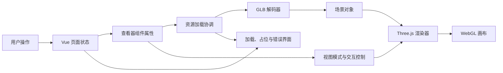
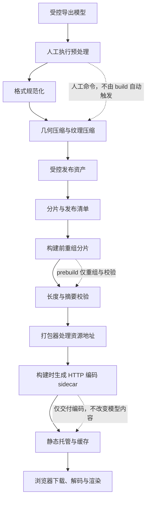

> 本文是一次脱敏技术复盘。它只记录可迁移的工程模式，不包含组织或项目名称、模型名称、资产路径、私有位置、二进制元数据、版本记录或可还原内部资源的细节。

Web 3D 的难点不是把模型放进页面，而是让资源在构建、传输、解码、渲染、切换和销毁的每一个阶段都有明确的责任边界。下面将**当前实现**、**审查推断**与**改进建议**分开说明；文中的性能方向均不是实测结论。

## 先给结论

- **当前实现**：Vue 组件负责界面状态与生命周期，渲染组件集中管理 Three.js 场景、相机、控制器、加载器和 WebGL 画布；构建前只重组分片并校验完整性，人工预处理与构建时 HTTP 内容编码是另外两条独立路径。
- **审查推断**：模型替换会释放旧模型的几何体和材质；组件卸载则释放渲染器、控制器与几何解码器，当前活动模型及其纹理尚未走同一条遍历释放路径。
- **改进建议**：把资产发布清单、加载优先级、GPU 资源所有权和性能验收指标写成可执行契约；优化应以真机网络与真实场景测量为准，而不是凭模型文件大小或本地观感判断。

## 运行时架构：把界面状态与 GPU 生命周期分开

**当前实现**将业务界面和 3D 查看器拆为独立 Vue 组件。上层选择或生成结果改变时，查看器接收新的资源地址与显示选项；下层初始化场景、相机、灯光、交互控制和渲染循环，并通过加载状态把进度、占位和错误信息反馈给界面。

这种分层的价值在于：Vue 不直接持有网格、材质或 WebGL 上下文，Three.js 也不决定页面业务流程。组件卸载时，查看器会停止动画帧、解绑窗口事件、移除画布，并释放渲染器、控制器与几何解码器；这不等同于已遍历并释放当前活动模型的全部 GPU 资源。

**审查推断**是，若把模型切换、历史记录和异步生成结果都交给同一个加载入口，竞态会比渲染本身更早出现：较早发出的请求可能在较晚选择之后返回。建议为每次加载生成递增的会话标识，并仅允许仍然有效的会话提交结果；同时使用可取消的请求或在回调中丢弃过期结果。

## 资产处理流水线：三条路径，各司其职

**当前实现**中，资产治理不是一条自动串联的流水线，而是三条边界清晰的路径：人工执行的预处理负责几何与纹理压缩；构建前钩子只根据清单重组分片并校验完整性；构建阶段的插件只为发布产物生成 HTTP 内容编码 sidecar。它们不能互相替代，也不应被描述为一次 `build` 自动完成的步骤。

浏览器只接收完整、可缓存的发布资源，不在运行时拼接分片。部署环境也不应依赖人工资产制作工具；人工预处理在受控资产制作阶段完成，完成后才进入分片与构建流程。

### 预处理：先修正确性，再讨论压缩

**当前实现**提供需要人工执行的资产预处理脚本：先规范化嵌入图片的媒体类型，再执行几何压缩与纹理压缩。它说明一个容易被忽视的事实：纹理的 MIME 标记不一致时，后续优化器、浏览器或加载器对资源的处理可能不同。该步骤不由 `prebuild` 或构建插件自动调用。

建议把资产检查做成固定的门禁：

- 校验容器能被标准加载器读取，所有外部引用都可解析。
- 校验贴图用途与颜色空间一致；颜色贴图与数据贴图不能用同一套假设处理。
- 检查重复几何、隐藏对象、无用动画、未使用材质与过大的贴图层级。
- 记录优化器版本、输入摘要和输出摘要，但不要把私有资产名称写进公开日志。

## 纹理、几何与传输压缩：它们解决的不是同一个问题

**当前实现**同时具备几何解码器接入、人工执行的几何与纹理压缩，以及构建产物的 HTTP 内容编码输出。前两者面向模型内容与解码，最后一项只面向静态文件交付；三者可以叠加，但不能互相替代。

| 层次 | 解决的问题 | 审查结论与建议 |
| --- | --- | --- |
| 几何压缩 | 减少网格数据传输与存储 | **当前实现**由人工预处理完成，运行时已接入相应解码路径。**改进建议**是按模型类别建立压缩与回退策略，并验证解码开销没有抵消网络收益。 |
| 纹理压缩 | 减少下载量、解码成本或 GPU 纹理占用 | **当前实现**由人工预处理在媒体类型规范化后完成。**改进建议**是按目标浏览器准备 GPU 友好的纹理格式与兼容回退，并逐贴图测量视觉损失。 |
| HTTP 内容编码 | 减少静态文件传输字节 | **当前实现**仅在构建阶段为适合压缩的发布产物生成 sidecar，不改变模型几何或纹理。**改进建议**是确认托管层能按请求头选择正确副本和内容类型。 |

不应在文章、工单或代码评审中宣称某种压缩“必然更快”。纹理格式、网络、设备解码能力、缓存命中和模型结构都会改变结果。可靠做法是在目标设备和目标网络条件下，对首次访问、缓存访问、模型切换和显存占用分别采样。

## 加载体验：按用户意图安排优先级

**当前实现**具有初始资源预取、模型切换加载状态、进度展示和候选地址回退等机制。它解决了“资源未到位时用户看见什么”的基本问题，但进度数值不一定等同于实际网络或解码进度；尤其是在没有可靠总长度、或需要经历下载和解码两个阶段时。

建议把加载状态改成阶段化而非假精确：

1. 请求已开始：显示可取消或可离开的非阻塞提示。
2. 数据已到达：说明正在解码和准备材质。
3. 场景已可显示：先呈现可交互的主体，再按需补充装饰性内容。
4. 加载失败：说明可执行的下一步，例如重试、选择其他条目或返回列表。

预取也应有预算。只预取最可能被访问、且不会挤占当前关键资源的候选项；网络节省模式、低电量、后台页面和小内存设备应降低或停止预取。**审查推断**是，当前在挂载后预取回退资源有助于首次展示，但还缺少根据 `visibilitychange`、网络状况和用户最近操作调整优先级的明确策略。

## 内存与释放：JavaScript GC 不负责 GPU 资源

**模型替换时的当前实现**会从场景移除旧对象，并遍历网格释放几何体和材质。材质释放并不自动覆盖所有纹理，因此这条路径仍没有证明独占纹理已释放；共享纹理则更不能在单一模型离场时直接销毁。

**组件卸载时的当前实现**会停止渲染循环、解绑事件、移除画布，并释放渲染器、控制器与几何解码器。它没有遍历当前活动模型以释放其几何体、材质和纹理；因此不能把卸载描述为完整的模型 GPU 清理。

建议把模型替换与组件卸载都调用同一个“场景对象释放”路径：先从场景移除活动模型，再遍历几何体、材质和由资源所有权规则判定为独占的纹理；最后将活动模型引用置空。渲染器、控制器和解码器只应在组件卸载时释放。已发起但过期的加载也应能中断，或至少不能加入场景。

资源所有权表应明确谁创建、谁缓存、谁引用、何时释放。使用浏览器的渲染器信息、性能面板和连续切换脚本观察几何、纹理、绘制调用和堆内存的趋势；只有采样结果稳定，才能把“没有泄漏”写进验收结论。

## 错误处理与可恢复性

**当前实现**会在候选资源加载失败后尝试回退，并将最终错误反馈到界面。这个边界应继续保持：加载器只报告结构化错误，页面组件决定如何提示和允许用户恢复。

建议区分以下错误类型，而不要把它们都显示为“加载失败”：

- 网络或缓存不可用：允许重试，并保留当前已显示内容。
- 资源完整性不匹配：阻断展示，避免把不完整数据交给解码器。
- 解码或材质错误：记录匿名诊断信息，提供回退视图。
- WebGL 上下文丢失：暂停操作，尝试恢复渲染器或提示用户刷新。
- 不受支持的能力：显示静态预览和明确的兼容性说明，而不是空白画布。

错误日志应只保存匿名错误类别、客户端能力和时间序列；不记录用户输入、私有资源地址或可识别业务信息。

## 测试、部署与持续优化

当前代码审阅能够证明构建前有资产准备步骤、运行时有加载和销毁路径，但不能替代端到端验证。建议将以下检查纳入发布门禁：

| 层级 | 建议验证 |
| --- | --- |
| 资产 | 重建后摘要匹配；非法容器、缺失片段和错误贴图类型均会明确失败。 |
| 单元 | 资源候选选择、加载会话失效、错误映射，以及替换与卸载共用的场景对象释放路径可独立验证。 |
| 浏览器 | 首次展示、切换、重试、返回、缩放，以及组件卸载后当前活动模型、画布和事件监听的释放行为均符合预期。 |
| 性能 | 在代表性设备与网络下采集加载阶段、主线程任务、GPU 资源趋势和缓存命中；结果进入变更评审。 |
| 部署 | 静态资源的内容类型、内容编码、缓存策略、跨域策略和回退页均在预览环境验证。 |

**审查推断**是，构建阶段产生压缩副本还不足以确保线上受益：托管层必须协商正确的内容编码，且缓存键要包含与之相关的请求头。模型与解码器等带内容哈希的发布物适合长期缓存；入口文档和资源清单应能较快更新或再验证。每次发布后，应在冷缓存和热缓存场景分别复测，并保留可回滚的发布物。

## 可复用的检查清单

- [ ] 资源经过格式、引用、纹理用途和完整性验证后才进入构建。
- [ ] 分片只用于受控构建流程，浏览器只接收完整、可缓存的发布资源。
- [ ] 预取遵守用户意图、设备能力与网络条件，并可随页面可见性停止。
- [ ] 模型替换与组件卸载共用场景对象释放路径，并按所有权处理几何、材质和独占纹理。
- [ ] 过期的加载会话不能覆盖新结果；错误能区分网络、完整性、解码和能力问题。
- [ ] 发布前验证压缩协商、内容类型、缓存策略和跨域策略。
- [ ] 性能结论来自可复现的目标设备测量，而不是未经验证的体积或帧率承诺。

Web 3D 的可持续性来自资源生命周期的可见性：从人工预处理、分片重组和 HTTP 编码 sidecar 的独立边界，到浏览器把资源交给 GPU，再到替换与卸载均调用可验证的释放路径。当前实现尚未完成活动模型与纹理的统一卸载清理；把这条缺口治理清楚，系统才能随着模型复杂度、交互需求和交付频率增长而保持可预测。
